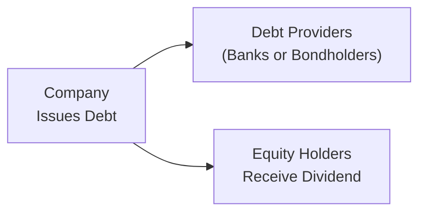

## Introduction

Sometimes, a company decides to shake up its balance sheet in a big way—like seriously big. It might, for example, load itself with massive debt to pay a chunk of cash back to equity holders. This is broadly known as a leveraged recapitalization (or “leveraged recap” for short). Now, if that doesn’t sound risky enough, imagine if even the interest payments on that new debt can be made with… more debt. That’s called Payment-in-Kind (PIK) financing. It’s all about adding more leverage and deferring cash outflows—but you can probably guess that it doesn’t come for free. Anyway, in this section, we’ll delve deeply into leveraged recaps and PIK structures, showing you why companies do them, how they work, and what to watch out for if you’re an investor or part of a corporate board.

## Leveraged Recapitalizations: The Basics

A leveraged recapitalization occurs when a company significantly alters (or “recapitalizes”) its capital structure by taking on a large amount of debt to replace or reduce equity. In many cases, the proceeds from issuing new debt might fund:
• A share buyback (to shrink the equity base).  
• A special dividend to the current owners.  
• A combination of both, or other forms of distribution.  

For instance, a private equity (PE) sponsor might orchestrate a leveraged recap to extract some of its initial equity investment from a successful portfolio company—sometimes called a “dividend recap.” While it puts money in the pockets of owners, a leveraged recap also leaves the portfolio company with a heavier debt load.

### Motives and Strategic Rationale

Why would a management team or a private equity sponsor do this? Some common reasons include:

• Returning Capital to Sponsors: After a period of decent operational performance, private equity sponsors might want to recoup part of their investment.  
• Deterring Hostile Takeovers: An overly indebted company is often viewed as a less attractive takeover target. Acquirers might not want to assume that large debt load.  
• Increasing Financial Leverage: Taking on debt can amplify returns when times are good. Of course, it can also amplify losses.  
• Optimizing Tax Benefits: Interest payments are typically tax-deductible (subject to certain jurisdictional restrictions), which can reduce taxable income, at least in the near term.  

From a purely theoretical perspective, leveraged recaps can be seen as a shift toward an optimal capital structure if the company was previously underleveraged. But in practice, it may feel more aggressive than “optimal.” Either way, the infusion of debt can dramatically change the risk and return profile of the business.

## Payment-in-Kind (PIK) Debt Structures

Next up is Payment-in-Kind debt, which might initially sound like some quirky financial contrivance. In a PIK structure, the issuer has the option (or obligation) to make interest payments not in cash, but by issuing additional debt. So, your interest payments become part of the outstanding principal, compounding as you go.

### How Does PIK Work?

Let’s say a company issues a PIK note with a 10% coupon. Instead of paying 10% in cash each year, the company “pays” that 10% by tacking it onto the principal. That means the main debt balance grows over time. After a certain period—often until maturity or a future conversion date—the accumulated debt must eventually be redeemed or refinanced. This deferral of cash interest gives the company more breathing room in terms of liquidity (at least for a while).

### Risk Implications of PIK Debt

• Compounding Liability: Just imagine a snowball rolling downhill, gathering more snow as it goes. Each “interest” payment simply sits on top of the principal, so the total balloon grows. This can be especially dangerous if performance slows or if interest rates spike, making the final maturity a huge liability.  
• Investor Perspective: Investors in PIK notes accept higher risk in exchange for a higher potential yield (assuming it all works out). However, they face the possibility of the issuer defaulting if the leveraged strategy goes sideways.  
• Liquidity and Illiquidity: PIK securities can be illiquid in the market. When times are stressful, their secondary trading volume might dry up.  

## Linking Leveraged Recaps and PIK

These two concepts—leveraged recaps and PIK—often converge in a single deal. For instance, a newly levered company might choose to issue some portion of its debt in a PIK format. By doing so, it can temporarily manage its cash flows (no big interest checks each quarter), but eventually, that debt mountain must be dealt with through refinancing or internal cash generation.  

Below is a simple flowchart of how a leveraged recap might direct funds to equity holders while using new debt (possibly including PIK):



In this diagram, the company raises debt from banks or bondholders and channels a portion of the proceeds to current equity holders. If part of that debt is PIK, the interest payments may accrue rather than be paid out in cash.

## Impact on Credit Ratings and Financial Metrics

When a company engages in a leveraged recap, credit rating agencies (S&P Global, Moody’s, Fitch, etc.) take notice. Increasing leverage substantially (and layering on PIK) often leads to:

• Potential Downgrades: More debt means higher default risk, which rating agencies reflect by lowering the company’s credit rating.  
• Strained Interest Coverage Ratio: The ratio of operating income (EBIT or EBITDA) to interest expense might deteriorate sharply. Although PIK defers cash payments, rating agencies also consider the eventual principal burden.  
• Refinancing Risk: A heavier debt load, especially if it matures in large chunks, can create a future refinancing cliff. The company may have to roll over substantial obligations at unknown future market rates.

## Corporate Governance and Board Considerations

For boards and management teams, a big question is: “How do we justify loading the company up with debt solely to pay out shareholders?” Usually, you’ll see rationales about efficiently utilizing capital or realigning capital structures. But from a governance standpoint, there are definite concerns:

• Shareholder vs. Creditor Interests: By taking on more debt, boards shift risk from shareholders to debt providers (and arguably to the company’s employees or other stakeholders). Some might say that’s opportunistic, especially if owners time the transaction before a potential downturn.  
• Fiduciary Duties: Directors have to show they considered the company’s long-term viability. If the recap leads to eventual insolvency, it could raise questions about whether the board met its fiduciary obligations.  

## Historical Perspective: Turnarounds, Distress, and Surprises

If you look back at some major leveraged recapitalizations, there are success stories—and some spectacular blowups. For example:

• Successful Turnarounds: In certain industries, leveraging up and returning capital can focus management on operational improvements—“We must generate cash now!” Some private equity–backed companies have used this pressure to sharpen strategy and drive cost efficiencies.  
• Financial Distress: Others find themselves in trouble when macro or industry conditions tighten. An over-levered balance sheet might be the difference between riding out a rough patch and defaulting.  

I recall chatting with a CFO who had executed a leveraged recap: “We were so flush with good news that we forgot to consider how cyclical our industry is,” he said. Within two years, the business was grappling with much higher interest expenses and lower revenue. They managed to avoid bankruptcy by selling a non-core asset, but it was close.

## Example: Modeling a PIK Note’s Growth

Let’s do a quick hypothetical example. A $100 million PIK note at a 10% annual coupon will accumulate interest to the principal rather than paying it in cash. Over five years (assuming no partial redemptions), the outstanding principal would look like this:

Year 0: $100 million principal.  
Year 1: $110 million principal ($100 million + 10% interest).  
Year 2: $121 million principal ($110 million + 10% of 110).  
Year 3: $133.1 million principal ($121 million + 10% of 121).  
Year 4: $146.41 million principal.  
Year 5: $161.05 million principal.  

That’s more than a 60% increase in liability. Let’s illustrate with a tiny Python snippet:

```python
principal = 100_000_000
rate = 0.10
years = 5

for year in range(1, years + 1):
    principal = principal * (1 + rate)
    print(f"Year {year}: {principal:,.2f}")
```

Running this yields the compounding schedule above. It looks nice and neat in text, but in real life, this can be quite a weight on the balance sheet.

## Best Practices and Common Pitfalls

### Best Practices

• Thorough Stress Testing: Companies should run scenarios to see how they’d fare in a downturn with heightened leverage.  
• Clear Governance Oversight: Boards need to document the decision-making process, risk mitigation strategies, and alignment with shareholder interests.  
• Sensible Timing: Initiating a recap toward the end of a growth cycle can be risky. Timing matters a lot.  
• Balanced Use of PIK: If you’re going to use PIK debt, ensure you have a path to refinance or repay before the compound interest bubble becomes unmanageable.

### Common Pitfalls

• Over-Optimism: Both managers and investors sometimes disregard the risk of cyclical downturns or unexpected disruptions.  
• Insufficient Liquidity Planning: Just because PIK defers interest doesn’t mean you can ignore free cash flow. Eventually, the debt comes due.  
• Governance Conflicts: If the controlling shareholders push the recap, minority shareholders or debt holders might end up with the short end of the stick.  

## Conclusion

Leveraged recapitalizations and PIK structures can be powerful tools in the corporate finance arsenal. They offer ways to return capital to shareholders, manage near-term liquidity, and potentially optimize the cost of capital—at least under specific market conditions. But oh boy, can they also create enormous risk. As a CFA candidate or practitioner, you’ll want to deeply understand these dynamics, from the rationale behind a dividend recap to the intricacies of ballooning PIK interest. Ultimately, whether leveraged recaps are a smart strategic move or a financial disaster waiting to happen depends on the underlying fundamentals, timing, and governance.

---

## References and Further Reading

• Kaplan, S. (1991). “The Staying Power of Leveraged Buyouts.” Journal of Financial Economics.  
• Rosenbaum, J., & Pearl, J. (2013). “Investment Banking: Valuation, LBOs, M&A.” Wiley.  
• Standard & Poor’s Leveraged Commentary & Data:  
  https://www.spglobal.com/ratings  

---

## Test Your Knowledge: Leveraged Recapitalizations and PIK Structures



### Which of the following best describes a leveraged recapitalization?

- [ ] A recapitalization where the company issues new equity to replace its debt.
- [x] A significant increase in debt to fund share buybacks or dividends to equity holders.
- [ ] A minor restructuring of working capital management.
- [ ] A process of issuing common shares to employees through stock options.

> **Explanation:** A leveraged recap typically involves the company taking on substantial new debt to restructure its capital, often with a goal of sharing proceeds with equity holders.

### What is a key motivation for private equity sponsors to pursue a leveraged recapitalization?

- [x] To return capital to themselves by issuing debt and using the proceeds to pay dividends.
- [ ] To strengthen the company’s balance sheet through debt reduction.
- [ ] To reduce risk by decreasing financial leverage.
- [ ] To comply with mandatory regulatory requirements.

> **Explanation:** Private equity sponsors often employ leveraged recaps to monetize part of their equity ownership, distributing proceeds to themselves or other equity holders.

### Which statement is true regarding PIK (Payment-in-Kind) debt?

- [ ] The issuer is prohibited from paying interest in cash.
- [ ] The debt automatically converts to equity at maturity.
- [x] Interest may accrue to principal instead of being paid in cash.
- [ ] The debt cannot be refinanced until near maturity.

> **Explanation:** In PIK structures, interest payments can be capitalized (added) onto the outstanding balance rather than paid in cash.

### When might a leveraged recapitalization deter a hostile takeover?

- [x] If the increased leverage makes the company less appealing due to high debt obligations.
- [ ] If it significantly increases the company’s share price by making it debt-free.
- [ ] If it forces all current creditors to convert their debt to equity.
- [ ] If regulators automatically prohibit further acquisitions of heavily leveraged firms.

> **Explanation:** A high debt load can discourage hostile acquirers, who don’t want to assume the added risk and debt repayment burdens.

### Which of the following is a potential risk for an issuer of PIK debt?

- [x] Ballooning principal amounts due to accrued, unpaid interest.
- [ ] Immediate cash outflows that exceed the company’s earnings.
- [x] Lower willingness of lenders to refinance if performance slips.
- [ ] Complete elimination of refinancing risk.

> **Explanation:** PIK debt leads to a growing principal balance, creating refinancing challenges and potentially large final payments if financial performance deteriorates.

### One potential governance concern with a leveraged recap is:

- [x] The risk that directors prioritize shareholder dividends over the company’s long-term health.
- [ ] The requirement that the CFO personally back the recapitalization debt.
- [ ] The elimination of all equity holders once the recap completes.
- [ ] Automatic dissolution of the board upon a debt issuance.

> **Explanation:** Boards must ensure that a leveraged recap makes sense for the company’s viability and not merely for immediate shareholder gain.

### What is an Interest Coverage Ratio typically used to measure?

- [x] The company’s ability to service its debt from operating income.
- [ ] How much of the company’s assets are intangible.
- [x] The ratio of total assets to outstanding dividends.
- [ ] The number of times earnings exceed cash reserves.

> **Explanation:** Interest Coverage Ratio typically reflects a firm’s capacity to meet interest payments, a critical metric for leveraged firms.

### How can PIK debt affect a company's cash flow in the near term?

- [x] It can reduce the immediate cash outflow for interest payments.
- [ ] It necessarily increases near-term interest payments.
- [ ] It forces the company to repurchase its stock.
- [ ] It eliminates the risk of default entirely.

> **Explanation:** Because interest is paid in kind, the issuer conserves cash in the short run, though it takes on a larger future liability.

### Which statement about refinancing risk and leveraged recaps is true?

- [x] A company may face higher refinancing costs if credit conditions worsen or if its leverage is pronounced.
- [ ] High-yield debt usually reduces the risk of not being able to refinance.
- [ ] Refinancing risk is irrelevant once a leveraged recap is executed.
- [ ] Regulatory agencies always guarantee low-interest refinancing to heavily levered firms.

> **Explanation:** When leverage increases, the company becomes more susceptible to market conditions and might face unfavorable (or unavailable) refinancing terms.

### True or False: Leveraged recapitalizations can lead to potential credit rating downgrades.

- [x] True
- [ ] False

> **Explanation:** Leveraged recaps increase a company’s debt burden, often prompting rating agencies to re-evaluate and possibly downgrade the issuer’s credit rating.


