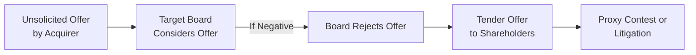
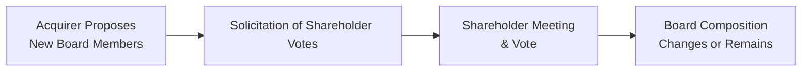

## Introduction

So, let’s say you wake up one morning and see a news headline: “Company A Launches Hostile Bid for Company B.” Ever wonder what exactly that means—and how it might unfold? Hostile takeovers and proxy contests can be some of the most dramatic events in the corporate world, packed with high-stakes negotiations, surprising twists, and serious financial implications. In the context of special situations and event-driven strategies, these deals can create both challenges and exciting opportunities for investors.

This section explores the nitty-gritty of hostile takeovers and proxy contests. We’ll talk about why a takeover might be hostile, the usual steps acquirers take (whether friendly cooperation is off the table or not), the defensive tactics targets might deploy, and how shareholder votes and board seats can become prized commodities in the quest for control. We’ll also sprinkle in some real-world insights—like the legendary RJR Nabisco saga—to show how it all goes down in real life. By the end, you should have a solid grasp of how these corporate battles play out, the choices available to the target and acquirer, and how stakeholders (including employees!) might be impacted.

## The Typical Sequence of a Hostile Takeover

A hostile takeover is an acquisition attempt that the target’s management vehemently opposes. Often, the process starts with an unsolicited bid, in which the acquiring company quietly or publicly signals its desire to purchase the target—sometimes at a premium price—to entice shareholders. However, the target’s board may reject the overture for reasons ranging from valuation disagreements to strategic misalignment.

Below is a simplified diagram illustrating the general flow of events:

### Unsolicited Offer

In a friendly takeover, suitors typically engage with the target’s board and negotiate a mutually agreeable deal. By contrast, a hostile takeover skips cooperative talks. Sometimes the acquirer tries a direct approach with the board first, but once it senses strong resistance, it might escalate matters.

### Tender Offer

If the board remains unwelcoming, the acquirer commonly proceeds with a tender offer, which is essentially a direct pitch to the target’s shareholders: “Sell us your shares at a specified price.” By bypassing the board and going straight to shareholders, the acquirer attempts to gain majority ownership. And if it secures enough shares, it can effectively gain control, even if management protests.

### Proxy Fight and Litigation

Sometimes the board still tries to block the process, leading to litigation over issues like disclosure requirements, deal pricing, or alleged breaches of fiduciary duty. Simultaneously, the acquirer might launch a proxy contest to replace board members, effectively tilting the governance structure in its favor. This set of battles between the acquirer and the incumbents can last a few intense weeks or drag on for months.

## Defensive Measures by Target Companies

Target firms don’t usually sit around twiddling their thumbs when faced with a hostile approach. They can employ a variety of defensive tactics to thwart, or at least slow down, unwanted bids. While these measures can protect the company from undervalued takeovers, critics argue they could also entrench management and inhibit open markets.

### Poison Pills (Shareholder Rights Plans)

A poison pill, or shareholder rights plan, is a formidable tactic. Essentially, it gives existing shareholders (other than the acquirer) the right to buy additional shares at a steep discount once an acquirer’s stake crosses a preset threshold. This tactic dilutes the acquirer’s ownership percentage, making the takeover prohibitively expensive or, at least, much less attractive.

### Staggered Boards

A staggered board means directors serve staggered terms, so only a portion of them come up for re-election each year. This strategy prevents an acquirer from sweeping in and replacing an entire board in one proxy fight. They’d need multiple proxy contests over multiple election cycles, significantly delaying any attempt to seize control.

### Supermajority Voting Provisions

Some corporate charters mandate the approval of a supermajority (e.g., 80%) of shareholders for major corporate transactions, such as mergers or significant asset sales. This higher threshold can shield a target from takeover unless an acquirer can garner overwhelming shareholder support.

### White Knight

A “white knight” is a more friendly acquirer that a target firm might seek out when faced with a hostile bid. In some cases, the target’s management actively courts another buyer who can offer a better deal—or at least be more aligned with the existing strategy. If the white knight emerges victorious, the target avoids falling into the hands of the hostile bidder.

## Proxy Contests 101

Even the best-laid takeover plan can fail if the board stays resolutely opposed. In such cases, an acquirer may resort to a proxy contest—asking shareholders to vote to replace some or all of the current board members with individuals willing to support the acquirer’s plan. Sometimes you see a “short slate” strategy, targeting just enough board seats to gain a foothold in corporate governance. Other times, a more aggressive approach tries to replace the entire board in one fell swoop.

Here’s a quick look at the flow of a typical proxy contest:

### Solicitation of Votes and the Role of Proxy Firms

To influence the shareholder vote, the acquirer and the incumbents often hire proxy solicitation firms—specialists in rallying shareholder support. These firms manage the outreach process, communicate the benefits of one side’s proposal, and encourage shareholders to complete proxy cards in favor of their sponsor. Shareholders can be scattered, from large institutions like pension funds to individual retail owners, so the logistical challenges can be immense.

### Board Control and Strategic Direction

If the challenger succeeds, new board members can steer corporate strategy in favor of the acquirer, facilitating the transaction. If the challenge fails, the incumbents remain in control, and the hostile takeover attempt may be derailed—or at least delayed.

## Strategic Considerations from Acquirer and Target Perspectives

### Acquirer’s Perspective

• Timing: One of the toughest decisions is when to go public with a hostile bid. Move too early, and you risk the target mobilizing its defenses. Wait too long, and you might miss an opening before the stock rises or before a white knight emerges.  
• Financing: Hostile takeovers typically involve significant leverage, so the acquirer needs investment bankers and possibly bridging loans or bond issuances.  
• Public Relations: Hostile bids can tarnish an acquirer’s brand if perceived as predatory. A well-crafted PR strategy can reassure not just shareholders, but also employees, regulators, and community members.  
• Valuation and Synergies: The acquirer must be confident that the cost of the acquisition matches or is lower than the perceived benefits or synergies. A poor valuation can quickly turn the deal unprofitable.

### Target’s Perspective

• Maintaining Credibility: Over-aggressive defenses can upset shareholders who might see a valuable premium being turned down. This can lead to lawsuits alleging breach of fiduciary duty.  
• Alternative Bidders: If management wants to remain independent, it must sometimes entertain the possibility that a “white knight” or another suitor might be preferable to the hostile party.  
• Negotiation Tactics: Sometimes targets reject initial offers only to negotiate a better price. They may also use litigation to buy time or highlight problematic aspects of the hostile bidder’s strategy.  
• Shareholder Relations: Targets typically engage in investor outreach to convince shareholders the current leadership’s strategic vision is in their best interests.

## Real-World Case: RJR Nabisco

To understand how intense things can get, consider the RJR Nabisco takeover in the late 1980s. The deal became a high-profile bidding war—first triggered by management’s leveraged buyout proposal, but soon joined by various private equity firms eager to topple the initial plan. It was anything but friendly. As recounted in “Barbarians at the Gate,” financial advisors jockeyed to secure higher bids, while target management pulled out all the stops to secure the best outcome and, frankly, to maintain some control. Ultimately, KKR (Kohlberg Kravis Roberts & Co.) prevailed with a massive leveraged buyout, overshadowing other contenders.

Today, the RJR Nabisco saga stands as a classic example of how complicated—and super expensive—these deals can become. It also illustrates how the entire process can pivot on personal egos, shifting alliances, and frenzied negotiations driven by big-time investment banks and legal teams working around the clock.

## Role of Investment Bankers, Lawyers, and Proxy Solicitation Firms

### Investment Bankers

• Valuations: They conduct in-depth valuations to support or contest an acquisition price.  
• Deal Structuring: They craft financing packages, possibly including debt or equity offerings, to fund the tender offer or subsequent integration.  
• Fairness Opinions: Boards often request “fairness opinions” to confirm that the price offered to shareholders is, indeed, fair.  

### Lawyers

• Regulatory Compliance: End-to-end compliance with securities regulations is crucial. Lawyers handle everything from SEC filings to representing parties in court if disputes arise.  
• Defense Strategy: Teams of attorneys help set up or dismantle defenses like poison pills, addressing whether these measures comply with relevant corporate governance laws.

### Proxy Solicitation Firms

• Vote Gathering: They secure proxy votes from retail and institutional shareholders.  
• Educational Campaigns: They educate shareholders on the merits or risks of a takeover, sometimes through mailings, phone calls, or online platforms.  
• Corporate Governance Guidance: Many also advise boards on strategies for effective shareholder communications, especially during heated proxy battles.

## Potential Impact on Employees, Communities, and Stakeholders

Hostile takeovers can bring about major corporate upheaval. Let’s face it—nobody likes waking up to news that their company may soon be sold. In many cases, new owners overhaul management, restructure operations, and sometimes shutter facilities if synergies or strategic changes demand it. This can lead to layoffs or relocations, impacting employees and their families. Local communities might experience a ripple effect—especially if the target was a big local employer contributing to tax revenues and philanthropic programs.

From an investor’s standpoint, these broad implications might not be top-of-mind. However, a stable workforce and supportive community can also be crucial to long-term business success. Some acquirers do consider these non-financial factors to preserve corporate reputation and maintain employee morale.

## Best Practices and Common Pitfalls

• Thorough Due Diligence: Acquirers should confirm that cost savings, synergies, or strategic advantages are realistic. Overpaying for a target can lead to immediate share price declines and longer-term underperformance.  
• Balanced Defense: Targets should protect themselves without alienating shareholders who might see a poison pill or supermajority provision as self-serving.  
• Proactive Communication: Early and transparent updates with employees, the community, and regulators can ease tensions.  
• Clear Governance: Staggered boards and supermajority votes must follow corporate governance best practices to avoid legal blowback from activist shareholders.

## Conclusion and Exam Tips

Hostile takeovers and proxy contests are among the most intense dynamics in corporate finance—think of them as an advanced chess game where each side plots multiple moves in advance. For exam purposes, remember that event-driven funds often consider these strategies for alpha generation, focusing on timely trades around rumored or actual takeover events. You’ll want to articulate how the synergy assumptions, regulatory environment, defensive strategies, and proxy mechanics interact when analyzing these opportunities.

From a time-management perspective on the exam, keep a structured approach to question prompts on hostile takeovers:  
• Identify the primary tactic being used (tender offer, poison pill, etc.).  
• Explain the rationale (valuation, synergy, board entrenchment).  
• Evaluate the pros, cons, and possible outcomes.  
• Always consider how stakeholders, from employees to bondholders, might be affected.

Use the RJR Nabisco case or other famous deals as mental anchors—examiners sometimes love referencing well-known transactions without naming them explicitly, expecting you to apply the concepts. Above all, practice bridging theoretical defenses with practical outcomes, and think about the role of boards, regulatory bodies, and, of course, the shareholders themselves. Good luck!

## References

• Burrough, B., & Helyar, J. (2009). Barbarians at the Gate: The Fall of RJR Nabisco.  
• Gaughan, P. A. (2017). Mergers, Acquisitions, and Corporate Restructurings.  
• U.S. Securities and Exchange Commission (SEC) Filings:  
  – https://www.sec.gov

## Test Your Knowledge: Hostile Takeovers and Proxy Contests



### Which of the following best describes a poison pill defense?

- [ ] A method to increase a firm’s leverage before an acquisition.  
- [ ] A strategy to intimidate the acquiring company’s leadership.  
- [x] A shareholder rights plan that dilutes shares when a hostile investor’s stake exceeds a certain threshold.  
- [ ] A recapitalization plan exclusively for management.  

> **Explanation:** A poison pill (shareholder rights plan) triggers the right of existing shareholders (except the acquirer) to buy additional shares at a discount, thus diluting the hostile acquirer’s stake.

### If a target company adopts a supermajority voting provision, what does it typically require?

- [ ] Board approval to level up its debt ratio.  
- [x] A higher-than-usual percentage of shares to approve a merger.  
- [ ] Unanimous consent among all board members during a hostile bid.  
- [ ] A regulatory agency to approve any transaction.  

> **Explanation:** Supermajority voting often demands 70–80% (or more) of shareholder votes to approve key corporate actions, making hostile takeovers more difficult.

### In a proxy contest, an acquirer primarily seeks:

- [ ] To enforce a new bond covenant.  
- [x] To replace existing board members with its own slate.  
- [ ] To introduce new trade receivables.  
- [ ] To gain regulatory immunity from takeover laws.  

> **Explanation:** A proxy contest is a form of corporate ballot battle where the acquirer attempts to gain board seats by rallying shareholder votes, often paving the way for a takeover.

### Which of the following could be considered a more favorable bidder invited by the target company to fend off a hostile bid?

- [ ] A poison pill  
- [x] A white knight  
- [ ] A supermajority holder  
- [ ] A golden parachute recipient  

> **Explanation:** A white knight is a friendly acquirer offering a more acceptable takeover alternative, potentially displacing the hostile bidder.

### What is meant by a “staggered board” in a company’s governance structure?

- [x] Directors serve overlapping terms so they are not all up for re-election at once.  
- [x] It makes rapid replacement of the entire board less likely.  
- [ ] It ensures all board members can be replaced simultaneously.  
- [ ] It separates voting rights from share ownership.  

> **Explanation:** A staggered board—where only a subset of directors stand for re-election each year—complicates efforts by an acquirer to take control quickly.

### Which statement best describes a tender offer in the context of a hostile takeover?

- [ ] An offer to issue new convertible bonds to the public.  
- [ ] A proposal put forth by management to restructure the board.  
- [x] A direct offer from the acquirer to shareholders to buy their shares at a specified price.  
- [ ] A leveraged recapitalization plan from the target company.  

> **Explanation:** A tender offer is a public proposal by the acquirer to buy shares directly from target shareholders, circumventing uncooperative board members.

### In the RJR Nabisco takeover, which major type of strategy was exemplified?

- [x] A contested bid involving multiple potential buyers and intense negotiations.  
- [ ] A spin-off to separate profitable segments.  
- [ ] A classic example of synergy-based cross-border M&A.  
- [x] A leveraged buyout with heavy debt financing.  

> **Explanation:** RJR Nabisco’s acquisition involved a fierce bidding war and massive LBO financing. It is one of the most famous contested transactions in modern corporate history.

### Which role do proxy solicitation firms play during a proxy battle?

- [ ] They provide an independent fairness opinion on the deal.  
- [ ] They set the premium price the acquirer must pay.  
- [x] They manage the logistics of collecting shareholder votes and rallying support.  
- [ ] They supply large loans to fund the transaction.  

> **Explanation:** Proxy solicitation firms gather votes, educate shareholders, and coordinate the distribution and collection of proxy cards, aiming to secure a favorable outcome for their client.

### Which of the following is a primary concern for communities and employees in a hostile takeover?

- [ ] The share premium offered to minority shareholders.  
- [ ] The stagflation risk of the broader economy.  
- [x] Potential plant closures, layoffs, or restructuring after the takeover.  
- [ ] Anti-trust exemptions for local government.  

> **Explanation:** A new owner can restructure, consolidate operations, or shut down facilities, which may lead to layoffs and subsequent economic challenges for local communities.

### A hostile takeover attempt is always successful if the acquirer’s board approves the bid.

- [ ] True  
- [x] False  

> **Explanation:** The success of a hostile takeover rests on shareholder support and the target board’s defenses. Even if the acquirer’s board approves, the target’s coordination of defensive measures and shareholder sentiment can block or derail the takeover.


