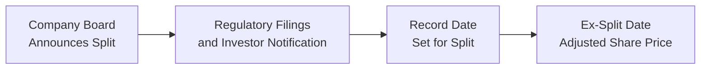
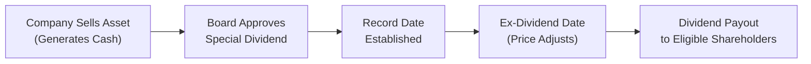

## Introduction
Splits, reverse splits, and special dividends are corporate actions that can dramatically change a company’s capital structure—sometimes overnight. These events often appear in the context of special situations and event-driven strategies, which is precisely why they pop up on many investment professionals’ radars. But let’s be honest: if you’re a new analyst (or if you just haven’t dealt with these in-depth before), they can look a bit confusing. I remember early in my career seeing a tech company do a 2-for-1 split and thinking, “Well, is that just free money?” The short answer: no, it isn’t. But it can be a catalyst for all kinds of shifts in market sentiment and liquidity, which can make it relevant to event-driven traders and portfolio managers alike.

Below, we’ll explore the mechanics, rationale, and real-world applications behind three important corporate events: stock splits, reverse splits, and special dividends. We’ll also examine common reasons companies deploy these strategies, how investors might respond, and how event-driven funds search for potential mispricings or arbitrage plays. While these topics seem straightforward on the surface (splitting shares or issuing a one-time dividend), they can have subtle implications in broader portfolios—particularly for those who watch listing requirements, investor psychology, and short-term liquidity changes.

## Mechanics of Stock Splits
A stock split (often described using a ratio like “2-for-1” or “3-for-1”) increases the number of a company’s outstanding shares. Let’s say you own 100 shares of a stock trading at USD 50 per share, and the firm announces a 2-for-1 stock split. After the split:

• Each holder gets double the shares: so your holding goes from 100 to 200 shares.  
• The share price is halved: from USD 50 down to about USD 25, in an ideal frictionless market.

In other words, the total market value in your hands remains roughly the same (assuming no material changes in investor sentiment). Mathematically:


P_{\text{new}} = \frac{P_{\text{old}}}{\text{Split Ratio}} \quad \text{and} \quad Q_{\text{new}} = Q_{\text{old}} \times \text{Split Ratio}


For a 2-for-1 split, the split ratio is 2. Your holdings just get “divided” across more shares, each priced lower. Stock splits are often used to improve marketability (i.e., making shares more attractive to smaller investors who might not want to buy an expensive USD 1,000-per-share stock). They can also enhance trading liquidity by increasing the share count.

Let’s visualize the typical process:

When the board announces a split, they file the necessary paperwork, notify investors, set a record date to determine which shareholders are entitled to the split, and finally implement the “ex-split” date when trading actually reflects the new share price and share count.

## Reverse Stock Splits
Reverse stock splits consolidate outstanding shares to increase the price per share. It’s basically a stock split in reverse. If there’s a 1-for-5 reverse split, each shareholder ends up with one share for every five shares previously held. So, if you started with 1,000 shares priced at USD 1 each (total market value of USD 1,000), after the reverse split, you’d hold just 200 shares. The share price should theoretically rise to around USD 5 to maintain the same total market value.

Common reasons for a reverse split:

• A company wants to avoid delisting from an exchange with a minimum price requirement (e.g., USD 1 per share).  
• The firm believes there’s a perception stigma around trading at “penny stock” levels and hopes a higher share price will attract institutional interest or demonstrate confidence.  
• Some companies use reverse splits to reduce the administrative costs associated with extremely high share counts.

Although the mathematical impact is neutral in an ideal scenario, reverse splits sometimes carry a negative connotation. Investors can be wary that a company might be artificially inflating its share price to mask deeper operational or financial issues. However, not all reverse splits are red flags. Some larger companies have also used them during strategic restructurings.

## Rationale for Splits and Reverse Splits
So, why would a healthy company bother splitting its shares at all, and why would another consolidate them?

• Marketability and Liquidity: Let’s face it—an extremely high share price can spook retail investors. A lower price might be more appealing for smaller buyers. Conversely, when a stock trades far below a psychologically acceptable range, a reverse split can boost its perceived value and help maintain listing requirements.  
• Investor Perception and Psychological Barriers: Investors often think about share price in absolute, not relative, terms. A 2-for-1 split from USD 200 to USD 100 per share might feel cheaper, even though the intrinsic value is the same.  
• Exchange Listing Requirements: As mentioned, if the stock price threatens to dip below the minimum threshold for the exchange, a reverse split can prevent delisting.  
• Signaling (Real or Perceived): A forward split might signal management optimism, expecting further growth. A reverse split might signal the company is trying to shore up its reputation. But, as we all know, signals can be misread.

## Special Dividends
Special dividends (also known as “extraordinary dividends” or “one-time dividends”) are typically cash distributions that don’t follow a company’s regular dividend schedule. They are often triggered by:

• Recapitalizations or large one-time events (e.g., selling a big asset or segment of the business).  
• Excess cash on the balance sheet that management decides to distribute.  
• Tax optimization for certain shareholders, depending on the jurisdiction and structure.  
• Corporate strategy to reward long-term shareholders, or to fend off activist investors.

Unlike a regular dividend, which is paid according to a consistent schedule (e.g., quarterly), a special dividend might be a single large payout—sometimes overshadowing the company’s typical quarterly distribution. This can temporarily spike investor yield. Or it might serve as a defensive tactic if management wants to discourage a takeover by reducing the company’s cash hoard.

## Funding Special Dividends
A company can fund a special dividend in several ways:

• Proceeds from an Asset Sale: For instance, a large spin-off might net the parent company significant cash. Instead of reinvesting all those proceeds, management might distribute a chunk to shareholders.  
• Debt Issuance: Although it sounds counterintuitive, sometimes a firm might borrow specifically to pay out a special dividend—often in leveraged buyout (LBO) contexts or private equity recapitalizations.  
• Existing Cash Reserves: If the company has built up a substantial cash surplus and sees no immediate, high-return investments, it might reward shareholders directly.

## Tax Implications and Record Date
Investors need to watch two concepts closely: the record date and the ex-dividend date.

• The record date defines which shareholders on the company’s books are eligible to receive the distribution.  
• The ex-dividend date is set just before that record date, typically one business day prior under U.S. rules. Anyone buying shares on or after the ex-dividend date is not entitled to receive the upcoming dividend.

From a tax perspective, special dividends might be treated similarly to ordinary dividends in many jurisdictions—meaning they can be taxable in the year received. However, specifics vary by tax code. For instance, certain countries might apply different withholding rates or classify distributions from spin-offs differently than standard dividend payouts.

## Event-Driven Opportunities and Arbitrage
From an investments standpoint, splits, reverse splits, and special dividends can serve as catalysts—factors that might prompt a short-term shift in price or volume. Event-driven hedge funds or other alternative investment managers often monitor these announcements for:

• Inefficient Price Adjustments: Does the market underreact or overreact? For example, a 2-for-1 split can sometimes momentarily inflate demand due to psychological “bargain” perceptions. A savvy trader might buy ahead of the ex-split date and quickly exit if momentum builds.  
• Reverse Split Arbitrage: If a borderline delisting scenario is resolved by a reverse split, some investors may interpret it as a sign of the company’s improving scenario, while others remain skeptical. This disparity can create short-lived price anomalies that advanced traders look to exploit.  
• Dividend Capture: With a special dividend on the horizon, some traders employ a dividend capture strategy—buying shares just before the ex-dividend date and then selling them once they’ve locked in the dividend. That said, transaction costs and price drops on ex-dividend day can make this strategy less fruitful than it appears.  
• Unexpected Volatility: Any corporate action can cause abrupt changes in trading volume and volatility, especially if the dividend is significantly large or if a reverse stock split is combined with other strategic announcements.

These corporate events aren’t guaranteed money-makers. Markets are fairly efficient, and many large institutional investors are well-versed in these tactics. Still, short-term dislocations sometimes occur, especially if the event is linked with broader strategic news (e.g., spin-offs, M&A, or fundamental transformations in the company) that’s more difficult to price.

## Practical Examples of Splits and Special Dividends
Let’s try some straightforward numerical examples to illustrate:

### Example 1: 2-for-1 Split
Imagine Company ABC is trading at USD 100 and you own 50 shares. Your total position value is USD 5,000. The board announces a 2-for-1 split:

• After the split, you have 100 shares (50 × 2).  
• The share price adjusts to around USD 50.  
• Your total position is still roughly USD 5,000, ignoring market reaction.

### Example 2: 1-for-10 Reverse Split
Company XYZ’s shares have fallen to USD 0.90, and there’s a looming delisting risk. They announce a 1-for-10 reverse split:

• If you own 1,000 shares, you’ll end up with 100 shares after the consolidation (1,000 ÷ 10).  
• The share price should re-price around USD 9.00.  
• The total portfolio value (again, ignoring short-term trading fluctuations) remains about USD 900.

### Example 3: Special Dividend from an Asset Sale
Company LMN sells off one of its subsidiaries for a net of USD 2 billion in cash. It announces a one-time distribution of USD 5 per share. After paying the dividend, the company might trade at a lower price, roughly adjusting for the cash exiting the business. The record date and ex-dividend date are crucial here if you want to receive the USD 5 distribution. Anyone buying on or after the ex-dividend date will not be entitled to the special dividend.

## A Word on Behavioral Bias
When people see a stock split, they might believe the stock has more “room to grow,” which can lead to a brief rally. That’s frequently tied to behavioral psychology rather than fundamentals—like thinking, “Wow, it’s so cheap now!” even though the total market cap is unchanged. On the flip side, a reverse split often elicits skepticism; investors might think, “They’re dressing up a poor situation.” In reality, neither assumption may reflect the actual outlook. For an event-driven investor, understanding these common biases can be invaluable in spotting short-term mispricings.

## Potential Pitfalls and Best Practices
• Understand the Real Motive: Is the split or reverse split purely cosmetic, or is it part of a meaningful strategic shift (e.g., a planned up-listing)?  
• Timeline Management: For special dividends, watch the record date, ex-dividend date, and payment date meticulously. Trading too late can mean you lose out on the dividend.  
• Transaction Costs: Dividend capture strategies might sound appealing but can be eroded by taxes and brokerage fees.  
• Liquidity Conditions: After a reverse split, the float might become smaller, impacting liquidity in ways that can magnify price moves.  
• Tax Implications: Special dividends might push some investors into higher tax brackets or yield unexpected tax liabilities—especially if the dividend is big.  
• Regulatory Triggers: Reverse splits can help maintain exchange listing requirements, but long-term investors should consider whether the company’s fundamentals are genuinely improving.

## Diagram: The Flow of a Special Dividend
Below is a simplified depiction of how a firm’s special dividend process might look:

## Exam Relevance and Final Exam Tips
• These corporate actions often appear in the context of event-driven strategies. On the CFA® exam, you might face a scenario-based question about how a portfolio manager should respond to a large special dividend announcement, or how a reverse split might affect liquidity ratios in an equity portfolio.  
• Don’t forget the ethical side—there could be concerns if corporate insiders profit by timing trades around these announcements.  
• Practice reading carefully for “record date” and “ex-date” details. Exam writers like to test your understanding of who is entitled to a dividend or how share price might adjust.  
• Prepare to do quick arithmetic on splits. The exam might show you multiple choice answers that rely on you mixing up the split ratio.

As you tackle practice questions, remember the key is to integrate the knowledge: Splits, reverse splits, and special dividends might connect to broader topics like capital structure, liquidity analysis, or even corporate governance. Be ready for cross-topic linkages—such as how an event-driven hedge fund might evaluate a firm that is simultaneously planning a spin-off and a special dividend.

## References
• Brealey, R., Myers, S., & Allen, F. (2020). Principles of Corporate Finance.  
• Fama, E. (1976). Foundations of Finance.  
• Online resource: Stock Splits & Dividends Data (NASDAQ): https://www.nasdaq.com/market-activity/stocks/splits

---

## Test Your Knowledge: Splits, Reverse Splits, and Special Dividends



### A company announces a 2-for-1 stock split. Which of the following is the most direct outcome?
- [ ] The stock’s market capitalization is doubled.
- [ ] Each existing shareholder will pay more in taxes.
- [x] Each existing shareholder’s number of shares will double, but total value remains the same initially.
- [ ] The share price climbs higher due to the split.

> **Explanation:** In a 2-for-1 split, shareholders receive twice the number of shares they originally held, and theoretically, the price per share is halved. The total value of their holdings remains unchanged, barring any market sentiment effects.

### Which of the following scenarios might prompt a reverse stock split?
- [ ] A company reaching excessively high share prices over USD 1,000.
- [x] A company facing potential delisting due to a share price below the exchange’s minimum.
- [ ] A company generating a large new asset sale.
- [ ] A firm planning to initiate a new line of business.

> **Explanation:** Reverse splits are often used to consolidate shares and boost a stock’s price above a minimum threshold, helping avoid delisting.

### If a publicly traded firm unexpectedly issues a large special dividend, which of the following is most likely to occur on the ex-dividend date?
- [x] The stock’s share price will decrease by approximately the dividend amount.
- [ ] Deferred taxes will be eliminated for institutional investors.
- [ ] The dividend will only be paid to corporate insiders.
- [ ] The share price will rise by the dividend amount.

> **Explanation:** On the ex-dividend date, the share price generally drops to reflect the value that is paid out to shareholders.

### An investor wants to execute a dividend capture strategy for a special dividend. What is a key downside?
- [ ] Regulatory restrictions forbid buying stock before a dividend.
- [x] Potential capital gains taxes and price decline on the ex-dividend date could erode profits.
- [ ] They cannot sell the stock after receiving the dividend.
- [ ] Dividends are always tax-exempt under this strategy.

> **Explanation:** While dividend capture aims to collect the upcoming dividend and sell quickly, the share price often declines by that dividend amount, and taxes and fees can offset any short-term gain.

### Which of the following is the primary reason a healthy firm may announce a forward stock split?
- [x] Improve share affordability and perceived liquidity.
- [ ] Mask the firm’s declining fundamentals.
- [ ] Avoid immediate delisting by boosting the share price.
- [ ] Immediately increase EPS without changing the business model.

> **Explanation:** Many companies split their stock to keep the per-share price in an “accessible” trading range, improving liquidity and marketability.

### In a 1-for-10 reverse split, which statement is true?
- [x] A shareholder with 1,000 shares ends up with 100 shares.
- [ ] A shareholder will receive more shares but at a reduced price.
- [ ] The total value of the shareholder’s position automatically doubles.
- [ ] The reverse split has no effect on the per-share price.

> **Explanation:** A 1-for-10 reverse split consolidates every 10 shares into 1 share, increasing the price per share accordingly in a theoretical scenario without market shifts.

### A special dividend is often funded by:
- [x] Proceeds from a significant corporate asset sale.
- [ ] Issuing new equity at a discount.
- [x] Excess cash reserves.
- [ ] Only the personal capital of company directors.

> **Explanation:** Special dividends can be funded through asset sales, debt issuance, or existing cash. Companies rarely use new equity issuance to pay a one-time dividend.

### Which of the following best characterizes delisting?
- [x] Removal of a company’s shares from an exchange for failing to meet requirements.
- [ ] A forced liquidation of all outstanding shares at the current market price.
- [ ] A routine corporate action for established companies.
- [ ] A final step in the IPO process.

> **Explanation:** Delisting occurs if a firm fails to meet exchange requirements (often due to low share price or insufficient market cap), or voluntarily chooses to go private.

### How might an event-driven hedge fund exploit a large upcoming special dividend?
- [x] Buy shares before the ex-dividend date, anticipating a short-term share price gain leading up to the payout.
- [ ] Ignore the dividend’s record date, as it has no investment impact.
- [ ] Sell shares short to profit from the dividend adjustment.
- [ ] Refuse to hold any position in dividend-paying firms.

> **Explanation:** An event-driven fund may initiate a position hoping that increased market attention could temporarily boost share price. However, they must manage ex-dividend price drops and associated taxes.

### A reverse split typically indicates:
- [x] True
- [ ] False

> **Explanation:** Often, a reverse split suggests the company seeks to correct a low share price issue. While not always negative, it is frequently associated with trying to remain listed, manage perception, or address liquidity constraints.


