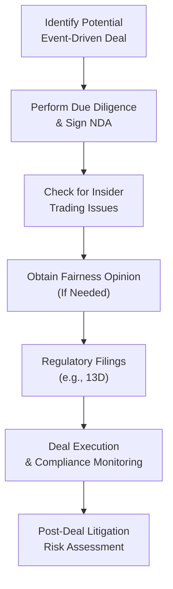

## Introduction

Let’s talk about one of the most fascinating—and sometimes fraught—parts of special situations and event-driven strategies: the legal and regulatory side. There’s a saying I often hear from fellow professionals: “What’s the fastest way to destroy investment returns? Get knee-deep in legal trouble.” Okay, maybe that exact phrasing is just something I mutter to my students, but you get the idea. In other words, no matter how promising an event-driven deal looks on a spreadsheet, ignoring legal and compliance considerations can quickly unravel the entire transaction.

This article addresses the key legal and compliance themes that pop up in event-driven investing, including insider trading regulations, confidentiality obligations, the role of fairness opinions, and extraterritorial laws. If you sometimes find these areas intimidating, you’re not alone. As we’ll see, with a bit of structuring and good practices, these considerations can actually become vital guardrails for successful event-driven deals.

## Understanding Key Legal and Compliance Elements

### Insider Trading, MNPI, and Disclosure Requirements

Insider trading isn’t just a thing you read about in the newspaper. It’s a real, constant concern for anyone doing event-driven deals, especially if you have inside access to corporate or transaction-specific data. The fundamental rule here: never trade on material nonpublic information (MNPI). If you’re not sure whether something is material or not, you should pause and consult legal counsel. Think of it this way: If you’d feel that the broader investing public might consider a fact important, it’s probably material.

For publicly listed transactions, you must also stay on top of any local and international disclosure requirements. These rules typically require that material information about pending mergers, acquisitions, bankruptcies, or corporate restructurings be made public in a timely manner. The precise definition of “timely” can differ among jurisdictions, so it’s essential to coordinate with local counsel—especially if you’re dealing with cross-border deals.

### Confidentiality Agreements and NDAs

Confidentiality agreements and non-disclosure agreements (NDAs) often form the legal backbone for controlling sensitive information. In most event-driven deals, you’ll receive or share privileged data—like non-public financials, strategic plans, or product roadmaps. NDAs help outline who can access what, under what conditions, and for how long. 

I personally recall a case (from my early days) where an NDA was so vague it practically allowed the other party to talk to every competitor in the region. That’s definitely not what you want! Be sure any NDA you sign is properly drafted, with crystal-clear provisions about how that confidential information can be used, who can see it, and the obligations to return or destroy data once negotiations end.

### Fairness Opinions and Corporate Governance

Another crucial aspect is the fairness opinion, a formal valuation analysis prepared by an independent investment bank or valuation firm to ensure that the price offered in a transaction is fair from a financial standpoint. These opinions serve a couple of purposes:

• They give boards and shareholders a sense of comfort that the deal terms are fair.  
• They help mitigate litigation risk by demonstrating a thorough valuation process and good-faith efforts to achieve a fair price.

In some cases, fairness opinions are introduced late in negotiations to address dissident shareholders or to backstop an activist investor’s arguments. Event-driven investors should keep fairness opinions in mind as a protective measure—both for themselves and for parties on the other side of the transaction.

## Regulatory Filings and Disclosure Obligations

For U.S. markets, regulatory filings such as Schedule 13D and 13G are vital instruments for maintaining transparency in ownership stakes.

- Schedule 13D: Required when an investor crosses the 5% ownership threshold in a public company and has an activist or control-oriented intent.  
- Schedule 13G: Typically submitted by passive investors who exceed 5% ownership but do not intend to influence or control the company.

Similar disclosures exist in other jurisdictions, albeit under different forms or rules. Failure to file on time can lead to fines, restrictions on voting rights, or worse—regulatory investigations. In activist campaigns, these filings are carefully scrutinized by the public, by the courts, and by market participants eager to see if someone is trying to accumulate shares for a forced takeover or board shake-up.

### Diagram: High-Level Compliance Process in Event-Driven Deals



This simple flow highlights the broad steps you should consider.

## Litigation Risk in Event-Driven Deals

Ever felt that sinking feeling when you see “lawsuit pending” in a term sheet? Litigations can erupt for any number of reasons: shareholder complaints, antitrust concerns, cross-border complexities, or claims of inadequate disclosure. Let’s outline a few major triggers and potential mitigation strategies:

| Potential Litigation Trigger                                     | Mitigation Strategy                                                          |
|------------------------------------------------------------------|------------------------------------------------------------------------------|
| Minority shareholders claim deal price is too low                | Secure fairness opinion and full documentation of valuation process          |
| Regulatory bodies suspect anti-competitive behavior              | Conduct thorough antitrust/regulatory review before signing definitive docs  |
| Breach of fiduciary duties by directors/officers                 | Enhance corporate governance, track decision-making with thorough minutes    |
| Inconsistent disclosures or missing SEC filings                  | Engage compliance experts and legal counsel for timely and accurate filings  |
| Disputes over data usage or confidentiality breaches             | Draft clear NDAs, monitor internal data-sharing protocols, implement audits  |

Cross-border deals introduce their own layers of complexity. Different countries have distinct litigation norms, sometimes leading to parallel lawsuits or multi-jurisdictional claims (imagine the headache of dealing with discovery rules in multiple countries). Also, foreign corruption or bribery regulations—like the U.S. Foreign Corrupt Practices Act (FCPA)—can extend well beyond national borders.

## Cross-Border Legal Frameworks and Extraterritorial Laws

It’s not uncommon to see an investor based in London acquiring a controlling stake in a U.S. firm with operations in Singapore. That’s a massive puzzle of legal jurisdictions. Generally, you should be aware of the following:

• Local securities laws where the target is incorporated.  
• Extraterritorial regulations like the FCPA, which can apply even if a transaction is primarily outside the U.S.  
• Anti-bribery statutes in the U.K. (e.g., the UK Bribery Act), Europe (various directives), and Asia (local anti-corruption laws).  
• Local customs or “informal” norms—sometimes you can’t close a deal until local or regional administrative bodies are satisfied.

These cross-border transactions can be thrilling, but also loaded with risk. It’s advisable to engage specialized legal counsel in each major jurisdiction so that you don’t inadvertently step into a compliance quagmire.

## Ethical Standards and Fiduciary Duties

Beyond black-letter law, event-driven deals are shaped by professional ethics. Fiduciary duty basically means that you—or the party in control—must place client or shareholder interests first. In practice, this means:

- **Accuracy of Representations:** If you say that a certain synergy or cost saving is likely to occur, ensure it’s grounded in realistic assumptions.  
- **Conflict of Interest Avoidance:** If you stand to benefit personally from a transaction in ways unknown to your LPs or shareholders, that’s a massive red flag.  
- **Confidentiality and Integrity:** Even items as simple as phone calls or shared drives matter. If there’s a slip, you could share MNPI with the wrong parties.

On the ethical side, I’ve seen deals derailed because a junior associate inadvertently forwarded a data room link to a potential co-investor who had not signed the NDA. Mistakes happen. But with robust compliance training, you can reduce the chance of such slip-ups.

## Best Practices and Practical Tools

### Compliance Checklist

A simple but effective tool is a compliance checklist. Here’s a condensed version:

1. Verify no prior confidentiality breaches have occurred.  
2. Conduct an initial legal risk scoping (e.g., insider trading, cross-border issues).  
3. Ensure NDAs are thoroughly in place.  
4. Determine if a fairness opinion is necessary.  
5. Check local/national disclosure deadlines and file on time, e.g., Schedule 13D.  
6. Implement ongoing monitoring to catch new developments.  
7. Document every decision for possible litigation discovery.  

### Scenario Example: Activist Campaign in a Mid-Cap Tech Company

Let’s say you’re launching an activist campaign in a mid-cap tech company. You plan to buy up to 6% of its shares:

- First, you sign NDAs with a few existing shareholders to gauge support.  
- Then, you securely store data in a virtual info room, ensuring only authorized personnel have access.  
- When crossing 5%, you quickly file a Schedule 13D—detailing your activist intent.  
- You coordinate with your legal team to confirm there’s no insider information that you’re inadvertently trading on.  
- You commission a fairness opinion to bolster the argument that the board’s current stance undervalues the firm’s potential.  
- Ultimately, you keep records of every meeting, phone call, and email. If the board challenges your positions in court or an activist standoff emerges, you have thorough documentation.  

## A Quick Note on Data Analytics

Sometimes, event-driven strategies involve analyzing big data or alternative data sets—like web traffic, satellite images, or scraping user reviews. Be cautious: if your data sources inadvertently cross the boundary and garner private or non-public commercial info, you could be dealing with MNPI concerns. In many jurisdictions, willful ignorance is not a defense.

Below is a simple Python code snippet that shows how you might run a quick analysis of stock price volatility around deal announcements. Keep in mind that even with analytics, make sure the underlying data is publicly available and not based on leaked information.

```python
import yfinance as yf
import pandas as pd
import numpy as np

ticker = 'XYZ'
event_date = '2024-06-15'
stock_data = yf.download(ticker, start='2024-05-01', end='2024-08-01')

stock_data['Returns'] = stock_data['Adj Close'].pct_change()

pre_event_vol = stock_data.loc[:event_date, 'Returns'].tail(20).std() * np.sqrt(252)

post_event_vol = stock_data.loc[event_date:, 'Returns'].head(20).std() * np.sqrt(252)

print(f"Pre-event annualized volatility: {pre_event_vol:.2%}")
print(f"Post-event annualized volatility: {post_event_vol:.2%}")
```

This snippet is a simplified approach to see, for instance, whether the post-event volatility has surged significantly relative to the pre-event period—something that might hint at how the market reacts to a rumored or announced transaction.

## Conclusion

Navigating the legal and compliance maze in event-driven deals can feel overwhelming, especially when cross-border concerns pop up. At the same time, these legal frameworks exist to protect investors, counterparties, and markets from unfair practices—or from questionable decisions that undermine shareholder value. By keeping an eye on insider trading rules, drafting solid NDAs, securing fairness opinions, documenting an airtight diligence process, and fulfilling your disclosure obligations, you can mitigate many of the biggest event-driven legal risks.

And hey, do it right and you keep your deals (and your reputation) robust. Do it wrong, and the next “event” might be a knock on your door from the regulators. So always keep compliance top of mind—it’s basically your seatbelt in the roller coaster of event-driven investing.

## Glossary

• Insider Trading: Illegal practice of trading on material nonpublic information.  
• Material Nonpublic Information (MNPI): Significant, market-moving information not yet disclosed to the public.  
• Non-Disclosure Agreement (NDA): An agreement to protect confidential information from unauthorized disclosure.  
• Fairness Opinion: A professional analysis concluding whether a particular transaction is fair from a financial standpoint.  
• FCPA (Foreign Corrupt Practices Act): U.S. law prohibiting bribery of foreign officials.  
• Fiduciary Duty: A legal obligation to act in the best interests of clients or shareholders.  
• Schedule 13D: A SEC filing required when an investor acquires more than 5% of a voting class of a company’s equity with activist or control intent.  
• Extra-Territorial Law: Laws that have jurisdictional reach beyond national borders.

## References and Further Reading

• Bainbridge, S. (2015). Securities Law: Insider Trading.  
• Coffee, J. C. (2008). Gatekeepers: The Professions and Corporate Governance.  
• U.S. Securities and Exchange Commission (SEC) Rules and Forms:  
  – https://www.sec.gov  

## Test Your Knowledge: Legal and Compliance Issues in Event-Driven Deals



### Which of the following best describes insider trading?

- [ ] Trading on information widely known by the public.
- [x] Trading on material information not available to the public.
- [ ] Trading on rumors found through social media.
- [ ] Trading solely based on fundamental analysis.

> **Explanation:** Insider trading involves trading securities based on material nonpublic information (MNPI), which is illegal and heavily penalized.

### Which statement about NDAs is most accurate?

- [x] NDAs restrict the sharing and use of confidential deal information.
- [ ] NDAs are optional and rarely used in major transactions.
- [ ] NDAs only apply to cross-border transactions.
- [ ] NDAs are typically enforced only after a deal closes.

> **Explanation:** NDAs (Non-Disclosure Agreements) are binding contracts that limit the sharing of confidential information, often put in place before due diligence.

### What is the primary purpose of a fairness opinion in an M&A transaction?

- [ ] To recommend to shareholders how to vote.
- [x] To confirm the deal price is fair from a financial standpoint.
- [ ] To provide legal immunity to all deal participants.
- [ ] To reduce the cost of capital for the acquiring entity.

> **Explanation:** A fairness opinion provides an independent assessment that the terms (including the price) of a deal are fair, which can help mitigate litigation risks and align shareholder expectations.

### What is a key filing requirement for an investor who owns more than 5% of a public company and intends to influence corporate strategy?

- [ ] Form 144
- [ ] Form 13F
- [x] Schedule 13D
- [ ] Schedule 13G

> **Explanation:** Investors who cross 5% with activist or control intentions must file a Schedule 13D. Schedule 13G is generally for passive investors.

### Which of the following is an example of “extra-territorial law” as it relates to event-driven deals?

- [ ] Local wage and hour regulations.
- [x] Foreign Corrupt Practices Act (FCPA).
- [ ] State business registration requirements.
- [ ] Trademark laws in a single country.

> **Explanation:** The FCPA applies beyond U.S. borders and can impact global transactions, making it a classic example of extra-territorial regulation.

### A comprehensive approach to mitigating litigation risk in an event-driven deal typically includes:

- [x] Obtaining a fairness opinion, adhering to disclosure requirements, and maintaining thorough deal documentation.
- [ ] Avoiding formal valuations but relying on internal models only.
- [ ] Minimizing regulatory filings to avoid public scrutiny.
- [ ] Conducting a fast, secretive transaction without NDA requirements.

> **Explanation:** A robust mitigation strategy includes fairness opinions, proper disclosures, and detailed records to protect against potential litigation.

### Which of the following might be considered a breach of fiduciary duty?

- [x] Failing to disclose a personal financial interest that conflicts with shareholders’ interests.
- [ ] Properly filing all regulatory forms before building a position.
- [ ] Commissioning a fairness opinion for deal transparency.
- [ ] Ensuring no insider information is used during share accumulation.

> **Explanation:** Failing to disclose personal interests that conflict with shareholder interests is a classic breach of fiduciary duty.

### What is the main objective of Schedule 13G?

- [ ] To disclose short positions in a company.
- [ ] To ensure confidentiality of ownership details.
- [ ] To register new securities.
- [x] To disclose ownership above 5% for investors with passive intent.

> **Explanation:** Schedule 13G is used by passive investors who exceed the 5% ownership threshold yet do not seek to influence or control the company.

### A cross-border M&A transaction involves a U.S.-based buyer acquiring a German target. Which of the following is most likely a key consideration?

- [x] Compliance with both U.S. and German regulatory and disclosure requirements.
- [ ] Filing a 13D only if the buyer purchases less than 5%.
- [ ] No need for NDAs because of cultural differences.
- [ ] Automatic exemption from insider trading regulations.

> **Explanation:** Cross-border deals typically require fulfilling each jurisdiction’s regulatory obligations, including disclosure, antitrust, and anti-bribery laws.

### Under insider trading regulations, which of the following is TRUE?

- [x] Trading while in possession of MNPI is prohibited, regardless of how that information was obtained.
- [ ] Trading on MNPI is acceptable as long as it was acquired through social media.
- [ ] All MNPI can be traded on after 48 hours of receiving it.
- [ ] Insider trading rules only apply to government officials.

> **Explanation:** If you possess MNPI, it is illegal to trade on it, no matter the source or timing.


