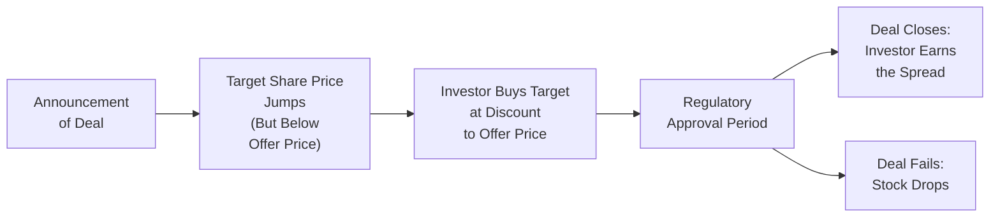
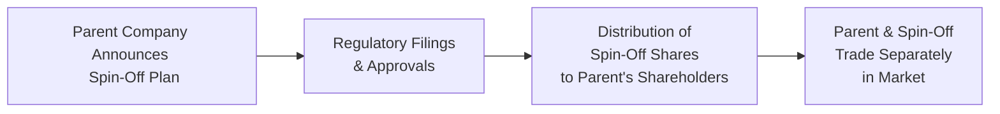

## Overview and Introduction

Event-driven investing often revolves around opportunities that surface during corporate transitions, such as mergers, acquisitions, spin-offs, and divestitures. These strategies capitalize on the possibility that markets may misprice the securities of companies undergoing transformative events. In this section, we’ll explore how merger arbitrage works in both cash and stock deals, why the “deal spread” exists, and how regulatory hurdles create unique investment considerations. We’ll also dig into spin-offs and divestitures—two ways companies sometimes unlock hidden value by separating assets or divisions from their main business.

It can be a roller coaster ride, to be honest, but it’s a fascinating corner of finance. I remember the first time I heard about a merger arbitrage scenario that posted double-digit annualized returns because the market was uncertain whether the deal would close. That left a big impression on me about how event-driven strategies can be profitable (or risky) if timed and analyzed correctly. Let’s walk through the details so you can see how these special situations might fit into an alternative investment portfolio.

## Mechanics of Merger Arbitrage

Merger arbitrage is an investment strategy that seeks to profit from the price discrepancy between a target company’s current share price and the takeover price announced by an acquirer. The basic premise is that, upon the announcement of an M&A deal, the target’s stock usually jumps toward the agreed-upon acquisition price but typically trades at a discount until the deal actually closes.

### Why a Discount Persists

This discount or “deal spread” largely exists because of:

• Uncertainty that the transaction will close.  
• Potential changes in deal terms.  
• Regulatory approvals that may impose conditions or even block the deal.  
• Financing challenges if credit markets tighten or if there is a liquidity crunch.

In essence, the opportunity arises from the market’s attempt to price in the probability of success (or failure) of the pending transaction. The risk is that if the deal fails, the target’s stock tends to drop back to (or below) its pre-announcement level. Hence, you’re not grabbing free money—far from it. You have to assess the likelihood and timing of deal completion, the catalysts along the way, and your downside if the unexpected occurs.

### Cash Deals vs. Stock-for-Stock Deals

In a straightforward cash merger arbitrage scenario, you typically purchase shares of the target if the target’s stock price is below the cash offer price. If the deal closes, you earn the spread between your entry price and the offer price. If the deal breaks, you often face significant losses because the stock is likely to revert to a lower level.

In stock-for-stock deals, it gets a little more complex. The acquiring company is using its own shares as currency. Suppose Company A announces it will acquire Company B by offering 1.5 shares of A for every share of B. In that scenario:

• You might buy shares of Company B and short shares of Company A to hedge your exposure.  
• The hedge ratio is typically determined by the exchange ratio (in this example, 1.5).  
• If the deal goes through, you deliver your B shares, receive A shares, and hopefully close out the entire position at a profit.  
• If the deal fails, you must rebalance your trade, and you risk losses on both legs if the market moves unfavorably.

This type of arbitrage is more complicated because the value you receive for B’s shares depends on the price of A’s shares. The spread can fluctuate as the acquirer’s share price moves.

### Focus on Regulatory Approvals

Regulatory approvals—often linked to antitrust or competition laws—can be make-or-break factors for a deal. If multiple regulators (e.g., the U.S. Federal Trade Commission, the European Commission, or others) are involved, the approval timeline can be lengthy and uncertain. A good friend of mine worked on a high-profile transaction that dragged on for nearly two years due to protracted negotiations with overseas competition authorities. From an arbitrage perspective, this is important because:

• A longer timeline means you’re tying up capital for a longer period—affecting your annualized return.  
• Changes in macroeconomic conditions during that waiting period can alter deal financing.  
• Political or national security issues may arise if it’s a cross-border transaction.

### Rumors, Leaks, and Deal Spreads

Market participants constantly speculate about potential deals. When rumors surface, shares of potential targets often rally, narrowing spreads before a formal announcement even happens. Once the announcement is out, the spread might shrink further but won’t usually compress fully to the offer price until completion appears highly probable. Skilled event-driven managers monitor:

• News flow and rumor mills.  
• Sell-side research indicating possible synergy or upcoming acquisitions.  
• Terms of the deal, such as any break-up fees.  
• Valuations in the relevant sector—if many deals in a sector have been blocked or re-priced recently, that might affect a manager’s appetite to invest or the market’s perception of risk.

Below is a simple diagram illustrating a typical cash merger arbitrage workflow:

## Hedging in Stock-for-Stock Deals

When acquirers use shares for the purchase, the value of the offer ratio sets the initial relationship between the two securities. However, the price of the acquirer’s stock can fluctuate, requiring active management of the hedge ratio. If the acquirer’s shares rise, you might need fewer short positions to hedge effectively. If they fall, you might need more. 

It’s sort of like balancing on a see-saw—if one side suddenly shifts, you have to make rapid adjustments to stay level. Of course, excessive rebalancing can generate high trading costs and erode potential returns. Many professional event-driven managers rely on sophisticated models to find the “optimal” hedge ratio and to rebalance at cost-effective intervals.

## Spin-Offs: Unlocking Hidden Value

A spin-off is when a parent company distributes shares of a subsidiary or specific business unit to its existing shareholders, creating a standalone public entity. The premise is often that the market will value the separated entities more accurately than a combined conglomerate structure. Corporations may pursue spin-offs for reasons like:

• Sharpening the strategic focus of the parent company.  
• Capitalizing on a faster-growing or more profitable division.  
• Complying with regulatory or antitrust requirements.  
• Satisfying activist shareholders pushing for corporate “deconglomeration.”

### Example: Large Conglomerate Splits into Two

Imagine a tech conglomerate with a flourishing cloud services business and a legacy hardware manufacturing arm. Let’s say the hardware side drags down the overall valuation multiple because it has lower growth margins. By spinning off the cloud unit, the parent company might allow investors to more clearly see—and pay for—the growth potential of the high-margin operation.

When the spin-off is completed, existing shareholders receive shares in the new entity. Event-driven investors might anticipate that the new shares will pop after the spin. They’ll buy the parent before the distribution date if they believe the spin-off shares will trade at a premium.

Here’s a diagram sketching a basic spin-off process:

## Divestitures and Their Rationale

Divestitures, in contrast to spin-offs, may involve the sale of a subsidiary or business line to an external buyer rather than establishing a separate public entity. Companies choose to divest for several reasons:

• Focusing on core operations and shedding non-core assets.  
• Improving the capital structure by generating cash to reduce debt.  
• Meeting regulatory obligations (e.g., to comply with competition rulings).  
• Responding to activist investor demands to streamline or reallocate resources.

Similar to spin-offs, divestitures can be seen as a means to release value that’s been trapped within the corporate structure. Event-driven investors will watch carefully for announcements of potential asset sales that might provide catalysts for the stock of the selling company (or even for the buyer, if the acquired assets help them reach strategic goals).

## Monitoring Critical Deal Terms

In any M&A or restructuring scenario, there are a few contractual provisions that can dramatically impact outcomes:

• **Go-Shop Provision**: Allows the target company to solicit competing bids after signing a definitive agreement. This can lead to a higher final bid but also means more uncertainty about the deal’s progression.  
• **Break-Up Fee**: A penalty paid by one party (often the target) if it backs out of the deal. A high break-up fee can deter other bidders from entering the fray.  
• **MAC Clause (Material Adverse Change)**: Gives the acquirer latitude to withdraw if a significant adverse event hits the target’s value or operational performance. Such clauses became notorious in volatile times, for instance during severe economic downturns.

Understanding these clauses is vital for risk management in event-driven strategies. If you see a steep break-up fee, for example, you might figure the deal is more likely to close. Or if a deal is loaded with MAC loopholes, you may want to discount your expected payoff for a higher chance that the acquirer walks away if market conditions deteriorate.

## Historical Outcomes and Success Factors

Historically, merger arbitrage—especially in less volatile market climates—has offered relatively attractive risk-adjusted returns. However, success rates vary depending on:

• **Deal Premium**: High premiums might raise the acquirer’s cost and risk of shareholder pushback. Low premiums might invite rival bids.  
• **Financing Conditions**: Stable credit markets help deals close more smoothly, while turmoil (for instance, the 2008–2009 financial crisis) can torpedo leveraged buyouts.  
• **Sector Cycles**: Some industries experience acquisition sprees fueled by strategic imperatives or cheap financing (e.g., the tech sector in certain periods). Others undergo lengthy dearths of M&A.  
• **Overall Equity Market Volatility**: Spreads tend to widen in high-volatility environments because the risk of deals breaking is perceived to be higher.

Likewise, spin-offs often see enthusiastic market reception, especially if the liberated subsidiary has strong growth potential. Still, not all spin-offs are successful. Coordination challenges, leverage allocations between parent and spin-off, or cost-sharing complexities can drag down performance.

## Practical Example: Cash Deal Arbitrage in Action

Picture this scenario: Company X agrees to buy Company Y at $40.00 per share—an announced 20% premium to Y’s prior closing price of $33.33. Right after the announcement, the market price of Y’s stock climbs to $39.00, creating a $1.00 deal spread. If you buy Y for $39.00, you stand to earn $1.00 per share if the deal finalizes at $40.00.

What could go wrong?  
• Regulators might delay or block the deal.  
• Company X might have financing difficulties.  
• A new competitor might appear, forcing renegotiation.  
• Unexpected negative news about Y could allow X to invoke a MAC clause.

The annualized return depends on how long it takes to close. If you expect the deal to close in six months, your approximate annualized return from that $1.00 share gain is around 5.13% over six months, or roughly 10.25% annualized—minus transaction costs. Not bad—unless something derails the deal.

## Exam Perspectives and Best Practices

For exam questions about merger arbitrage, spin-offs, and divestitures, you might see scenario-based prompts such as:

• Evaluate the probability-weighted return on a merger arbitrage investment.  
• Analyze the effect of regulatory uncertainty on the spread of an announced deal.  
• Identify reasons a company might pursue a spin-off rather than a sale.  
• Discuss how break-up fees and MAC clauses factor into risk assessment.

Remember: practice reading the fine print of hypothetical deal documents and consider the interplay between markets, financing, and strategic rationales.

## Key Takeaways

• **Merger Arbitrage**: Profits from price convergence in announced acquisitions. Spreads persist due to deal completion risk.  
• **Spin-Offs**: Let a unit operate independently, aiming to unlock hidden or undervalued corporate assets.  
• **Divestitures**: Selling off a business line to refocus on core operations, reduce debt, or comply with regulations.  
• **Regulatory Approvals**: Critical in M&A activity—long delays or rejections can devastate arbitrage returns.  
• **Contractual Provisions**: Go-shop clauses, break-up fees, and MAC clauses are essential to understand in event-driven analysis.  
• **Historical Performance**: Merger arbitrage can offer decent returns, but the risk of deal failure or long closure timelines can’t be ignored.  
• **Event-Driven Outlook**: Stay tuned to macro conditions, sector cycles, and rumor mills. Even small changes in sentiment can widen or tighten spreads.

## References and Further Reading

- Weston, F., Mitchell, M., & Mulherin, J. (2004). Takeovers, Restructuring, and Corporate Governance.  
- Mauboussin, M. J., & Callahan, D. (2020). Expectations Investing.  
- Harvard Law School Forum on Corporate Governance:  
  https://corpgov.law.harvard.edu  

---

## Merger Arbitrage, Spin-Offs, and Divestitures Knowledge Check



### Which term best describes the difference between the target company's market price and the agreed acquisition price in a merger deal?

- [ ] MAC clause
- [x] Deal spread
- [ ] Break-up fee
- [ ] Go-shop provision

> **Explanation:** The term “deal spread” specifically refers to the price discrepancy between the target’s current market price and the offered acquisition price.

### When regulators take longer than expected to review a proposed merger, which risk are merger arbitrage investors primarily exposed to?

- [x] Opportunity cost if capital is tied up for a prolonged period
- [ ] Stock-for-stock price conversion increases
- [ ] Elimination of activist investor participation
- [ ] Complete nullification of hedging gains

> **Explanation:** A lengthier regulatory review generally ties up capital longer and reduces annualized returns, increasing opportunity cost for investors.

### In a stock-for-stock merger, an event-driven investor might short shares of the acquirer mainly to:

- [x] Hedge against fluctuations in the acquirer’s share price
- [ ] Reduce regulatory antitrust requirements
- [ ] Increase overall portfolio beta
- [ ] Avoid paying dividends to target shareholders

> **Explanation:** By shorting the acquirer’s shares in a stock-for-stock merger, the investor hedges the exposure that arises from receiving the acquirer’s shares as consideration.

### Which clause allows an acquirer to exit the transaction if a significant negative event impacts the target’s business before closing?

- [ ] Break-up fee clause
- [ ] Go-shop clause
- [x] MAC (Material Adverse Change) clause
- [ ] Non-compete clause

> **Explanation:** A MAC clause permits withdrawing from a deal if an adverse event significantly affects the target's fundamentals or valuation.

### A company chooses to spin off its fast-growing software division as a separate public firm. One key reason it might do so is:

- [x] The parent wishes to unlock a higher valuation for the high-growth unit
- [ ] Reduce volatility in the IPO market
- [ ] Force the parent’s shareholders to convert their shares
- [ ] Avoid paying taxes on a divestment

> **Explanation:** Companies often spin off units to highlight their value and possibly achieve a higher valuation compared to when they operate under a more diversified umbrella.

### When a target company has a go-shop provision, this generally means:

- [ ] No other bidders can approach the target once a definitive agreement is signed
- [x] The target can actively seek higher bids from other potential buyers
- [ ] The acquirer must pay a large break-up fee if the deal concludes
- [ ] The acquirer’s shareholders can vote to replace the board during negotiations

> **Explanation:** A go-shop provision allows the target to solicit competing bids after the agreement, potentially leading to a higher final transaction price.

### In a typical cash merger arbitrage scenario, if the deal does not close:

- [x] The target’s share price is likely to fall back to its pre-announcement level
- [ ] Investors automatically receive stock in the acquiring company
- [x] The annualized return is locked in if the spread was positive
- [ ] The break-up fee is paid to the buyer’s shareholders

> **Explanation:** If a deal is terminated, the target’s price often drops toward its original, pre-announcement price because the merger premium disappears.

### Which best describes the primary motivation for a corporate divestiture?

- [ ] Combine two subsidiaries under the same management
- [x] Sell or dispose of a subsidiary to focus on core operations
- [ ] Acquire additional strategic assets to reduce synergy costs
- [ ] Merge spin-off shares back into the parent company

> **Explanation:** Divestitures remove underperforming or non-core assets so management can focus on the company’s main operations or raise cash to reduce debt.

### What is a potential outcome of having a large break-up fee in a merger agreement?

- [x] Fewer competing bids may emerge
- [ ] The target always prefers a no-shop clause
- [ ] Regulators expedite approval
- [ ] The acquirer can no longer walk away from the deal

> **Explanation:** A large break-up fee often discourages other bidders from launching rival offers because the cost to the target would be substantial if it changes suitors.

### True or False: Spin-offs typically involve the distribution of existing business unit shares to external third-party acquirers.

- [ ] True
- [x] False

> **Explanation:** Spin-offs typically involve distributing shares of a subsidiary to existing shareholders of the parent, not selling to external buyers.


