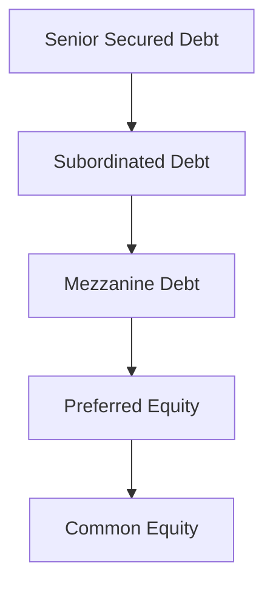

## Introduction and Context

Picture this: You’re poring over the financial statements of a company that has multiple layers of debt, equity, and maybe even a few warrants thrown in for good measure. You notice that the bond prices seem oddly depressed relative to the firm’s equity valuation. At some point, you can’t help but think, “Wait, aren’t these two capital structure layers tied to the same underlying assets?” That’s basically the spark behind capital structure arbitrage—a strategy that aims to exploit relative mispricings between a company’s different capital layers.

In the meantime, there’s another corner of the alternative investments arena that’s been quietly gaining traction: litigation finance. This is where investors or specialized firms fund legal disputes in exchange for a share of any monetary award that might result. It’s a world that sits at the crossroads of law, risk management, and big potential returns—often uncorrelated with mainstream markets. Sounds intriguing, right?

Below, we’ll take a closer look at both capital structure arbitrage and litigation finance, unraveling each strategy’s mechanics, risk factors, and potential benefits to a well-diversified alternative investments portfolio.

## Understanding Capital Structure Arbitrage

Capital structure arbitrage is all about mispricing—how the payoff of a firm’s debt instruments might differ from the payoff implied by its equity. Let’s say you believe the equity is overpriced relative to the risk profile indicated by the firm’s outstanding debt. In that scenario, you might short the equity—which you expect to decline in price—and simultaneously go long on the debt (or derivatives that reference the debt). Alternatively, if you expect the equity to outperform relative to the firm’s debt, you might do just the opposite.

To keep us on the same page, here’s an illustrative mermaid diagram showing a simplified capital structure from senior debt all the way down to equity:

In theory, each layer of the capital structure compensates investors for the probability of default, recovery rates, and overall claim priority in liquidation. If the company’s credit risk changes, you’d expect yields (or prices) to adjust accordingly across these layers. But in practice, markets can be inefficient for quite a while, presenting an arbitrage opportunity.

### Analytical Frameworks and Structural Credit Models

One of the more popular theoretical underpinnings for capital structure arbitrage draws on structural credit models like the Merton model. In simple terms (though the math can get intense), the Merton model treats a company’s equity as a call option on its underlying assets. Why a call option? Because if the firm’s assets are worth more than its liabilities at maturity, then equity holders essentially “exercise” their right to the residual claim. If the assets are worth less, the equity holders lose out—like letting an out-of-the-money call option expire.

From an arbitrage perspective, if the equity market implies a certain volatility for the firm’s value (and thus a certain risk of default), but the credit markets (as reflected in bond prices or credit default swaps) imply something else entirely, you might have an opening. For instance, if bond prices are overly cheap relative to the implied volatility from the equity side, it could be a signal to go long on the bonds and short the equity. The difference between what the equity is “saying” about default risk and what the bond or CDS spreads are “saying” can be captured for a profit if you get it right.

### The Role of Credit Default Swaps (CDS)

Credit default swaps (CDS) are essential tools in capital structure arbitrage. A CDS is like an insurance contract on the firm’s debt. If the company defaults, the buyer of protection gets compensated by the seller of protection, typically receiving the par value of the bond in exchange for the defaulted instrument. The spread you pay to buy a CDS is a reflection of the market’s view of the firm’s credit risk.

In an arbitrage context, you might see that the equity is trading at an implied volatility that suggests a relatively low default likelihood, but the CDS spread is quite high, indicating the credit market sees things more pessimistically. So you could short the equity and buy the CDS protection if you believe the bond market’s perspective is more “correct.” Over time, if the position converges (e.g., the CDS spread narrows, or the equity price falls), you could capture that mispricing. 

Of course, none of this is guaranteed. Markets can stay irrational longer than you might expect, or new information might emerge that changes the fundamental picture dramatically. Plus, the technicalities of short selling fees, CDS market liquidity, and margin requirements will all matter immensely.

### Practical Example: Bond-Equity Implied Default Risk

Imagine a simple scenario:  
• The company’s common equity is flying high—implying that the market sees limited downside.  
• Meanwhile, the yield on the firm’s subordinated bonds seems unreasonably wide, suggesting credit risk that feels more akin to a distressed issue.  

An arbitrageur might short the common stock (anticipating a correction in stock price once the market acknowledges the credit risk) and go long on the subordinated bonds. If the firm’s fundamentals remain stable, it’s possible the bonds will rally and converge closer to par, while the overly optimistic equity price might correct. By capturing that spread convergence, the arbitrageur stands to profit.

This idea can be framed in a little table:

| Capital Structure Layer | Observed Pricing Signal   | Potential Action             |
|-------------------------|---------------------------|------------------------------|
| Equity (Common Stock)   | Overvalued (high prices) | Short Common Stock           |
| Subordinated Bonds      | Undervalued (wide yield) | Go Long Subordinated Bonds   |

Naturally, real-world positions can be far more complex, possibly involving multiple derivatives to hedge out top-level market risk while focusing on the idiosyncratic mispricing. But the general principle remains.

## Introducing Litigation Finance

Now, let’s shift gears to an alternative investment approach that’s all about legal claims: litigation finance. If you’ve never encountered this strategy before, it can seem a bit out of left field—like, “Wait, you can invest in lawsuits?” But it’s actually been around for quite some time, particularly in the commercial sector.

### What Is Litigation Finance?

Litigation finance refers to the practice of providing funding to plaintiffs (or sometimes law firms) to pursue legal cases in exchange for a portion of any settlement or judgment. The big draw? The returns on such investments often hinge on the legal merits of the case, the quality of representation, and the solvency of the defendant—factors that can be largely uncorrelated with what’s happening on Wall Street or in global commodity markets.

So, even if equity markets tumble or interest rates spike, a well-chosen legal claim might stay on track, unaffected by broader economic gyrations. For some investors, this uncorrelated return profile is gold.

### Mechanics of Litigation Finance Deals

Here’s a simplified mermaid diagram that shows a possible litigation finance flow:

1. The plaintiff enters into a funding agreement with the litigation funder.  
2. The funder provides capital to cover legal expenses, expert witnesses, or even living expenses for the plaintiff.  
3. If the case results in a settlement or awarded damages, the funder receives a portion of the proceeds, as specified in the agreement.  
4. If the plaintiff loses, in many funding structures, the funder typically receives nothing, meaning it’s essentially a non-recourse investment to the plaintiff.

### Risk Drivers and Underwriting

While litigation finance can deliver uncorrelated alpha, it’s not free from risk. Some key considerations:

• Legal Merits: The claim must have substantial legal grounds. Underwriters (often experienced attorneys) will dissect every aspect to gauge success likelihood.  
• Quality of Legal Counsel: Strong, reputable law firms can increase the odds of a favorable outcome or settlement.  
• Defendant’s Solvency: Even if the plaintiff wins, the money has to come from somewhere. A judgment is only as good as the defendant’s ability (or willingness) to pay.  
• Jurisdiction: Different legal systems have different rules governing litigation funding and the enforceability of judgments.  

Because no one can predict a courtroom outcome with perfect accuracy, robust due diligence is paramount. Most litigation finance providers have teams of lawyers, investigators, and experts who pick apart the case to minimize the risk of a total loss.

### Ethical and Regulatory Implications

One of the biggest questions swirling around litigation finance is: Does external funding encourage frivolous lawsuits? That’s something regulators watch closely. In many jurisdictions, disclosure requirements and professional conduct rules mandate that attorneys maintain control of legal strategy, thus mitigating the risk that a funder effectively “buys” the case and dictates proceedings.

There’s also the question of conflicts of interest. For instance, if a funder exerts undue influence on a plaintiff to settle (or not to settle) for the sake of maximizing the funder’s return, is that in the plaintiff’s best interest? It’s a delicate balancing act, and some jurisdictions require explicit disclosures to ensure transparency.

From a CFA Institute Code of Ethics standpoint, it’s crucial that any alternative investment professional connect the dots between investor obligations (i.e., fairness, loyalty, and prudence) and the well-being of the party receiving the funding. Overstepping or ignoring these aspects can introduce major reputational and legal risks.

## Similarities and Differences from Traditional Alternatives

It might help to compare capital structure arbitrage and litigation finance with more traditional alternative strategies, such as private equity or standard hedge fund approaches.

| Strategy                     | Primary Focus               | Main Sources of Return             | Correlation          |
|-----------------------------|-----------------------------|------------------------------------|----------------------|
| Capital Structure Arbitrage | Corporate debt vs. equity   | Price convergences in capital stack| Moderate to Low with broad eq.   |
| Litigation Finance          | Legal claims & settlements  | Legal judgments/settlements        | Typically Low        |
| Private Equity              | Company ownership (long term)| Firm growth, exit multiples        | Often Linked to eq. markets      |
| Hedge Funds (Long/Short)    | Broad range of instruments  | Leverage & alpha on mispricings    | Varied across strategies         |

One key difference is that litigation finance is highly illiquid—cases can run for years, and you either get a payoff (often a big payoff) if the claim is successful or walk away with nothing if the suit fails. It’s a binary-like risk that requires skillful underwriting. In capital structure arbitrage, daily pricing for bonds, stocks, and CDS typically allows for more dynamic entry and exit strategies, though liquidity can still be an issue for certain distressed bonds or niche credit default swaps.

## Best Practices in Underwriting and Execution

### Capital Structure Arbitrage Best Practices

• Detailed Modeling of Credit Risk: Rely on structural credit models or advanced fundamental analysis to understand default likelihood.  
• Active Hedging: Manage systemic market risk by hedging with index CDS or other derivatives, so you remain exposed primarily to the relative mispricing.  
• Scenario Analysis: Stress test your assumptions. If the market experiences a liquidity freeze, can you hold your position?  
• Trading Infrastructure: Because you might be actively managing short equity and long bond positions (and possibly OTC derivatives like CDS), the operational load can be high.  

### Litigation Finance Best Practices

• Thorough Due Diligence: Review every contract, gather prior legal precedents, assess the defendant’s creditworthiness, and scope out any uncertain legal interpretations.  
• Diversification: Spread risk across multiple cases or a pool of lawsuits to safeguard against the binary nature of individual claims.  
• Engage Reputable Law Firms: High-quality counsel increases the likelihood of success and can expedite the legal process.  
• Ethical Clarity: Maintain compliance with all rules regarding disclosures, conflicts of interest, and the role of financing in litigation decision-making.

## Integration into a Portfolio

Some investors allocate to both capital structure arbitrage and litigation finance for a more holistic alternative investments exposure. The idea is that these strategies can offer returns not strongly tied to equity market movements or interest rate shifts. In times when equities and bonds might both be under pressure, a successful litigation finance portfolio might still produce healthy returns.

At the same time, these strategies can be complex. Brokerage fees for short positions, the cost of CDS, potential margin calls, and the possibility of losing your entire investment in an unsuccessful legal case—these are not for the faint of heart. Using a robust risk management framework—and possibly a dedicated team with the right expertise—is absolutely essential.

## Personal Observations

I remember a friend describing their first capital structure arbitrage trade with a mixture of excitement and sheer terror: “I’m long this weird subordinated bond, short the common stock, and it’s like I’m waiting for the market to realize what I believe is so obvious.” The convergence took longer than they expected, but eventually, they saw a tidy gain. That’s a microcosm of the patience and conviction you sometimes need in these positions.

As for litigation finance, I’ve met a few attorneys-turned-investment-managers who said they loved bridging the gap between financial structuring and the intricacies of legal battles. But they also warned me that the underwriting process demands a ton of effort—like a forensic team going through a company’s books, except you’re parsing through entire court records, witness depositions, expert analysis, and potential appellate processes. Patience and thoroughness rule the day, because if you skip steps, you can land in a world of litigation trouble—literally.

## Common Pitfalls

• Overreliance on Models: Both strategies rely heavily on quantitative or legal “inputs.” If your model is off or your legal assessment is flawed, the results can be disastrous.  
• Liquidity Crunches: In capital structure arbitrage, a mismatch in the cost of carry can ruin an otherwise sound trade. In litigation finance, you might face indefinite delays if the court docket drags on.  
• Shifting Regulatory Landscapes: New laws or regulations can dramatically alter the viability of litigation finance in certain jurisdictions. Meanwhile, short-selling restrictions or changes to the CDS market can hamper your capital structure strategies.

## Final Exam Tips

• For capital structure arbitrage exam questions, be prepared to discuss how to evaluate mispricings, the usage of CDS, and the basics of structural credit models. Keep an eye on how item-set questions might mix theoretical knowledge with practical scenarios.  
• When dealing with litigation finance questions, remember it’s all about identifying, pricing, and managing legal risk, and how these can be uncorrelated. Ethical considerations are often tested—especially conflicts of interest and compliance with disclosure rules.  
• Time management matters. On constructed-response questions, clearly outline your assumptions for mispricing or legal case viability. The exam often gives partial credit for the right approach, even if you misapply the final numeric solution.

## References and Further Reading

- Das, S. (2011). Traders, Guns & Money: Knowns and Unknowns in the Dazzling World of Derivatives.  
- Finch, V., & Milman, D. (2019). Corporate Insolvency Law.  
- Litigation Finance Journal:  
  https://litigationfinancejournal.com

---

## Test Your Knowledge on Capital Structure Arbitrage and Litigation Finance



### When engaging in capital structure arbitrage, which core principle underlies the strategy?  
- [ ] Exploiting high-risk short-term loans.  
- [x] Exploiting mispricings between different layers of a company’s capital structure.  
- [ ] Investing solely in common equity with low volatility.  
- [ ] Monitoring short-sellers’ activity as a contrarian indicator.  

> **Explanation:** Capital structure arbitrage is primarily about recognizing and profiting from pricing inefficiencies between debt and equity of the same issuer.

### Which model views equity as a call option on the firm’s assets when analyzing default risk?  
- [ ] Black-Scholes-Merton Option Pricing Model for commodities.  
- [x] Structural credit model, often based on the Merton approach.  
- [ ] CAPM (Capital Asset Pricing Model).  
- [ ] Dividend Discount Model.  

> **Explanation:** The Merton model (a form of structural credit model) conceptualizes equity as a call option on the firm’s assets, allowing analysts to compare implied volatilities and credit spreads.

### In capital structure arbitrage, if bond prices are deemed too cheap relative to equity valuations, the common tactic is to:  
- [x] Go long the bond and short the equity.  
- [ ] Go short both the bond and the equity.  
- [ ] Go long both the bond and the equity.  
- [ ] Implement a risk parity allocation.  

> **Explanation:** When bonds are undervalued relative to a more optimistic equity market, arbitrageurs typically buy (go long) the bonds and sell (short) the equity to profit from expected price convergence.

### What is the role of a credit default swap (CDS) in capital structure arbitrage?  
- [ ] It is a type of structured note that guarantees equity returns.  
- [x] It acts as insurance against default and can reflect market-implied credit risk.  
- [ ] It’s a derivative that tracks equity index performance.  
- [ ] It standardizes interest rates for corporate loans.  

> **Explanation:** A CDS allows an investor to buy or sell protection against credit events, helping them hedge or speculate on a company’s creditworthiness in capital structure arbitrage.

### Litigation finance differs from many traditional alternative investments mainly because:  
- [x] Returns hinge on legal verdicts and settlements, often uncorrelated with market movements.  
- [ ] It only invests in publicly traded securities.  
- [ ] It relies solely on interest rate fluctuations.  
- [x] It requires daily mark-to-market valuations.  

> **Explanation:** Litigation finance typically generates returns based on legal outcomes, which can be largely independent of broader economic or financial market cycles.

### Which risk factor is unique to litigation finance, compared to typical fixed-income instruments?  
- [ ] Duration risk from interest rates.  
- [x] Legal merits and defendant solvency.  
- [ ] Currency exposure in emerging markets.  
- [ ] Commodity price hedging.  

> **Explanation:** Litigation finance hinges on case outcomes, heavily influenced by legal merits and the defendant’s capability to pay, rather than traditional metrics like duration or yield.

### One key ethical concern of litigation finance is:  
- [ ] Excessive short-selling activity.  
- [x] Potential conflict of interest if funders push plaintiffs to settle prematurely.  
- [ ] Transparent auditing of mutual fund statements.  
- [ ] Insider trading in the common stock.  

> **Explanation:** An ongoing debate is whether funders might pressure plaintiffs to act in ways that maximize the funder’s return rather than serve the plaintiff’s interests.

### In which scenario might a capital structure arbitrageur short a company’s equity?  
- [ ] If the investor wants to hedge interest rate exposure.  
- [ ] If equity and bond prices are both low.  
- [ ] If the investor believes the stock price will remain flat.  
- [x] If the investor perceives that the stock is overvalued relative to the firm’s credit profile.  

> **Explanation:** Arbitrageurs short the equity when they believe it is overpriced relative to the risk suggested by the firm’s bonds or CDS spreads.

### Which of the following is a likely benefit of incorporating litigation finance into a broader alternative investments portfolio?  
- [ ] Eliminating default risk altogether.  
- [ ] Perfect correlation with equity markets.  
- [x] Access to an uncorrelated return stream based on legal outcomes.  
- [ ] Guaranteed daily liquidity and clear pricing.  

> **Explanation:** Litigation finance can provide diversification benefits since legal outcomes often bear no direct correlation to financial market trends.

### True or False: In litigation finance, if the plaintiff loses the case, the funder typically recovers its initial investment from the plaintiff.  
- [x] True  
- [ ] False  

> **Explanation:** Actually, this is typically false. Most litigation finance deals are non-recourse arrangements. If the plaintiff loses, the funder generally does not recover its initial outlay. Hence the correct answer is “False.”


