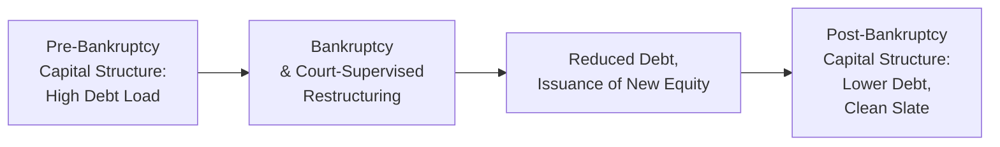
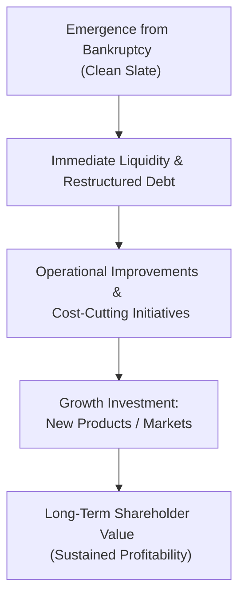

## Overview

Post-bankruptcy equities and turnarounds can offer incredibly intriguing opportunities for investors, particularly those with a knack for a bit of contrarian thinking. A common scenario is when a lofty, well-known company falls on hard times, ends up going through bankruptcy proceedings (often under Chapter 11 in the U.S.), and then emerges with a reshaped balance sheet that might have, you know, a lot less debt. This “clean slate” can present a new life for the business. At the same time, post-bankruptcy equities can be complicated to analyze, so thorough research, a solid grasp of restructuring concepts, and a hefty dose of patience are all essential.

## Post-Bankruptcy Equity: A New Beginning

When a firm navigates bankruptcy, typically a reorganization plan determines how debts will be restructured and who among the existing creditors ends up owning the new equity. The result is new shares—often distributed to creditors in place of previous obligations—called post-bankruptcy equity. These shares commonly trade at a deep discount, reflecting market skepticism about whether the restructured company can truly stage a sustainable comeback.

• Deep Discount Pricing  
  After emerging from bankruptcy, the new equity may carry a price far lower than many people expect. That’s partly because the market might still be rattled by the company’s tough history—poor track record, brand damage, or simply the lingering specter of prior missteps.

• Reduced Debt Load  
  The firm’s liabilities are (ideally) slashed during bankruptcy, enabling management to fund operations without the suffocating interest burdens that existed before. In many cases, the new equity holders might be major creditors with a vested interest in the company’s successful resurgence.

Anyway, from an investor’s perspective, this drastically lighter capital structure can pave the way for business improvements. But caution is the name of the game: if operational or strategic issues remain unresolved, the new equity can flounder.

## Capital Structure After Bankruptcy

One of the biggest appeals of post-bankruptcy investing is how the capital structure is streamlined, sometimes dramatically. You might see large tranches of debt either converted into equity or written off altogether. The resulting configuration usually involves:

• Significantly Lower Total Debt  
  Lenders, bondholders, and other claimants often accept equity in exchange for their existing claims. This type of “haircut” to debt principal reduces the company’s mandatory interest obligations—hello breathing room!

• Simplified Hierarchy of Claims  
  Many pre-bankruptcy instruments (e.g., old common stock, certain junior bonds) could be canceled. In turn, a new, more straightforward hierarchy emerges, often with a single class of common stock and fewer types of debt outstanding.

• Potential Impact on Legacy Equity Holders  
  Pre-bankruptcy shareholders frequently get wiped out or receive a nominal stake. So, new equity holders will be predominantly former creditors, plus any new investors who bought in after the reorganization.

### Illustrative Capital Structure Flow

Below is a simple Mermaid diagram illustrating how a company's capital structure may transform before and after bankruptcy.

Note that in practice, each step involves extensive negotiation, valuation disputes, and potential litigation among stakeholders.

## Importance of Turnaround Strategies

Buying post-bankruptcy equities is more than a simple financial maneuver—it’s often about a deeper operational journey known as a turnaround. Essentially, a turnaround is the set of strategic moves a freshly restructured organization takes to regain profitability and restore marketplace credibility.

### Common Turnaround Tactics

• Operational Improvements  
  This could involve realigning production processes, introducing cost-saving technology, or selectively outsourcing certain functions to become more efficient.

• Management Overhaul  
  Sometimes, new leadership is a must. New CEOs or CFOs with restructuring experience may help shift the company’s culture to one focused on consistent, profitable growth.

• Revised Business Model  
  Maybe the company emerges from bankruptcy and decides to pivot away from unprofitable products. Or it might restructure pricing, distribution channels, or the overall brand image.

• Leaner Cost Structure  
  A hallmark of any turnaround is cost-cutting: that’s the first step on the road to better margins. Whether it’s renegotiating supplier contracts or paring down overhead expenses, cost-cutting measures are basically table stakes.

### Why Thorough Due Diligence is Critical

Um, you might be tempted to waltz in and buy newly issued equity at a perceived bargain price, but not all reorganized companies are set to triumph. A real test of viability is the company’s competitive landscape and industry outlook. Questions like: Is the market in long-term decline? Are the firm’s products still in demand? Does the management team have a history of successful corporate turnarounds?

It’s not always just about financials. The intangible factors—culture, reputation, relationships with key partners, or brand recognition—can sometimes be the deciding factor as to whether a post-bankruptcy company truly recovers.

## The Role of Private Equity Sponsors

Private equity (PE) sponsors often jump in post-bankruptcy environments. Well, they do so for good reasons:

• Expert Guidance  
  PE sponsors typically have teams that are adept at implementing turnarounds—think cost optimization, revenue enhancement, and supply chain management. They bring a disciplined approach to measuring performance.

• Capital Infusion  
  Following restructuring, companies may still require fresh capital to fund expansions, new product development, or marketing. Private equity can provide that capital and help accelerate the new business plan.

• Governance and Oversight  
  Many resurrected firms adopt robust corporate governance structures, including independent board members and more stringent financial controls. PE sponsors often enforce these measures, boosting transparency and accountability.

### Case in Point: Personal Anecdote

I remember a situation years back when I observed a mid-sized manufacturing company that had just come out of Chapter 11. A large private equity sponsor came in, replaced most of the executive team, and meticulously reworked the product lines. They divested a losing division and streamlined the rest. By focusing resources on the core profitable operations, the company turned around in less than two years. That’s a sweet success story—but it doesn’t always go that way.

## Time Horizons and the Clean Slate Phenomenon

Once reorganized, a company is by no means guaranteed a quick-and-easy growth path. Turnarounds often take multiple quarters—or even years. It can be a slow uphill climb as management irons out last-mile operational issues, invests in new technology, or rebuilds lost customer relationships. On the bright side, the newly minted equity can sometimes see massive appreciation if the turnaround yields sturdy cash flows and profitability.

### The “Clean Slate” Advantage

A major advantage post-bankruptcy is that many of the firm’s biggest liabilities may be gone or substantially reduced. However, there’s also a risk that intangible issues remain:

• Lingering Reputational Harm  
  Suppliers and customers might be wary of re-engaging with a business that defaulted on obligations. Overcoming that stigma can be tricky.

• Potential Supply Chain Shifts  
  Sometimes suppliers or distribution partners have found other outlets during the company’s downtime, and the reorganized firm has to re-negotiate from a weaker position.

• Loss of Key Talent  
  Bankruptcy can shake employee confidence, leading to turnover in critical operational roles. Newly emergent companies may need to re-hire or promote up-and-coming talent, which might require time and resources.

## Practical Example: Hypothetical Reorganized Retailer

Let’s say a regional retailer, “Fresh Threads,” has a well-known local brand but got hammered by heavy debt and changing consumer trends. Eventually, they file for Chapter 11. After months of court supervision, they convert $300 million of bonds into equity, effectively clearing out that debt and leaving just $50 million in new long-term notes.

• Post-Bankruptcy Capital Structure:  
  – $0 (old equity canceled)  
  – $300 million in new shareholders’ equity (issued primarily to former bondholders)  
  – $50 million in new debt  

Emerging from bankruptcy, Fresh Threads replaces top management, invests in e-commerce channels (since consumers are heading online), and closes unprofitable physical stores. The new shares, minted at reorganization, might trade at, say, $5.00 per share initially—a steep discount relative to the old shares’ peak. But if, over the next 18 months, the new leadership proves the model can thrive, the equity could climb significantly, rewarding those who took the chance on a fresh start.

## Risk Management and Pitfalls

Before jumping into post-bankruptcy equities:

• Evaluate Industry Tailwinds (or Headwinds)  
  Are you investing in a company that’s in a shrinking or rapidly evolving market? Even if debt is wiped out, a sinking industry can bury the turnaround.

• Don’t Underestimate Organizational Complexity  
  Bankruptcy doesn’t automatically fix poor leadership or structural inefficiency. Make sure there’s a robust turnaround plan, supported by data and credible management.

• Check for Remaining Liabilities  
  Some reorganized companies still face legacy issues like litigation, environmental obligations, or pension shortfalls. Even though they might have reduced the principal debts, these potential landmines can hamper the “clean slate” effect.

## Diagram: High-Level Turnaround Phases

Here’s a simplified look at the phases a company might pass through when implementing a turnaround:

One phase typically feeds into the next, but transitions can get bumpy if a firm hits unforeseen market shifts or leadership snags.

## Final Exam Tips for CFA Candidates

• Scenario-Based Analysis: In an exam question, you might be asked to evaluate the viability of a newly reorganized company. Look at both the financial reorganization (debt reduction, fresh equity) and whether the business has the strategic foundation for a true turnaround.

• Risk Assessment: Expect to break down potential pitfalls—like reputational damage or uncertain market conditions. Use frameworks that integrate both quantitative reviews of the restructured capital structure and qualitative assessments of brand and operational prospects.

• Timeframe Considerations: Recognize that typical valuations for post-bankruptcy equities might rely on a multi-period horizon. Short-term cash flow generation can be volatile, so you might need to project further out than usual.

## References and Further Reading

- Harrigan, K. R. (2020). Strategic Turnarounds: A Guide to Restructuring.  
- Slatter, S. et al. (2006). Corporate Turnaround: Managing Companies in Distress.  
- Online Resource:  
  – Restructuring Cases (court dockets and filings) via PACER (U.S. only): https://pacer.uscourts.gov

## Test Your Knowledge: Post-Bankruptcy Equities and Turnarounds



### Which best describes why post-bankruptcy equities may trade at a deep discount initially?

- [ ] Companies emerging from bankruptcy typically have unchanged debt loads.
- [ ] Old shareholders retain significant ownership post-bankruptcy.
- [x] Investors remain uncertain about the reorganized company’s ability to generate sustainable profits.
- [ ] There is always a large supply of competing equities in the market.

> **Explanation:** Post-bankruptcy firms often carry stigma and uncertain future prospects, so investors remain cautious until the company proves it can achieve stable operations and profitability.

### What is a key advantage of a reorganized company’s “clean slate” status?

- [ ] They must retain all prior debt obligations.
- [x] They emerge with reduced debt loads, enabling better cash flow utilization.
- [ ] The company’s product line automatically becomes more competitive.
- [ ] Pre-bankruptcy management is always replaced.

> **Explanation:** A successful reorganization typically wipes out or restructures large portions of debt, providing more free cash flow to reinvest in operations and growth.

### A newly restructured airline emerges from bankruptcy with significantly reduced debt. Which of the following is most likely a remaining challenge?

- [x] Rebuilding supplier and customer confidence.
- [ ] Complete elimination of operating costs.
- [ ] Guaranteed immediate profit margins.
- [ ] No competition in the airline industry.

> **Explanation:** Even after reducing debt, the airline must restore trust among business partners and customers who might have been let down by the bankruptcy experience.

### Which statement best captures the role of private equity sponsors in post-bankruptcy companies?

- [ ] Private equity sponsors generally avoid post-bankruptcy investments.
- [x] They provide both capital and operational expertise to drive turnaround efforts.
- [ ] They focus solely on saving management costs.
- [ ] They only invest in companies that do not require operational changes.

> **Explanation:** Private equity sponsors often bring not just funding but also hands-on capabilities to guide restructured firms back to profitability.

### What is the primary purpose of operational improvements in a turnaround scenario?

- [x] Increase efficiency and reduce expenses to rebuild margins.
- [ ] Shift all production overseas.
- [x] Develop new marketing channels and product strategies.
- [ ] Completely abandon existing business lines.

> **Explanation:** Turnaround strategies often involve cutting unneeded costs and optimizing processes alongside seeking new revenue opportunities.

### Which factor is most relevant when conducting due diligence on post-bankruptcy equity?

- [x] The competitive landscape and industry growth prospects.
- [ ] The new ticker symbol alone.
- [ ] Old historical stock price movements.
- [ ] Speculative rumors about the company’s management team.

> **Explanation:** Thorough due diligence requires evaluating the firm’s future viability, analyzing industry conditions, and factoring in any strategic or operational changes crucial to a successful turnaround.

### Which of the following is characteristic of capital structures immediately following bankruptcy?

- [x] They often have fewer layers of debt and more streamlined equity.
- [ ] They always double the number of bond issuances.
- [x] Existing creditors frequently swap debt for equity.
- [ ] Equity holders from before bankruptcy usually retain all their shares.

> **Explanation:** During the restructuring process, certain creditors may accept equity in exchange for those debts. Pre-bankruptcy equity holders are mostly wiped out or heavily diluted.

### Which statement describes a practical challenge that can persist for companies after bankruptcy?

- [x] Lingering reputational concerns that can affect supplier contracts.
- [ ] The guaranteed exit of all employees.
- [ ] Automatic brand enhancement through reorganization.
- [ ] Immediate reestablishment of all credit lines at favorable rates.

> **Explanation:** Post-bankruptcy reputation issues can remain, and suppliers or customers might hesitate to renew contracts under previously favorable terms.

### What is a common element in a turnaround strategy led by private equity?

- [x] Appointment of experienced managers to realign the company’s structure.
- [ ] Zero interest in operational efficiencies.
- [ ] Allowing the previous leadership to continue with no changes.
- [ ] Avoiding any changes to product lines or supply chain processes.

> **Explanation:** PE sponsors frequently install new leadership teams with proven restructuring experience to overhaul and redirect business processes.

### Is a post-bankruptcy equity investment always a short-term strategy?

- [x] True
- [ ] False

> **Explanation:** Many post-bankruptcy turnarounds require patience. Some operational fixes take a couple of quarters or more to unfold, making these investments potentially more medium to long term in nature.


