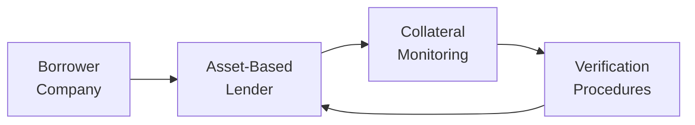

## Introduction
Have you ever looked at a business that was struggling financially but somehow still managed to secure a loan? Maybe you wondered, “How in the world did they get financing?” The answer, in plenty of cases, is asset-based lending. Asset-based lending (ABL) is a form of financing that hinges on tangible or financial assets—like receivables, inventory, or equipment—rather than relying solely on a borrower’s cash flow.

In this section, we’ll delve into the crux of ABL, focusing on collateral coverage as the central pillar. We’ll also unpack how ABL loans help businesses tap additional liquidity, especially those operating in distressed conditions or with lower credit quality. Along the way, we’ll explore personal anecdotes, share cautionary tales, and talk about best practices. Let’s dig in!

## Fundamentals of Asset-Based Lending
Asset-based lending is pretty much what it sounds like: a lending arrangement secured by a borrower’s assets. Many lenders focus primarily on accounts receivable or inventory because these are easier to convert to cash if the borrower defaults. It’s like having a pawnshop transaction on a corporate scale—somebody brings in an asset (collateral), and in exchange, the lender gives out funds.

• Receivables serve as one of the most common forms of collateral. Lenders typically evaluate:
  – Credit quality of the borrower’s customers (Who owes the money?).  
  – Historical collection timelines (Does the borrower collect on time?).  
  – Industry or seasonal patterns (Are there cyclical dips in payment?).  

• Inventory is another key asset backer. Lenders look into:
  – Inventory turnover (How fast can it be sold?).  
  – Product obsolescence (Is it perishable or subject to shifts in trends?).  
  – Liquidation value (What would this inventory fetch in a forced-sale scenario?).  

If you’re newer to ABL, just remember: physical assets that can be sold off or collected if things go south become the safety net for the lender.

## Collateral Coverage Fundamentals
At its core, collateral coverage measures how well the value of the collateral backs the loan. It’s often expressed as a ratio:


\text{Collateral Coverage Ratio} = \frac{\text{Value of Secured Assets}}{\text{Loan Amount}}


So if we have a borrower with $2 million in collateral and they borrow $1 million, the collateral coverage ratio is 2.0 (or 200%). Many lenders target a coverage ratio comfortably above 1.0, providing a protective cushion.

### Quick Example
Suppose Company A has $1.5 million in receivables. The lender applies a “haircut” to these receivables, recognizing that not all will be collectible (maybe it’s 80% deemed collectible). Thus, $1.2 million is the borrowing base. If the loan is $850,000, collateral coverage is:


\text{Collateral Coverage} = \frac{\$1{.}2 \text{ million}}{\$0{.}85 \text{ million}} \approx 1.41


A coverage ratio of 1.41 leaves some margin for bad debts or other unforeseen shortfalls.

## ABL in Distressed or Sub-Investment-Grade Situations
Asset-based lending can be a real lifeline for companies in distress or operating with sub-investment-grade credit ratings. Because repayment flows from the liquidation of specific assets rather than general corporate cash flows, businesses that might not qualify for a conventional loan can still tap liquidity.

I remember, once upon a time, reviewing a family-owned manufacturing firm that had run into cash flow issues due to cost overruns in a new product line. Their credit rating took a beating, but their steel inventory was still valuable. An ABL facility allowed them to leverage that inventory to secure a short-term line of credit and stabilize the business. It wasn’t easy—there was a lot of inventory verification involved—but it kept them afloat when traditional lenders would have declined outright.

## The Role of Covenants and Monitoring
When it comes to ABL, covenants (like coverage ratio thresholds) are critical. They’re contractual guardrails that ensure borrowers don’t deviate too far from agreed-upon business metrics or degrade the collateral. A lender might mandate:

• Minimum collateral coverage ratio—if coverage dips below an agreed threshold, the borrower must repay part of the outstanding balance or pledge additional collateral.  
• Ongoing borrowing-base certificates—borrowers must regularly send updated schedules of receivables and inventory, ensuring the loan amount is always justified by current asset values.  
• Frequency of audits and inspections—some lenders even send field examiners to physically inspect inventory or verify the existence and collectability of receivables.

### Visualization of the Monitoring Process



The loop from the lender (B) to monitoring (C) and then verification (D) back to the lender demonstrates how continuous tracking is essential to keep everyone comfortable with the collateral’s status.

## Potential Risks
As with any investment or lending strategy, asset-based lending comes with risks. For starters, fraudulent asset reporting can be a real concern. Borrowers might overstate their receivables or fail to mention they’re not collecting from half their customers.

Insert a case of illiquid or perishable inventory (imagine fish or produce) that can rapidly lose value if the borrower can’t sell it on time. Or intangible assets that are tough to value properly. The lender must be vigilant with the data. Anyone who invests in or partakes in ABL needs to keep a watchful eye on:

- Collateral obsolescence or depreciation.  
- Over-reliance on a few major customers for receivables.  
- Potential steep declines in inventory value if the market price drops.  
- Borrower’s operational discipline—are they mixing up funds or using receivables for something else?

## ABL vs. Cash Flow Lending
So how does ABL differ from the more traditional, cash flow–based loans we hear about all the time? The key divergence is in what the lender looks at. In cash flow lending, the lender emphasizes projected EBITDA (earnings before interest, taxes, depreciation, and amortization), free cash flow patterns, or other metrics that gauge a borrower’s future ability to repay.

In contrast, ABL is anchored to the liquidation value of assets. Sure, lenders want borrowers to succeed, but the fallback if things turn sour is, “We’ll just sell off your equipment or collect your receivables.” That means in distressed or sub-investment-grade situations, ABL can be more accessible since the focus is on assets, not uncertain future performance.

Here’s a simple comparison table:

| Feature                   | Asset-Based Lending                     | Cash Flow Lending                       |
|---------------------------|-----------------------------------------|-----------------------------------------|
| Primary Focus             | Tangible Assets (AR, inventory, etc.)  | Cash Flow Generation                    |
| Collateral Requirement    | Essential                               | Often unsecured or lightly secured      |
| Common Borrower Profile   | Could be distressed or sub-IG           | Typically stable or strong credit       |
| Loan Size Determination   | Based on appraised collateral value     | Based on EBITDA multiples or coverage   |
| Monitoring Intensity      | High (regular audits, borrowing base)   | Moderate (financial covenants)          |

## Growth of Private Credit Funds
In recent years, private credit funds have ramped up involvement in ABL, seeking yield in a low-rate environment. Banks, also sensitive to higher capital requirements, have pulled back from riskier lending segments, which opened the door for private lenders to fill that gap. These private funds often tailor their loan structures to niche companies or industries, offering more flexible terms than traditional banks.

Private credit can come in the form of direct lending, mezzanine financing, or unitranche (a blended senior-junior structure). Asset-based lending—especially in special situations—sits nicely in this ecosystem: it provides a clearly identifiable collateral cushion and often has a shorter-term horizon. For investors, these deals can be quite lucrative if structured well, but also come with higher default and collateral risk.

## Best Practices in Collateral Valuation
Lenders and investors rely on consistent valuation methods to assess collateral. No single approach fits all, but the most common tactics include:

• Net Orderly Liquidation Value (NOLV): A measure of what the assets would fetch in a carefully managed liquidation process.  
• Forced Sale Value (FSV): Assumes there is limited time to find buyers, potentially resulting in lower values.  
• Fair Market Value (FMV): Represents the price a willing buyer would pay under normal market conditions.  

Depending on the type of collateral, the lender chooses between these approaches. For instance, some lenders love NOLV for equipment because a forced sale might give an overly pessimistic view. Meanwhile, for inventory of unique goods, forced sale might be warranted if turning it around quickly is complicated.

## Monitoring Collateral Quality
Monitoring collateral isn’t just about counting boxes or verifying the dollar amount of receivables outstanding. It involves frequent checks on whether:

• Receivables are collectible within standard terms.  
• Inventory is intact, not obsolete or damaged, and properly accounted for.  
• Equipment and machinery remain in working condition and aren’t moved offsite.  

Lenders typically demand monthly borrowing-base certificates, validated by periodic audits. These practices ensure that any margin of safety (the difference between the collateral’s value and the loan outstanding) remains intact.

## Real-World Example: ABL for a Manufacturing Company
Let’s say you have Maple Interiors, a furniture manufacturer struggling with seasonal cash flows. Most of its assets are in high-quality wood inventory, partial assemblies, and receivables from a handful of big retailers.

• Collateral: Inventory (hardwood, semi-finished chairs, tables) + outstanding receivables from known retail chains.  
• Valuation: The lender inspects Maple Interiors’ warehouses, obtains an appraisal of the raw materials, and assigns a certain advance rate (e.g., 60%) of the net realizable value. For receivables, the lender might apply an 80% advance rate after excluding any overdue or questionable invoices.  
• Monitoring: Monthly inventory lists and receivables aging reports must be submitted, plus quarterly field audits.  
• Risk Mitigation: Maple Interiors is required to maintain a minimum coverage ratio of 1.3. If they fail, the loan can be called or Maple Interiors must repay a portion to restore coverage.

This sort of arrangement allows Maple Interiors to keep operating and meet payroll during slower months, while the lender remains reasonably protected via the pledged assets.

## Brief Python Snippet for Collateral Coverage
Data analytics can help automate monitoring. For instance, let’s say a lender gets monthly CSV reports for receivables and inventory. A short script to compute coverage might look like:

```python
import pandas as pd

df = pd.read_csv('collateral_data.csv')
df_receivables = df[df['Type'] == 'Receivable']
df_inventory = df[df['Type'] == 'Inventory']

receivables_value = df_receivables['CurrentValue'].sum() * 0.8
inventory_value = df_inventory['CurrentValue'].sum() * 0.6

collateral_value = receivables_value + inventory_value
loan_balance = 2_000_000  # hypothetical outstanding amount

coverage_ratio = collateral_value / loan_balance
print(f"Total Collateral: ${collateral_value:,.2f}, Coverage Ratio: {coverage_ratio:.2f}")
```

While oversimplified, real-world lenders might combine these calculations with advanced monitoring to automatically trigger alerts when coverage falls below a set threshold.

## Final Exam Tips
• Emphasize coverage ratios and how they’re determined. The exam often tests your knowledge of how haircuts and appraised values feed into the loan size.  
• Understand the key differences between ABL and cash flow lending. You might face a scenario question about which financing route suits a distressed borrower.  
• Covenants and monitoring aren’t just filler items—examiners love to ask about covenant triggers, margin calls, or hypothetical defaults.  
• Familiarize yourself with typical risk factors in ABL (fraud, liquidity mismatches, etc.) and how lenders mitigate them.  
• Synthesize the concepts with real-life examples. The exam could present a case of a specialty retailer turning inventory 10 times per year versus a heavy equipment company with a 20-year depreciation schedule.

## References
• Udell, G. (2015). Asset-Based Finance.  
• Sufi, A. (2009). The Real Effects of Debt Certification: Evidence from the Introduction of Bank Loan Ratings. Journal of Finance.  
• Commercial Finance Association: <https://www.sfnet.com>

## Test Your Knowledge: Asset-Based Lending Strategies and Collateral Coverage



### Which of the following best describes one key advantage of asset-based lending for sub-investment-grade companies?

- [x] Access to financing based on tangible assets rather than purely on future cash flows
- [ ] Lower interest rates than unsecured credit
- [ ] No monitoring or covenant requirements
- [ ] Complete immunity from default

> **Explanation:** Asset-based lending focuses on actual collateral, making funding accessible even for sub-investment-grade companies. Monitoring and covenants, however, are still typical requirements.

### In collateral coverage analysis, which factor generally lowers the effective borrowing base?

- [x] Applying a “haircut” to account for potential collection shortfalls
- [ ] Faster inventory turnover
- [ ] Increasing the loan-to-value ratio
- [ ] Decreasing borrower's credit risk

> **Explanation:** “Haircuts” reduce the appraised value of collateral, thus lowering the effective borrowing base.

### When assessing inventory as collateral, which of the following is a primary concern for lenders?

- [ ] The borrower’s quarterly cash flow statements
- [x] The liquidation value and marketability of the inventory
- [ ] The company’s tax obligations
- [ ] The interest rates offered by competitors

> **Explanation:** From the lender’s perspective, the liquidation value and marketability of inventory strongly influence the comfort level.

### A company obtains an asset-based loan secured by its receivables. Which of the following conditions is most likely to appear in a standard covenant package?

- [ ] A restriction on paying employee bonuses
- [ ] Mandatory purchase of key-person insurance
- [x] Requirement to maintain a minimum borrowing-base certificate
- [ ] Limitation on capital expenditures

> **Explanation:** Borrowing-base certificates (BBCs) allow lenders to monitor receivables and ensure adequate collateral coverage.

### How do private credit funds typically differ from traditional banks in their approach to asset-based lending?

- [x] They may offer more flexible structures but charge higher rates
- [ ] They impose more stringent collateral coverage ratios
- [x] They are often willing to work with distressed industries
- [ ] They avoid specialized sectors

> **Explanation:** Private credit funds can be more flexible in structures and cater to distressed sectors, albeit at higher costs.

### Which of the following is a common risk for lenders in asset-based financing?

- [x] Fraudulent reporting or overstatement of receivables
- [ ] Strict bank regulatory requirements
- [ ] Excessive reliance on future cash flows
- [ ] Zero covenant requirements

> **Explanation:** Fraudulent overstatement of receivables is a significant concern because collateral values might be inflated.

### In an ABL scenario, a “field exam” typically refers to:

- [x] An on-site inspection to verify inventory and receivables
- [ ] A comprehensive study of the borrower’s marketing plan
- [x] Physical appraisal of equipment at the borrower’s location
- [ ] Only a quick review of the borrower’s financial statements

> **Explanation:** Field exams happen on-site to confirm the existence and condition of assets.

### A technology firm seeking an ABL might face a challenge if:

- [ ] It has substantial patent portfolios
- [ ] It has a high EBITDA margin
- [x] Most of its assets are intangible or intellectual property
- [ ] Its inventory turnover is relatively high

> **Explanation:** Asset-based lending thrives on tangible, easily liquidated collateral. Intangibles alone aren’t as appealing for ABL.

### What is the key difference between asset-based and cash flow lending?

- [ ] ABL only applies to nonprofit organizations
- [ ] Cash flow lending never involves covenants
- [ ] There is no real difference
- [x] ABL bases its loan primarily on the value of physical or financial assets

> **Explanation:** Whereas cash flow lending relies on future earnings, ABL is secured by tangible or financial assets that can be liquidated.

### True or False: Private credit funds have avoided asset-based lending as it is considered too safe and offering low returns.

- [x] False
- [ ] True

> **Explanation:** Many private credit funds actively pursue asset-based lending because it offers higher yields compared to certain traditional debt and can be structured in specialized ways.


