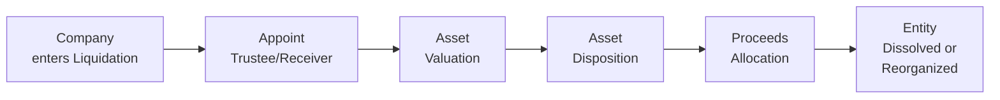

## Introduction

Sometimes companies hit a wall—maybe they're struggling with debt or failing to adapt to industry changes. At that point, the business might find itself forced to liquidate or have a receiver appointed by a court. It sounds a bit heavy, right? Don’t worry—we’ll break down the key ideas in this section, discussing the difference between voluntary and involuntary liquidations, highlighting the role of trustees and receivers, and exploring how assets get sold off to repay creditors (and possibly even shareholders). We’ll also chat about some real-world strategies: investing in liquidations (where assets can often be picked up at discounts) and the potential upsides if those assets can be repurposed for other ventures. Liquidations and receiverships can be high-stakes, event-driven situations that present unique risks and opportunities.

## Voluntary vs. Involuntary Liquidation

You might wonder, “Why on earth would anyone volunteer to shut down their own business?” Well, in a voluntary liquidation, management or shareholders decide it’s time to wind things down in an orderly manner—often to avoid deeper losses or to preserve some level of control. This might happen if a company sees a dire future ahead (like major lawsuits or unsustainable operational costs) and wants to ensure all creditors get paid (at least in part) without external parties stepping in.  

An involuntary liquidation, on the other hand, is initiated by external forces, like creditors filing a petition with the courts when they believe the company can’t pay its debts. In this scenario, the process is driven mostly by legal mandates. Courts typically assume oversight, and a trustee (or receiver, in some jurisdictions) is appointed to park the company’s operations, gather and sell assets, and handle the distribution of proceeds.

## Role of Trustees, Courts, and Receivers

“Trustee” and “receiver” sometimes sound like interchangeable terms, but they often have distinct roles depending on local laws. A trustee is typically appointed (often in bankruptcy settings) to oversee asset disposition under the watchful eye of the court. Meanwhile, a receiver may be appointed to take control of a company in distress—think of it as a caretaker who runs or manages the business on behalf of the court and the creditors.  

• Trustees often arise in liquidation proceedings (e.g., in a corporate bankruptcy under Chapter 7 of the U.S. Bankruptcy Code or an equivalent in another jurisdiction).  
• Receiverships can occur in insolvency matters, but they might also apply in non-bankruptcy contexts (like regulatory enforcement actions against financial institutions).  

Regardless of the formal title, this neutral third party steps in to figure out what the firm owns, how much it owes, and how best to sell or manage assets to satisfy creditor claims.

Below is a simple diagram illustrating a typical liquidation flow:

## Hierarchy of Claims and Payout Structure

One of the fundamental lessons in this area is that not all creditors and stakeholders are created equal. There’s a well-defined hierarchy of claims (sometimes known as the “waterfall”):

1. Administrative and legal costs (the folks handling the liquidation, lawyers, accountants, etc.).  
2. Secured creditors (often banks or bondholders with collateral backing).  
3. Priority unsecured creditors (e.g., certain taxation authorities, employees with unpaid wages, or other priority claims).  
4. General unsecured creditors (all other lenders not backed by specific collateral).  
5. Subordinated debt holders (junior debt).  
6. Equity holders (common shareholders are typically at the bottom of the heap).  

This hierarchy plays a huge role in who gets repaid. Sometimes, there’s enough money to satisfy everyone. But, more often than not, the lower-ranking creditors or equity holders may come away with a fraction of their claims—if anything at all.

A simplified formula for potential recovery to each creditor category in a liquidation might look like this:


\text{Senior Debt Recovery} = \min(\text{Senior Debt}, L) 



\text{Junior Debt Recovery} = \min\Bigl(\text{Junior Debt}, \max(0, L - \text{Senior Debt})\Bigr)



\text{Equity Recovery} = \max(0, L - (\text{Senior Debt} + \text{Junior Debt}))


where \\( L \\) is the total liquidation proceeds. Naturally, if \\( L \\) is too small compared to claims, not everyone gets their full portion.

## Fire Sales and Macroeconomic Factors

Nobody likes a rush job, especially when selling valuable assets. But in a liquidation, time can be your worst enemy. Sometimes the trustee or receiver just needs to raise cash quickly to pay off urgent claims—that’s where “fire sales” come into play. Fire sales often result in assets going for well below their potential fair market value. If market sentiment is poor or we’re in the midst of an economic recession, it can push prices even lower.

I recall one situation back around the late 2000s—when the global financial crisis was in full swing—where real estate assets originally priced at, say, $10 million, were sold for half that amount (or even less). The liquidation timeline was tight, everyone was afraid the market might deteriorate further, so buyers swooped in and got a bargain. This is precisely why the macro environment matters so much. In a hot market, you might manage a decent recovery, but in a downturn, well, let’s just say the deals can get extremely juicy for opportunistic investors (and downright painful for the distressed seller or estate).

## Strategies for Purchasing Assets at a Discount

From an investor’s perspective, liquidations and receiverships can be a gold mine—if you have the right risk appetite and expertise. Strategies typically include:

• Auction Participation: Many liquidations happen through publicly announced auctions, allowing investors to bid for assets. It’s a bit like eBay but on a massive scale. Bidders might need to meet certain qualifications, and the final price depends heavily on who shows up.  

• Negotiated Transactions: If you’re comfortable navigating the legal intricacies—and you’re able to move quickly—you might negotiate directly with the trustee or receiver. This approach can yield more specific assets tailored to your needs, often at a discount if you’re one of the few buyers capable of closing fast.  

• “Stalking Horse” Bids (in some jurisdictions): Sometimes, a buyer agrees upfront to buy certain assets at a baseline price. This establishes a floor for bids from other interested parties. If no one outbids the stalking horse, the deal closes at that pre-agreed price.

While these might sound like golden opportunities, keep in mind that diligence is crucial. Assets on the block could include intangible items like patents, brand rights, or operational businesses. Ensuring you understand potential legal liabilities or ongoing regulatory requirements can be the difference between making the deal of a lifetime and inheriting a financial fiasco.

## Receivership: Court-Appointed Management

When a company can’t keep its chin above water, creditors might petition the court to appoint a receiver to salvage something from the ashes. The receiver effectively takes over the day-to-day control or the custody of specific assets:

• The job: Secure the assets, possibly keep the business running if that enhances value, and ultimately sell or dispose of those assets in a manner that best serves the creditors’ interests.  
• Accountability: The receiver reports to the court rather than to the company’s shareholders or management.  
• Outcome: In some cases, a receivership can preserve value better than an outright liquidation if it allows for a strategic sale of the business as a going concern.  

You’ll typically see receiverships in situations involving real estate foreclosures, large corporate defaults, or sensitive industries like utilities or financial institutions where regulators want a structured wind-down.

## Upside of Repositioning or Repurposing Liquidated Assets

Sometimes, a failing business is like a puzzle with some missing pieces—it can’t operate profitably in its current form. But maybe the assets (like specialized machinery, property, intellectual property, or brand name) still have some life left if repurposed or repositioned in a new venture. For example:  

• Real Estate Repurposing: A defunct factory located in a prime urban corridor might be converted into trendy lofts or coworking spaces.  
• Intellectual Property: Patents or trademarks from a small biotech firm might be integrated into the R&D pipeline of a larger pharmaceutical company.  

The real challenge is evaluating the intrinsic or synergy-based value of these assets. During an economic downturn, the upside might be limited, but once the market recovers, an investor who snagged them at fire-sale prices can see substantial returns. This is why analyzing macroeconomic trends, industry outlooks, and the potential for synergy with your existing operations can significantly boost your payoff.

## Practical Example

Imagine a mid-sized consumer electronics company—SparkTech—that specialized in streaming devices but lost market share to bigger players. SparkTech built a robust patent portfolio, had a loyal R&D team, and maintained strong relationships with supply chain partners. But after repeated quarterly losses, they defaulted on their loans, and a creditor forced them into an involuntary liquidation.  

• The trustee organizes a liquidation sale. Some investors see raw materials (like microchips) and distribution channels as valuable, so they jump in at the auction to buy physical assets on the cheap.  
• Another investor—an established electronics competitor—quickly negotiates with the trustee to purchase the entire patent portfolio. They believe these patents can complement their existing intellectual property and reduce future R&D costs.  
• A private equity firm spots an opportunity in SparkTech’s brand name (maybe it’s still highly recognized in certain emerging markets) and invests a small sum to acquire trademark rights with the hope of a brand “revival” strategy or licensing arrangement.  

Each buyer has a different motivation. Each buyer sees a different path to unlocking value from SparkTech’s liquidation. But the original creditors only care about getting enough proceeds to cover their losses, and the trustee’s job is to maximize the total proceeds while adhering to the legal hierarchy of claims.

## Risk Management Considerations

Taking part in liquidation-based deals calls for extensive due diligence and robust risk management:

• Liquidity and Timing: Fire sales can demand immediate liquidity. Investors need enough liquid capital (or easy access to financing) to close deals quickly.  
• Legal Complexity: Cross-border receiverships and liquidations can be notoriously complex, involving multiple jurisdictions with different rules.  
• Valuation Uncertainty: Assets in liquidation may lack easy comps or might require specialized knowledge.  
• Macroeconomic Conditions: As we said, if you’re in a recession, the short-term upside might be limited because exiting those assets in a weak market can be tough.

You can cross-reference Chapter 2 (“Alternative Investment Performance and Returns”) for additional insights into measuring performance on distressed deals and understanding how to track the volatility of these specialized assets.

## Exam Relevance and Best Practices

From a CFA exam perspective, a question on liquidations or receiverships typically tests your ability to understand the hierarchy of claims, evaluate the potential risk/return trade-offs, and consider macro-level factors. You might be asked to analyze a scenario where you have a chance to buy assets at a discount, or to gauge the impact of a forced liquidation on the capital structure.

In short-answer or constructed-response questions, be ready to:

• Identify which parties get paid first and how much.  
• Discuss how a “fire sale” environment might affect net recoveries and valuations.  
• Evaluate an investment opportunity’s upside in the context of potential legal complications or macro uncertainty.

When dealing with item set questions, the exam might provide a short case study: a firm is entering receivership, you have to figure out who gets repaid, and how an investor might capitalize on a specific asset sale.

## Conclusion

So, at the end of the day, liquidations and receiverships form a niche but fascinating corner of the alternative investment landscape. They can represent both a kind of worst-case scenario for the company itself (and for creditors, to some extent) and a compelling event-driven opportunity for well-prepared investors. Recognizing the difference between voluntary and involuntary liquidation, understanding the role of trustees and receivers, and mastering the claim hierarchy are key building blocks to evaluating and even thriving in these situations.  

Add in a dash of macroeconomic insight, along with savvy due diligence on the specific assets, and you just might find yourself walking away from a fire sale with a bargain that’s poised for a bright future in a new venture.

## References and Further Reading

• Finch, V. (2017). Corporate Insolvency Law: Perspectives and Principles.  
• Bankruptcy Code (various jurisdictions). For the U.S., see U.S. Code Title 11.  
• INSOL International: https://www.insol.org  

---
## Test Your Knowledge: Liquidations and Receiverships Exam-Prep Quiz



### In a voluntary liquidation, who typically initiates the process?

- [ ] The secured creditors.
- [x] The company’s shareholders or management.
- [ ] The court upon receiving a creditor petition.
- [ ] A government agency.

> **Explanation:** In a voluntary liquidation, the company’s shareholders or management decide to wind up operations, rather than being forced by creditors or a court.

### Which of the following best describes a “fire sale” in liquidation?

- [x] Assets are sold quickly and usually at below-market prices.
- [ ] Assets are sold above book value to recover claim amounts.
- [ ] Assets undergo multi-year negotiations to find the highest bidder.
- [ ] Sales are completed only when the economy recovers.

> **Explanation:** A fire sale involves a forced, rapid sale of assets at discounted prices, often to meet urgent liabilities.

### In a typical liquidation hierarchy, which class of creditors is paid first?

- [x] Secured creditors.
- [ ] Subordinated debt holders.
- [ ] Common shareholders.
- [ ] General unsecured creditors.

> **Explanation:** Secured creditors have collateral backing, so they generally get paid out first, after any administrative expenses.

### How does a court-appointed receiver typically differ from a trustee?

- [x] A receiver may take control of the business or property on behalf of creditors, whereas a trustee primarily oversees the liquidation process under court supervision.
- [ ] A trustee actively manages ongoing operations, while a receiver is limited to legal paperwork only.
- [ ] A receiver only works with shareholder claims, whereas a trustee only addresses secured creditors.
- [ ] Both terms refer to the same role in every jurisdiction.

> **Explanation:** The line between “receiver” and “trustee” can vary by jurisdiction, but generally, a receiver is responsible for day-to-day operations on behalf of creditors, and a trustee focuses on liquidation steps.

### Which of the following is most commonly associated with a “stalking horse” bid?

- [ ] Preventing an out-of-court settlement with creditors.
- [x] Establishing a baseline offer for the assets in a liquidation.
- [ ] Eliminating the trustee’s oversight in the sale process.
- [ ] Allowing the original management team to retain partial ownership.

> **Explanation:** A stalking horse bid sets a minimum purchase price, ensuring that the estate has a guaranteed baseline even if no higher bids materialize.

### When assessing the recovery of junior debt in a liquidation, which factor is most critical?

- [x] Whether proceeds exceed the amount owed to senior debt holders.
- [ ] The difference in interest rates between junior debt and equity investments.
- [ ] The existence of multiple classes of common stock.
- [ ] The final bankruptcy filing date.

> **Explanation:** Junior debt holders are paid only after senior claims are fully satisfied, so the key question is how much remains once senior creditors have been paid.

### Which scenario may result in a higher overall recovery during liquidation?

- [x] Strong macroeconomic conditions encouraging multiple bidders.
- [ ] A lack of operational synergy among potential buyers.
- [ ] Limited competition, leaving just one active bidder.
- [ ] Crucial industry regulation that forbids open auctions.

> **Explanation:** A healthy economy can drive competitive bidding for the assets, typically resulting in higher sales proceeds.

### An investor interested in purchasing intellectual property during liquidation should primarily focus on:

- [x] Potential legal or regulatory hurdles tied to the IP transfer.
- [ ] The workforce retention plan at the selling company.
- [ ] The property’s sentimental value to the original owners.
- [ ] The trademark only, ignoring any associated patents.

> **Explanation:** Intellectual property transactions can carry complex licensing, patent, or legal obligations. These must be thoroughly reviewed prior to acquisition.

### A “negotiated transaction” in a receivership context often involves:

- [x] Direct discussions between an interested buyer and the receiver to purchase select assets.
- [ ] Only public auctions where the highest bid always wins.
- [ ] A mandatory pre-emption right given to existing shareholders.
- [ ] A settlement that defers all payments until the economy recovers.

> **Explanation:** Negotiated transactions give a buyer direct access to the receiver or trustee, allowing a tailored purchase outside a full public auction process (though usually subject to court approval).

### True or False: Equity holders usually have priority over subordinated bondholders in a liquidation.

- [ ] True
- [x] False

> **Explanation:** Equity holders are at the bottom of the hierarchy. Subordinated debt holders, while also behind senior debt, still rank above common shareholders.


