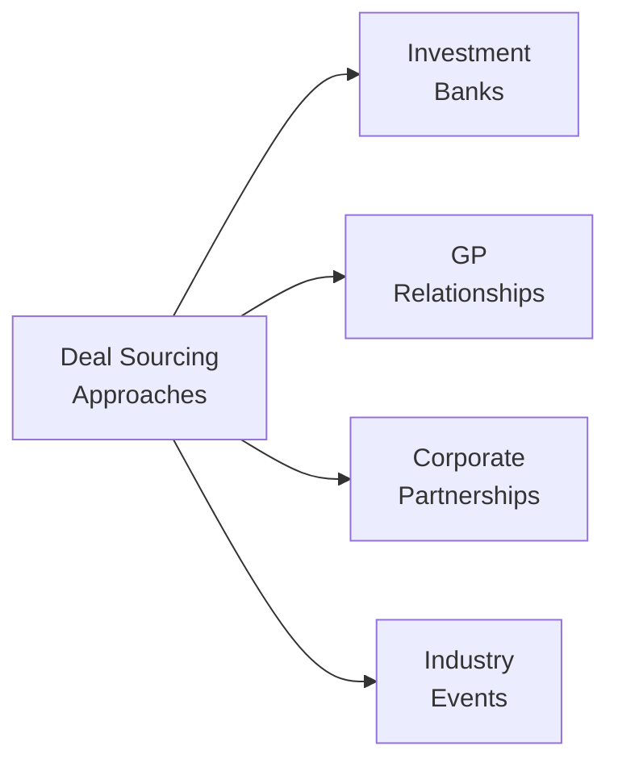
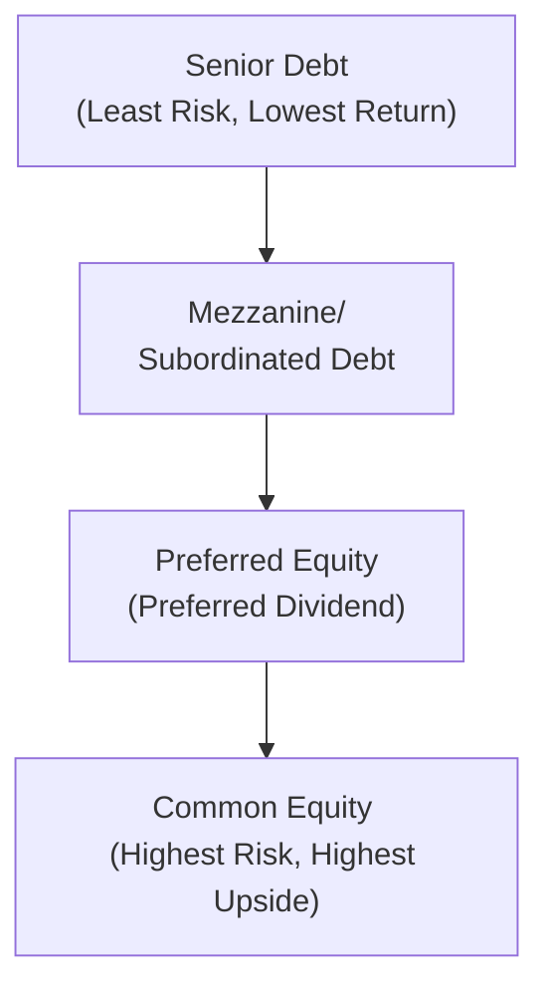

## Introduction

Have you ever run into that moment when you find the perfect investment opportunity, but you’re not quite sure how to actually “get in the room” to pitch your capital? That’s basically the big puzzle behind deal sourcing. In co-investments and direct deals, your success can hinge on your network, relationships, and an understanding of who to call—or text—when the right transaction surfaces. This section explores some of those behind-the-scenes methods, tying them to the structural nuances that shape the risk-return profile of your investments.

Below, we’ll walk through the key approaches to identifying co-investment and direct deal opportunities, highlight how to vet them carefully, and explain how (and why) you might structure these deals using different vehicles or legal frameworks. We’ll also look at how real-life considerations—like cross-border compliance, controlling equity stakes, and tricky “preferred equity” deals—fit into the big picture.

## Deal Sourcing: An Overview

When it comes to co-investments and direct deals, sourcing is the art of finding the right partner, company, or managerial team to back. Unlike a widely marketed IPO—where the ticker symbol is plastered all over financial news—private transactions often hide in less public, more relationship-driven corners of the market. That exclusivity is both the reason for potentially higher returns and, let’s be honest, the reason it can be frustrating to break in. 

From a CFA perspective, deal sourcing integrates elements of networking, due diligence, and sector knowledge. Essentially, it’s about “who you know” and “what you can bring to the table,” balanced against the obligation to deliver returns that match your risk appetite.

## Core Approaches to Sourcing Opportunities

• Existing GP Relationships: If you’ve ever been at a conference and shared a coffee with a private equity GP, you know that building a personal rapport can open doors. GPs—General Partners—manage private equity and venture capital funds, typically focusing on sourcing deals and executing them. Many co-investments flow through GPs that allow large investors (Limited Partners) or strategic partners to tag along in a secondary or side-by-side capacity.

• Investment Banker Deal Flow: Investment bankers often act as the “matchmakers” of the corporate finance world. They maintain lists of potential buyers/investors on one side and possible sellers/founders on the other. While fees can be chunky, especially for smaller deals, bankers can expedite the time it takes to find your target. They also frequently run formal auctions, in which you’ll get an information memorandum packed with data about the target. Keep in mind that auctions can drive up valuations, and you may face a competitive bidding environment.

• Corporate Partnerships and Joint Ventures: Corporations might look for specific operational expertise or capital injections. For instance, a tech company spinning off a non-core division might want a co-investor to accelerate that division’s growth. This scenario often involves partial ownership by the corporate parent, combined with direct investment from external parties. In these setups, the synergy can be huge, but so can the complexity—especially if multiple joint venture partners have different strategic objectives.

• Industry Events and Conferences: It might sound obvious, but well-structured events are often breeding grounds for fresh opportunities. You’ll hear about emerging market expansions, brand-new agricultural technology in farmland investing, or specialized real estate deals in niche asset classes. It’s the place to gather business cards, share elevator pitches, and see if there’s a potential match.

Here’s a quick visual snapshot of the major sourcing channels:

This diagram underscores that each sourcing approach radiates out from a central objective—identifying prospective deals. In reality, you might employ multiple channels at once.

## Screening and Preliminary Due Diligence

Once you grab a prospective deal, it’s time for preliminary due diligence. This usually involves:

• Reviewing company financials (if available): You want to determine if the projected cash flows align with the story pitched.  
• Evaluating the management team: Have they successfully executed on similar ventures before?  
• Checking for strategic fit: Does this company match your portfolio’s sector exposure, regional focus, and risk-return target?  
• Assessing transaction feasibility: Are there regulatory hurdles, licensing requirements, or cross-border complexities?

A personal anecdote: I once got excited about an industrial manufacturing co-investment offered by an old classmate who worked at a mid-tier private equity shop. The fundamentals looked good—until I discovered they had a regulatory infraction in one of their key sales regions. That single compliance red flag killed the transaction for me, and reminded me that legal or regulatory hurdles can quickly overshadow strong numbers.

## Structuring Co-Investment and Direct Deals

Structuring is where you bring in your legal counsel, your CFO, and any tax advisers to translate an investment vision into the right “wrapper.” This is basically deciding how you will hold the asset. Will you set up a special purpose vehicle (SPV)? Will you put the capital straight on the target’s balance sheet? Who will own which slice of the equity or debt?

### Picking the Right Vehicle

The most common approach is an SPV, created specifically for one deal. Think of an SPV as a standalone box: if something goes wrong inside that box, it doesn’t necessarily spill out into your broader portfolio. This is beneficial for containing risk, clarifying liability, and abiding by regulatory constraints—for instance, limiting the number of co-investors or meeting accredited investor rules. However, forming an SPV can generate additional legal fees and administrative overhead.

Another factor: some institutional investors, especially large pensions or sovereign wealth funds, might prefer to invest directly into the company. They skip the SPV because they already have robust compliance teams and prefer fewer layers of complexity. But not every GP or sponsor likes that approach: they might prefer to keep foreign or external investors in a ring-fenced entity to manage liability and avoid direct interference.

## The Capital Stack

If you’re investigating direct deals, you’ll quickly discover that the capital stack is not just a layered pyramid of money—it’s also a reflection of the power balance between different investors. Typically, you have senior debt at the top (least risky, but lower returns), mezzanine or subordinated debt in the middle (riskier, but paying higher yields), and equity at the base (highest risk, highest potential reward). Within equity, there might be multiple classes: common shares, preferred shares, or convertible securities.

Below is a simplified diagram of a typical capital stack for a co-investment structure:

In a co-investment scenario, you might assume a slice of the equity, or you might be participating in a mezzanine layer that gives you a semi-equity upside but also a steadier coupon. That choice depends on your risk tolerance, return objectives, and how actively you want to be involved in management decisions.

## Negotiations: Control Rights and Protective Provisions

One of the unique aspects of co-investments (as opposed to investing through a commingled fund) is the ability to negotiate your level of control. Protective provisions—or veto rights—ensure that certain major decisions (like selling the company, adding massive debt, or changing the business model) cannot happen without your approval. If you’re a minority investor, these protective rights can be vital for safeguarding your capital.

Of course, anchor GPs or controlling shareholders might be reluctant to grant too many vetoes, as it could bog down the business in endless negotiations. Striking the right balance is key: you want enough protection to prevent a meltdown, but not so many conditions that the management team can’t function effectively.

Typical elements to negotiate include:  
• Board representation or observer rights  
• Blocking rights on major corporate actions  
• Pre-emptive rights to maintain your percentage ownership during future financing rounds  
• Information rights (e.g., quarterly financial statements, development updates)

## Regulatory and Compliance Considerations

Whether you’re operating in a single jurisdiction or bridging multiple countries, keep compliance on your radar. Co-investments and direct deals sometimes involve private placements and must conform to local securities regulations. In the U.S., for instance, Regulation D offerings limit how many “non-accredited” investors can participate. In Europe, each member state might have different rules, although there are EU-level directives that can apply.

Cross-border deals present even more complexities, from foreign ownership restrictions to local tax treaties. If you’re co-investing in a regulated sector—telecommunications, energy, healthcare—be prepared for an intense (and sometimes lengthy) review by government authorities. And yes, I learned the hard way that expensive lawyers are sometimes a necessity when regulatory filings run 300 pages long!

## Balancing Alignment and Liquidity

Unlike public equities, co-investments typically come with lock-up horizons that can last many years. You can’t just log into your brokerage account and sell shares in a pinch. This illiquidity means you should plan your capital calls and distributions carefully. The lead sponsor often exercises a capital call mechanism, requiring you to fund your portion at specific intervals.

Alignment with the sponsor’s goals becomes crucial: if they’re targeting a 5-to-7-year holding period, you must be comfortable with that timeline. If a corporate partner is pushing to exit in three years, that can create a mismatch in investment horizons. Always ask: “How soon do we want out, and how do we get out?” That question alone can spark enlightening discussions with the sponsor or management team.

## Practical Example: Technology Start-Up Co-Investment

Imagine you’re approached by a GP about a technology start-up that’s rapidly scaling in the data-analytics space. The GP is deploying capital from a fund, but invites you—along with other co-investors—to join in at the Series C round. The capital stack might include:

• Senior secured debt from a venture debt firm  
• Mezzanine convertible notes from an early mezz lender  
• A new class of preferred shares with a liquidation preference  
• Founder common shares and existing employee-option pool  

You, as the co-investor, might take a slice of the preferred shares. You negotiate protective provisions: for instance, the start-up can’t take on new debt above a certain threshold without approval from the preferred holders. You also secure a board observer seat to stay plugged into strategic decisions.

Although your stake is relatively small, these governance rights can give you peace of mind. Fast-forward 24 months—if the company’s revenue surges, a strategic or financial buyer might come knocking. If that exit happens, your preferred shares may give you priority in distribution—one reason you structured them that way in the first place.

## Common Pitfalls and How to Avoid Them

• Overlooking Management Quality: The GP or sponsor—and the target’s management—are central to your investment’s performance. Scrutinize their track record.  
• Excess Complexity in Structures: Multiple layers of SPVs can create hidden fees, tax inefficiencies, and governance headaches. Understand each layer’s purpose.  
• Failing to Align on Time Horizon: If your sponsor is typically in-and-out by year three, but you aim for a five-year hold, there’s a mismatch.  
• Insufficient Due Diligence: Some co-investors rely too heavily on the sponsor’s due diligence. You can’t outsource your entire risk assessment—do your own homework.  
• Conflicts of Interest: Sponsors might prioritize deals that benefit their main fund over side-pocket co-investments. Scrutinize fairness opinions and deal terms.  

## Strategies for Success

• Build and Maintain Strong Networks: Stay top of mind with GPs and bankers. Engage at industry events, keep in touch, share market insights.  
• Foster Transparent Communication: Outline your deal preferences and capital availability early. This helps sponsors know when (and why) to bring you into a transaction.  
• Know Your Sector Focus: Specializing in a sector—like healthcare or real estate—can position you as a “value add” partner, increasing your chances of being invited into exclusive deals.  
• Leverage Legal and Tax Expertise: Sometimes skipping on expert counsel feels like it saves cash, but a single misstep can cost you dearly on the back end.  
• Document Everything: NDAs, term sheets, side letters, subscription agreements—keep them organized and consistent.  

## Final Exam Tips

• Understand the Typical Structures: For exam questions, you should deeply grasp SPVs, direct stakes, and how risk flows through the capital stack.  
• Master the Key Definitions: Terms like “protective provisions,” “preferred equity,” and “capital calls” frequently appear in item sets or essay scenarios.  
• Demonstrate Analytical Skills: Be ready to break down how a certain structure impacts returns or alignment among investors, especially in scenario-based questions. You might be asked to evaluate the viability of protective rights or the sponsor’s approach to underwriting.  
• Manage Time in Constructed Responses: If you see a multi-part question about structuring considerations for a cross-border co-investment, identify the major compliance, tax, and governance issues quickly.  
• Integrate Ethics and Professional Standards: Always recall the need to treat all parties fairly and maintain confidentiality—and watch for red flags that raise conflict-of-interest concerns.

## References

- Gompers, P., & Lerner, J. (2002). The Venture Capital Cycle. MIT Press.  
- CFA Institute (Official Curriculum readings on Private Equity and Direct Investments).  
- National Venture Capital Association (NVCA) resources on term sheets and deal structuring:  
  https://nvca.org/  
  
## Test Your Knowledge: Co-Investment and Direct Deal Sourcing Quiz



### Which of the following channels is typically considered most relationship-based for sourcing co-investments?

- [ ] Investment banking auctions 
- [x] Existing General Partner relationships 
- [ ] Online crowdfunding platforms 
- [ ] Venture debt providers 

> **Explanation:** Of the listed choices, relationships with existing GPs are a key channel for privately sourced co-investments, leveraging established trust and track records.

### Why might investors choose to form a special purpose vehicle (SPV) for a co-investment?

- [x] To compartmentalize deal-specific liabilities 
- [ ] To enhance daily liquidity for the sponsor 
- [ ] To meet strict IPO filing requirements 
- [ ] To reduce the sponsor’s management fee arrangement 

> **Explanation:** SPVs isolate risk and segregate deal-specific liabilities from other assets in an investor’s portfolio. They are not primarily designed for liquidity or to address IPO requirements.

### In a typical capital stack, which layer provides the highest risk and highest potential return?

- [ ] Senior debt 
- [ ] Preferred equity 
- [x] Common equity 
- [ ] Mezzanine debt 

> **Explanation:** Common equity sits at the bottom of the stack. If the business fails, it’s last in line for claims, but if the business thrives, it generally benefits most from appreciation.

### Which of the following best describes a key function of protective provisions in a co-investment deal?

- [ ] Ensuring the sponsor always has board majority 
- [ ] Guaranteeing the sale of the investment after a set period 
- [x] Blocking certain major corporate actions without minority consent 
- [ ] Lowering the interest rates on subordinated loans 

> **Explanation:** Protective provisions combat the risk that a majority investor (or management) will take significant actions without the minority investor’s input, safeguarding minority interest.

### If an investor is particularly concerned about liquidity needs in a 2–3 year horizon, what is a major concern with co-investments?

- [ ] They usually have daily pricing and easy exit routes 
- [x] They are typically illiquid and have long holding periods 
- [ ] They come with interest rate hedges built in 
- [ ] They are required by law to provide quarterly redemption 

> **Explanation:** Co-investments lack the liquidity that public market instruments offer. Investors must be prepared for a longer horizon with no easy exit.

### When screening a potential co-investment, which due diligence item might be most crucial for uncovering regulatory red flags?

- [x] Reviewing licensing requirements and pending infractions 
- [ ] Checking the sponsor’s recent marketing campaigns 
- [ ] Evaluating the brand image in consumer surveys 
- [ ] Studying the entire private equity fund’s travel expenses 

> **Explanation:** Regulatory infractions or licensing issues can threaten the viability of the entire enterprise. Identifying these early can save significant trouble.

### In a cross-border co-investment, which of the following complexities often arises?

- [x] Differing securities laws and foreign ownership limits 
- [ ] Guaranteed capital calls from local governments 
- [ ] Automatic alignment of interests between all parties 
- [ ] Eliminated tax obligations in the host country 

> **Explanation:** Cross-border deals come with multiple layers of complexity, such as foreign ownership restrictions, local securities laws, and tax considerations.

### Why do investment bankers often run formal auctions for private deals?

- [ ] To reduce confidentiality among potential buyers 
- [x] To maximize the selling price through competitive bidding 
- [ ] To extend the due diligence period indefinitely 
- [ ] To enhance personal brand recognition 

> **Explanation:** Auctions attract multiple bidders and ideally drive up the valuation, benefiting the seller. The bankers seek to find the highest bidder under structured timelines.

### What is the primary benefit of having a board observer seat in a co-investment deal?

- [ ] Allowing the investor to veto all management decisions 
- [ ] Eliminating the need for protective provisions 
- [ x ] Gaining direct insight into corporate strategy without full board liability 
- [ ] Controlling the sponsor’s deployment schedule 

> **Explanation:** A board observer seat provides enough visibility to track key developments and strategies but typically does not entail the fiduciary responsibilities or voting power of a full board seat.

### True or False: A straightforward way to avoid negotiation complexities in a co-investment is to waive any protective provisions and simply trust the sponsor.

- [x] True
- [ ] False

> **Explanation:** While you might sidestep potential friction by not negotiating protective provisions, this strategy can be extremely risky. Protective provisions offer essential safeguards to minority investors.


