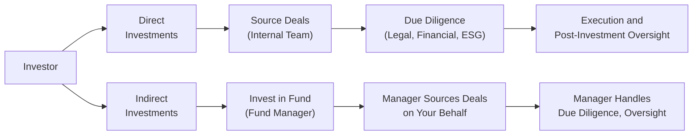

## Overview

Direct investments typically involve an investor taking a direct stake—equity, debt, or some form of hybrid—in a target company or asset without going through an external fund structure. Indirect investments, by contrast, are made via commingled funds managed by professional General Partners (GPs). The choice between direct and indirect investment strategies can profoundly shape one’s portfolio, risk profile, and return expectations. 

It’s a bit like deciding whether to build your dream house yourself (direct) or hire a reputable developer who handles all the details (indirect). Sure, you might have more input if you roll up your sleeves and do it yourself, but you also take on extra headaches and might need deeper expertise. In this section, we’ll explore the trade-offs between these paths, the resource intensity, and—importantly—the return potential. We’ll also see how some large institutional investors have used direct deals to reduce management fees (known as fee drag) and tailor strategic decisions, while others prefer the diversification and convenience that commingled funds provide.

## Key Considerations

### Investment Control and Governance
• Direct Investments: One of the main attractions of direct deals is that you, as the investor, control the decision-making process. You choose when to exit, you decide how to structure the financing, and you directly influence corporate governance. But along with that control comes a big responsibility: day-to-day oversight or involvement.  
• Indirect Investments: When you invest in a fund or partnership, you typically cede operational control to the GP. They hire portfolio managers, CFOs, and deal teams with specialized skills in everything from real estate management to technology analysis. This professional management can free up your time and resources, but it also means your say in investment decisions is limited or nonexistent.

### Fee Drag and Cost Dynamics
• Direct Investments: You avoid the layered management fees and carried interest charged by funds, which can significantly improve your net returns over time. On the other hand, you need a dedicated internal team with the relevant expertise to source and evaluate deals—these are your in-house costs.  
• Indirect Investments: Funds charge a variety of fees (management fees, performance fees, tiered incentive structures, etc.). That obviously reduces returns to some degree. But if you don’t have the resources or scale to manage deals internally, an external manager’s fees might be worth it. 

### Resource Requirements and Operational Burden
• Direct Investments: To manage deals on your own, you need specialized in-house capabilities—accounting, legal expertise, compliance, plus the sector knowledge to perform thorough due diligence. You must also keep track of regulatory filings (especially if you’re in multiple jurisdictions). This can be incredibly resource-intensive.  
• Indirect Investments: Your major resource expenditure here is researching and selecting the right GP. Once you’ve done your due diligence and committed your capital, the GP handles day-to-day oversight, reporting, and sector expertise. That said, you must monitor the GP’s performance to ensure your interests are protected.

### Risk and Return Trade-Offs
• Direct Investments: By investing directly, you might achieve higher returns if you pick good deals, negotiate favorable terms, and actively engage. But concentration risk can also rise if you have fewer deals in your portfolio, and your learning curve might be steep if you’re new to this.  
• Indirect Investments: A fund structure is typically more diversified. You can invest across multiple deals, industries, or geographies through one vehicle. That can help reduce idiosyncratic risk. However, the cost of diversification is that you share the returns with other limited partners, and you often pay the GP for this diversification.

### Strategic Decision-Making
• Direct Investments: You have the freedom—and burden—of making important strategic decisions. For instance, you might personally guide a portfolio company’s expansion plan or pivot away from unprofitable segments. This can be very rewarding, but also time-consuming.  
• Indirect Investments: The GP drives strategy on your behalf, ideally leveraging deep sector knowledge and relationships for your benefit. However, if you disagree with the direction they choose, there’s usually little recourse beyond discussing in advisory committees or, in extreme cases, redeeming (if redeemable) or selling your position in the secondary market.

## Comparative Pros and Cons

The following table summarizes some of the major arguments for going direct versus indirect:

| Factor                | Direct Investments                                           | Indirect Investments                                                        |
|-----------------------|-------------------------------------------------------------|-----------------------------------------------------------------------------|
| Control               | High (design your own strategy, full governance)           | Low (decisions left to GP)                                                 |
| Fees                  | No performance or management fees, but in-house costs       | Management fees, carried interest, other fees                              |
| Diversification       | Potentially limited unless you have deep pockets            | Typically broad across deals, sectors, and geographies                     |
| Expertise             | In-house specialists required                                | GP provides professional management                                        |
| Resource Intensity    | High (staff, technology, systems, legal, compliance)        | Low-to-moderate (ongoing GP oversight needed, but day-to-day is delegated) |
| Risk Profile          | Potentially concentrated and uncertain, but upside higher   | More diversified, but returns net of fees                                  |
| Governance Structure  | Customizable to your preferences                            | Standardized by fund legal documents                                       |
| Time Horizon          | Flexible—exit whenever feasible                             | Typically tied to fund lifecycle                                           |

## Hybrid Approaches

Many investors adopt a hybrid approach by committing capital to funds and setting aside a portion of their portfolio for select direct deals. In such a setup, you might invest in broad-based private equity funds for diversification, while separately making direct (co-)investments in a few specialized sectors you know deeply—like data centers or healthcare innovations. 

A hybrid approach can let you:
• Capture the specialized expertise of professional managers in areas you’re less familiar with,  
• Avoid paying full fees on every single deal (especially if your co-investment structures include lower fees),  
• Focus internal resources on the direct deals you believe will be particularly lucrative or strategic.

## Real-World Anecdote

I once met an entrepreneur—he was super excited about solar farms. He decided to go direct into acquiring a piece of land, building panels, and managing the project. It was exhilarating for him at first! But he quickly realized that besides raising capital, you’ve got to handle local permits, liability insurance, daily maintenance, and so on. Meanwhile, his friend invested indirectly through a renewable energy fund, paying management fees but freeing herself from all that operational burden. At the end of the day, both made decent returns, but the entrepreneur spent huge amounts of time dealing with minor details he hadn’t anticipated. 

This story highlights that direct deals aren’t always about just the money. They can also be about how you spend your time—and how comfortable you are tackling unforeseen issues.

## Deal Sourcing and Coordination Costs

Direct investments require robust deal sourcing capabilities. Without a strong network, finding quality deals can be challenging, and you might end up with suboptimal targets. Additionally, direct deals incur coordination costs if you involve multiple internal teams or external consultants.

For indirect investments, the GP handles the entire pipeline, from identifying potential deals to negotiating terms. This arrangement drastically minimizes your internal resource needs, but you also have less insight into the ongoing negotiations and the day-to-day tactics used to solidify a deal.

## Mermaid Diagram: Direct vs. Indirect High-Level Flow

Below is a simplified diagram illustrating key steps in direct vs. indirect investment processes.

## Portfolio-Level Considerations

### Asset Allocation Impact
When deciding between direct and indirect investments, consider how each will integrate into your overall portfolio. Direct investments typically require a concentrated allocation of capital, which might reduce your liquidity. Indirect investments can be structured so that you commit capital, but it’s called down over time (in the case of private equity) or is somewhat more liquid (in the case of open-end real estate funds or hedge funds). 

### Correlation Structures
Direct investments in niche sectors can be less correlated with traditional markets but can be tricky to analyze without robust data and knowledge. Indirect funds might give you well-managed exposure to these niches in a diversified manner. For instance, a farmland fund might have a subtle correlation to commodity prices, interest rates, and real estate cycles, while a direct farmland acquisition would be more specifically exposed to local climate and crop yield variations. 

### Financial Returns: Gross vs. Net
Always analyze your expected gross returns (before fees and costs) and net returns (after fees, carried interest, and overhead). It’s common for large institutional investors—like sovereign wealth funds and major pensions—to build a direct investment program to reduce the “fee drag” that can be particularly punitive on large capital commitments. But smaller family offices and individual accredited investors might lack the scale to justify the overhead of an in-house investment program, so paying the fees might actually be cheaper (and less risky in terms of operational execution) in the long run.

## Case Study: A Pension Fund’s Direct Strategy

Suppose a large public pension fund is under pressure to reduce external management costs. Its board decides to allocate a part of the alternative investments budget to direct real estate acquisitions. They hire a team of real estate experts, attorneys, and analysts to handle the acquisitions and ongoing asset management. 

• Upside: Over a 10-year horizon, they cut out the middleman fees. They also have a say in property renovations (e.g., focusing on sustainable building upgrades). They might see higher net returns because they’re not paying the typical “2 and 20” (2% management fee, 20% performance fee) structure.  
• Downside: If the property sector faces a sudden downturn or the team proves inexperienced in that geography, the entire direct investment could sour. The fund’s staff costs also rise significantly, and the board must oversee compliance, governance, and reporting in a more hands-on manner.

By contrast, if the same pension fund had chosen an indirect approach—committing the capital to a well-regarded real estate PE fund—it would have gleaned diversification across multiple properties, geographies, and property types. The GP’s track record and expertise might have reduced risk and improved stability of returns, but fees and carried interest would definitely slice into net performance.

## Risk Management and Governance

### Concentration Risk
Direct deals tend to be “lumpy.” Your capital can be tied up in a single asset or small set of assets. If one of them fails, it can have a disproportionate impact on portfolio performance. Indirect investments spread that risk over several deals.

### Governance Mechanisms
You have the potential to craft custom governance structures for direct deals, setting board seats, veto rights, or performance triggers. Indirect investors rely on the fund’s limited partnership agreement. Although you can influence terms during the negotiation phase, you have far less input once the fund is established.

### Operational Due Diligence
Direct investors must do everything themselves: verifying financial statements, analyzing tax structures, evaluating management teams, and so on. In indirect arrangements, the GP typically has a robust ODD process baked in, but as a limited partner, you need to do due diligence on the GP itself—examining their track record, operational framework, compliance culture, and reference checks.

## Best Practices and Common Pitfalls

• Have a Clear Strategy: Don’t just go direct because someone told you it can yield higher returns. Assess your in-house capacity, your time horizon, and your risk tolerance.  
• Build the Right Team: If you choose direct investments, ensure the internal team includes seasoned professionals with robust networks and domain-specific knowledge.  
• Negotiate Fund Terms: For indirect investments, examine the alignment of interests—management fees, carried interest hurdles, clawback provisions, fund governance committees, and so forth.  
• Mind Coordination Costs: Direct deals can entail hidden overhead. You might need third-party consultants, accountants, or lawyers for specialized tasks.  
• Evaluate Liquidity: Direct deals might not have any secondary market or might take months (or years) to exit. If liquidity is crucial, consider a more flexible fund structure or partial exit strategies.  
• Hybrid Approach: A combined strategy can balance the desire for control in some specialized investments with the diversification of broad-based funds.

## Additional Considerations for CFA Level III Candidates

From the CFA Level III perspective, keep in mind that the curriculum emphasizes portfolio-level optimization, risk management, and how these decisions feed into the Investment Policy Statement (IPS). Knowing how fee structures and expected returns differ between direct and indirect models is crucial for shaping asset allocation decisions. You might see scenario-based questions asking whether an institutional investor should build an internal team or rely on external managers, and you’ll need to weigh the trade-offs precisely.

Beyond that, ethics also come into play: direct investors must ensure compliance with professional standards, especially with regard to conflicts of interest, proper disclosure, and transparency in governance. Indirect investments place additional reliance on the GP’s ethical conduct; a major scandal or compliance failure at the GP level can tarnish your returns—and your reputation.

## Final Exam Tips

• Be Prepared to Do Quantitative Comparisons: You might face exam questions that ask you to compare net returns of a direct investment vs. an indirect investment. Make sure you’re familiar with how to model fees, carried interest, and potential performance across multiple years.  
• Master the Qualitative Factors: The CFA Institute loves to test your ability to articulate reasons for and against certain strategies. Know your bullet points—control, fees, diversification, expertise, and so forth.  
• Practice Scenario Analysis: Think about an investor scenario (e.g., a family office vs. a large endowment). Ask yourself how their constraints on liquidity, time horizon, and resource availability might drive them to prefer direct or indirect routes.  
• Don’t Ignore the Governance Dimension: The CFA Code and Standards emphasize the importance of governance structures for investor protection. Indirect structures typically have a well-defined chain of accountability. Direct deals are only as robust as the governance you establish.  
• Familiarize Yourself with Typical Terms: For both direct and indirect strategies, you need to be aware of standard terms like hurdle rates, clawbacks, and distribution waterfalls. These often show up in CFA exams.

## References

- Tuck School of Business Private Equity and Venture Capital Casebook (2025 Edition).  
- Groh, A. P., Liechtenstein, H., & Lieser, K. (2012). “The European Venture Capital and Private Equity Country Attractiveness Index.”  
- CFA Institute (2025). Official Curriculum for the CFA Program, Level III, Private Equity and Alternative Investments Readings.  

## Test Your Knowledge: Direct vs. Indirect Investment Trade-Offs



### Which of the following is a major benefit of making a direct investment rather than an indirect investment?

- [ ] Broader diversification with minimal operational burden.  
- [x] The investor has greater control over strategic and governance decisions.  
- [ ] Lower concentration risk through multiple deals in a single vehicle.  
- [ ] Management fees are typically lower in indirect structures.  

> **Explanation:** Direct investments afford the investor more direct control and decision-making authority. However, they often come with higher concentration risk and increased operational burdens.

### A pension fund is debating whether to set up a small real estate acquisition team or commit capital to an external real estate private equity fund. One key drawback of going direct is:

- [ ] Paying high performance fees on each deal.  
- [ ] Relying on the GP for asset selection.  
- [x] Bearing a heavy resource and operational burden in-house.  
- [ ] Sticking to a fund’s predefined investment timeline.  

> **Explanation:** Going direct means the pension fund must hire and manage an internal real estate team, incurring overhead costs and responsibilities for deal sourcing, due diligence, and asset management.

### What is “fee drag” in the context of indirect investments?

- [ ] The operational complexity associated with hiring new staff for direct investments.  
- [ ] The immediate capital call system used by private equity funds.  
- [ ] The requirement to pay higher corporate taxes on private equity returns.  
- [x] The reduction in overall returns resulting from management and performance fees.  

> **Explanation:** “Fee drag” is the effect of fees (management fees, carried interest, etc.) on net returns when investing through a fund or commingled vehicle.

### Which of the following statements best describes a hybrid approach to investing?

- [x] A mix of direct investments in certain sectors coupled with commitments to funds for diversification.  
- [ ] Utilizing an external fund of funds structure that targets multiple GPs.  
- [ ] Focusing exclusively on direct co-investments without any fund involvement.  
- [ ] Relying solely on a commingled vehicle for all alternative assets.  

> **Explanation:** A hybrid approach blends elements of direct and indirect investments. For instance, an investor might choose direct deals in familiar sectors while maintaining fund commitments for broader coverage.

### In the context of governance, what is one major difference between direct deals and indirect fund investments?

- [ ] Direct investments offer less control over board appointments.  
- [ ] Indirect investments allow for personal involvement in day-to-day operations.  
- [x] Direct investments enable more customized governance structures, while fund-led governance is typically standardized.  
- [ ] Indirect investments circumvent typical compliance requirements.  

> **Explanation:** Direct deals let you design specific governance rules, including board seats and veto rights. In a fund, these terms are largely predetermined in the partnership agreement.

### A smaller institutional investor with limited internal capacity might prefer an indirect investment approach primarily because:

- [ ] They want to control all strategic decisions directly.  
- [ ] They aim to concentrate their portfolio in fewer assets.  
- [ ] They wish to eliminate management fees.  
- [x] They lack sufficient resources to handle due diligence and ongoing oversight for direct deals.  

> **Explanation:** Less-resourced investors often lack the expertise and manpower to efficiently manage direct deals, so investing through a professional manager can be more effective despite fees.

### For large institutional investors, a key motivation to expand their direct investment program is often:

- [x] Reducing the fee drag associated with commingled fund structures.  
- [ ] Outsourcing the day-to-day asset management responsibilities.  
- [ ] Maximizing their exposure to multiple GPs for diversification.  
- [ ] Ensuring they have access to a variety of specialized operators.  

> **Explanation:** Many large institutions aim to bring investment capabilities in-house once they reach scale, thereby lowering overall fees and retaining more of the investment upside.

### When designing a direct investment strategy, which of the following expenses should be anticipated?

- [ ] Performance fees paid to external fund managers.  
- [x] In-house staffing costs, compliance requirements, and specialized consultants.  
- [ ] Tiered waterfalls for carried interest distributions.  
- [ ] Fund administration fees charged by the GP.  

> **Explanation:** Direct investing entails building internal capacity, including staffing, technology, legal counsel, and external consultants—costs that can add up.

### While an indirect fund investment is generally more diversified, one potential disadvantage is:

- [x] Limited input on key strategic or operational decisions of the underlying assets.  
- [ ] The inability to invest in large or institutional-grade deals.  
- [ ] No access to professional management.  
- [ ] Expansion of an investor’s direct operational responsibilities.  

> **Explanation:** In an indirect structure, the GP manages the investments and the LP has limited authority to shape each investment’s strategy, exit timing, or operational decisions.

### True or False: Direct investment strategies inherently carry lower risk due to the absence of any GP-related fees.

- [ ] True  
- [x] False  

> **Explanation:** Direct investment strategies might avoid certain fees, but they often involve higher concentration risk and require greater operational oversight, which can increase risk.


