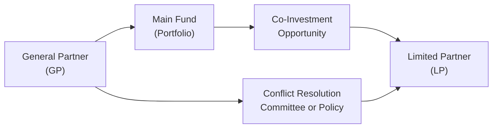

## Understanding Fiduciary Duty in Co-Investments

Fiduciary responsibility—quite a mouthful, right? It simply points to the obligation that one person (or entity) has to act in the best interests of another. When I first encountered the concept, I was a junior analyst grappling with a major co-investment proposal alongside our core private equity fund. It felt a little nerve-racking because co-investments add extra layers of complexity to the usual manager–investor dynamic. Not only do GPs (General Partners) have to optimize returns for their limited partners (LPs), but in co-investment deals, they also need to juggle the demands of an additional, often large, co-investor that might enjoy different fee terms, different risk preferences, or, well, different everything.

This sense of “duty to serve the best interest” intensifies under co-investment structures. Because co-investors often rely heavily on a GP’s diligence, oversight, professional judgment, and fairness, any slip-up may erode trust, dent reputations, and possibly trigger legal liabilities. Meanwhile, LPs (say a pension fund or an endowment) must also ensure that their co-investment decisions remain prudent for their own beneficiaries. So let’s dig into the nuances of how fiduciary duty comes to life in co-investments.

## Balancing Conflicts of Interest

Co-investments can be amazing because they let investors tap into the sponsor’s best deals at favorable economics (for instance, reduced or no management fees, reduced carried interest, and so forth). But these sweet deals can come with conflicts:

• Potential for Reduced Diversification: Some co-investments concentrate LP capital in a single opportunity.  
• Tension between GP and Different Co-Investors: GPs seeking additional capital might court certain investors more aggressively—sometimes neglecting that not all LPs can accept or desire the same risk exposures.  
• Side Arrangements and Special Terms: You’d be surprised how quickly undisclosed side letters or sweetheart deals can show up in a co-investment. Maybe the sponsor quietly arranges some fee discounts or different governance rights for one large investor—potentially to the disadvantage of others.

When conflicts bubble up, they often do so because of incomplete disclosure or misalignment of incentives. That’s why the duty of loyalty and the duty of care loom so large.

## Duty of Loyalty and Duty of Care

The duty of loyalty basically says, “You have to put your clients’ (or your beneficiaries’) interests first—always.” It means no self-dealing, no shady side deals, and yes, full transparency. Meanwhile, the duty of care is about prudence and thoroughness in making decisions. If a GP invests in a software start-up without fully investigating the founder’s track record, the product pipeline, or the competitive landscape, they could face questions about whether they truly satisfied their duty of care.

### Quick Illustrative Example

Imagine a GP sees a stellar growth opportunity in a biotech firm. They put it into the main fund but also invite co-investors to put in an additional $20 million. If the GP has the inside scoop that the biotech firm’s next clinical trial looks promising, they might be fulfilling their duty of loyalty and care by sharing this opportunity widely across interested LPs—within the guidelines of confidentiality. However, if they only share it with their favorite institutional investor (the one that invests a ton in the fund each year) and withhold it from other LPs who actually inquired about co-investment opportunities, that might violate the fairness principle underlying fiduciary responsibility.

## The Role of Disclosure

Full disclosure is the lifeblood of fiduciary responsibility. Nobody wants hidden fees or hush-hush side letters. When co-investors step into a deal, they usually rely on the GP’s due diligence and structuring, which includes:

• Transparent Fee Arrangements: Ensuring that everyone knows who pays what fees, carried interest splits, or ongoing management costs.  
• Explicit Conflict of Interest Disclosures: For example, “We, the GP, have a vested interest in this particular real estate project because one of our principals sits on the board of the construction firm.”  
• Economic and Governance Terms: Outlining exactly how co-investors share in the upside and the downside.  

I once saw a scenario where a GP included ambiguous language in the co-investment memoranda—something along the lines of “additional fees may apply as per sponsor’s discretion.” That is a big no-no under a strong fiduciary framework. Clear, unambiguous disclosures keep all parties from unpleasant surprises and potential litigation.

## The Overlapping Responsibilities of GPs and LPs

It’s not just the GP who must wear the fiduciary hat. Large LPs—like pension funds—have their own sets of fiduciary obligations to the pensioners (the real beneficiaries). Picture a pension fund manager who invests in a co-investment opportunity that is way too risky compared to what retirees’ risk profiles can handle. That manager might be breaching their own duty of care to the pensioners. So, prudent investing—aligned with each institution’s risk/return objectives—remains essential, especially for co-investment deals that can be chunky relative to the total portfolio.

## Conflict Resolution and Internal Compliance

Okay, so how do we keep co-investment deals on track and not devolve into fiascos? It comes down to establishing a robust internal compliance program and clarifying conflict resolution processes.

• Create a Dedicated Conflict Resolution Committee: A group within the GP’s organization or the LP’s internal governance that flags potential conflicts early.  
• Written Policies: Document how the GP prioritizes deals for the main fund vs. co-investors. Maybe the policy says all co-investment opportunities must be offered pro rata to existing LPs.  
• Periodic Audits or Third-Party Verification: Engaging external auditors or third-party consultants to double-check that co-investments are fairly allocated and not used to offload risk.  

Here’s a diagram that visualizes how various entities (GP, Main Fund, Co-Investors) might be linked and how conflicts can arise:

In this simplified flow, the GP drives the main fund and decides when to spin off co-investment opportunities. A conflict resolution committee (or policy mechanism) stands by to ensure fair and transparent allocation processes. Meanwhile, each LP invests in the main fund or in direct co-investment deals.  

## Glossary

Fiduciary  
An individual or entity legally obligated to act in another party’s best interest (e.g., a trustee for a pension fund, GP for an LP).

Duty of Loyalty  
The requirement to put client or beneficiary interests ahead of personal considerations.

Side Arrangements  
Unofficial or selectively shared agreements granting special rights or fee structures to certain investors. These must be disclosed to avoid ethical and legal pitfalls.

Disclosure  
Full transparency over all deal terms, potential conflicts, and any special agreements or fees.

Internal Compliance  
An internal set of policies and processes ensuring that all decisions follow legal, ethical, and regulatory guidelines.

Duty of Care  
The responsibility to undertake careful, well-researched, and prudent decision-making, especially important in illiquid and complex co-investment scenarios.

Conflicts of Interest  
Any situation—financial, personal, or otherwise—where an individual’s or firm’s decisions might be biased due to competing incentives.

Beneficiaries  
People or entities that ultimately receive the profits or benefits from investments. For a pension fund, these would be retirees; for a foundation, the philanthropic endeavors, etc.

## Personal Reflection and Practical Example

I recall a case at a small private equity shop where I worked as an analyst. The GP had a golden co-investment opportunity in a niche manufacturing firm. Because it was so specialized, few major LPs expressed interest. But the sponsor wanted to secure co-investments quickly to reduce the main fund’s exposure. So they reached out to one large LP with whom they had a strong relationship.

Midway through diligence, it turned out the manufacturing firm’s primary customer was run by a close relative of one of the GP’s principals. This nepotism angle wasn’t initially disclosed to smaller co-investors. The GP was facing a serious duty of loyalty issue by not presenting the potential conflict up front. In the end, the sponsor came clean, provided the relevant documents, and allowed each LP to decide whether to proceed. Luckily, the manufacturing firm’s related-party relationships did not hamper returns. But had the conflicts not been shared promptly, the GP could have faced a breach of fiduciary duty claim or possibly a meltdown of investor confidence.

## Best Practices for Maintaining Fiduciary Responsibilities

| Aspect                          | Best Practice                                 | Rationale or Example                                                 |
|:--------------------------------|:----------------------------------------------|:---------------------------------------------------------------------|
| **Duty of Loyalty**            | Provide equal access to opportunities         | Offer co-investments pro rata; share all relevant deals with all LPs |
| **Duty of Care**               | Conduct thorough due diligence                | Engage independent third-party experts, share complete data          |
| **Active Disclosure**          | Publish conflict and fee structures           | Avoid hidden side letters, ensure all investors have the same info   |
| **Internal Compliance**        | Establish a compliance officer or committee   | Oversee transactions, audit fairness in selection and allocation     |
| **Conflict Resolution**        | Outline a process for grievances              | Have policies that specify arbitration or board-level committees     |
| **Monitoring**                 | Provide regular co-investment updates         | Ensure LPs remain informed about portfolio performance, fees, etc.   |

## Exam Tips and Common Pitfalls

• Keep an Eye on Disclosures: For CFA exam scenarios, expect queries on how to handle incomplete or inadequate disclosures in co-investment deals.  
• Dual Fiduciary Roles: Watch out for questions where a pension fund is the LP, as they also have fiduciary duties to their beneficiaries.  
• Recognize Conflict Red Flags: The exam might test your ability to identify or mitigate hidden conflicts of interest.  
• Alignment with Ethics: Always connect fiduciary duties back to the CFA Institute Code of Ethics and Standards of Professional Conduct.  
• Procedure for Conflicts: Be prepared to describe steps a GP or an LP can take to resolve or disclose a conflict (e.g., establishing an independent committee, recusal of certain individuals).  

## References

• Institutional Limited Partners Association (ILPA) Guidelines: Offers best practices on governance, transparency, and fiduciary responsibility.  
• CFA Institute Code of Ethics and Standards of Professional Conduct: https://www.cfainstitute.org/en/ethics-standards  
• Additional Reading:  
  – “Private Equity and Co-Investment Strategies,” CFA Institute Publication  
  – “Limited Partnership Agreements: A Legal Perspective,” Johns, M. & Harper, D. (2022)  

## Test Your Knowledge: Fiduciary Responsibilities in Co-Investments



### Which of the following best describes "fiduciary duty" in a co-investment context?

- [x] The obligation to act in the best interest of beneficiaries, even if personal interests conflict.
- [ ] A contractual requirement to earn a minimum return for co-investors.
- [ ] The right to charge any fee structure deemed appropriate without disclosure.
- [ ] An obligation to invest exclusively in public equities.

> **Explanation:** Fiduciary duty requires placing beneficiaries’ interests ahead of personal or organizational gain. It also involves duties of loyalty, care, and comprehensive disclosure.

---

### In a typical co-investment scenario, how does “duty of loyalty” commonly manifest?

- [x] By disclosing all conflicts and offering equitable access to investment opportunities.
- [ ] By securing a GP commitment without requiring any disclosure of side letters.
- [ ] By prioritizing main fund interests over all other considerations.
- [ ] By ensuring that returns are always risk-free for co-investors.

> **Explanation:** Duty of loyalty implies fair dealing, equitable allocations, and open disclosure of conflicts, so all investors can make informed decisions.

---

### An LP who invests in a co-investment deal for a pension fund has its own fiduciary responsibility because:

- [x] The pension fund manager must act in the best interest of the pensioners.
- [ ] The GP has delegated all responsibility to the LP.
- [ ] Co-investing always involves zero risk, requiring no oversight.
- [ ] The LP has no fiduciary duty once it signs a limited partnership agreement.

> **Explanation:** Pension fund managers owe fiduciary duties to the plan beneficiaries (pensioners). Even when co-investing, they must align the deal with the fund’s overall risk profile.

---

### Side arrangements in co-investments can pose a fiduciary issue primarily because:

- [x] They can create undisclosed conflicts of interest or unequal economics among investors.
- [ ] They guarantee stable returns and thus attract excessive capital.
- [ ] They are usually forbidden by regulatory authorities in all jurisdictions.
- [ ] They never require disclosure to co-investors or regulators.

> **Explanation:** Side arrangements—often undisclosed or selectively disclosed—may erode fairness and transparency, undermining fiduciary duties of loyalty and care.

---

### What is a recommended practice to handle conflicts of interest in co-investments?

- [x] Establish a conflict resolution committee and maintain transparent allocation policies.
- [ ] Ignore them and assume alignment of incentives will develop naturally.
- [ ] Provide limited disclosure only to top-tier LPs.
- [ ] Deny co-investors any involvement in governance matters.

> **Explanation:** Setting up committees, documenting policies, and ensuring full disclosure helps manage conflicts proactively, keeping the fiduciary relationship intact.

---

### From a fiduciary perspective, a GP who discovers material adverse information about a target investment:

- [x] Must promptly disclose it so that co-investors can make informed decisions.
- [ ] Is free to withhold it until the investment is closed.
- [ ] Can only share partial information to preserve confidentiality.
- [ ] Should prioritize appeasing the largest LP over others.

> **Explanation:** The duty of care and duty of loyalty both require full and timely disclosure of all pertinent information, even if it may cause investors to back out.

---

### Which of the following would violate a GP’s fiduciary duty in co-investments?

- [x] Allocating a promising opportunity exclusively to a favored LP without disclosing it to others.
- [ ] Having a strict pro rata allocation approach for all interested LPs.
- [ ] Sharing the same fee terms with all co-investors.
- [ ] Offering thorough due diligence materials to all LPs.

> **Explanation:** Favoritism violates fairness and loyalty principles. A GP must provide a transparent process for all interested co-investors.

---

### What is one key role of internal compliance in a GP’s setup?

- [x] Ensuring that all investment, disclosure, and allocation practices conform to ethics, regulations, and fiduciary standards.
- [ ] Maximizing fund returns by taking on undisclosed leverage.
- [ ] Guaranteeing that no co-investment deals are made.
- [ ] Hiding side letter agreements from certain LPs to maintain strategic relationships.

> **Explanation:** Internal compliance programs are meant to uphold ethical and fiduciary standards, ensuring transparency, fairness, and alignment with the rules.

---

### In co-investment deals, the concept of “duty of care” implies:

- [x] Conducting thorough due diligence and acting prudently based on the best available information.
- [ ] Prioritizing personal investments over LP interests.
- [ ] Limiting the involvement of legal counsel to reduce costs.
- [ ] Maintaining a hands-off approach to oversight responsibilities.

> **Explanation:** Duty of care means the GP must investigate, analyze, and make informed decisions, ensuring the co-investment is suitable and in line with fiduciary standards.

---

### True or False: In a co-investment arrangement, the responsibility to disclose conflicts of interest is entirely on the LP.

- [x] False
- [ ] True

> **Explanation:** The GP, as fiduciary, carries the primary duty to disclose conflicts. LPs, especially those managing pension or endowment assets, also have fiduciary duties, but conflict disclosure starts with the GP.


