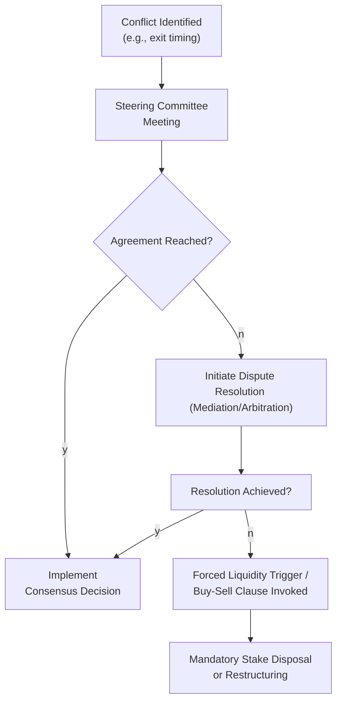

## Introduction
Co-investments often promise the best of many worlds—access to unique deals, alignment of interest among investment partners, and the potential for attractive returns. Yet, whenever multiple stakeholders gather around the table—like general partners (GPs), limited partners (LPs), minority investors, and management teams—conflicts can arise. And trust me, I’ve seen my fair share of co-investment deals where tensions flare up over exit timing or follow-on financing, sometimes catching investors off guard. In this discussion, we’ll unpack the common sources of stakeholder conflict, explore formal (and informal) resolution mechanisms, and walk through best practices to keep your co-investment ship sailing smoothly.

## The Nature of Conflict in Co-Investments
Co-investments differ from traditional fund investments because they allow various LPs (and sometimes external parties) to invest alongside a GP in a specific portfolio company. By design, you get a more direct line of sight into the investment and, presumably, tighter alignment with the sponsor. Yet the complexity arises when not all parties share the same motivations or time horizons.

• GPs might want a quick exit if their fund is nearing the end of its term.  
• LPs might push for continued growth if their strategy involves a longer holding period.  
• Management teams (often with equity stakes) care about operational control and day-to-day decision-making.  
• Minority investors may require stronger governance protections to protect their smaller (but strategic) stakes.  

Differences in opinions revolve around:  
• Exit timing and valuations  
• Strategic direction and expansion  
• Distribution of proceeds (especially if the investment goes better—or worse—than expected)  
• Follow-on financing or recapitalization decisions  

If you’ve ever been in a multi-owner business meeting, you probably know how easily these well-meaning partners can talk past each other when money and control are on the line.

## Common Sources of Stakeholder Disputes
### Exit Timing and Valuation
One of the most common flashpoints is deciding when—and how—to exit an investment. Maybe the GP, who must liquidate the fund, pushes for a sale, while certain minority LPs prefer a longer time horizon to capture additional upside. Or perhaps management wants more runway to grow the company’s value, but an LP is looking to redeploy capital into new opportunities. A misalignment like this can create tension, or even a deadlock, when no one can agree on a suitable path forward.

### Follow-On Financing
Follow-on rounds can create tension when not all co-investors are prepared (or willing) to commit additional capital. Those who continue funding might want a bigger slice of the pie, diluting the stakes of the non-participants. Meanwhile, non-participants may worry that GPs have over-optimistic growth projections. Without a transparent discussion of how these follow-on rounds are structured, seeds of conflict can quickly sprout.

### Strategic Direction
Imagine a scenario in which the management team wants a bold acquisition to grow the company, while minority investors fear the associated risk and potential dilution. Or, the GP has invoked operational controls that the LPs find too aggressive. If the ownership agreement doesn't clearly clarify who has the final say—and which checks and balances are in place—these strategic disputes can become significant headaches.

### Distribution of Proceeds
Distribution conflict might seem straightforward—money gets paid out, everyone’s happy, right? Actually, it’s rarely that simple. Disagreements crop up when priority returns (like a preferred return for certain investors) or hurdles in the waterfall structure mean some investors get paid sooner or in larger proportion than others. Throw in timing complexities regarding in-kind distributions versus cash payouts, and these disputes can become a big mess.

## Mechanisms to Mitigate Conflict
### Clear Governance from the Outset
You really can’t overstate the importance of a well-designed partnership agreement. Before a single dollar changes hands, all parties need clarity on voting rights, conflict resolution steps, and obligations for future capital calls. Sometimes, this clarity gets overlooked in the rush to land a good deal. But trust me, that’s like skipping the foundation when building your house—it might look fine at first, but it’s bound to cause structural issues later.

### Steering Committees
A steering committee is often the first line of defense against conflict. It’s essentially a representative body that includes key stakeholders (e.g., the GP, major LPs, management representatives) to guide decisions on day-to-day governance and broader strategic matters. Because co-investments can balloon into complex ownership structures, a steering committee acts as a neutral facilitator, ensuring no single faction dominates every discussion.

The steering committee might:  
• Review major capital expenditures  
• Approve follow-on financing or new debt  
• Align on exit scenarios and potential sale processes  
• Monitor management performance and strategic alignment  

### Transparency in Communication
Ongoing, open dialogue can sound trivial—until you see what happens without it. I once saw a co-investment scenario where a GP unilaterally decided to pivot strategy, blindsiding minority LPs. The result? Lawsuits, forced buyouts, and a bunch of damage to relationships. Transparent communications—like scheduled stakeholder meetings, regular progress updates, and open financial reporting—help reduce misunderstanding and friction from the get-go.

### Formal Dispute Resolution Clauses
When steering committees or open forums fail, the partnership agreement (or a shareholders’ agreement) should have formal scaffolding to resolve disputes. This usually includes:  
• Deadlock provisions that outline steps if parties can’t agree on critical decisions  
• Buy-sell provisions allowing one side to purchase another’s stake if disagreements reach a standstill  
• Mediation or arbitration clauses for neutral third-party resolution  

It might sound a bit legalese, but having these clauses in writing is crucial to avoid drawn-out legal battles. In practice, a well-structured buy-sell provision can keep business continuity rolling when co-investors truly can’t see eye to eye.

## Resolving Deadlocks and Forced Liquidity
### Deadlock Provisions
Deadlock provisions specify how decisions are made if critical proposals fail to receive the necessary approval. This might entail a cooling-off period, referral to a steering committee, or even expert mediation. If resolution remains elusive, the parties may trigger a buy-sell arrangement or a forced liquidity event.

### Buy-Sell Arrangements
Buy-sell clauses allow an investor who triggers the clause to set terms under which either they will purchase the other investor’s stake or sell their own stake. This can be an effective way to avoid indefinite conflict. However, it’s also a high-stakes move—once triggered, you must be ready to buy or sell according to the agreement’s rules. This ensures that parties think carefully before using a buy-sell provision, especially when valuations are uncertain or in flux.

### Forced Liquidity Triggers
This is basically the “break glass in case of emergency” strategy. A forced liquidity trigger might come into effect if either:  
• Certain performance metrics aren’t met (e.g., a minimum return threshold or coverage ratio), or  
• A deadlock continues for a certain period, or  
• Material breach of contract occurs by one of the parties  

When triggered, forced liquidity might mandate a sale of the entire company or a more targeted restructuring. While not the rosiest outcome, it’s a mechanism to ensure nobody remains locked in a distressed or stalled investment indefinitely.

## Mermaid Diagram: Conflict Resolution Flow
Below is a simplified workflow of how conflict resolution might proceed in a co-investment scenario:

## Case Study: The Redwood Tech Co-Investment
To bring this to life, let’s consider a hypothetical situation:

• A GP sponsors an investment in Redwood Tech, a mid-sized software firm ripe for expansion.  
• Three LPs join as co-investors, holding minority stakes.  
• Four years into the deal, Redwood Tech experiences a big market opportunity but requires follow-on capital to seize it.  
• One LP wants to invest more, believing Redwood Tech could double its enterprise value in three years. Another LP is short on capital and doesn’t want further dilution. The third LP is neutral but concerned about execution risk.

The conflict intensifies around the follow-on round’s valuation, the dilution of non-participants, and Redwood Tech’s strategic direction. A steering committee meeting is called:

1. The GP proposes bridging the shortfall by offering convertible notes to existing or external investors if the minority LPs don’t fully participate.  
2. The hesitant LP balks, citing potential large dilution if Redwood’s performance soars.  
3. The neutral LP suggests an incremental approach, but time is short because Redwood’s commercial window is narrow.

Ultimately, no consensus is reached in the first steering committee session. The partnership’s deadlock provision indicates a second vote within 30 days, possibly followed by arbitration if there are no changes. With mounting pressure, the GP and the supportive LP negotiate a sweetener for the others, such as a partial distribution if Redwood Tech hits certain performance thresholds. The neutral LP signs on, and the reluctant LP grudgingly accepts a smaller follow-on allocation. After additional negotiation, they avoid triggering the buy-sell clause—and Redwood Tech proceeds with the expansion plan.

## Practical Steps for Analysts and Investors
### Document Everything
If there’s one tip from real-world experience, it’s “write it down.” That includes board meeting minutes, steering committee notes, and any side agreements. Good recordkeeping helps keep everyone honest later.

### Conduct Ongoing Due Diligence
You don’t just do diligence at the outset of a deal; you do it continuously. Stay updated on the portfolio company’s performance and watch for signs of friction among co-investors. Early identification of issues can prevent crises.

### Communicate Early and Often
Regular check-ins can resolve misunderstandings before they bloom into conflicts. If you’re an LP, ask for frequent updates on strategy, valuations, and any emergent issues. If you’re a GP, keep the lines of communication open with all relevant parties, ensuring that no one feels blindsided.

### Leverage Third-Party Advisors
Sometimes it helps to bring in an impartial advisor (e.g., an investment bank or specialized consultant) to provide valuations or strategic guidance. If tension is building, an advisor’s neutrality can help break the logjam.

## Exam Relevance and Common Pitfalls
In a CFA exam context—especially as you progress to more advanced scenario-based questions—know that conflict resolution in co-investments can be probed in the ethics context, portfolio management, or in direct deals and private equity topics. Examinees may be asked to:

• Identify potential conflicts and propose solutions (like a buy-sell provision).  
• Analyze how forced liquidity triggers might impact returns.  
• Evaluate an LP’s or GP’s viewpoint in a scenario where strategic directions diverge.  

Common pitfalls on exam day include:
• Misidentifying parties’ motivations (for example, mixing up short-term vs. long-term perspectives).  
• Overlooking the role of formal dispute resolution clauses in the partnership agreement.  
• Failing to mention the practical reality of open communication and stakeholder meetings.  
• Underestimating how vital it is to have robust governance and documentation.

## References
- American Bar Association (ABA) Guidelines: Dispute Resolution in Business Partnerships.  
- Practitioner Texts on Corporate Governance and Conflict Resolution in Private Markets.  
- CFA Institute Curriculum, Private Equity and Alternative Investments Modules.  

## Test Your Knowledge: Conflict Resolution in Co-Investments



### A GP and several LPs disagree on exit timing. According to best practices, which mechanism often helps facilitate discussion before invoking formal dispute resolution?

- [x] Steering committee meetings
- [ ] Forced liquidity triggers
- [ ] Immediate buy-sell provisions
- [ ] Permanent board removal

> **Explanation:** A steering committee is typically the initial forum where key stakeholders attempt to resolve conflicts through open discussion and negotiation.

### Which clause gives a shareholder the right to force another shareholder to purchase or sell their stake if an unresolvable dispute emerges?

- [ ] Follow-on financing clause
- [ ] Deadlock provision
- [x] Buy-sell provision
- [ ] Forced liquidity trigger

> **Explanation:** A buy-sell provision specifically allows a shareholder to force the other party to buy or sell. Deadlock provisions and forced liquidity triggers serve different but related functions.

### A co-investment experiences a deadlock over strategic direction, and the investor agreement mandates a cooling-off period before arbitration. Which step is this requirement most likely to be part of?

- [ ] Forced liquidity trigger
- [x] Deadlock provision
- [ ] Follow-on financing negotiations
- [ ] Buy-sell arrangement

> **Explanation:** Cooling-off periods are often written into a deadlock provision, giving parties time to reconcile or gather further information before escalating to a formal dispute resolution mechanism.

### Why might an LP resist a follow-on financing round, even if the GP and other investors support it?

- [x] The LP might lack available capital or be concerned about dilution.
- [ ] The LP might prefer to set higher management fees.
- [ ] The GP’s exit strategy is always superior to the LP’s strategy.
- [ ] The LP wants to reduce the portfolio’s value to avoid taxes.

> **Explanation:** LPs might resist follow-on financing if they do not want to invest additional capital, or they are worried about dilution, risk, or timing.  

### Which of the following best describes a forced liquidity trigger?

- [ ] A directive that compels limited partners to invest after the investment period
- [ ] A provision that forces management to liquidate their private shares
- [x] A condition that automatically initiates an exit or restructuring if certain performance metrics or time limits are not met
- [ ] A small penalty for late capital calls

> **Explanation:** A forced liquidity trigger is commonly employed when preset conditions fail to be met, automatically initiating an exit or restructuring process.

### In a dispute resolution flow, what is the typical next step if the steering committee cannot reach an agreement?

- [ ] Immediately triggering the forced liquidity clause
- [x] Initiating mediation or arbitration
- [ ] Removing the GP from the co-investment
- [ ] Declaring the minority investors in default

> **Explanation:** The typical pattern is to attempt a more formal dispute resolution method like mediation or arbitration before resorting to forced liquidity or buy-sell clauses.

### What is a primary function of a “deadlock provision” in co-investment agreements?

- [ ] It guarantees GPs always have the decisive vote.
- [x] It outlines procedures when major decisions cannot gain sufficient approval.
- [ ] It forces a systematic exit at the end of the investment’s life.
- [ ] It protects the company’s management team from majority investors.

> **Explanation:** Deadlock provisions detail the actions to take if major decisions cannot be finalized, helping prevent indefinite stalemates.

### A minority investor feels they lack transparency in a co-investment. Which practice is most likely to reduce misunderstanding and friction?

- [ ] Enforcing a forced liquidity trigger
- [ ] Imposing additional fees on minority shareholders
- [x] Ensuring frequent, open communication and regular stakeholder meetings
- [ ] Prohibiting management from sharing financial projections

> **Explanation:** Regular updates and effective stakeholder communication allow all parties to stay informed, significantly reducing the likelihood of conflict stemming from misinformation.

### In the Redwood Tech case study, what was the main source of tension among the LPs?

- [ ] Distribution of proceeds at exit
- [ ] Conflicts with the GP over management compensation
- [x] Differing opinions over a follow-on financing strategy
- [ ] A unanimous decision to avoid further funding

> **Explanation:** Redwood Tech’s conflict centered on some investors’ willingness to invest more follow-on money and the concern over potential dilution for others.

### True or False: Once a buy-sell provision is triggered, the initiating party must be prepared to either buy or sell the stake at the set terms.

- [x] True
- [ ] False

> **Explanation:** Buy-sell provisions require the initiating party to accept buy or sell terms under the agreement. They cannot force the other side to act without being willing to reciprocate under the same conditions.


