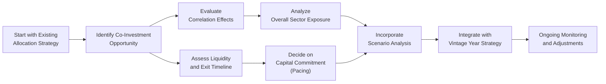

## Introduction

Co-investments are a fascinating way to build up your alternatives exposure—at least, that’s how I felt years ago when a colleague first introduced me to them. In a nutshell, a co-investment allows you, as a limited partner (LP) investor, to invest alongside a fund’s general partner (GP) in a specific deal, typically without paying the full freight of multiple layers of fees. It can be this awesome path to securing additional returns, broadening your exposure to sectors you believe in, and staying close to deals you find personally compelling. But let’s be honest: it also concentrates your risks. After all, you’re now more exposed to one deal’s success or failure rather than spreading that capital across many deals managed by a fund.

In this article, we’ll discuss the heart of portfolio construction with co-investments. Specifically, we’ll examine how, from a big-picture perspective, you should think about correlation effects, liquidity profiles, capital deployment timelines, and the all-important concept of pacing your investments over multiple years (vintages). We’ll also walk through scenario analyses—those “what-if” exercises that help you see how your portfolio might fare in an unexpected downturn. Ultimately, we’ll explore not only the core theory but also practical best practices and even a few real-world examples. And hopefully, you’ll come away feeling more confident about folding co-investments into your portfolio.

## Key Concepts in Co-Investments

Before diving into the mechanics of portfolio construction, let’s clarify a few key terms you’ll often see:

• Vintage Year  
  The year in which a private equity fund (or other private vehicle) starts investing. This concept is incredibly relevant for measuring performance and ensuring that you don’t get stuck with too many commitments all in the same “vintage,” which can lead to concentration risk in that time period’s market environment.

• Correlation Effects  
  A quantitative measure of how two or more investments move relative to each other. In simpler terms, you want to keep an eye on how your co-investment might move up or down with other holdings in your portfolio. If they all move together (positive correlation), you might be in for a roller coaster ride when market conditions shift.

• Pacing  
  The strategic allocation of investment capital over time, also known as “commitment pacing” in private markets. This helps you level out your exposure by vintage year, maintain diversification, and avoid liquidity bottlenecks.

• Cross-Holdings  
  Overlaps between deals or funds that hold interests in the same underlying asset. Sometimes, co-investments can inadvertently lead to double exposure to a particular company or sector if you’re not carefully tracking your portfolio’s overall composition.

• Scenario Analysis  
  A process by which you examine how your portfolio might respond under a variety of hypothetical market or economic conditions. For instance, consider a prolonged recession, a period of skyrocketing interest rates, or a sector-specific downturn.

• Sector Exposure  
  How your portfolio is distributed across different industries. An energy co-investment might do wonders if oil prices rise—but it could also weigh you down if energy goes through a slump while the rest of your portfolio is also tied to cyclical commodities.

• Over-Allocation Risk  
  The danger of putting too many of your eggs in one basket. Perhaps you’re heavy in technology because you made a big co-investment in a software startup right when your main fund also allocated 40% to the same sector.

• Maturity Structure  
  The timeline of expected cash flows from your portfolio. Having a balanced schedule (some deals that might exit within 3–5 years, some in 6–7 years, etc.) can help you manage ongoing liquidity needs—rather than ending up with 100% of your capital locked away in deals that won’t exit for a decade.

## Integrating Co-Investments into a Multi-Asset Portfolio

So how do co-investments fit into your broad portfolio strategy? You might be holding a “main” private equity or private credit fund, along with a standard mix of stocks, bonds, and other alternative assets such as real estate or hedge funds. Then a co-investment opportunity pops up: The GP (General Partner) says, “We’ve got a limited-time chance to invest in XYZ Co., and we think it’s going to be a game-changer in the biotech space.” You can invest directly alongside the fund, typically without the usual management fee and carried interest rates. Initially, it sounds great, right?

But let’s slow down. Adding that co-investment:

• Enhances Return Potential: You could earn a potentially higher gross return because the fees are either waived or lower.  
• Concentrates Risk: Now if biotech faces an industry-wide slump, your broader portfolio might take a hit from your main private equity allocations and this additional co-investment—so correlation matters.  
• Affects Liquidity and Cash Flows: Co-investments often have their own timeline for capital calls and exits. You need to get comfortable with those schedules before committing.  
• Requires Different Due Diligence: You’ll need more granular knowledge about the target company, financial structures, the GP’s track record in that specific sector, and so on.

Let me share a little anecdote. A friend of mine jumped at a co-investment in a new specialty retail chain. The co-investment was fairly large for her personal portfolio, but she was excited about the brand’s growth potential and the lower fee structure. A few years in, the location expansions slowed down, and the broader retail sector was hammered by e-commerce competition. She was basically locked into that single company risk. Luckily, it wasn’t a total disaster, but the outcome taught her the value of balanced pacing and scenario planning—something we’ll get to in more detail soon.

## Correlation Effects and Risk Management

When we talk about correlations in co-investment deals, it’s straightforward to define it mathematically. If you’ve got two assets, i and j:


\rho_{i,j} \;=\; \frac{\mathrm{Cov}(R_i, \, R_j)}{\sigma_i \,\sigma_j}


Where:
• Cov(Rᵢ, Rⱼ) is the covariance of the returns of assets i and j.  
• σᵢ and σⱼ are the respective standard deviations.  
• ρᵢⱼ is the correlation coefficient.

But real-world correlation is about more than just the numbers. Private assets often have limited disclosures and a host of other complexities that can muddy traditional correlation estimates. If the main private equity fund invests in high-growth early-stage tech, and your co-investment is in a single high-growth early-stage tech company, it’s safe to assume you’re placing a big bet on the same risk factor. This is not necessarily a bad thing—it can lead to outsized returns if the sector booms—but it’s something you need to incorporate into your overall portfolio’s risk profile.

### A Quick Look at a Hypothetical Correlation Matrix

Let’s say you track your existing portfolio exposures across four segments: global equities, private equity buyout fund, a real estate fund, and your new co-investment. You might see a matrix like:

|                      | Global Equities | PE Buyout Fund | Real Estate Fund | Co-Investment |
|----------------------|-----------------|----------------|------------------|---------------|
| Global Equities      | 1.0             | 0.6            | 0.2              | 0.7           |
| PE Buyout Fund       | 0.6             | 1.0            | 0.3              | 0.75          |
| Real Estate Fund     | 0.2             | 0.3            | 1.0              | 0.15          |
| Co-Investment        | 0.7             | 0.75           | 0.15             | 1.0           |

From this matrix, you’d see that your co-investment is correlated with both public equities and the PE fund fairly strongly. In times when the broader equity market is rallying, your portfolio might do great, but in downturns, it could face more significant declines.

## Pacing and Maturity Structures

Multi-year pacing is crucial for building a resilient portfolio, especially in private markets. Imagine you allocate a large chunk of capital to multiple co-investments all in the same year. Sure, if that year’s deals all turn out to be unbeatable winners, you’ll look like a genius. But if macro conditions take a nosedive specifically in that vintage year—like in the wake of a financial crisis—your entire set of co-investments may struggle to realize their potential.

Instead, consider spreading your co-investment capital across multiple years. This not only balances your underlying sector exposures over time but also stabilizes your capital calls and distributions. That distribution of investment reduces “vintage risk.”  

I’ve seen institutional investors specify that no more than 15–20% of their private equity portfolio commitments can be devoted to co-investments in any given vintage year. That’s because they want to keep consistent asset allocation targets, maintain liquidity, and avoid over-allocation risk.

## Scenario Analysis for Co-Investments

You can think of scenario analysis as your hypothetical test drive. Maybe you’ll run a few scenarios:

• Recession Scenario: GDP growth stagnates, interest rates rise, and valuations dip. Your co-invested biotech or retail chain might have trouble raising additional capital.  
• Sector Bubble Scenario: Suppose you’re leaning heavily into technology, but tech valuations get overheated and suddenly correct by 40%. Check how your combined portfolio might look—will you breach any risk tolerance thresholds?  
• Base-Case Scenario: Steady growth, stable inflation, no major asset bubble. In this environment, does your co-investment help you outperform or simply replicate exposures you already get from your main private equity fund?

Let’s do a hypothetical Python snippet for scenario analysis on a simplified portfolio of four holdings: your main fund, a broad equity index, a real estate fund, and your new co-investment.

```python
import numpy as np

# Format: [MainFund, EquityIndex, RealEstateFund, CoInvestment]
recession = np.array([-0.10, -0.15, -0.05, -0.20])
tech_bubble = np.array([-0.05, -0.25,  0.00, -0.30])
base_case = np.array([ 0.08,  0.07,  0.06,  0.10])

weights = np.array([0.25, 0.30, 0.25, 0.20])

def portfolio_return(scenario, weights):
    return np.sum(scenario * weights)

print("Recession Scenario:", portfolio_return(recession, weights))
print("Tech Bubble Scenario:", portfolio_return(tech_bubble, weights))
print("Base-Case Scenario:", portfolio_return(base_case, weights))
```

When you run this, you get a quick snapshot of what your portfolio returns might look like in each scenario. Of course, real scenario analysis can get far more involved with dynamic covariances, but this is the general idea.

## Transparency and Cross-Holdings

One main benefit of co-investing is that you often get extra transparency from the GP about the portfolio company—more than you would as a regular LP in a blind pool. But ironically, this can also mean discovering overlaps or cross-holdings whose risk might get overlooked in your official portfolio statements. You might own shares of the same operating company through multiple private equity funds and then add a direct co-investment to that same business.

Cross-holdings become especially tricky when it comes to governance or exit strategies. If you own a controlling stake in a company collectively with multiple co-investors, you may find that exit negotiations are complicated by differing timelines or strategies. Maybe you want out in 5 years, while another large co-investor aims for a 7-year hold. Keep a close eye on these dynamics so that you don’t run into a situation where your investment is effectively locked in because the group can’t reach consensus.

## Diagram: Portfolio Construction with Co-Investments

Below is a simple Mermaid flowchart that illustrates how co-investments fit into the broader decision-making process for portfolio construction. 



In this chart, you see you’re starting with your existing portfolio strategy—potentially with certain targets for sector exposure, yields, etc. You then identify and evaluate the co-investment, paying particular attention to correlation, liquidity, exit timeline, and your sector exposure. From there, you incorporate scenario analysis, finalize your pacing plan, and ultimately integrate the co-investment with your multi-year strategy. Finally, of course, everything requires ongoing monitoring.

## Practical Example: Sector-Specific Co-Investment

Let’s say your main private equity fund invests heavily in consumer tech and online retail. You spot a co-investment opportunity in a late-stage e-commerce startup focusing on eco-friendly apparel. The GP offers you a chance to commit $1 million, with no additional carried interest, because it’s a side-by-side deal with the existing fund.

• Step 1: Determine if your portfolio is already exposed to e-commerce or consumer tech. If you’re heavily concentrated there, this might push you beyond comfort.  
• Step 2: Pacing. If you’ve recently made two other direct deals in e-commerce, that million might tip you into a single-year, single-sector bet. Is the risk too high?  
• Step 3: Conduct scenario analysis: What if supply chain disruptions hamper this startup’s growth? Alternatively, what if e-commerce booms even further?  
• Step 4: Ensure the maturity timeline fits your personal or institutional liquidity needs. Maybe you’re expecting distributions in 3–5 years, but e-commerce deals can sometimes drag on if an IPO is postponed.  
• Step 5: Decide. If the risk/return profile still looks strong and correlations are manageable, you might proceed. If not, politely pass and wait for the next opportunity.

## Potential Pitfalls

Here are some common mistakes investors make with co-investments:

• Over-Allocation  
  There’s a real temptation to pile into every “hot” deal. Be sure you don’t exceed your targeted exposure in a single year or a single sector.

• Limited Diligence  
  Sometimes, the co-investment window is tight, and you have only a few weeks to decide. Rushing can mean missing red flags.

• Overlooking Fees and Costs  
  While co-investments often come with reduced fees, there may still be legal expenses, due diligence costs, or structuring fees that dilute your returns.

• Misplaced Reliance on GP  
  Yes, you’re investing alongside a GP that presumably knows the target deal well. But you’re also reliant on the GP to continue supporting that deal. If the GP’s strategy shifts, your co-investment may not receive the same level of attention.

• Lack of Liquidity Management  
  Co-investments typically have fewer liquidity options than publicly listed assets. Exiting early might be difficult—or require a discount on the secondary market.

## Best Practices for Building a Co-Investment Program

• Establish a Clear Allocation Policy  
  Decide what percentage of your portfolio can go into co-investments, ensuring you manage concentration risk.

• Develop Strong GP Relationships  
  Good co-investment deal flow usually comes from longstanding partnerships. GPs often offer co-investments first to their most trusted LPs.

• Maintain Thorough Documentation  
  Track each co-investment’s exposure, sector, risk factors, expected exit, and maturity. This helps you avoid cross-holdings that might slip under the radar.

• Run Multiple Scenario Analyses  
  Don’t rely on a single base-case scenario. Consider worst-case, best-case, and moderate outcomes.

• Monitor Vintage Overlaps  
  Keep an eye on vintage year distributions so that commitments remain phased over time. This will help you avoid sudden liquidity crunches or overly front-loading capital in one market cycle.

• Periodically Rebalance  
  If you find yourself overweight in one sector or vintage year, try to rebalance future commitments to bring your portfolio back in line with your investment targets.

## Conclusion and Exam Tips

Co-investments can supercharge your returns or weigh down your portfolio—honestly, it all depends on how well you integrate them into your overall plan. By thoroughly evaluating correlation effects, pacing your commitments over multiple vintage years, and doing scenario analyses that reflect real-world stress points, you set yourself up for a more resilient outcome.

For the CFA exam, expect questions that test your understanding of how co-investments fit within an overall asset allocation, how to adjust for correlation in private markets, how to apply scenario analysis, and how to address risk management in a multi-asset context. Remember to:

• Keep track of potential cross-holdings.  
• Understand the differences in liquidity profiles.  
• Examine correlation, especially in downturn scenarios.  
• Emphasize the importance of pacing and vintage years.  

In an exam context, you’ll likely see scenario-based questions that ask you to evaluate the pros and cons of co-investing in a specific deal, or you’ll need to recalculate a portfolio’s overall risk exposure once the co-investment is included. Use the frameworks discussed here—your knowledge of correlation, scenario analysis, and capital deployment timelines—to tackle those queries methodically.

## Test Your Knowledge: Portfolio Construction with Co-Investments Quiz



### Which of the following is a primary benefit of including co-investments in a broader private equity portfolio?

- [ ] Requires less sector-specific knowledge.  
- [x] Potentially lower fee structures compared with standalone fund commitments.  
- [ ] Reduces management complexity.  
- [ ] Eliminates over-allocation risk entirely.  

> **Explanation:** Co-investments often come with reduced (or waived) management fees and carried interest, making them a cost-effective way to gain additional exposure. However, they do not inherently reduce complexity or eliminate over-allocation risk.

### When evaluating the correlation effects of a potential co-investment, which factor is most important?

- [ ] Management team reputation within the GP.  
- [x] The degree to which the co-invested company’s returns move in tandem with the existing portfolio.  
- [ ] Whether the co-investment is in an emerging market.  
- [ ] The ratio of debt to equity in the co-investment vehicle.  

> **Explanation:** Correlation specifically measures how returns move together. Management expertise and debt structure do matter, but correlation analysis focuses on return movements relative to the existing portfolio.

### An investor wants to avoid allocating too much capital to co-investments in a single vintage year. This approach is known as:

- [x] Pacing.  
- [ ] Sector rotation.  
- [ ] Capital distribution.  
- [ ] Exit targeting.  

> **Explanation:** Pacing is the practice of spacing out commitments over multiple years to avoid concentration risk and liquidity crunches.

### Which of the following best describes the concept of cross-holdings?

- [ ] A GP’s practice of placing co-investments in multiple countries.  
- [x] Overlap where multiple investments share partial interests in the same underlying asset.  
- [ ] When an LP invests in multiple types of instruments within a single fund.  
- [ ] The process of hedging macro risks across different asset classes.  

> **Explanation:** Cross-holdings refer to owning an interest in the same company via multiple funds or co-investments, potentially increasing concentration risk.

### In scenario analysis, the “recession scenario” would most likely be used to evaluate:

- [x] The potential downside risks of a co-investment during an economic downturn.  
- [ ] Returns in a stable market environment.  
- [ ] How the co-investment would fare during a massive bull market.  
- [ ] Only real estate portfolio performance.  

> **Explanation:** A recession scenario is designed to test a portfolio’s resilience under deteriorating economic conditions.

### Scenario analysis is especially critical in co-investing because:

- [ ] Co-investments always have near-zero correlation with the overall portfolio.  
- [x] The targeted company might face different macro pressures compared to diversified fund investments.  
- [ ] GPs do not factor in macroeconomics.  
- [ ] It is mandated by all global regulators.  

> **Explanation:** Co-invested companies often have unique or concentrated sector exposures, making scenario testing crucial to understand how they might behave under various economic outcomes.

### A co-investment in a single biotech startup can be described as:

- [x] Potentially high return, but concentrated risk.  
- [ ] Guaranteed steady returns.  
- [x] Potentially aligned with fund returns if biotech is a major exposure.  
- [ ] Completely uncorrelated with existing biotech holdings.  

> **Explanation:** A single biotech co-investment has concentrated risk (and potentially high return). If you already have biotech through other funds, correlation can be elevated.

### Which best describes “maturity structure” in a private equity portfolio context?

- [ ] The phase where a portfolio moves from growth to value.  
- [x] The expected schedule of exits and cash flows over time.  
- [ ] How an investor’s personal life stage affects their investment strategy.  
- [ ] The age of each GP involved.  

> **Explanation:** Maturity structure refers to the timeline and schedule of cash flows—essential for planning liquidity and diversification across different exit horizons.

### How can an investor reduce the risk of over-exposure to a single sector when pursuing co-investments?

- [ ] Only co-invest in the largest deals.  
- [ ] Focus exclusively on distressed debt strategies.  
- [x] Diversify co-investments across different industries and vintage years.  
- [ ] Wait for the GP to mitigate all deal-specific risks.  

> **Explanation:** By consciously spreading co-investments across multiple sectors and vintage years, investors limit concentration risk.

### True or False: Reduced management fees in co-investments mean there is no risk of incurring additional expenses.

- [x] True  
- [ ] False  

> **Explanation:** While co-investments sometimes come at lower fees, investors can still face legal, due diligence, or structuring costs, which means additional expenses can accrue.



## References

• Lakhani, K., & Wolf, M. (2019). The Art of Portfolio Construction in Private Equity.  
• CFA Institute (2025 Level I Curriculum readings) on asset allocation and portfolio management.  
• CFA Institute Code of Ethics and Standards of Professional Conduct, relevant sections on diligence and independence in investment decision making.  

Remember, thoughtful portfolio construction with co-investments is all about balancing opportunity with caution. Spread out your bets, keep an eye on correlation, and test out a few worst-case scenarios before you commit—because even the brightest co-investment opportunity isn’t a sure thing. Good luck with your studies and happy co-investing!
