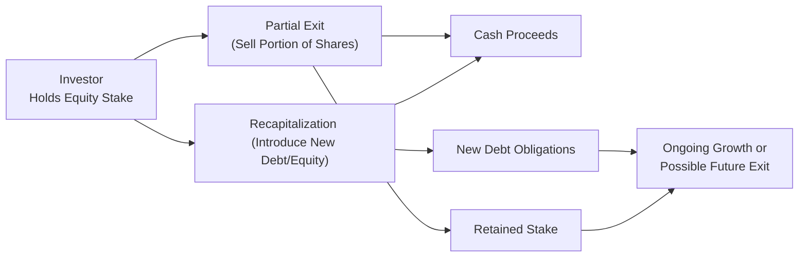

## Introduction and Overview

Let’s talk about something that comes up all the time in co-investments and direct deals: risk mitigation. If you’ve ever had to juggle both growth and safety, you know how stressful it can be deciding whether to exit an investment fully or hold on for (hopefully) more upside. Well, partial exits (also known as partial stake sales) and recapitalizations (recaps) can help strike that balance by securing some gains without completely losing future growth potential.

In simpler words, a partial exit can be like taking one foot off the pedal—you lock in some returns, reduce your stake, and free up some cash for other opportunities. Meanwhile, with a recapitalization, you might rearrange the debt and equity mix. That could involve taking on some extra leverage (which needs to be managed carefully) or raising new equity to return some capital to existing investors, while hopefully preserving the portfolio company’s ability to grow.

In this section, we’ll explore how partial exits and recaps can help co-investors manage risk while still keeping the door open for further gains. We’ll also walk through potential pitfalls—like introducing too much leverage or failing to align interests among all parties. We’ll wrap it up with some best practices, real-world examples, diagrams, and a few exam tips to keep you on your toes.

## Partial Exits: Locking in Gains While Retaining Upside

### Understanding the Basics

A partial exit is when an investor decides to sell just a portion of their stake in a portfolio company. You might do this because:

• You want to lock in some returns and reduce downside risk.  
• You’d like to rebalance your portfolio exposure (for instance, if one investment is taking up too large a slice of the pie).  
• You need liquidity for other investments or obligations (maybe you found a new and promising venture).  

When done thoughtfully, partial exits can mitigate concentration risk while leaving the opportunity for future growth on the table.

Imagine you invested early in a tech start-up that’s grown like crazy. You’re nervous about the lofty valuation, but you also don’t want to bail out entirely. You could sell, say, half your holdings to secure a tangible return—reducing your overall risk—while letting the rest ride. That’s a partial exit. Neat, right?

### Potential Benefits

• Liquidity: Gaining access to some cash lets you diversify or pursue new opportunities.  
• Downside Risk Management: You’ve already cashed in part of your stake, so a future negative shock won’t hit you as hard.  
• Retained Upside: If the company continues growing, the remaining stake still benefits.  

### Potential Drawbacks

• Opportunity Cost: If the company does spectacularly well, you might kick yourself for not holding the entire stake.  
• Impact on Influence: Selling part of your stake might reduce your voting power or board influence, particularly if you had a large block of shares.  
• Timing Risk: We all wish we had a crystal ball; partial exits can protect us somewhat but can still be tricky to time optimally.

### Example in Practice

Let’s say you invested USD 5 million in a private consumer-goods company. After three years, the company is thriving, and your stake is now valued at USD 15 million. You’re pretty happy, but you also think it’s fairly priced. You decide to sell half your stake (USD 7.5 million in equity) while retaining the other half. As a result, you lock in a 50% realized return on your initial investment (and effectively recoup all your principal). If the company’s valuation doubles again over the next few years, your existing stake further appreciates—but if things go south, at least you’ve pocketed some gains.

## Recapitalizations (Recaps): Adjusting the Capital Mix

### Recap Basics

Recapitalization, or “recap,” is when you change the capital structure of a company—usually by adding new debt or equity. Why do this? Often, it’s to optimize the debt-to-equity ratio, return capital to shareholders, or fund expansion. In private equity and co-investment scenarios, you frequently see recaps structured to achieve partial liquidity for existing investors while still leaving money in the company for growth.

Commonly, a recap might involve taking on additional leveraged loans or issuing new debt instruments. Some of that debt capital can be used to pay out a special dividend to shareholders (yes, that could be you) or buy back a portion of their equity. But it’s not all roses—too much leverage could hamper long-term growth or push a promising business into distress if market conditions worsen.

### Key Considerations for Co-Investors

• Is the new leverage level sustainable? Excessive leverage can quickly lead to liquidity issues, so you want to ensure the company’s cash flows support the new debt obligations.  
• Are recap terms fair? Ensure that new capital is introduced at an equitable valuation, and watch out for potential dilution or suboptimal pricing.  
• Downside protection features: Look for anti-dilution provisions, liquidation preferences, or other structures that safeguard your position if subsequent rounds of financing occur at lower valuations.  
• Alignment of interests: Confirm that the company’s management and major shareholders remain incentivized to grow the business sustainably.

### Example Recap Scenario

Suppose you’re a co-investor in a mid-sized manufacturing firm. The business decides to raise USD 50 million in new debt. Half of that is used to modernize equipment, while the other half is distributed as a special dividend to existing shareholders (including you). This distribution effectively gives you partial liquidity—some of your original investment is returned. However, the company is also now more leveraged. You must carefully assess whether the company’s cash flows can handle additional interest payments. If so, the recap might be a great way to realize returns earlier without fully exiting.

## Diagram: Partial Exit and Recap Flow

Below is a simplified Mermaid diagram showing how partial exits and recaps can interact:

## Balancing Risk and Return with Partial Exits and Recaps

### Liquidity vs. Growth

You know how sometimes you want your cake and eat it too? Partial exits and recaps can feel that way. They can provide liquidity now (like a partial cash-out) while continuing to ride potential future value creation. The trade-off is that every move you make—whether a partial exit or a recap—comes with its own set of risks.

This balancing act is why you’ll often see co-investors employing sophisticated scenario analyses to gauge various outcomes. If the portfolio company is expected to keep growing, a partial exit allows rebalancing but still offers a foothold in future gains. If the market or the economy is overheating, a recap might help you get some cash out ahead of a potential downturn.

### Impact on Company Operations and Growth

Recaps can be great for early liquidity, but they also mean increased debt. If the new debt is used productively (e.g., expansions or acquisitions), it might spark even greater profitability. Conversely, if that new debt just pays out a dividend without strengthening operations, the company could be left vulnerable. Similarly, a partial exit might reduce the capital the company has to play with if no new equity investors step in, which could affect growth.

## Detailed Scenario Analysis

### Stress Testing Future Valuation

One of the best ways to figure out the risk-return trade-off is to perform scenario analysis. This entails modeling how partial exits or recaps change your potential outcomes:

• **Base Case**: The company meets moderate growth expectations; you realize some liquidity either via partial exit or recap distribution.  
• **Upside Case**: The company’s valuation grows more than expected; your retained stake enters “bonus territory.”  
• **Downside Case**: The company underperforms or faces a major setback. In that scenario, a partial exit helped protect some returns, while a recap might amplify downside risk if leverage is too high.

You might employ discount models (e.g., DCF or the Weighted Average Cost of Capital approach) to see how changes in capital structure shift enterprise value. It can also be helpful to run Monte Carlo simulations or partial sensitivity analyses around the company’s EBITDA growth and interest-rate changes. In all these exercises, keep your eyes peeled for the effect of leverage on net free cash flow.

### Assessing Distribution Structures

In a partial exit, you actually sell shares. In a recap, you receive a distribution or special dividend. Either way, you want to confirm the liquidity event is fairly valued and that the distribution timeline aligns with your investment horizon. If you’re closer to the end of your fund’s life cycle, capturing some returns might be crucial to meet your limited partners’ expectations.

## Downside Protection and Anti-Dilution

Downside protection is a big deal in both partial exits and recaps. If you’re partially exiting in a simple way—selling some shares to a new investor or existing co-investors—there might not be elaborate legal structures attached. However, with recaps, especially those involving new equity capital, you need to look at:

• Liquidation Preferences: Who gets paid first if things go south?  
• Anti-Dilution: If the company raises more capital at a lower valuation later, will your existing shares get some form of price protection?  
• Restrictive Covenants: Can the company take on more debt or significantly alter its operations without your consent?

One investor I knew (a friend’s old boss, to be honest) was thrilled to get a dividend recap from a tech firm… until the next round of financing came at a much lower valuation, and the new investors had senior preferences. That partially offset the gains he’d realized from the recap. Bottom line: read the fine print.

## Common Pitfalls

• **Overleveraging**: Recaps can create immediate gains but leave the business strapped with a heavy interest burden.  
• **Misaligned Incentives**: If founding teams or major shareholders sell too much upfront, they might lose the incentive to keep hustling for growth.  
• **Poor Timing**: Partial exits made too early can mean missing out on significant upside, while waiting too long can expose you to downturns.  
• **Insufficient Due Diligence**: Skipping an in-depth look at company performance, growth prospects, and debt capacity can lead to ugly surprises down the line.

## Best Practices for Executing Partial Exits and Recaps

• **Valuation Transparency**: Conduct or commission a robust valuation to ensure any share sale or recapitalization is fair.  
• **Align with Growth Strategy**: Confirm that introducing new debt or equity won’t hamper the company’s future.  
• **Negotiate Protective Rights**: In case of recaps, secure downside protection or anti-dilution where feasible.  
• **Diversify**: If you realize proceeds from a partial exit, consider distributing them across other portfolio companies or asset classes.  
• **Ongoing Monitoring**: Continue to track the business fundamentals and maintain an active dialogue with management.  

## Case Study: Mid-Market Manufacturing Co.

### Background

• You invest USD 6 million in a mid-market manufacturing company that specializes in eco-friendly packaging.  
• Over four years, the company’s bottom line grows steadily, and your equity is now valued at USD 12 million.  

### Decision Point

• You’re approached by another private equity fund looking to buy part of your stake. They offer you USD 6 million for half your position, effectively letting you recover your entire initial investment.  
• Alternatively, the company’s board proposes a recapitalization: they want to raise USD 10 million in new debt, pay out USD 5 million as a special dividend to shareholders, and use the other USD 5 million to automate part of the production line.

### Analysis

• Partial Exit: If you sell half your stake now, you fully lock in your principal and keep half your stake for further growth. But if the new investor is working on an ambitious expansion, you might miss out on a bigger payoff by not staying fully invested.  
• Recap Option: You end up with USD 2.5 million from the recap dividend (your proportionate share). Meanwhile, your stake still remains (though the business is now more leveraged).

### Outcome

• You decide to accept the recap, because the company’s operational plan seems robust and the new debt is at a relatively low fixed interest rate, which management can handle. You pocket USD 2.5 million and still hold equity worth approximately USD 12 million (since the recap was structured at close to the market valuation).  
• Nine months later, that new production line outperforms expectations, boosting profitability. Further down the road, you might consider a second partial exit or maybe remain until a full buyout.  

## Regulatory and Ethical Dimensions

Even though partial exits and recaps often sit in a less regulated environment than public markets, there are still ethical considerations. For instance, disclosing the rationale and fair pricing behind a recap is essential to avoid misleading minority shareholders. Similarly, if you’re orchestrating a partial exit while having inside information about negative upcoming news, that’s a potential no-go from an ethics standpoint.

Refer back to Chapter 1 (Regulatory Considerations) for more context on how bodies like the Securities and Exchange Commission (SEC) in the U.S. or the Financial Conduct Authority (FCA) in the U.K. require transparent disclosures, especially in large recap deals or partial exits that might affect minority holders.

## Practical Exam Tips

• **Scenario Analysis**: Be ready to model partial exits and recaps under different growth assumptions; exam questions might show you multiple sets of potential outcomes.  
• **Downside Protection**: Familiarize yourself with typical protective clauses, such as anti-dilution rights, liquidation preferences, and covenants.  
• **Leverage Ratios**: Understand how to calculate and interpret common leverage ratios (e.g., Total Debt/EBITDA) in a recap context. You might need to assess the firm’s ability to service the new debt.  
• **Valuation Impact**: You could be asked how partial exits can affect post-money valuation or how a higher cost of capital from new debt weighs on the overall enterprise valuation.  
• **Manager/Investor Alignment**: CFA exams often test how manager incentives can shift when ownership structures change.

## References and Further Reading

• Rosenbaum, J., & Pearl, J. (2013). Investment Banking: Valuation, Leveraged Buyouts, and Mergers & Acquisitions. Wiley Finance.  
• The Private Equity Review – “Recapitalizations and Dividend Recaps” Section.  
• Chapter 3 of this volume on Private Equity Valuations and Chapter 11 on Co-Investments for additional color.  

---  

## Test Your Knowledge: Partial Exits and Recapitalizations



### When might an investor choose a partial exit?

- [x] To lock in some gains while still participating in future upside
- [ ] To completely cut ties with a failing venture
- [ ] To increase portfolio concentration
- [ ] To avoid any due diligence requirements

> **Explanation:** Partial exits are useful when the investor wants to de-risk or lock in profits but still benefit from continued growth.

### What is a key drawback of relying heavily on debt in a recapitalization?

- [ ] It increases voting rights for existing shareholders
- [ ] It generally lowers the Weighted Average Cost of Capital
- [x] It can raise the risk of financial distress due to higher interest obligations
- [ ] It makes the company more attractive to regulators

> **Explanation:** Recapitalizations involving significant debt might saddle the company with high interest payments, elevating overall financial risk.

### Which of the following is most relevant in providing downside protection during a recap?

- [x] Anti-dilution provisions
- [ ] A high post-transaction valuation
- [ ] Very short lock-up periods
- [ ] Favorable corporate tax rates

> **Explanation:** Anti-dilution provisions help protect existing shareholders if new shares are issued at a lower valuation in the future.

### In assessing a partial exit, which scenario analysis case focuses on the event that the company underperforms or faces a major setback?

- [x] Downside case
- [ ] Base case
- [ ] Upside case
- [ ] Sensitivity case

> **Explanation:** A downside case assumes worse-than-expected performance, highlighting how partial exits or recaps might mitigate risk under adverse conditions.

### Which of the following is an example of a distribution in recapitalization?

- [x] A special dividend paid out to existing shareholders
- [ ] Issuing new debt with no change in equity
- [x] A direct cash payout via share buyback
- [ ] A philanthropic donation to a nonprofit

> **Explanation:** Recaps often involve a distribution to current shareholders, such as a special dividend or a share buyback.

### How does a partial exit differ from a full exit?

- [x] The investor only sells a fraction of their equity holdings
- [ ] The investor defers the entire sale for a future date
- [ ] It’s always combined with a recapitalization
- [ ] There is no difference in risk profile or liquidity

> **Explanation:** In a partial exit, the investor retains some ownership while selling off part of their stake.

### Which factor is most associated with timing partial exits effectively?

- [x] Valuation momentum and future growth prospects
- [ ] Removing all downside protection structures
- [ ] Instant profitability from new debt
- [ ] Accelerated lock-up periods post-IPO

> **Explanation:** Partial exits often hinge on growth forecasts and valuations. Investors try to time their sales to optimize returns while managing risk.

### Why might an investor prefer a recapitalization with moderate leverage over a highly leveraged one?

- [x] To reduce the probability of financial distress
- [ ] To guarantee no equity dilution
- [ ] To lower the cost of equity indefinitely
- [ ] To attract more activist shareholders

> **Explanation:** Moderate leverage helps retain flexibility and lower financial risks compared to a heavily leveraged structure that can strain cash flows.

### In a scenario where a company undergoes a recap to pay a special dividend, which ratio is most pertinent to watch?

- [x] Total Debt/EBITDA
- [ ] Quick Ratio/EBIT
- [ ] Price-to-Earnings
- [ ] Dividend Yield for S&P 500

> **Explanation:** Total Debt/EBITDA is a common measure of leverage, indicating how much debt is placed on the company relative to its operating cash flow.

### True or False: A partial exit always eliminates the investor’s exposure to future downside risk.

- [ ] True
- [x] False

> **Explanation:** A partial exit only reduces the exposure proportionally; the investor still carries risk tied to the remaining stake in the company.


