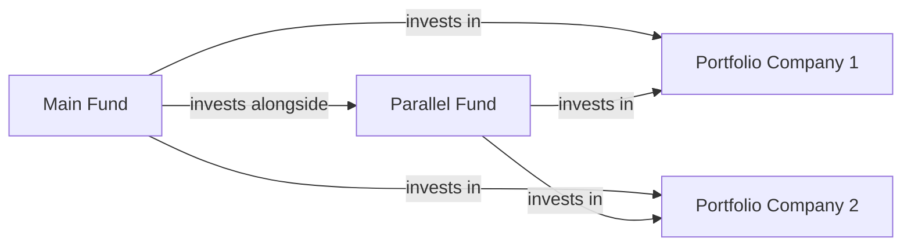
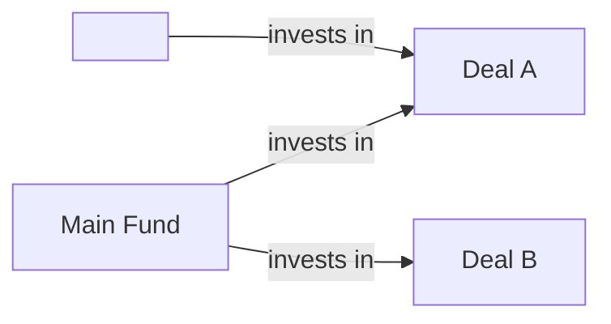

## Introduction and Context

Parallel funds and sidecar vehicles are niche structures within private market investing. From my perspective, they’re often the behind-the-scenes “supporting cast” to a main fund structure. You might have heard about them when an institutional investor wants a separate legal entity for a specific tax reason, or when a deal sponsor sets up smaller vehicles to handle special co-investment opportunities. These structures can appear a bit, well, daunting at first. But once you break them down, you’ll see they’re quite clever at handling the complexities of various investor needs.

This article focuses on parallel funds and sidecar vehicles—two structures that often roam in tandem with main private equity or investment funds. We’ll cover how they’re formed, why they exist, and how they affect fund governance, allocation policies, and investors. A good comparison is how a restaurant might have a main dining room for the general crowd and a private dining room (or two) for special reservations that require unique accommodations. In that sense, parallel funds and sidecars serve specialized needs while maintaining a cohesive overall strategy.

We’ll also study how regulatory constraints, such as ERISA for pension funds or specialized regimes for sovereign wealth funds (SWFs), affect the use of these structures—plus how organizations like the Institutional Limited Partners Association (ILPA) aim to ensure fair allocation. Along the way, we’ll touch on fees, pro-rata allocations, and the day-to-day considerations that both limited partners (LPs) and general partners (GPs) face when setting up or investing in these vehicles.

## Understanding Parallel Funds

Parallel funds are set up to invest side by side with a main fund. So yes, they are truly “parallel.” They have virtually the same investment strategy and typically participate in the same deals at the same time, though they might exist as distinct legal entities. Why bother? Well, different investors have different tax, legal, or regulatory requirements. Think of a large pension plan subject to ERISA or an SWF with cross-border restrictions. A parallel fund can be configured to meet those constraints while still participating in the same deals as the main fund.

### Rationale for Parallel Funds

• Regulatory Requirements: Some investors can only invest under certain legal frameworks or in certain jurisdictions. A parallel fund is a neat solution—create a structure that fits the investor’s constraints and run it alongside the main vehicle.  
• Tax Efficiency: Tax laws can be complicated, especially on a cross-border basis. By using parallel funds, GPs can keep different categories of investors separated into distinct entities, potentially optimizing tax outcomes for each group.  
• Governance Preferences: Some large institutions might demand a unique governance process or reporting requirements. A parallel fund can provide that, ensuring each investor’s needs are respected without major disruptions to the main fund operations.  

### How Parallel Funds Operate

Parallel funds co-invest in every deal that the main fund engages in, typically following the same style, the same strategies, and the same pace. However, each parallel fund can have its own capital call procedures, distribution rules, or fee structures—though these are usually aligned to ensure fairness. For instance, ILPA guidelines recommend that these deals be allocated on a pro-rata basis (proportional to each entity’s capital commitments) unless otherwise disclosed.

Diagrammatically, consider the following structure:

This simple depiction shows a main fund (A) and its parallel fund (B) both investing side by side in portfolio companies (C, D). Each circle in the diagram represents a potential investment into a portfolio company. The parallel fund is structured as a separate legal entity yet operates in lockstep with the main fund.

### Fairness in Deal Allocation

One of the biggest concerns for LPs in parallel structures is whether the deals are allocated fairly among the vehicles. Imagine you’re an LP that invests in the parallel fund because of your special constraints—you want to ensure you’re not missing out on prime deals that the main fund gets first pick on. ILPA suggests a pro-rata policy to preserve fairness. This means that if the main fund invests 60% of the total capital in a venture, the parallel fund invests 40%—matching their relative capital commitments.

### Fee Structures and Transparency

Now, about fees: parallel funds often charge management and performance fees in line with the main fund, but they might have additional administrative charges if they require extra structuring services. In my own practice, I’ve sometimes seen large institutional investors push hard for lower fees in a parallel vehicle, especially if that structure primarily benefits the manager who’s trying to attract their capital. It’s important that any incremental fees are well-justified (e.g., a separate administrator for cross-border filings) and adequately disclosed to all parties. Good governance demands that GPs explain clearly why these additional charges exist and how they’re calculated.

### Cross-References in This Book

• Chapter 3 on due diligence addresses deeper aspects of selecting the right manager and evaluating the fund structure.  
• Chapter 12 covers how fundraising cycles and capital flows work, shedding light on how GPs design these parallel structures to secure large institutional commitments.  

## Understanding Sidecar Vehicles

Sidecar vehicles—affectionately called “sidecars”—are often single-deal or limited-purpose funds that sit alongside a main fund. They allow existing (or new) investors an opportunity to deploy more capital into a specific deal or a narrower strategy that the main fund might not fully pursue on its own. Sidecars can be used for co-investment, where certain LPs are invited to put in extra capital beyond what is drawn from the main fund’s commingled pot.

### Rationale for Sidecar Vehicles

• Single Purpose Mandates: Suppose a big investor spots a unique opportunity or wants to double down on a certain sector. A sidecar can be launched to pool additional capital for that single investment, still under the manager’s umbrella.  
• Co-Investment: Co-investment allocations often go through sidecars so direct co-investors can bypass the standard management fee and carried interest structure of the main fund. Sidecars facilitate these arrangements neatly.  
• Strategic Partnerships: Some GPs form a sidecar with strategic partners—such as a corporate investor or a family office—that wants exposure to a specialty project.  

In day-to-day reality, sidecar vehicles can be quite small or as large as the main fund, depending on how big that particular deal is. If you’ve ever been in a situation where you’re offered the chance to put additional capital to work in a “hot” deal, that’s exactly sidecar territory.

### Operational Mechanics of Sidecars

Compared to parallel funds, sidecars may have:

• Different or no Management Fees: Some sidecars have zero management fees because they represent co-investment deals.  
• Unique Governance: Since they’re often single-purpose, the corporate documents might revolve around that deal’s life cycle.  
• Limited LP Base: The participants can be a handful of existing LPs that want extra exposure.  

A possible structure might look like this:

Notice that the sidecar (B) invests only in Deal A for instance. (We’ve intentionally left “Deal B” unsubscribed by the sidecar—just to illustrate that sidecars can be quite targeted.)

### Aligning Interests

If sidecars are established, GPs need to ensure that the investors in the main fund who don’t participate in the sidecar aren’t harmed by any perceived conflict of interest or cherry-picking of deals. Many limited partnership agreements detail how co-investment opportunities are shared. A fair, transparent approach fosters trust. Some GPs follow a “pro-rata first refusal” approach, giving main fund LPs the option to join the sidecar up to their relative ownership stake.

## Regulatory and Tax Considerations

A critical driving force behind these structures is regulation. For instance, under ERISA, pension funds face unique compliance obligations about how their capital is managed and the level of control they can have in a private equity fund. By carving out a parallel or sidecar vehicle, the GP can structure governance and operational rules that keep the investment’s status as a “plan asset” or avoid triggering certain regulatory thresholds.

Sovereign wealth funds (SWFs) might also prefer a parallel fund approach for tax reasons or confidentiality concerns. And, in some jurisdictions, the presence of certain SWFs in a main fund can require complex disclosures or tax treatments that might not apply if the SWF invests through a different legal structure.

## Cost and Fee Implications

In real-life fund documentation, the cost structure is an area that can create tension between GPs and LPs. Additional legal, administrative, and compliance tasks can add cost. For example, if a parallel fund needs a distinct set of financial statements or separate auditors, that can drive up overhead. GPs must be transparent with these incremental charges, and LPs need to evaluate whether the incremental benefits outweigh the costs. As covered in Chapter 2 (Alternative Investment Performance and Returns), the net-of-fee returns matter most for investors, so vigilance in fee negotiations is crucial.

## Fairness and ILPA Guidelines

We keep returning to fairness because it’s so darn important in private markets. ILPA’s best practices stress that any parallel or sidecar arrangement should:

• Allocate deals on a consistent, pro-rata basis.  
• Disclose any side arrangements or preferential terms.  
• Avoid layering additional fees unless they’re for legitimate incremental services.  
• Maintain consistent governance oversight, so side funds or parallel funds don’t become a “shadow” structure with unmonitored risk.  

Following these guidelines can help GPs maintain strong relationships with their LPs and reduce potential conflicts or accusations of favoritism.

## Practical Example

Let’s consider an example to make this even clearer. Suppose the main fund, “Global Growth Fund I,” has USD 1 billion in committed capital. A large European institutional investor invests USD 200 million in a parallel fund that shares the same strategy but is set up as a Luxembourg-based vehicle for tax and regulatory reasons. Meanwhile, the rest of the capital is in a Cayman Islands structure. Both vehicles invest in the same deals, proportionally to their commitments: 80% from the main fund, 20% from the parallel.

Separately, a sidecar could be created for a single co-investment in a tech start-up. The GP identifies a USD 100 million opportunity. The main fund invests USD 50 million, but a few LPs want an additional USD 30 million of exposure (beyond what the fund can accommodate). So, the GP launches “Sidecar Tech Co-Invest SPV,” which invests that USD 30 million alongside the main fund. Another USD 20 million might come from the parallel fund if that investor also wants extra exposure. Everyone invests at the same valuation and terms, ensuring fairness. 

## Operational Challenges

Although parallel funds and sidecars can be powerful solutions, they complicate the back-office side of fund management. Fund accountants, administrators, and compliance teams typically handle multiple sets of capital calls, distribution notices, and investor communications. The GP might need dedicated staff to track and reconcile each vehicle’s share of portfolio companies.

Moreover, from a risk management angle (see Chapter 2 on measuring risk), the GP must ensure it aggregates and monitors exposures across all vehicles. A parallel fund might have the same strategy, but from a front office perspective, the GP must confirm that compliance checks aren’t being inadvertently circumvented by investing in multiple vehicles.

## Best Practices

• Transparency: Provide all investors a clear breakdown of how deals and fees are allocated.  
• Consistency: Abide by consistent pro-rata allocations, or fully disclose any departures.  
• Governance: Ensure parallel or sidecar vehicles adhere to the same or comparable governance frameworks.  
• Tracking and Reporting: Keep robust systems to track each vehicle’s performance and promptly distribute financials.  
• Alignment of Interests: If sidecars are used for co-investments, clarify the terms so that the main fund’s LPs do not feel at a disadvantage.  

## Exam Tips and Takeaways

If you’re facing CFA® exam questions on parallel funds and sidecars, be ready to:

• Discuss how these structures address different regulatory or investor needs.  
• Evaluate fairness in deal allocation—particularly focusing on ILPA’s pro-rata guidelines.  
• Calculate net returns after fees, factoring in incremental charges that might arise from additional structures.  
• Identify possible conflicts of interest between main fund and sidecar investors, and propose ways to mitigate them.  
• Illustrate how tax or ERISA considerations might drive the creation of parallel funds.  

From an exam perspective, a typical constructed response question might present a scenario with multiple investor types—some subject to U.S. pension regulations, others to foreign tax constraints—and ask you to suggest a suitable fund structure. Or, you might see an item set about a GP wanting to set up a co-investment vehicle with a sidecar for a specific transaction. In each instance, you’d show that you understand how parallel funds and sidecars are set up to solve real investor challenges, but also how you’d manage the potential conflicts.

## References for Further Study

• Institutional Limited Partners Association (ILPA). “ILPA Principles.” (Extensive guidelines on alignment of interests and fund governance.)  
• Private Equity International (PEI). Articles on multi-vehicle fund structures and best practices.  
• CFA Institute (2025). CFA Program Curriculum, especially Volume 8: Alternative Investments.  

Remember, parallel structures and sidecars are not just exotic legal tools—they’re practical solutions that let managers tailor the same strategy to diverse investors. Once you grasp the whys and hows, you’ll be better equipped to handle all the complexities that come with alternative investing in a global environment.

---

## Parallel Funds and Sidecar Vehicles - Practice Questions



### Which of the following best describes a parallel fund?

- [x] An investment vehicle that runs alongside the main fund, investing in the same deals under substantially similar terms.
- [ ] A separate fund that invests only in follow-on rounds of existing portfolio companies.
- [ ] An emergency fund used by the GP when the main fund is fully deployed.
- [ ] A public vehicle created for retail investors with minimal constraints.

> **Explanation:** A parallel fund mirrors the main fund’s strategy and invests in the same deals, typically set up for investors with special regulatory or tax requirements.

---

### What is a primary reason to form a parallel fund for a sovereign wealth fund investor?

- [ ] To gain access to small-cap public equities.
- [x] To address cross-border tax or regulatory complexities unique to the sovereign wealth fund.
- [ ] To avoid paying management fees or carried interest.
- [ ] To eliminate the need for due diligence on portfolio companies.

> **Explanation:** Sovereign wealth funds often face unique legal and tax issues. A parallel fund can be structured to address those cross-border complexities while still investing alongside the main fund.

---

### In sidecar vehicles, which of the following is typically true regarding fees?

- [ ] Sidecars always carry higher management fees than the main fund to cover incremental costs.
- [ ] Sidecars never charge performance fees, only fixed fees.
- [x] Sidecars may have reduced or zero management fees, especially in co-investment arrangements.
- [ ] Sidecar vehicles must charge a flat 2% management fee by regulation.

> **Explanation:** Sidecar vehicles, particularly co-investment sidecars, often carry significantly lower or no management fees, reflecting the narrower purpose and reduced overhead.

---

### An investor is concerned about fair deal allocation between the main fund and a parallel fund. What best practice often addresses this concern?

- [ ] Granting the main fund first refusal on all deals.
- [x] Implementing a pro-rata allocation methodology aligned with each vehicle’s capital commitments.
- [ ] Allocating only smaller deals to the parallel fund.
- [ ] Keeping both vehicles in the same legal entity to avoid duplication.

> **Explanation:** ILPA guidelines and market best practices often emphasize pro-rata deal allocation to preserve fairness among different fund vehicles.

---

### Which of the following statements about sidecar vehicles is correct?

- [ ] They primarily invest in secondary market trades.
- [ ] They cannot co-invest with the main fund if the main fund is regulated.
- [ ] They must have exactly the same investors as the main fund.
- [x] They can be established to pursue a specialized mandate or single-deal opportunity.

> **Explanation:** Sidecars are typically single-purpose or specialized vehicles designed to provide targeted exposure to specific deals or strategies, often complementing the main fund’s broader approach.

---

### Why might an LP choose not to participate in a sidecar opportunity?

- [ ] They are legally prohibited from all private market investments.
- [x] They prefer not to raise their exposure to a single investment or sector.
- [ ] Sidecars always have a completely different general partner.
- [ ] Sidecars are unregulated and too risky for all institutions.

> **Explanation:** Some LPs may prefer diversification and therefore might opt out of concentrating additional capital into a single deal or industry theme that a sidecar focuses on.

---

### A sponsor forms a parallel fund specifically for ERISA-bound investors. What could be a key benefit of this structure?

- [x] It allows for separate compliance with strict ERISA rules without constraining the broader main fund.
- [ ] It ensures the main fund can invest in a higher percentage of riskier assets.
- [ ] It eliminates the need for annual financial statements.
- [ ] It guarantees ERISA investors a seat on every portfolio company’s board.

> **Explanation:** Creating a parallel fund for ERISA investors is a common strategy to comply with the unique regulatory environment of pension plans, segregating them from the main fund’s governance if needed.

---

### Which of the following guides is most often referenced by investors regarding fair allocation and governance of parallel funds?

- [ ] Financial Accounting Standards Board (FASB) guidelines.
- [x] Institutional Limited Partners Association (ILPA) best practices.
- [ ] The Sarbanes-Oxley Act.
- [ ] Basel III Accords.

> **Explanation:** ILPA has established recognized principles and best practices to ensure fairness, alignment of interests, and transparency in private equity fund structures, including parallel and sidecar vehicles.

---

### Suppose a GP charges an additional “administrative fee” specifically for handling separate audits for its parallel fund. Under best practices, what should the GP do?

- [x] Fully disclose and justify the incremental administrative fee to investors.
- [ ] Hide the fee in the consolidated financial statements to avoid confusion.
- [ ] Charge the fee to the main fund only.
- [ ] Allocate the administrative fee equally among the main fund and parallel fund.

> **Explanation:** Transparency is paramount. Any incremental fees for services in the parallel fund must be fully disclosed and justified to investors, in line with ILPA guidelines and best practices.

---

### True or False: Sidecar vehicles always invest on the same terms and in the same deals as the main fund.

- [x] True
- [ ] False

> **Explanation:** While sidecars typically follow the same deal terms (price, valuation conditions) when co-investing alongside the main fund, they can have different or no ongoing management fees, and may be narrower in scope. However, the investment terms for each transaction are commonly consistent with the main fund for fairness reasons.


