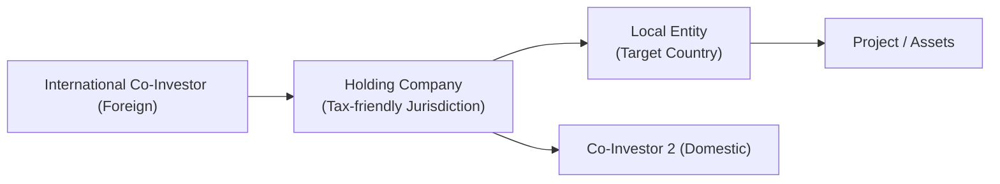

## Introduction
Cross-border co-investments and direct deals can feel like venturing into unfamiliar territory—literally and figuratively. I remember once chatting with a colleague who was finalizing an investment in a fast-growing tech company overseas. At first, everything looked so exciting: new market, big growth potential, strong local partner. But eventually, the labyrinth of foreign ownership laws, tax exposures, and repatriation constraints made the entire project pretty nerve-wracking. You know, those moments where you go, “Wait, can we even bring our profits home without losing half to taxes?” That’s exactly what we’ll explore here.

This section covers the essential regulatory and tax considerations you’ll encounter when investing across borders. We’ll look at foreign ownership restrictions, holding-company structures, and the complexities of double-taxation treaties. We’ll also chat about repatriation of profits, anti-money-laundering requirements, and local compliance requirements you absolutely can’t ignore. And, of course, we’ll talk about political risk and how a sudden policy shift can derail even the best-laid plans.

## Beyond the Basics of Co-Investments
In Chapter 11, we’ve already talked a bit about co-investments and direct deals in a domestic context. Once you throw in international considerations, the puzzle gains extra pieces:

• Regulatory constraints around what sectors foreigners can invest in.  
• Currency volatility that can wipe out your returns if you’re not careful.  
• Varied tax treaties (or sometimes the lack thereof).  
• Different cultural, legal, and political frameworks that shape deal execution.

Cross-border co-investments often revolve around pooled structures—like private equity funds or “club deals”—where the lead investor (general partner, or GP) might be domestic, and co-investors (limited partners, or LPs) might span multiple jurisdictions. These LPs need consistent frameworks for how they enter, exit, and realize returns. The complexities can be manageable if you plan well. But get caught by surprise, and it can be an expensive lesson.

## Foreign Ownership Laws and Sector Restrictions
So, foreign ownership laws are basically local regulations that protect certain industries from foreign control. Imagine you want to invest in a strategic sector—like telecommunications or energy—in Country X. Often, local laws cap the percentage of foreign ownership. These regulations vary wildly from one country to another, and they’re not always crystal clear.

• For instance, some countries require that overseas investors not exceed 49% ownership in certain “critical” sectors.  
• Others permit 100% ownership, but with fine print requiring local representation on the board or mandatory technology transfer agreements.  
• And in some extreme cases, the government might block a foreign takeover entirely, citing national security.

Even if your co-investment is in a “neutral” sector like a software startup, you might still see “downstream” regulations. For example, the local government might say, “Sure, invest away,” but if that same startup tries to pivot into a sector with restrictions, suddenly that changes the story. It’s essential to clarify these boundaries fast to avoid entanglements later.

### Checking Regulatory Overlays
When analyzing foreign ownership constraints, keep these in mind:
• Look out for “negative lists” that spell out restricted or prohibited sectors.  
• Understand any licensing regimes. Perhaps you can own the majority stake but need a license from a local ministry.  
• Some governments impose mandatory joint ventures with local entities. Know in advance who your local partners might be and the power balance within that relationship.

## Anti-Money-Laundering (AML) Requirements
No less important, local AML laws can be quite strict—and so can global standards you need to abide by. If your cross-border co-investment is perceived to be a channel for questionable funds, local regulators (and your own domestic authorities) may freeze assets, impose fines, or worse.

### Key AML Considerations
• Know Your Customer (KYC): GPs and LPs must thoroughly verify each other’s identities and the origin of the funds.  
• Source of Wealth: If you’re co-investing alongside another big investor, be certain they’re not using illicit money.  
• Ongoing Monitoring: Even after the deal closes, you remain responsible for detecting suspicious activity in your target portfolio company.  

From a practical standpoint, banks and legal advisors in many jurisdictions won’t even facilitate the transaction if your AML or KYC documentation is incomplete. So it’s not just best practice—it could literally derail the deal if not done properly.

## Repatriation of Profits
Let’s say your cross-border investment makes a handsome profit. Great news, right? Well, there’s a twist: you have to repatriate those gains to your home country (or to your fund structure’s domicile). Repatriation of profits is the process of converting foreign earnings into your home currency and transferring them back. This sounds so straightforward, but local regulations can complicate it. Sometimes you face withdrawal limits or capital controls that restrict the timing and amount you can move across borders.

### Strategies for Smooth Repatriation
• Use a tax-friendly holding jurisdiction: You might structure your investment via a holding company in a country with flexible capital flow rules.  
• Hedge currency exposure: In many emerging markets, currency volatility can erode returns—so consider hedging strategies or ensuring you can hold proceeds in a stable currency.  
• Understand local timelines: Some jurisdictions make you wait for official approvals or impose quotas on outgoing currency each year.

Sure, it can be frustrating. But if your business plan calls for distributing free cash flow to investors on a certain schedule, you need to understand whether local rules even allow that—and at what cost in taxes or fees.

## Cross-Border Tax Treaties
Cross-border tax treaties are basically handshake agreements between two (or more) countries to prevent double taxation and encourage capital flows. These treaties typically cover issues like:
• Withholding taxes on dividends, interest, and royalties.  
• Corporate tax rates and permanent establishment rules.  
• Mechanisms for dispute resolution if double-taxation conflicts arise.

If your target market has a robust tax treaty with your home country, you can often reduce withholding tax on investment returns. For instance, if the normal withholding rate is 30% but the tax treaty says it’s only 10%, that can significantly boost your net yield.

### Example of Treaty Benefits
Imagine you invest in a renewable energy project in Country A. Dividends from that project are subject to a 25% withholding tax. But thanks to a tax treaty with your home jurisdiction, you only pay 10%. If you’re distributing, say, $1 million in dividends, you’d save $150,000 in taxes just from that favorable withholding rate—quite a meaningful difference.

## Holding Companies and SPVs
Let’s talk structures. I know we touched on this a bit earlier, but let’s dive deeper. Establishing a holding company—often in a neutral or tax-friendly jurisdiction—helps navigate cross-border constraints. This holding company could own the shares of the target business, funnel funds in and out, and eventually facilitate smoother exits.

### Common Reasons to Use a Holding Structure
• Maximizing treaty benefits: The holding company might be domiciled in a country that has a robust network of tax treaties.  
• Limiting liabilities: If the investment faces lawsuits or other liabilities, the holding structure can ring-fence that risk.  
• Streamlining compliance: You may centralize certain processes, like accounting or reporting, especially if the holding company is in a well-regulated financial hub.

Anyway, we sometimes call these “Special Purpose Vehicles” (SPVs). They’re typically limited liability companies that exist purely to hold the investment and facilitate the transaction. Of course, the trick is to ensure these aren’t used for tax evasion or to mask beneficial ownership. So you might see regulators requiring a “substance test,” meaning the SPV must have real operations or staff in that jurisdiction, not just a mailbox.

## Political Risk and Economic Stability
In cross-border deals, you have to weigh not just the target’s fundamentals, but also the country’s political and economic climate. Are elections coming up? Is there civil unrest? Could the government unexpectedly impose new regulations? Perhaps a major shift in monetary policy could hamper currency exchanges, or a new capital control could freeze your ability to move money across borders.

### Evaluating Political Risk
• Check “country risk” ratings by agencies or reports by the World Bank and IMF.  
• See if there’s a history of expropriation—where the government takes over private assets.  
• Assess the legal environment: Will local courts enforce your contracts fairly?

Currency volatility is another hidden killer. Even if your target venture thrives, a sudden currency depreciation might slash returns when converted back to your home currency. So you might want to hedge by using currency forwards, options, or other derivative instruments—though those come at a cost and can be complicated.

## Engaging Qualified Local Counsel and Accountants
I used to think I could figure out local law by reading some official guidelines online. Um, big mistake. In cross-border deals, it’s worth the time and money to hire local expertise. They know the real, on-the-ground rules—like how to handle import licenses, capital flow limitations, or the nuances of local labor laws. They’ll also help you ensure your SPV is set up in a tax-efficient way without breaching any anti-avoidance regulations.

• Local counsel can handle the licensing, help interpret foreign ownership laws, and represent your interest in negotiations.  
• Accounting firms can clarify how your local entity should book revenues, pay taxes, and handle intragroup transfers—a crucial detail if you’re funneling profits back to a parent company.  
• Specialized advisors can keep an eye on ongoing regulatory changes—sometimes these changes happen quickly, especially in unstable jurisdictions.

## Common Pitfalls
1. Overlooking Capital Controls: Don’t discover after the deal closes that you can’t easily transfer your capital out.  
2. Underestimating Local Regulations: Some jurisdictions have contradictory or evolving laws that could disrupt your business model.  
3. Failure to Hedge Currency Exposure: Even stable currencies can have major swings.  
4. Not Conducting Thorough AML Checks: If your co-investment partner is shady, you’re on the hook for regulatory issues as well.  
5. Inadequate Insurance: Political risk insurance programs exist (offered by agencies like MIGA, part of the World Bank), but some investors omit it due to cost—only to regret it later.  
6. Reinvestment vs. Repatriation: Some investors prefer to reinvest local profits to avoid repatriation taxes, but that can lead to complications if local expansion strategies fail.

## Visualizing a Sample Co-Investment Structure

Below is a simplified Mermaid diagram illustrating how an international co-investment might be set up with a holding company:

In this structure:  
• The foreign co-investor (A) establishes or invests via a holding company in a jurisdiction with strong tax treaties (B).  
• The holding company then invests in the local entity (C), which owns the actual project or assets (D).  
• A domestic co-investor (E) may also come into the holding company or directly into the operating company, depending on local rules.

This approach often streamlines profit repatriation, harnesses beneficial tax treaties, and can ring-fence liabilities.

## Practical Financial Example
Imagine you have €10 million to invest in an infrastructure project in Country Y. Without a favorable tax treaty, you might face these taxes:  
• 25% withholding tax on dividends.  
• 2% local “transaction tax” on cross-border business.  
• High capital gains taxes if you exit your stake.

With a holding SPV in Country Z, which has a treaty with Country Y:  
• Withholding tax drops to 10%.  
• Transaction tax might be zero under certain investment structures.  
• Capital gains might be exempt if the holding meets substance requirements.

So, if your project yields €2 million in dividends per year, the difference in withholding tax alone can be an extra €300,000 in your pocket. Over several years, that can turn a decent IRR into a solid one.

## Best Practices and Strategies
• Perform Thorough Due Diligence: Check local corporate governance norms, the target’s legal compliance, and any existing tax disputes.  
• Explore Political Risk Insurance: In higher-risk jurisdictions, it may be worth the premium.  
• Map Out Exits Early: Structure your deal so you can exit cleanly. If you need government approvals, plan that timeline in advance.  
• Stay Updated on AML Rules: Make sure your target invests in ongoing compliance training and transaction monitoring. Regulators love to see that.  
• Use Local Advisors: Don’t cut corners on local counsel or accountants.

## Encouraging Continuous Learning
Cross-border deals require knowledge of evolving regulations, treaties, and political climates. Even in so-called stable jurisdictions, laws can shift—especially in areas like digital taxes, foreign currency control, or environmental regulations. So keep your curiosity alive: read up on local newspapers, talk to local experts, and follow economic indicators. This approach not only minimizes surprises but also uncovers fresh opportunities.

## Conclusion
Cross-border regulatory and tax constraints can feel like an endless game of whack-a-mole. Every time you figure out one puzzle, a new one might pop up. But with proper structuring, local counsel, and an eye for political and economic shifts, you can structure profitable deals across borders and bring those returns home safely. Just be sure to factor in the possibility of unexpected changes. Keep your risk measures robust, and you’ll find that diversifying internationally can deliver both growth and resilience to your overall portfolio.

## Glossary
• Foreign Ownership Laws: Regulations determining how much equity non-domestic investors can hold in certain industries or assets.  
• Repatriation of Profits: The process of converting foreign earnings into the investor’s home currency and transferring them back to the investor’s domicile.  
• Cross-Border Tax Treaties: Bilateral or multilateral agreements to prevent double taxation and encourage international investment.  
• Holding Company: A corporation created to hold shares in other companies, often used for tax or regulatory efficiency.  
• Currency Volatility: Fluctuations in exchange rates that can significantly impact investment returns.  
• Anti-Money-Laundering (AML) Requirements: Laws and regulations aimed at preventing illegal funds from entering financial systems.  
• Withholding Tax: A portion of income withheld by the payer in a foreign jurisdiction and remitted to the tax authorities.  
• Political Risk: The risk of losses resulting from political instability, policy changes, or government interference.

## References
• OECD Model Tax Convention on Income and on Capital:  
  https://www.oecd.org/tax/treaties/  
• International Monetary Fund (IMF) and World Bank Publications on Cross-Border Investment Regulations:  
  https://www.imf.org  
  https://www.worldbank.org  

• CFA Institute Code of Ethics and Standards of Professional Conduct for guidance on ethical considerations in cross-border transactions.

## Test Your Knowledge: Cross-Border Co-Investments and Tax Constraints



### Which of the following is the most direct advantage of using a holding company for a cross-border investment?

- [ ] Reducing operational inefficiency
- [x] Leveraging tax treaties to minimize withholding taxes
- [ ] Creating multiple layers of management oversight
- [ ] Eliminating all local compliance requirements

> **Explanation:** Holding companies often help investors access favorable tax treaties and streamline profit repatriation.

### When a country restricts foreign ownership to 49% of a domestic enterprise, this is typically intended to:

- [ ] Increase foreign direct investment
- [x] Protect strategically important or sensitive sectors
- [ ] Encourage unlimited consolidation
- [ ] Reduce local capital formation

> **Explanation:** Many governments impose ownership caps in sectors they consider vital, such as defense or telecommunications, to protect national security and strategic interests.

### A cross-border co-investor faces 25% withholding tax on dividends. However, under a bilateral treaty, the withholding tax can be reduced to 10%. Which of the following statements is true?

- [ ] The investor must first pay the 25% and then apply for a tax credit in their home country.
- [x] The investor can remit dividends at 10% withholding if the holding entity is domiciled in a treaty-favorable jurisdiction and meets the treaty’s requirements.
- [ ] The investor does not have to pay any withholding tax in any scenario if a treaty exists.
- [ ] The investor only receives the benefit if the local government is fully subsidizing the dividend.

> **Explanation:** Tax treaties often provide reduced withholding rates, but the investor usually must comply with specific documentation and residency requirements to benefit.

### Which is a key AML concern in cross-border co-investment structures?

- [ ] Inability to verify the project’s future returns
- [x] Potential for funds from illicit sources to enter the financial system
- [ ] High volatility in exchange rates
- [ ] Lack of hedging strategies

> **Explanation:** Anti-money-laundering measures are designed to ensure that no illicit funds are entering or leaving the financial system. Proper KYC and transparency practices are crucial.

### Which tactic might an investor use to reduce the risk of currency depreciation in cross-border transactions?

- [x] Hedging through forwards or options
- [ ] Avoiding foreign markets entirely
- [x] Holding funds in a stable reserve currency until deployment
- [ ] Investing primarily in illiquid assets

> **Explanation:** Currency forwards or options can help protect against adverse exchange rate movements, and temporarily parking funds in stable currencies can mitigate day-to-day volatility.

### Political risk can manifest in:

- [x] Expropriation of assets
- [ ] Minor fluctuations in commodity prices only
- [ ] Guaranteed capital gains
- [ ] Increases in global credit ratings

> **Explanation:** Expropriation, sudden regulatory shifts, or changes in government can significantly impact investment value and operational freedom.

### In deciding whether to repatriate profits or reinvest locally, an investor should primarily consider:

- [x] Local tax rates and capital controls
- [ ] Irrelevant global interest rates
- [x] Prospects for further local growth
- [ ] The desire to exit any global investments

> **Explanation:** Investors weigh factors like tax implications, capital controls, and local growth potential when deciding whether to bring home profits or reinvest them in-country.

### Why might an investor engage specialized local counsel during cross-border deal negotiations?

- [x] To interpret on-the-ground regulations and licensing requirements properly
- [ ] To replace external auditors
- [ ] To eliminate the need for anti-money-laundering checks
- [ ] To guarantee the deal’s success

> **Explanation:** Local counsel is indispensable for legal nuances, licensing, and regulatory interpretation in unfamiliar jurisdictions.

### What is a “substance test” in the context of holding companies or SPVs?

- [x] A requirement that the entity maintain meaningful operations or employees in its jurisdiction of incorporation
- [ ] An official examination of the SPV’s intangible assets
- [ ] A local accreditation standard required to list on a stock exchange
- [ ] A process for verifying raw materials used by the operating company

> **Explanation:** Authorities often ask for proof that an SPV or holding company isn’t just a “shell” but actually conducts some real business activity in the location where it’s registered.

### True or False: Under an effective cross-border tax treaty, you will always pay zero withholding tax on interest or dividends.

- [ ] True
- [x] False

> **Explanation:** While treaties often lower withholding tax rates, they rarely reduce them to zero. Additionally, eligibility depends on meeting certain treaty conditions and documentation requirements.


