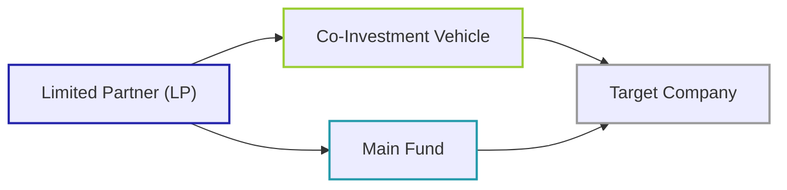

## Overview

Co-investing can be a powerful arrow in an investor’s quiver—especially for those seeking to tweak their exposure to a particular opportunity, reduce fees, or simply develop deeper partnerships with experienced General Partners (GPs). At the same time, you know how it goes: greater potential reward often implies greater risk. In the context of co-investments, this expanded risk can manifest in the form of heavy exposure to a single deal or sector, more limited exit paths, and sometimes over-reliance on the sponsor’s due diligence. 

Below, we break down both the benefits and risks associated with co-investments, weaving in examples, highlighting best practices, and showing how this topic fits into the broader realm of alternative investments—particularly relevant for CFA Level I candidates who want to see the interplay between theoretical concepts and real-world application.

## Key Considerations in Co-Investments

### Reduced Fee Load

One of the main attractions of co-investing is that participating Limited Partners (LPs) can often avoid the standard management fee (e.g., 1.5%–2.0%) and carried interest structures (e.g., 20% above a hurdle rate) associated with the primary fund. In a typical private equity fund, the GP charges these fees on all committed capital. But in a co-investment scenario, the LP invests directly into a specific deal alongside the main fund, usually at lower fees or sometimes with no additional carried interest. This is presumably a sweet deal—less overhead, more direct upside, right?

Well, sometimes. You’ll need to ensure that the GP’s incentives remain properly aligned so that they are not pushing deal risk onto you just because you’re helping fund an opportunity that doesn’t fit perfectly into the main vehicle. More on that in the next section.

### Alignment of Interests with the GP

GPs typically welcome co-investments because they can:

• Deploy capital faster (the GP might have multiple deals in the pipeline).  
• Reduce concentration in their main fund if a particular investment is large.  
• Strengthen relationships with key LPs who have capacity to invest more extensively.

For LPs, co-investments offer a seat closer to the deal table—and, crucially, deeper insight into transaction details. When LPs directly invest, they often receive extra data or even direct access to management. That’s the dream scenario, but do watch out for any red flags if you feel you’re being rushed into a deal or not given enough time to run your own due diligence.

### Concentration Risk

The flip side of pursuing that single “home run” deal is that your portfolio may become dangerously heavy in one company, sector, or region. Concentration risk arises when a portfolio’s capital is disproportionately allocated to just one or a few deals, risking amplified volatility on the downside. In co-investments, the lack of broad diversification can feel like an adrenaline rush if the deal outperforms, but it can be a painful freefall if the investment goes sour.

### Potential Liquidity Constraints

Private equity deals are known for their multi-year holding periods. A co-investment is no different. If you’re used to the relative flexibility of public equities or short-term credit instruments, a co-investment might lock up your capital for 5 to 7 years (or longer) with minimal liquidity options. 

And it’s not just about the waiting—if you try to exit prematurely, you might have to renegotiate terms or find a secondary buyer (often at a discount). Liquidity risk is thus significant for co-investments. Make sure you’re comfortable not having immediate access to those funds.

### Sponsor Incentives and Ongoing Management

A critical question for any co-investing LP is: “Will the GP still care about this deal if it underperforms or drags on?” In many standard fund structures, the GP’s carry is tied to the entire pool of investments, so sub-par deals can be offset by top performers. But in a single co-investment, if it turns into a thorn in the GP’s side, you don’t want them to lose appetite for devoting resources to operational improvements. 

Hence, thorough due diligence on sponsor incentives and track record is paramount. You should confirm that the GP is truly engaged throughout the investment’s lifecycle, not just at the deal origination stage.

### Operational Complexities and Diligence

Co-investments can be structured in ways that might leave you with additional back-office burdens—like additional legal documentation, direct oversight responsibilities, or the need for specialized external advisors. Also, it’s quite possible that a co-investment deal offers less standardized reporting than a typical commingled fund. If that’s the case, you or your team must be prepared to handle unique reporting timelines, customized metrics, or inconsistent data feeds. 

And sometimes, if the co-investment requires more hands-on oversight, you’ll need people with specialized skill sets that might not exist within your organization. Keep in mind how many hours and how much expertise you have to manage this. 

### Example: The Single Company Trick

Imagine an LP invests $5 million as part of a co-investment in a tech start-up. The main fund invests $20 million. While this company might only represent 5% of the main fund’s portfolio, it could be 50% or more of the LP’s private equity allocations if they have a smaller overall portfolio. If that start-up fails to execute its business plan—whether due to regulatory changes or product failures—the LP suffers a much larger proportional loss than it would have in a more diversified vehicle.

This mismatch demonstrates how co-investments can look one way at the overall fund level (“just one of many deals”) and another way entirely at the LP level (“this is half my private equity bucket!”). It’s a lesson learned from folks who discovered, sometimes the hard way, that co-investment losses can sting badly if they’re an outsized slice of your pie.

## Benefits of Co-Investments

### Potential for Enhanced Returns

Fee savings, if properly negotiated, can significantly boost net returns. Eliminating or reducing management fees and carried interest can mean a direct pickup in total returns if the underlying deal performs well. By tapping into these direct deals, LPs stand to capture a bigger slice of the value creation pie (assuming the GP hits its performance targets).

### More Control and Insight

Another perk is more clarity into what’s happening at the company level. Some co-investments give you a seat on the board or at least observer rights. That direct line to management can offer a real-time look at strategic decisions, giving you early warning signals if the investment thesis is going off track.

### Faster Capital Deployment

Sometimes, the main fund invests capital at a more measured pace to maintain diversification. In contrast, a co-investment can move quickly. This is particularly appealing for LPs who are trying to deploy capital into private markets at specific times (e.g., if they’re rotating out of public assets or see a fleeting market opportunity). 

### Relationship Building

Getting recognized as a reliable co-investment partner can lead to preferential allocations, early looks at new deals, and deeper networking benefits. GPs often like to have a stable of dependable co-investors to phone up when big opportunities arise. If you build a track record of swift and capable execution, your phone might ring more often, and better deals might be offered first.

## Analyzing Risk-Return Trade-Off

One quick way to conceptualize potential outcomes is by outlining the payoff if success is moderate or if it’s a total meltdown. Because co-investments can move your entire portfolio’s needle significantly, it helps to think of risk-adjusted returns in a more holistic sense than just “this deal’s IRR.” Let’s illustrate a stylized scenario in Python pseudocode:

```python
import numpy as np

np.random.seed(42)
iterations = 10000
deal_returns = np.random.normal(loc=0.15, scale=0.3, size=iterations)  # Stdev is high

# We'll track how many times we get a negative outcome
negative_outcomes = np.sum(deal_returns < 0)

average_return = np.mean(deal_returns)
prob_negative = negative_outcomes / iterations

print(f"Average Simulated Return: {average_return:.2%}")
print(f"Probability of Negative Returns: {prob_negative:.2%}")
```

In a fictional run, you might see an average of 15% return (with a high standard deviation of 30%), but there could be 30% or more negative outcomes. This code snippet (though simplistic) shows how the distribution can be wide and underscore how significant negative returns can be if you’re heavily concentrated. 

## Structural Dynamics of Co-Investments

It’s often helpful to visualize the key players and the flow of capital. Below is a simple Mermaid diagram illustrating the relationship:



In this structure, the LP invests directly (often through a separate co-investment vehicle) into the target company while also participating in the main fund. This arrangement underscores two main flows: (1) the direct capital injection into the co-investment, and (2) the broader commitment into the GP’s main fund.

## Sponsor Incentives in Depth

When an LP invests via both the main fund and a co-investment, they need to ensure that the GP:

1. Continues to support the company with sufficient resources—no “orphan deals.”  
2. Maintains enough personal involvement or “skin in the game.”  
3. Structures the co-investment in a fair manner with transparent governance.  

One question that frequently arises: “What if the GP was forced to do this co-investment because they didn’t have enough capital in the main fund for a big deal?” That can be a good thing or a bad thing. On one hand, it suggests the GP sees a compelling opportunity and is going big on it; on the other, they’re likely using external capital to close the gap. So, do they personally remain strongly invested if their ownership stake is diluted?

## Operational and Legal Complexities

### Customized Legal Terms

Sometimes, you might have to sign side letters or specialized LLC agreements that differ from the typical subscription documents for the main fund. The devil is in the details—each side letter can shift reporting requirements, cause tax implications, or impose additional governance structures.  

### Potential Lack of Standardized Reporting

Consider how you’ll receive quarterly updates or how you’ll measure performance. The main fund might provide consolidated returns, but the co-investment might be reported differently or at a different cutoff date. For accurate risk monitoring, you’ll need consistent data feeds—your middle-office or external fund administrator must be ready.

### Cross-Border Complexities

If the target company is in a different jurisdiction, you’ll likely face a more complicated tax or regulatory framework. LPs often need to consult with international tax advisors to structure the investment in a way that avoids double taxation and meets local compliance requirements.

## Case Study: A Cautionary Tale

I recall a situation (an anecdote shared by a private equity professional) where an LP jumped at a co-invest opportunity in a fast-growing e-commerce company. They loved the brand, the pitch deck was gorgeous, and the sponsor had a solid track record. Yet, the LP was primarily a real estate-focused investor with limited tech expertise. They didn’t fully grasp the intricacies of supply chain disruptions in that sector. 

A couple of years later, the company faced a massive shipping bottleneck and soared overhead costs. The LP discovered how little direct control they had over operational decisions—they couldn’t pivot the business strategy unilaterally because the GP and the main fund were controlling it. When the dust settled, the investment barely broke even after a major recapitalization. 

So, it’s not always gloom-and-doom, but it highlights how important it is to have the right knowledge base and governance terms if you’re going to co-invest in an unfamiliar domain.

## Best Practices

• Conduct Thorough Due Diligence: Don’t assume that just because it’s a GP you trust, you can skip your own independent analysis.  
• Assess the Sponsor’s Alignment: Make sure the GP is motivated to keep working on the deal even if it lags or experiences hiccups.  
• Evaluate Concentration Exposures: Check how large this co-investment is within your entire portfolio.  
• Prepare for Illiquidity: Expect a multi-year lockup with few exit options.  
• Obtain Proper Legal Counsel: Co-investment structures can be complex, so get specialized legal advice.  
• Keep Clear Communication Channels: Clarify how operational updates, capital calls, and distributions will be managed.  

## Exam Tips

• Approach scenario-based questions by first identifying where the sponsor’s incentives might align or misalign.  
• Understand how co-investments can amplify concentration risk—be prepared to do quick portfolio-level calculations on the exam.  
• For item-set style questions, watch out for tricky details around fees. They might test your knowledge of net vs. gross returns, carried interest waivers, or side letter conditions.  
• If you see a question involving partial GP funding or borderline deals, assess if the co-investment is mitigating or magnifying inherent risk. Sometimes a co-investment is used to “fill in the gap” for riskier deals.  
• Time management: In essay questions, keep it straightforward. Outline risks, then outline benefits, and finally conclude with a balanced view.  

## References

- Fraser-Sampson, G. (2010). Private Equity as an Asset Class. John Wiley & Sons.  
- Metrick, A., & Yasuda, A. (2021). Venture Capital and the Finance of Innovation. Cambridge University Press.  

## Exam-Level Co-Investment Insights



### Which of the following is a primary advantage of co-investments for LPs?

- [ ] Guaranteed liquidity within one year.  
- [ ] Access to leverage not available in the main fund.  
- [x] Reduction or elimination of extra management fees and carried interest.  
- [ ] Guaranteed board seats in the target company.  

> **Explanation:** One of the biggest draws is the opportunity to invest side by side with the GP and avoid additional management fees. While co-investments can sometimes provide board access, it is not guaranteed in every deal.

### When evaluating co-investment risks, concentration risk refers to:

- [ ] The likelihood that the GP will reduce management attention over time.  
- [x] Overexposure to a single deal or sector in an LP’s portfolio.  
- [ ] The inability to secure co-investment allocations across multiple deals.  
- [ ] Reputational damage if the deal fails.  

> **Explanation:** Concentration risk is about having too much capital allocated to one specific investment or theme, which can lead to amplified losses if that investment underperforms.

### Which of the following best describes how co-investment fees are typically structured?

- [ ] LPs always pay the same fee level as in the main fund.  
- [ ] LPs typically pay substantially higher fees due to specialized negotiations.  
- [x] LPs often pay reduced or no additional management fees and carried interest on co-investments.  
- [ ] GP invests in the deal at no cost but claims 50% carried interest.  

> **Explanation:** Co-investments commonly come with fee structures more favorable to LPs, including reduced or waived management fees and carried interest.

### Why might a GP seek co-investment from LPs?

- [ ] To avoid being personally liable for fund shortfalls.  
- [ ] To exit a failing investment quickly.  
- [ ] To shift legal liability away from the main fund.  
- [x] To deploy capital for a larger deal than the fund alone can support.  

> **Explanation:** GPs often invite co-investors when they encounter an attractive deal requiring more capital than the fund can provide, allowing them to participate in opportunities that might exceed their fund limits.

### Which of the following statements about liquidity considerations in co-investments is correct?

- [ ] Co-investments are inherently more liquid than the main fund.  
- [ ] An LP can typically exit at any time at par value.  
- [x] Co-investments can be illiquid for several years, similar to standard private equity deals.  
- [ ] Liquidity risk only applies if the main fund invests outside domestic markets.  

> **Explanation:** Co-investments often carry the same illiquidity characteristics as private equity in general; the holding periods can extend for years, with limited secondary market options.

### An LP that wants deeper control and governance rights in a target company when co-investing should:

- [ ] Expect to be passive and rely entirely on the GP.  
- [x] Negotiate board visibility or observer seats during the deal documentation phase.  
- [ ] Propose a zero-fee structure for the main fund.  
- [ ] Avoid side letters and other direct agreements.  

> **Explanation:** LPs seeking more control or insight typically negotiate governance rights or observer seats, often documented in side letters or specialized co-invest structures.

### A potential downside of co-investments from the LP’s perspective is:

- [ ] Greater diversification across the entire portfolio.  
- [x] Reduced diversification if the co-investment represents a large share of the LP’s portfolio.  
- [ ] Absence of sponsor incentives and oversight.  
- [ ] Prohibitions on obtaining performance data.  

> **Explanation:** By participating heavily in one deal, the LP’s portfolio may become more concentrated, increasing risk if that specific investment performs poorly.

### In evaluating sponsor incentives, an LP should consider:

- [x] Whether the GP will remain engaged throughout the investment’s lifecycle.  
- [ ] If the GP can delegate all responsibilities to the LP.  
- [ ] How soon the LP can exit via the public markets.  
- [ ] The real estate exposure in the main fund.  

> **Explanation:** A key factor is ensuring that the GP has the motivation to continue supporting the co-investment, even if it faces challenges or competes for attention with other fund assets.

### One operational challenge specific to co-investments (compared to commingled funds) is:

- [x] Customized reporting requirements and different legal documents.  
- [ ] Strict uniformity of documentation across all deals.  
- [ ] A short time horizon of only six months.  
- [ ] Guaranteed capital calls at the same schedule as the main fund.  

> **Explanation:** Co-investments frequently require separate agreements and unique reporting structures, which can increase complexity for an LP’s back office.

### Co-investments carry no management fees and no ring-fenced carried interest. True or False?

- [ ] True  
- [x] False  

> **Explanation:** While fees are commonly reduced for co-investments, it is not guaranteed that they are eliminated. Some deals still carry minimal management fees or carried interest, and these terms can vary significantly by GP and transaction.


