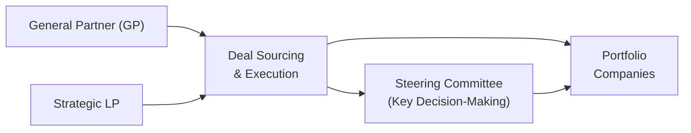

## Overview 
Strategic partnerships between Limited Partners (LPs) and General Partners (GPs) are increasingly influential in the world of alternative investments, especially in private equity and related private markets. The idea is straightforward: when an LP consistently invests alongside a GP and the relationship has produced favorable deal outcomes, both parties may explore a deeper, more formal partnership arrangement. This strategic collaboration might include a “preferred LP” status (where an LP gets first dibs on co-investment opportunities), a standing agreement to share deals regularly, or even a scenario where the LP acquires a minority stake in the GP’s own management company. 

But wait—let’s step back for a moment: why would an LP want to do this? And why would a GP welcome that added involvement? The short answer is that deeper partnerships can open doors to proprietary deals, streamlined discussions on terms (like reduced fees or better profit splits), and improved due diligence on portfolio assets. At the same time, it demands a high level of trust on both sides, and—quite frankly—a lot of proactive oversight by the LP to avoid becoming too reliant on a single GP’s success. 

Think of it like forming a business friendship: if everything goes smoothly, you reap the rewards of synergy, shared resources, and better alignment of interests. If it goes south, you might become stuck or overshadowed—kind of like being locked into a one-sided friendship where you’re always seeking the other’s approval. This section breaks down how strategic partnerships with GPs work, the myriad structures they can take, the benefits and pitfalls, and how to measure performance and maintain discipline.

## Building a Foundation for Strategic Partnerships
A strategic partnership usually grows out of a track record of successful fund investments, co-investments, or direct deals. In many cases, an LP invests in multiple vintage funds led by the same GP. Over time, the LP may notice consistent outperformance or strong relationships with the investment professionals—this fosters trust and can serve as the initial spark for a broader partnership.

• Momentum in Co-Investing: If an LP sees that the GP has sourced proprietary transactions (where limited competition exists) and has the operational skill to drive value creation, the LP might request preferential access to those opportunities.  
• Cultural Fit: Sometimes it’s about cultural alignment—GP and LP representatives communicate well, share similar ethical standards, or have complementary strategic objectives.  
• Shared Industry Focus: If the LP’s guiding thesis is to focus on, say, healthcare or technology, and the GP has a high level of expertise in precisely that niche, a deeper partnership creates synergy and targeted market coverage.

## Potential Structures
Although every partnership is unique, there are some tried-and-true templates:

### Preferred LP Status
An LP with “preferred LP” status is the GP’s first call when a co-investment deal arises. The LP might also receive beneficial economic terms, such as reduced management fees or carried interest, in recognition of the volume or reliability of its capital commitments. Sometimes, these deals come with compressed timelines, so the LP must be ready to pivot quickly and deploy capital when the GP rings.

### Regular Deal-Sharing Agreements
Some partnerships establish a formal arrangement (perhaps documented in a side letter) stating that the GP will share a certain percentage of each deal or a cohort of deals with the LP. This helps the LP—and the GP—plan capital allocation more predictably. But watch out: the GP typically needs to ensure it has the capacity to field the LP’s questions and maintain robust due diligence systems that can handle multiple investors.

### Minority Stake in the GP’s Management Company
In a deeper expression of partnership, an LP might purchase a minority stake in the GP’s management firm. This can entitle the LP to a share of the carried interest across all the GP’s funds, seats on the GP’s advisory board, or even some input into management decisions. Keep in mind, though, that this arrangement effectively ties the LP’s own brand to the GP’s future success—an alignment that can be powerful, but tricky if performance or leadership changes.

## Benefits of Strategic Partnerships
### Privileged Access to Proprietary Deals
If you’ve ever wanted to be first in line at a concert ticket drop, you can relate to the desire for “preferred access.” By forging a strategic partnership, an LP often gets an early look at deals from the GP’s pipeline. This can be a game-changer because many of these transactions never make it to competitive auctions. Proprietary deals can come with more attractive pricing (less bidding pressure) and more time to conduct due diligence.

### Enhanced Due Diligence
Close relationships usually mean more transparent access to operational data and direct dialogue with the GP’s deal team. If an LP sits on an advisory committee or has frequent scheduled check-ins, the partnership fosters real-time intelligence on the deal pipeline. Instead of waiting for quarterly updates, the LP might get near-instant feedback on how portfolio companies are performing, changes in management, or pivot strategies in uncertain markets.

### Potential Fee Concessions
A strategic partner often negotiates reduced management fees or carried interest rates. For instance, the arrangement might say, “We will co-invest up to 20% of the deal’s equity in exchange for a 50% reduction in our portion of the GP’s carry on that particular transaction.” Over time, these concessions can be quite meaningful from an LP’s perspective—especially for large institutional investors with big commitments.

### Deeper Networking and Knowledge Sharing
It’s not just about the money. Many strategic partnerships lead to secondment opportunities, collaborative research, or even staff rotation programs where the LP’s in-house professionals might spend time with the GP’s team. This fosters cross-pollination of ideas, best practices, and skill sets that can strengthen both organizations’ investment capabilities.

## Risks and Challenges
### Over-Reliance on a Single GP
One day, I was chatting with an LP who told me they felt so comfortable with a particular GP that they allocated nearly half their alternatives budget to that manager. Then the GP ran into a rough patch of deal performance, and, well, you can guess what happened—sudden stress on the overall portfolio. Over-reliance risk is real; a single manager’s successes or failures can heavily impact the LP’s results. Diversification is crucial to mitigate that correlation in performance outcomes.

### Governance Concerns
All those perks—shared committees, deeper involvement, minority GP stakes—introduce governance complexities. If friction emerges, the LP and GP might disagree on investment strategy, portfolio management, or potential conflicts of interest. Making decisions about follow-on investments or partial exits can be contentious if roles and decision-making rights aren’t spelled out in advance.

### Reputational Risk
In a strategic partnership, the LP’s name often becomes tied to the GP’s brand. If the GP faces regulatory scrutiny or negative press (for example, allegations of operational misconduct), the LP might be seen as implicated by association. That’s a strong motivator for thorough due diligence and a good reason to stay updated on how the GP manages compliance and ethics.

## Performance Metrics and Reporting
Before the partnership is fully baked, both sides should agree on key performance indicators (KPIs) and the reporting standards that define them. 

• Return Metrics: Typically, this includes Internal Rate of Return (IRR), Multiple on Invested Capital (MOIC), and realized vs. unrealized performance. GPs should provide breakdowns by portfolio company or by strategy.  
• Qualitative Assessments: Are the GP’s key personnel remaining actively involved? Is the fund’s strategy drifting from its original focus? The “Key Person Provision” often addresses this, requiring designated individuals to be central to the decision-making.  
• Meeting Cadence and Transparency: While quarterly updates might suffice in normal fund relationships, strategic partners often expect monthly data or even a seat at the GP’s investment committee (if possible).  
• Decision-Making Rights: Determining exactly how much influence an LP has can be tricky. Usually, high-level decisions stay with the GP, but the LP may receive veto rights or special input on major corporate actions.

## Decision-Making Rights and Alignment
Strategic partnerships are built on alignment of interests. At a minimum, the GP typically invests personal capital into each fund or co-investment alongside the LP. The LP, in turn, agrees to meet capital calls promptly and honor the GP’s timeline for deals. 

In some partnerships, specific “major decisions” might require approval by a steering committee composed of senior members from both sides. This structure can be visualized as follows:

• “General Partner (GP)”: Manages day-to-day operations of the fund, sources deals, and executes transactions.  
• “Strategic LP”: Provides capital, may hold preferred status or minority stake in the GP’s management company.  
• “Steering Committee”: A forum for major decisions (e.g., changes to strategy, large follow-on investments, or expansions).  
• “Portfolio Companies”: The ultimate vehicles for delivering returns.

## Real-World Example
Imagine GlobalFoundation, an institutional LP with a special focus on healthcare and biotech. Over several years, they consistently committed capital to HealthVentures Private Equity, a GP known for mid-market life sciences buyouts. As trust grew, GlobalFoundation negotiated a minority stake in HealthVentures’ management company, ensuring that they receive a share of carried interest across the GP’s entire fund lineup—not just the vehicles in which they are direct investors. 

By virtue of this strategic partnership, GlobalFoundation also gets first refusal on any co-investment deals that involve healthcare services. They pay a significantly reduced carried interest on those deals. In return, HealthVentures benefits from the certainty of capital (GlobalFoundation has committed to a certain volume of capital each vintage) and from GlobalFoundation’s in-house scientific advisors, who help enhance due diligence. The synergy is powerful—but GlobalFoundation also had to reduce its allocation to other healthcare GPs to maintain overall portfolio weighting, which raises the risk that if HealthVentures stumbles, so might a big chunk of GlobalFoundation’s private equity portfolio.

## Best Practices to Ensure Long-Term Success
• Maintain Diversification: Even the best GP can have off-years. Strategic partnerships should not override the LP’s overall asset-allocation discipline.  
• Define Roles and Responsibilities: Use side letters, advisory boards, or limited partnership agreements to lay out procedures, governance, decision-making rights, and conflict resolution channels.  
• Establish Clear Performance Hurdles: If the GP fails to meet certain IRR or MOIC thresholds, the partnership might revert to standard terms.  
• Conduct Periodic Stress Tests: Review how the partnership would perform in adverse scenarios—e.g., an economic downturn or a sector-specific disruption.  
• Uphold Ethical Standards: Ensure robust compliance frameworks and keep an eye out for any potential misalignments, especially around insider information or conflicts of interest.  
• Structure Exit Flexibility: If the relationship sours or the GP’s leadership changes (triggering that Key Person Provision), the LP should have a feasible path to reduce or exit its stake in the partnership.

## Exam Tips for CFA® Candidates
• Be prepared to discuss how strategic partnerships can align incentives but also create concentrated risks.  
• Don’t forget the legal and governance nuances—knowing common partnership clauses and how they protect LPs or GPs is crucial for exam scenario questions.  
• Recognize how to evaluate a GP’s track record, both qualitatively (key team members, cultural fit, operational approach) and quantitatively (IRR, MOIC, liquidity metrics).  
• In an essay-style question, be ready to articulate the pros and cons of deeper involvement in a GP’s management or direct co-investment structures.  
• Remember that strategic partnerships are not just about money—they can provide ongoing collaborative advantages and knowledge sharing.

## References and Further Reading
• Talmor, E., & Vasvari, F. (2011). International Private Equity. John Wiley & Sons.  
• Preqin Global Private Equity & Venture Capital Reports:  
  https://www.preqin.com/  
• CFA Institute Standards of Practice Handbook, 11th Edition (for ethical and governance considerations)  
• Institutional Limited Partners Association (ILPA) Guidelines

---

## Test Your Knowledge: Strategic Partnerships with General Partners



### Which of the following describes a key benefit for the LP in a strategic partnership with a GP?

- [ ] Increased reliance on a single GP's strategy
- [x] Privileged access to proprietary deal flow
- [ ] Guaranteed fund-level profits with no downside risk
- [ ] Avoidance of management fees entirely

> **Explanation:** A major advantage of strategic partnerships is that LPs often receive privileged or first-in-line access to proprietary deals generated by the GP. This benefit is one of the main motivations for establishing such partnerships.

### An LP in a strategic partnership might take a minority stake in the GP’s management company primarily to:

- [ ] Eliminate all performance fees
- [x] Align economic interests and participate in the GP’s carried interest
- [ ] Force the GP to focus on a single investment sector
- [ ] Bypass all governance provisions in the fund documents

> **Explanation:** By acquiring a stake in the management company, the LP can participate in the GP’s carried interest across multiple funds, further aligning incentives and sharing the upside.

### Over-reliance risk in a strategic partnership refers to:

- [ ] The LP’s risk of substituting a GP’s decision-makers with their own experts
- [x] Excessive concentration on a single GP, potentially leading to correlated performance risk
- [ ] The GP’s risk of reduced carried interest
- [ ] A situation where the GP outsources all due diligence to the LP

> **Explanation:** Over-reliance risk occurs when an LP invests too heavily in one GP. If that GP underperforms or faces challenges, the LP’s overall portfolio could suffer disproportionately.

### What is a typical arrangement under "preferred LP" status?

- [ ] The LP gains veto power over all transactions with no exceptions
- [ ] The LP must commit to every co-investment opportunity offered
- [x] The LP is granted priority access to certain co-investment deals and may receive fee concessions
- [ ] The LP receives zero management fees but pays double carried interest

> **Explanation:** "Preferred LP" status usually grants first-look privileges on co-investment deals and often allows the LP to invest under more favorable fee or carry terms.

### One proven method to mitigate over-reliance risk within a strategic partnership is to:

- [ ] Concentrate 80% of the LP’s funds in the highest-performing GP
- [x] Maintain overall portfolio diversification across various GPs and asset classes
- [ ] Commit only to the GP’s smallest funds to limit exposure
- [ ] Eliminate all performance hurdles in the partnership agreement

> **Explanation:** Even with a valuable strategic partnership, the LP should avoid over-concentration and continue to diversify across multiple GPs or asset classes to mitigate correlated risks.

### Which of the following reporting standards is typically expected in a strategic partnership?

- [x] Real-time or frequent disclosure of portfolio performance
- [ ] Complete secrecy about deal sourcing and portfolio updates
- [ ] Quarterly performance reports with zero detail on underlying companies
- [ ] No communication until final liquidation of the fund

> **Explanation:** Deeper involvement usually means the LP demands (and receives) more frequent and timely data on portfolio performance, often beyond the standard quarterly reports.

### In the context of a strategic partnership, which of the following best describes a “Key Person Provision”?

- [ ] A clause ensuring LPs can replace the GP’s investment committee at will
- [ ] An agreement that the GP can invest in any strategy
- [ ] A guarantee that the LP can commit less capital after the investment period
- [x] A clause ensuring certain individuals remain active in the fund’s management

> **Explanation:** Key Person Provisions protect the LP’s interests by requiring that named individuals at the GP remain involved in the fund’s investment decisions.

### Assuming an LP and GP form a steering committee, which of the following might be subject to that committee’s approval?

- [x] Major strategic pivots, such as investing outside the agreed sector
- [ ] Daily stock-by-stock trading decisions
- [ ] Minor budget line items for GP travel
- [ ] Hiring decisions for all junior GP staff

> **Explanation:** Steering committees typically focus on high-level strategic or extraordinary decisions, like expanding into a different industry or adjusting the fund’s investment thesis.

### In a typical strategic partnership, the GP benefits from:

- [x] Committed capital and the LP’s specialist insights
- [ ] Being able to charge unlimited fees with no accountability
- [ ] Complete immunity from governance requirements
- [ ] Guaranteed success of every portfolio company

> **Explanation:** The GP gains assurance of capital (often across multiple deals or funds) and can tap into the LP’s expertise, which can help with due diligence or portfolio company oversight.

### True or False: A strategic partnership always eliminates the need for standard limited partnership agreements (LPAs).

- [x] True
- [ ] False

> **Explanation:** This is a bit of a tricky one—some might argue most strategic partnerships still require underlying LPA documents for each fund. However, certain deeper partnerships can sometimes incorporate custom legal contracts that supplement or, in rare cases, supersede the LPA structure. In specialized instances where the LP is a minority owner of the GP’s management company, the terms go beyond a traditional LPA. Therefore, in a few structures, the standard LPA may be largely replaced or heavily modified. 


