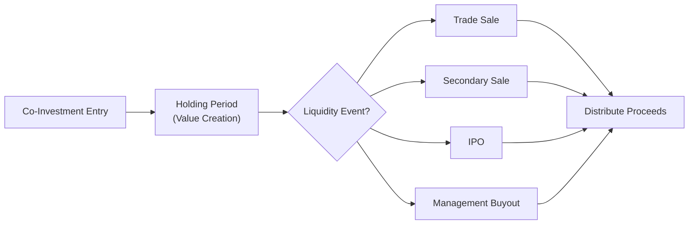
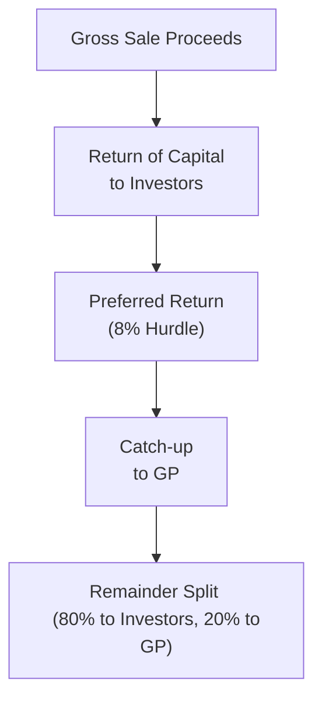

## Introduction

Well, let's talk about something I once found slightly nerve-racking when diving into private markets: liquidity. You know that feeling, right? You get excited about a new co-investment opportunity—maybe you’re teaming up with a General Partner (GP) you admire—and all you can think about is the potential upside. But, um, the next thing you realize is that this investment might lock up your capital for years. Meanwhile, guess what? You might need that cash sooner if things don't go as planned or if your strategic goals shift. That’s the reality in co-investments and direct deals. Unlike public equities that can be sold at the click of a button, private investments are less liquid, with fewer potential buyers and more complicated exit routes.

So, in this section, we’re going to dig into the complexities of liquidity, governance structures, and exit scenarios for co-investments and direct deals. We’ll also see how misalignment among various stakeholders—GPs, limited partners (LPs), and co-investors—can create friction when it’s time to organize a liquidity event. We’ll look at common exit options, governance mechanisms, and how proceeds are distributed through waterfall structures. The aim is to give you a toolkit to evaluate these deals with eyes wide open, so you don’t get surprised after committing your hard-earned capital.

## Why Liquidity Matters

Private investments often run on a different clock than public markets. Liquidity in co-investments and direct deals is inherently limited because:

• There’s typically no active secondary market or only a very shallow one.  
• Transaction sizes can be large and require negotiation for months.  
• You might depend on the majority investor (often the GP) or other controlling shareholders to initiate an exit.

I remember speaking with a colleague who jumped at a direct investment in a niche manufacturing firm. The growth story was compelling—solid management, top-notch product line, stable cash flows. But she needed capital for a family emergency, and no formal exit event was on the horizon. She had to orchestrate an expensive secondary sale at a discount. Ouch. The moral of her story: always keep an eye on potential exit routes and timelines.  

### Liquidity Mismatches

One major challenge is that co-investors might need liquidity at different points than the primary sponsor or other co-investors. For instance, a GP with a 10-year fund life (plus extension periods) may not be in a hurry to sell. Meanwhile, an LP with a shorter investing horizon might be pushing for a quicker exit, forcing the question: how do you reconcile these competing goals?

## Governance Structures in Co-Investments

Governance in co-investments sets the rules of the game, establishing who gets to make decisions and how. Clarity in governance helps you avoid nasty disputes that can arise when each party’s interests diverge.  

### Board Representation

In many co-investments, if you invest a significant amount, you might gain the right to nominate a director or even just have an “observer” seat on the board. Board representation means potential influence over strategic direction, budgets, liquidity strategies, and so on. Of course, being on the board also carries fiduciary responsibilities. You can’t just pop in and say, “Hey, I want out—time to force a sale!” That might not cut it if the board consensus or the controlling shareholder has other plans.

### Protective Clauses

I’ve seen deals where minority co-investors got hammered partly due to weak protective clauses. True story: an investor lacked veto rights on major corporate actions, which allowed the majority holder to do a dilutive capital raise. Before he knew it, his stake was diluted, and he had no recourse. That’s why robust protective clauses—like veto rights concerning a sale, merger, issuance of new equity, or incurring excessive debt—become crucial.  

### Waterfall Structures and Performance Thresholds

In many direct deals, especially those with multiple investor classes (senior equity, junior equity, etc.), a waterfall structure is used to outline distributions:

• Return of Capital: First, the investors often get their capital back.  
• Preferred Return (Hurdle Rate): Next, investors might get a preferred rate—often in private equity structured deals, something like 8%—if specified.  
• Catch-up Provision: Once the preferred return is paid, there might be a “catch-up” so the GP or certain shareholders get a portion until they reach parity.  
• Carried Interest Split: Finally, remaining profits are split based on negotiated percentages.

This structure ensures each stakeholder is rewarded commensurate with the risk they’ve taken, though you must always check the fine print to see who gets priority and how the leftover proceeds will be shared.

## Navigating Multiple Exit Scenarios

Liquidity events can take various forms: trade sale, secondary sale, IPO, or management buyout (MBO). Each exit has implications for timing, costs, and valuations.

### Trade Sale

A trade sale usually means selling the entire stake (often the entire company) to a strategic or operational buyer in the same or a complementary industry. This can yield strong synergies and potentially higher valuations if the acquiring firm sees the target as a way to expand or gain technology/data capabilities. However, negotiations can be lengthy and complex, and the sale might get blocked by certain protective clauses or regulatory hurdles.

### Secondary Sale

Secondary sales can be partial or full. You might find a buyer—another co-investor, an external private equity sponsor, or a high-net-worth individual—willing to buy your stake, which is typically done privately. But let’s be honest: you probably won’t get a top-dollar, market-clearing price. The buyer will often want a discount for the illiquidity, plus an internal rate of return (IRR) that compensates for the risk. This mechanism is still a viable route if you need liquidity without forcing a total corporate exit.

### IPO (Initial Public Offering)

The IPO is often glamorized as a big-ticket exit. Everybody thinks about that celebratory opening day price jump. Well, it’s not always a fairy tale. Timing is everything—if the public equity markets are in a downturn, or if your company’s sector is out of favor, you might be forced to wait for a more favorable window. Also, IPO processes can be lengthy and expensive, with extensive regulatory and disclosure requirements. In addition, lock-up periods can restrict insider and co-investor share sales for months post-listing.

### Management Buyout (MBO)

In an MBO, the existing management team acquires or increases their stake. This usually necessitates external financing—often from debt or private equity partners. If the management team is confident in the company’s future and the sponsor or co-investor wants an exit, an MBO can be a neat solution. But from a governance standpoint, be mindful that management’s personal incentives might not always align with existing co-investors who are looking for the best price or immediate liquidity.

## Mermaid Diagram: Typical Exit Routes

Below is a simple Mermaid diagram to visualize the flow from initial investment to potential exits:

During the holding period, the company’s management and the investors strive to generate growth. Once a liquidity event is triggered, the investors exit—fully or partially—and proceeds flow according to the waterfall structure.

## Potential Misalignments Among Investors

One frequent pitfall relates to the mismatch in liquidity horizons. Maybe the GP has a typical 7- to 10-year horizon, plus extension options, while a co-investor wants out in, say, five years. If the controlling party feels the business can fetch a higher valuation by waiting, the co-investor might be stuck. 

Professional relationships can become tense, especially if the co-investor tries to push a sale or find a secondary buyer. This is precisely why those protective clauses and well-defined governance rules are so important.

### Conflict Resolution

If you anticipate friction, you might negotiate a “drag-along” or “tag-along” right. For instance:

- Tag-Along Rights: If the majority sells, minority investors can “tag along” and sell under the same conditions.  
- Drag-Along Rights: The majority can compel minority investors to sell if a certain threshold is met (e.g., 75% or 80% shareholder approval).  

Both are double-edged swords. They solve some liquidity timing issues but can also force you out (drag-along) or keep you from selling individually if you prefer not to.

## The Role of Waterfall Structures in Distribution

We briefly touched on waterfall structures, but let’s add more color. Imagine a scenario where you and the GP have a deal specifying:

• First 100% of proceeds go to repay investor capital.  
• Then an 8% preferred return to investors.  
• After that, a catch-up to the GP, such that the GP receives, say, 20% of the total distributed so far.  
• Finally, any additional proceeds are split 80/20 between investors and the GP.

It’s possible that your co-investment arrangement gives you a slice of the GP’s carried interest or it could be a side arrangement that offers different economic terms. The details can get complicated, so it’s crucial to read the limited partnership agreement (LPA) or side letter thoroughly.  

This diagram is a simplified version of how cash might flow in private equity or co-investment deals when an exit occurs.

## Best Practices for Managing Liquidity and Governance

### 1. Anticipate Liquidity Constraints

Always explore possible exit routes when considering a co-investment. Are secondary sales feasible? Will the sponsor’s fund life align with your own liquidity needs? Basic questions, but you’d be surprised how often investors skip them because they’re enamored with that “hot deal.”

### 2. Negotiate Governance Protections

Seek veto rights or at least protective covenants over major corporate actions. Make sure the deal has a robust board structure if you’re investing a large stake. You don’t want to be a mere passenger.

### 3. Align Economic Incentives

If you sense that the sponsor or majority investor’s timeframe differs dramatically from yours, consider alternative structures. For example, you might rely on redemption rights after a certain period. However, redemption rights can be toothless if the company can’t actually pay you.

### 4. Understand Waterfall Provisions

Let’s say the business performs well, but growth is a bit slower than forecasted. Depending on how the waterfall is structured, you might recover less than expected, or the GP might not receive carried interest if the hurdle rate is not met. Clarity upfront reduces heartbreak later.

### 5. Develop a Contingency Plan

If you might need liquidity sooner than the majority investor or GP, line up potential secondary buyers or keep open lines of communication with your sponsor. The time to plan is before the unexpected event.  

## Practical Example: A Hypothetical Co-Investment Deal

Suppose you co-invest in a technology startup with a GP:

• Your stake: 15%; GP’s stake: 40%; management/founders: 45%.  
• Board seats: GP gets 2 seats, management 2 seats, you get 1 seat.  
• Protective clauses: You (and the GP) must approve any recapitalization or major asset sale.  
• Exit horizon: GP has an 8-year fund; you want to exit by the 5th year.  

Fast forward four years. The GP wants to hold until year 7 to capitalize on an upcoming product launch. But you’d prefer to exit now due to personal liquidity needs. Your options could include:

1. Negotiate a secondary sale of your stake to another private investor, albeit probably at a discount (and subject to the GP not exercising a right of first refusal).  
2. Propose an early partial redemption if the company can afford it (less common in growth-stage companies, but feasible in some buyout scenarios).  
3. Compel a sale only if your protective clauses so allow (which is unlikely unless certain performance or governance triggers are met).  

You can see how misalignment can become complicated.  

## Regulatory and Reporting Considerations

If the entity is preparing for a potential IPO, the enterprise will need to comply with local or international reporting standards—often IFRS or comparable local GAAP. Liquidity terms, exit routes, and governance structures might be disclosed in investor communications, especially if these terms materially affect valuations. International Financial Reporting Standards (IFRS) can guide fair value measurement of private stakes and the consolidation or equity method of accounting, depending on the level of control or significant influence. Always ensure you’re aligned with IFRS 9 (Financial Instruments) and IFRS 10 (Consolidated Financial Statements), among others, if you have controlling or significant influence.

## Common Pitfalls

• Overly optimistic exit timelines.  
• Overlooking minority shareholder rights.  
• Neglecting alignment of interest between management, GP, and co-investors.  
• Failing to adequately protect yourself in the event of a forced sale, recapitalization, or new round of financing.

## Exam Relevance and Strategies

If you’re prepping for the CFA exam at Level I or beyond, expect scenario-based questions. They might describe a co-investment with a certain governance setup or exit plan. You could be asked:

• How do protective clauses enhance or reduce the risk for a minority investor?  
• Which exit scenario maximizes valuation but may require a longer timeline?  
• What are the trade-offs between an IPO vs. a trade sale?  

Remember to link these co-investments concepts to bigger topics like portfolio diversification (Chapter 8.5) and risk management (Chapter 8.2). Also, ethical considerations from the CFA Institute Code and Standards (especially around conflict of interest and fair dealing) might come up if you’re a board member or if you have partial control that impacts minority investors.

## Conclusion

Liquidity, governance, and exit scenarios in co-investments and direct deals can feel like a maze—one with various doors, each labeled “Trade Sale,” “Secondary Sale,” “IPO,” or “MBO.” The question is: which door leads to the best outcome for you, and can you actually open it? By structuring sound governance, anticipating misalignments in liquidity objectives, and understanding the distribution waterfall, you position yourself to navigate that maze more confidently.

Before committing to a co-investment, do your homework. Make sure you’re comfortable with the exit timeline, the governance structure, and the distribution terms. And if you find yourself wondering whether you’ll be “locked in,” well, remember that’s normal for this asset class—just try to mitigate it through protective clauses, sturdy relationships with your GP, and thorough due diligence.

## References

Black, B. S., & Gilson, R. J. (1998). Venture Capital and the Structure of Capital Markets. Journal of Financial Economics.  
IFRS Standards: https://www.ifrs.org/  

## Test Your Knowledge on Liquidity, Governance, and Exit Scenarios



### Which of the following best describes a major reason for lower liquidity in co-investments?

- [x] Limited secondary markets for private stakes
- [ ] Higher traded volumes on public exchanges
- [ ] Strict regulations that prohibit private transactions
- [ ] Investors prefer publicly-listed companies

> **Explanation:** Co-investments generally have limited secondary market activity, making it much harder to convert shares into cash quickly.

### What is the primary function of protective clauses for minority co-investors?

- [x] To provide veto or consent rights on major corporate actions
- [ ] To guarantee board seats in all circumstances
- [ ] To enable constant price renegotiation
- [ ] To prevent shareholders from selling stakes

> **Explanation:** Protective clauses help minority co-investors safeguard their interests by requiring their approval (or veto) on significant decisions like issuance of new debt or a corporate sale.

### In a typical distribution waterfall, which claim is usually settled first after a liquidity event?

- [x] Return of invested capital to the investors
- [ ] GP’s carried interest
- [ ] Preferred return catch-up
- [ ] A performance bonus for management

> **Explanation:** Most private equity-style waterfalls prioritize returning the initial contributed capital to the investors before other distributions.

### A co-investor seeking liquidity sooner than the GP could attempt which of the following routes?

- [x] A secondary sale of their stake to another investor
- [ ] Immediate forced sale of the entire company without GP approval
- [ ] An overnight listing on a public exchange without prospectus
- [ ] A partial redemption financed entirely by management’s personal funds

> **Explanation:** A secondary sale is often the most direct way for a minority co-investor to exit if other liquidity events aren’t occurring yet.

### Which exit route can provide high valuations but may take significant time due to market fluctuations and compliance requirements?

- [x] IPO
- [ ] Management Buyout
- [x] IPO
- [ ] Secondary Sale

> **Explanation:** An IPO can potentially fetch strong valuations but often involves lengthy processes and market timing risks.

### If a majority shareholder holds “drag-along” rights, it implies:

- [x] They can force minority holders to sell under certain conditions
- [ ] Minority investors automatically keep their shares during an exit
- [ ] Minority investors have veto power over any sale
- [ ] The board seat is exclusively allocated to the minority

> **Explanation:** Drag-along rights enable the majority shareholder to require minority investors to join in a sale, ensuring a clean transaction.

### What does “board representation” typically offer to a co-investor?

- [x] Influence over strategic direction, budgets, and exit strategies
- [ ] Absolute control to force an exit at any time
- [x] Influence over strategic direction, budgets, and exit strategies
- [ ] A guaranteed IPO within 2 years

> **Explanation:** Board representation allows direct participation in corporate governance and decision-making, although it does not grant absolute unilateral control.

### What is a key benefit of including a robust governance mechanism in a co-investment structure?

- [x] Clear rules for decision-making and reduced disputes
- [ ] Guaranteed above-market returns
- [ ] No need for written term sheets or agreements
- [ ] Complete elimination of minority risk

> **Explanation:** Strong governance lowers the risk of conflict by clearly outlining each party’s rights and responsibilities.

### Which term best describes a situation where management acquires a significant portion of the business from existing shareholders?

- [x] Management Buyout (MBO)
- [ ] Spin-off
- [ ] Reverse Merger
- [ ] PIK Toggle

> **Explanation:** In a management buyout, the management team purchases a portion (or all) of the company, often with external financing from sponsors.

### True or False: A co-investor’s liquidity needs are always perfectly aligned with the GP’s investment timeline.

- [x] True
- [ ] False

> **Explanation:** In practice, there is often a mismatch between the co-investor’s liquidity preferences and the GP’s fund life, leading to potential tension or forced negotiations.


