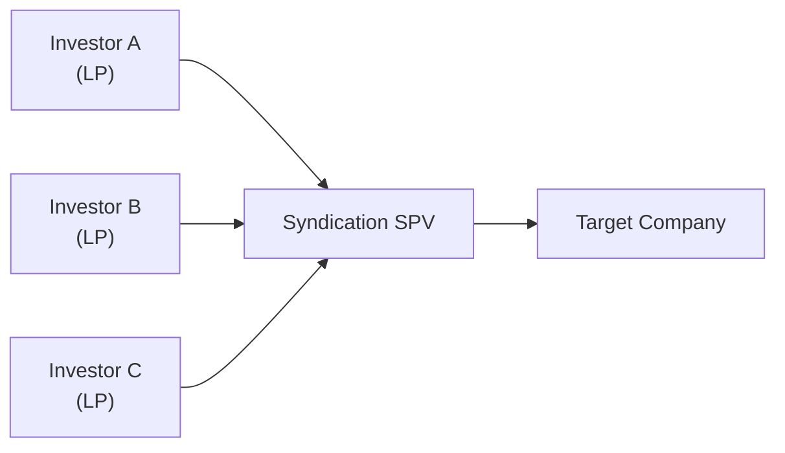

## Introduction

Sometimes, you just can’t do it alone—especially when you’re eyeing a sizable private equity or direct deal that might exceed your individual capital or risk tolerance. That’s where multi-investor syndications and club deals enter the scene. They’re like the times I’ve teamed up with a few friends to invest in a new coffee shop or real estate property. Each of us brings a different skill or resource, and, in principle, we all share the upside and the downside in a more balanced way.

In formal capital markets, multi-investor syndications gather numerous limited partners (LPs) or institutional investors around one table, while club deals feature a smaller group of private equity firms or large LPs who collaborate to buy an entire business. The idea is to spread risk, pool expertise, and expand your investment capacity. But as you might imagine with multiple voices, it’s a bit more complicated than going it alone. In this article, we’ll explore how these deals are structured, what roles each stakeholder might play, how to handle conflicts, and what to watch out for if you ever find yourself part of a “club.”

## Understanding Multi-Investor Syndications

Multi-investor syndications are essentially formal partnerships or ad hoc consortiums where several investors commit capital to a single transaction. Each investor’s share can vary, and sometimes you’ll see a lead sponsor or anchor investor taking the largest stake and orchestrating the deal terms. This structure leverages everyone’s financial strength without any single party overextending its resources.

• Risk-Sharing and Capital Allocation  
Pooling funds is like splitting the check at a restaurant. If the bill gets too large, none of us want to pick it up alone. But if everyone kicks in proportionally, then the opportunity is within reach. In syndications, the risk is diluted—potential losses (and, of course, the gains) get spread among the investors.

• Streamlined Structure  
Syndicate members commonly invest through a special purpose vehicle (SPV) designed to hold the stake in the target company. This SPV sets out the governance rules, voting rights, and distribution waterfall so that each investor knows precisely how returns will be shared and how decisions will be made.

Below is a simplified diagram of how that might look:

This approach ensures clarity regarding ownership. Each participant in the syndicate feeds capital into the SPV, and the SPV invests in the company (Target Company), eliminating the confusion of multiple direct lines from each investor to the target.

• Roles and Responsibilities  
Though the group invests collectively, roles within the syndicate can differ. Some participants act as passive LPs, while others may have more active board seats or oversight roles. The lead investor often organizes the deal, negotiates terms with the target, drives due diligence efforts, and maintains ongoing relationships with all participants.

## Club Deals: A Syndication Subset

Club deals are essentially a smaller, more exclusive version of multi-investor syndications. Instead of a large pool of many LPs, you might find just two or three private equity firms (or large institutional LPs) teaming up to buy a company. For instance, in a leveraged buyout situation, a couple of PE firms might form a club to take a public company private. They share the buyout cost and risk, and each presumably brings unique sector expertise or relationships to manage the newly acquired business.

• Why Club Deals?  
Club deals are about synergy: “I have operational expertise in consumer goods, you have some in technology, so together we can bring more value to this target.” Also, it reduces the single-firm risk. But club deals can be tricky. You have to align the exit timeline and strategy among multiple drivers. If one firm wants to exit and the others want to hold for another two years, tension arises. I once saw a scenario where a friend’s PE fund had to buy out its co-investor—who had a shorter fund life—just to facilitate a timely exit without damaging the target’s strategic plan.

• Governance and Control  
Major strategic decisions—such as capital structure changes, acquisitions, or divestitures—often require supermajority approval in a club deal. It’s not unusual for each investor to hold veto rights on certain transactions. However, the complexity can make day-to-day operations more cumbersome. 

## Governance, Term Sheets, and Alignment

An important piece of these transactions is the term sheet or syndication agreement. All investors sign this to outline economics, control rights, and responsibilities.

• Economic Rights and Distribution Waters  
These agreements specify how distributions of profits, interest payments, or dividends flow back to each investor. In some private equity structures, you might see a “waterfall” arrangement (discussed in more depth in Chapter 12: Private Markets Fundraising and Capital Flows) that prioritizes fees, then returns each investor’s capital, and finally splits profits based on ownership or carried interest structures.

• Control Rights and Minority Safeguards  
Investors typically want certain protective provisions, especially if they’re minority holders. These include board seats, veto power on major decisions, or special approval on dilutive actions. It’s important to keep these clear to prevent future battles or confusion.

• Information Rights  
Every investor in a syndicate wants timely financials and operational updates. But more investors means more eyes on confidential data. The term sheet should clarify confidentiality obligations to avoid leaks or misuse of insider information.

## Potential Challenges and How to Mitigate Them

It’s easy to dream about a frictionless partnership, but in reality, multi-investor deals can get complicated. Let’s look at some of the big pitfalls:

• Coordination and Decision-Making  
With multiple voices, it can feel like herding cats—one wants to reinvest profits, another wants dividends, and the third just wants a quick exit. Address that up front with well-defined governance protocols and escalation paths for disputes.

• Information Overload or Asymmetry  
Not everyone needs the same level of detail, but if some members have privileged operational data and others do not, that can lead to mistrust or claims of unfair treatment. A robust Non-Disclosure Agreement (NDA) framework ensures the right level of transparency while preserving confidentiality.

• Misaligned Exit Timelines  
This is perhaps the single biggest headache when you’ve got multiple LPs or PE firms. One member’s fund might be nearing the end of its lifecycle, while another is content to hold. Possible solution? Pre-agree on a forced liquidity clause. For example, after a certain number of years, any party can trigger a sale or buyout at a fair market price.

• Legal and Compliance Hurdles  
Any cross-border transaction introduces new complexities—currency risk, tax structures, foreign direct investment rules, or additional layers of regulation. It’s wise to build a specialized multinational legal team from day one if going global.

## Real-World Scenarios

• A Real Estate Syndication Example  
Imagine a marquee office building in a major city. The sponsor organizes five institutional LPs plus a few family offices. Each invests a portion of the required $200 million equity. The sponsor keeps a 10% stake. Roles are spelled out: sponsor manages the property; institutional LPs have board representation and monthly performance calls. Eventually, years down the line, they collectively decide to divest the property to capture capital gains.

• Club Deal for a Technology Buyout  
Two large private equity funds identify a promising enterprise software firm. Each invests 50% into a newly formed SPV. They negotiate control rights—both must approve capital calls above $10 million. They also plan for an exit no later than seven years. Snags? Fund B wants to exit in five years. So, they insert a buy-sell clause, allowing Fund A to purchase Fund B’s shares if one side wants out earlier.

## Best Practices and Ethical Considerations

In multi-investor syndications, especially at the institutional level, there’s a professional code of conduct that fosters trust and credibility. The CFA Institute’s Code and Standards, for instance, emphasizes fair dealing and confidentiality. That’s critical if you’re dealing with material nonpublic information, strategic corporate data, or sensitive business plans.

Some best practices include:

• Clarity in Roles and Governance: Everyone’s seat at the table and voting rights should be spelled out.  
• Suitability and Proper Diligence: Each investor should confirm the deal fits their mandate and risk profile.  
• Transparent Communication: Update all syndicate members regularly—no selective disclosure.  
• Robust Legal Counsel: Good attorneys are worth their weight in gold. They can help parse out control rights, exit clauses, and indemnifications.  
• Ethical Conduct: Avoid conflicts of interest, especially if one investor or sponsor also has a separate relationship with the target company.

## Conclusion

Multi-investor syndications and club deals aren’t just about capital—they rely on alignment, communication, robust documents, and mutual trust. Ultimately, you want the synergy of expertise and capital to outweigh the complexity of managing multiple players. When these structures work, they can achieve bigger acquisitions with shared risk. When they go awry, they can become a tangle of conflicting interests and slow decision-making.

If you’re thinking about joining a syndication or club deal, ask yourself: “Are my goals aligned with the other participants? Do I trust the lead sponsor? Am I prepared for the complexities of group governance?” No single blueprint works for everyone, but with careful planning and a healthy respect for potential pitfalls, a collaborative approach can be a powerful way to invest. 

From personal experience, I’ve found that a small group of reliable, transparent co-investors can make the whole venture more hands-on, engaging, and potentially more profitable—just like those times I teamed up with friends to invest in that local coffee shop. Yes, we had the occasional debate about expansion strategy, but, in the end, each of our unique perspectives enriched the final result.

## References for Further Exploration

• Kaplan, S. N., & Strömberg, P. (2009). Leveraged Buyouts and Private Equity. Journal of Economic Perspectives.  
• Harvard Business Review Case Studies on Club Deals and Syndicated Investments.  
• CFA Institute Code of Ethics and Standards of Professional Conduct.  
• Chapter 12 of this Volume (Private Markets Fundraising and Capital Flows) for more on waterfall structures and LP relationships.  
• Chapters 3.3 and 11.6 for insight into Due Diligence processes and sponsor reputation checks.  

## Practice Questions: Multi-Investor Syndications and Club Deals



### Which best describes a club deal in the context of alternative investments?

- [x] A collaboration among a small number of PE firms or large LPs to acquire a target.
- [ ] An investment structure restricted to only family offices.
- [ ] A form of SPV that invests solely in index funds.
- [ ] A broad-based syndication with numerous small-scale investors.

> **Explanation:** Club deals typically involve a small group of private equity firms or large institutional investors teaming up to acquire a significant stake in a company.

### What is a primary reason investors participate in multi-investor syndications?

- [ ] To avoid drafting formal legal agreements.
- [x] To diversify risk and pool capital for larger investments.
- [ ] To eliminate the need for a lead sponsor.
- [ ] To delay presenting annual financial statements to regulators.

> **Explanation:** By participating in a syndication, investors can take on bigger deals than they would be able to alone, while also spreading the risk with others.

### In a typical multi-investor syndication, which document lays out the governance, control rights, and economic rights for the investors?

- [ ] An informal memorandum of understanding without legal enforceability.
- [ ] A personal contract between the lead investor and the target management only.
- [ ] A public registration statement filed with the stock exchange.
- [x] A formal term sheet or syndication agreement signed by all participants.

> **Explanation:** The term sheet or syndication agreement provides clarity on each investor’s role, rights, and obligations, making it a crucial element of any multi-investor deal.

### One common challenge in club deals arises when:

- [ ] All investors have the exact same fund life cycle and risk appetite.
- [x] Different investors have different timelines for exit and liquidity needs.
- [ ] The target company has too much management expertise.
- [ ] There is complete transparency among investors regarding financials.

> **Explanation:** Misalignment of timelines and exit horizons can create tensions and force early buyouts or suboptimal sale decisions.

### Which of the following is a recommended best practice for mitigating disputes in a multi-investor syndication?

- [x] Clarify decision-making protocols and veto rights in the syndication agreement.
- [ ] Allow only one investor to maintain full veto power over any changes.
- [ ] Restrict all operational updates to a single investor.
- [ ] Avoid communicating exit strategies until a forced sale is imminent.

> **Explanation:** Clear governance structures, well-defined roles, and transparent communication paths reduce the likelihood of major disputes.

### Which statement is most accurate regarding risk in a multi-investor syndication?

- [x] Risk is distributed among participants, making larger deals more manageable for each investor.
- [ ] Risk is concentrated solely on the lead sponsor, leaving other investors fully protected.
- [ ] Syndications eliminate all market risks associated with the investment.
- [ ] Syndications are exempt from regulatory oversight, reducing risk-related compliance costs.

> **Explanation:** Syndications distribute risk among investors, allowing them to take on larger transactions. However, it does not remove all market or regulatory risk.

### What is a primary ethical concern when multiple investors are granted information rights in a deal?

- [ ] They might share the extra data to encourage others to invest.
- [x] Investors may inadvertently—or intentionally—leak sensitive information.
- [ ] They usually fail to read circulated materials.
- [ ] They must each sign multiple NDAs without any legal obligations.

> **Explanation:** Confidentiality must be strictly managed, or proprietary information might leak, damaging the company or giving unfair advantages to certain parties.

### How do club deals typically handle major strategic decisions in a portfolio company?

- [x] They often require supermajority or unanimous approval from all club deal members.
- [ ] They are decided by a single investor, leaving others as passive participants.
- [ ] They utilize arbitration panels of outside investors.
- [ ] They avoid all forms of governance agreements to prevent internal conflicts.

> **Explanation:** Club deals tend to have strong shared governance structures, leading to supermajority or unanimous voting requirements on key decisions.

### When investors in a syndicate have misaligned exit horizons, a practical mitigation strategy could be:

- [x] Including a buy-sell or forced liquidity clause in the legal agreement.
- [ ] Encouraging the earliest leaver to trigger a full liquidation.
- [ ] Ensuring no contractual exit terms exist.
- [ ] Letting each investor exit arbitrarily without any buyout provision.

> **Explanation:** A buy-sell or forced liquidity clause ensures an orderly process for an investor to exit early if needed.

### True or False: One reason for pursuing a club deal is to leverage the multi-sector expertise of different private equity firms.

- [x] True
- [ ] False

> **Explanation:** Club deals often happen because each participant brings a complementary skill set, improving the collective expertise applied to the target.


