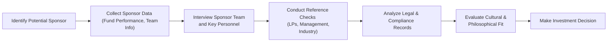

## Introduction

So, you’re thinking about partnering with a General Partner (GP) or sponsor for a co-investment. Maybe you’ve heard about the potential for enhanced returns, or you’re just excited about actively contributing to the strategy. Whatever the reason, you’ve probably realized one thing: the GP you choose can make or break the deal. I remember sitting in my old office once, listening to a colleague rave about a GP’s “great track record,” only to find out later that, well, the GP’s approach to risk management was pretty shaky—leading to a meltdown in one portfolio company’s finances. That experience taught me to never underestimate the importance of kicking the tires on the sponsor’s reputation, stability, and performance metrics.

In the world of co-investments and direct deals, ensuring that your sponsor shares your vision, demonstrates strong operational capabilities, and upholds sound governance practices is absolutely crucial. This section outlines how to systematically assess a sponsor’s track record and reputation, offering a roadmap to help you sidestep misalignments before you invest your hard-earned capital into a co-investment. And honestly, if you can’t trust your partner, you’re probably better off staying far away. Let’s dive in.

## Defining the Sponsor in a Co-Investment Context

In private markets parlance, the “sponsor” (often the GP) is the lead firm orchestrating the transaction, managing day-to-day oversight, and guiding key decisions for the underlying portfolio company. Think of the sponsor as the quarterback, calling plays, making in-game adjustments, and hopefully leading the team to victory. Since they hold so much influence over the investment’s direction and success, it’s obviously in your best interest to examine them as thoroughly as you would any major purchase or partnership.

Sponsors control the capital calls and distributions, set the pace for value creation, and handle many of the operational tasks associated with the investment. They must have robust sector expertise, a culture of accountability, and a verifiable record of generating returns ethically (i.e., with no hidden regulatory skeletons in the closet). Ensuring alignment on investment philosophy, governance style, and problem‑solving approach basically sets the tone for the entire co-investment relationship.

## Historical Performance and Key Metrics

When evaluating sponsor reputation and track record, it’s easy to default to scanning the headline IRR or MOIC. Indeed, those performance metrics can serve as helpful starting points. But historical performance is more nuanced than a single number or figure. Below are some of the core metrics commonly used, with nuances to watch out for:

### Internal Rate of Return (IRR)

IRR measures the discount rate at which the net present value (NPV) of all future cash flows equals zero. In co-investments, you’ll often see IRRs for fully realized transactions as well as partially realized deals, which can be a bit trickier to interpret. Here’s the formula in KaTeX:


\text{IRR} \, \text{solves for} \,\ r \, \text{such that:} \quad 
\sum_{t=0}^{n} \frac{C_t}{(1 + r)^t} = 0 


where \\(C_t\\) is the net cash flow at time \\(t\\). 

Keep an eye on:

• The weighting of realized vs. unrealized gains (unrealized valuations might inflate perceived performance).  
• Whether the IRR is gross (doesn’t account for fees) or net (includes fees).  
• Any “time bias” introduced by earlier successes or late-stage write-offs.

### Multiple on Invested Capital (MOIC)

MOIC, or multiple on invested capital, answers the simpler question: “How many times your capital did you get back?” It’s calculated as:


\text{MOIC} = \frac{\text{Total Proceeds}}{\text{Invested Capital}}


The MOIC paints a broad picture of absolute gains relative to the initial investment, but it lacks any time dimension. An investment that doubles in 12 months achieves the same MOIC as another that doubles in seven years, even though the IRRs are quite different. Expect the sponsor’s marketing materials to trumpet MOIC (especially for successful exits). Don’t let the hype overshadow your deeper due diligence on timing and distribution schedules.

### Number of Successful Exits

Potential co-investors should analyze how many companies in the sponsor’s portfolio have come full circle—meaning they were ultimately sold, merged, or taken public at favorable valuations. Of course, an “exit” might be a liquidation or a less favorable scenario if the sponsor took a wrong turn. It’s not just the number of exits you should look at—you should dig into how many of them were successful. This helps you see patterns like:

• Did the GP focus on a particular industry or region to drive success?  
• Were certain economic cycles or macro conditions more conducive to profitable exits?  
• Did the sponsor face any repeated operational challenges that impacted returns?

### Team Continuity and Sector Expertise

A sponsor’s track record is only meaningful if the same team that generated those results is still in place and actively driving current deals. It’s common, for instance, to see a star portfolio manager or key partner exit a GP and, with that, their relationships, intangible knowledge, and intangible “secret sauce” might walk out the door. If the sponsor had a major turnover in the last couple of years, the historical numbers could be less relevant.

Sector expertise is another big one. For example, your potential sponsor could have a phenomenal track record in technology startups but is now raising a new fund to co-invest in real estate development. Wait—why the pivot? Are they hiring specialists, or have they expanded their operational bench in that new sector? We’re all for sponsors branching out, but not at the expense of the skill sets that made them successful in the first place.

## Reference Checks and Reputation

Yes, reference checks can be time-consuming. But, oh man, they’re often the most revealing step. These references can provide color on the sponsor’s collaborative approach, humility, and sense of fair dealing:

1. References with Previous Portfolio Company Management Teams  
   – Did the sponsor truly support management’s strategy or constantly meddle in day-to-day decisions?  
   – Were there episodes of unethical behavior or undue pressure?  
   – How did they manage crises, especially financial or operational stress?

2. References with Limited Partners (LPs)  
   – Ask LPs about capital call discipline, the sponsor’s transparency in reporting, any patterns of unexpected fees or cost shifting.  
   – Inquire about the sponsor’s approach to conflicts of interest.  

3. Industry Peers and Experts  
   – If the sponsor invests in, say, industrial manufacturing, talk to domain experts on the sponsor’s reputation. Knowledgeable folks might know about any legal or compliance scuffles.

Don’t just rely on the references the sponsor is willing to connect you to. Proactively source additional references if you can. Nobody likes to reveal embarrassing details to a prospective new investor, so you might glean the real story from someone not so carefully curated by your prospective GP.

## Risk Management and Operational Oversight

Solid risk management is like that seatbelt you (hopefully) wear even when you feel certain you’re not going to crash. The sponsor’s job is to identify key operational or financial hazards that could derail returns. Take time to review:

• The sponsor’s track record of handling operational challenges, such as leadership changes, supply chain disruptions, or sudden regulatory shifts.  
• Internal committees or staff dedicated to compliance, risk management, or law (does the sponsor rely on external counsel or do they have robust in-house capabilities?).  
• The sponsor’s approach to governance. For instance, are there well-defined committees, robust procedures for approvals, and effective processes for monitoring portfolio company performance?

One approach that I’ve found telling is to ask the sponsor to describe a high-profile investment that didn’t go according to plan. How did they handle it? Did they pivot strategy swiftly? Did they manage communication with co-investors well, or was it a fiasco?

## Governance and Culture

Many co-investors overlook the importance of cultural fit. If you’re a hands-on investor who likes to engage with management and wants frequent updates, but your sponsor is extremely private and tends to keep tight control of the board, you’re likely to feel frustrated in a co-investment scenario.

Governance is often a reflection of culture. A sponsor that invests heavily in compliance controls, fosters independent board representation, and welcomes robust debate about strategic decisions is probably one that values transparency and broad-based collaboration. On the other hand, if they are extremely hierarchical with little accountability, that might set off alarm bells.

## Legal and Compliance Issues

Regulatory or legal concerns should be considered early in your due diligence. Investigations, pending lawsuits, or regulatory sanctions can hamper portfolio performance and tarnish the sponsor’s reputation. Beyond just scanning a sponsor’s public record, it’s wise to:

1. Review their documented compliance systems (if they exist).  
2. Check if they’ve faced any repeated or consistent allegations in different funds or geographies.  
3. Ask about any changes in compliance directors or outside counsel.

Even a single serious compliance violation can have big ripple effects on a sponsor’s future ability to fundraise and attract top-tier co-investors.

## Philosophical Alignment

On the surface, co-investors and sponsors want the same thing: positive returns. But dig a bit deeper—there might be significant divergences in mission or approach. For example, some co-investors are purely financial and will chase the highest risk-adjusted IRR, while others prioritize social impact or ESG considerations, as introduced in earlier chapters that discuss ESG factors (see Chapter 5 “Natural Resources” and Chapter 8 “Professional Skills and Best Practices”). If these fundamental differences in philosophy aren’t revealed until after the investment is made, friction is pretty much inevitable.

Look beyond financial returns. Check whether the sponsor’s style of portfolio company engagement, the level of transparency, and the strategic timeline are truly in sync with yours. If you envision a decade-long partnership in an infrastructure opportunity, but your sponsor wants a quick flip in 24 months, that might be a recipe for disappointment.

## Illustrative Co-Investment Due Diligence Process

Below is a simple Mermaid diagram to visualize the due diligence flow for a sponsor’s reputation and track record:

At each stage, you can (and should) decide if the sponsor checks enough of your boxes to continue. Think of it like a funnel—you start broad, then you decide to proceed or retreat based on red flags.

## Practical Example and Case Study

Let’s say you’re approached by RiverRock Partners (a hypothetical GP) that has a stellar track record in industrial manufacturing. They’re pivoting to high-end consumer retail—quite a contrast in business model and operational needs. They show you an aggregate IRR of 25% across their industrial manufacturing funds and boast a MOIC of 2.5x. Sounds great, right?

But after some reference checks, you learn:

• Two key partners who spearheaded their most lucrative deals left the firm last year.  
• RiverRock’s CFO resigned amid an under-the-radar compliance probe.  
• The sponsor’s only direct experience in consumer retail was a short-lived JV that ended in a write-off.  

In discussing risk management practices, they’re vague on the day-to-day engagement they’ll have with new retail-based portfolio companies. You also notice an overall shift in their approach to portfolio management—less rigorous governance, more reliance on external consultants. Even if RiverRock’s high returns were real in the past, the new direction and turnover raise serious questions. Unless you’re comfortable with that level of risk and cultural uncertainty, you might walk away.

Alternatively, you could propose investing in a smaller, more specialized sector fund or wait until they build a more robust consumer retail team. The key is that the due diligence process keeps you from blindly chasing a sponsor’s historical 25% IRR while ignoring the changes under the surface.

## Tools and Data Sources

In addition to in-house resources, you can leverage the following:

- Preqin (https://www.preqin.com): Database offering sponsor performance analytics, peer comparisons, and market data for private equity.  
- Institutional Limited Partners Association (ILPA) (https://ilpa.org): Provides guidelines for due diligence, best practices in GP-LP relationships, and standardized reporting templates.  
- Thomson One and PitchBook: Performance data, sponsor league tables, sector analysis, and real-time updates on sponsor activities.  
- Regulatory Filings: In some jurisdictions, sponsors must file disclosures with regulators. These are often accessible via public databases.

## Best Practices and Common Pitfalls

• Don’t Overrely on Headline IRRs: High IRRs from a small number of short-lived deals can be misleading.  
• Vet the Key Decision Makers: Even the best brand names can experience leadership shake-ups.  
• Review Complex Fee Arrangements: Clawbacks, waterfall structures (see Chapter 12 on “Private Markets Fundraising and Capital Flows” for deeper coverage), or hidden charges can significantly erode returns.  
• Maintain Ongoing Dialogue: Due diligence doesn’t end after committing capital. Stay in touch with your sponsor to catch early signs of trouble.  
• Align Timelines: A mismatch in exit horizons can cause friction.  
• Document Everything: Should legal disputes arise, having a clear paper trail of your due diligence findings is invaluable.

## Exam Tips for CFA Candidates

From an exam perspective—particularly at the advanced levels where you might see item sets or short-answer questions—demonstrating an understanding of sponsor due diligence is fairly about applying frameworks to real-world scenarios. The exam loves to include mini-case studies, where you might be asked to identify red flags, evaluate IRR calculations, or suggest steps to mitigate alignment issues. Some strategies:

• Familiarize Yourself with the Distinction Between Gross and Net IRR: The exam often tests whether you can see how fees and carry might influence sponsor-provided performance figures.  
• Be Ready to Spot Potential Conflicts of Interest: The test might include a scenario where the sponsor also owns a service provider used by the portfolio company.  
• Practice Summarizing Key Considerations in Due Diligence: The exam often wants you to concisely lay out the top items an LP should check.  
• Understand How to Evaluate Team Continuity: Don’t overlook partnership adjustments and turnover.

Remember, the CFA Institute Code and Standards emphasize diligence, care, and a thorough investigation of investment managers. In your exam writing, connecting sponsor track record review to these ethical standards will be a welcomed demonstration of your knowledge.

## References

- Preqin Database: https://www.preqin.com/  
- Institutional Limited Partners Association (ILPA) Guidelines: https://ilpa.org/  

## Test Your Knowledge: Sponsor Reputation and Co-Investment Track Record



### Which performance metric focuses primarily on the absolute value of proceeds relative to total invested capital?

- [ ] IRR
- [x] MOIC
- [ ] Sharpe Ratio
- [ ] Beta

> **Explanation:** MOIC (Multiple on Invested Capital) is calculated as (Total Proceeds / Invested Capital), emphasizing how much capital is returned overall without factoring time.

### When evaluating sponsor track record, which of the following is a primary concern if there is significant leadership turnover at the GP?

- [ ] The possibility of lower IRRs in the broader market
- [x] The historical performance data may be less indicative of future results
- [ ] Fee structures will automatically become more transparent
- [ ] The sponsor’s brand name no longer applies

> **Explanation:** If key decision‑makers who drove performance in the past have departed, the firm’s track record might not reflect the current capabilities and expertise of the remaining team.

### A sponsor’s IRR could be misleading if which of the following factors occurs?

- [x] Most of the portfolio gains are unrealized and based on estimated valuations
- [ ] The sponsor invested primarily in low-risk assets
- [ ] All of the GP’s funds are fully realized
- [ ] The GP invests across multiple sectors

> **Explanation:** Unrealized returns rely on internal valuations and may overstate performance. If the IRR is largely driven by unrealized gains, there is no guarantee those values will be realized at exit.

### What is the key advantage of conducting reference checks with previous portfolio company management teams?

- [ ] They help ensure the sponsor has capital call discipline
- [x] They can reveal the sponsor’s collaborative approach and how they handle crises
- [ ] They confirm the sponsor’s marketing strategy
- [ ] They provide formal regulatory filings

> **Explanation:** Previous portfolio company teams witness the sponsor in action—during governance discussions, operational decisions, and crisis management. They can offer candid feedback on sponsor temperament and involvement.

### Which best describes a scenario of philosophical misalignment between sponsor and co-investor?

- [ ] They both aim for a quick 12-month exit
- [ ] Both parties emphasize short-term profit maximization
- [x] The sponsor pursues rapid flips while the co-investor prefers a long-term horizon
- [ ] They share the same target IRR

> **Explanation:** Misalignment can arise if the GP has a strategy or exit timeline at odds with the co-investor’s. One wanting a short hold while the other wants a multi-year commitment can cause friction.

### Why is it important to distinguish between realized and unrealized gains in a sponsor’s track record?

- [ ] Unrealized gains are always significantly undervalued
- [x] Unrealized gains may not materialize at the projected exit value
- [ ] Realized gains are less relevant for co-investments
- [ ] Unrealized gains can be accounted for in IRR, but hidden from MOIC

> **Explanation:** Unrealized gains are based on interim valuations. There is a risk that final exit values might differ substantially from those estimates.

### Which of the following signals a potential conflict of interest in a sponsor’s approach?

- [x] The sponsor hires a related-party vendor for portfolio companies without disclosure
- [ ] The sponsor invests across multiple industries
- [ ] The sponsor’s IRR is lower than the market benchmark
- [ ] The sponsor offers co-investment opportunities to LPs

> **Explanation:** Using a related-party vendor without fully disclosing relationships or terms can lead to conflicts, as the sponsor might prioritize personal gain over investor interests.

### When analyzing risk management capabilities, what question might best help determine how a sponsor handles a failed investment?

- [ ] “What is your net IRR across all funds?”
- [x] “How did you address operational weaknesses after the investment struggled?”
- [ ] “Do you have access to subscription lines of credit?”
- [ ] “Can you provide us the marketing strategy for the next fund?”

> **Explanation:** The sponsor’s response in dealing with an actual failed investment reveals how they manage crises, communicate with stakeholders, and adjust strategies in real time.

### Why is a sponsor’s approach to governance often linked to its culture?

- [ ] Governance is only relevant during the exit phase
- [x] Governance structures reflect how decisions are made, accountability is enforced, and transparency is valued
- [ ] Culture merely affects branding, not investment results
- [ ] Culture is dictated by regulators, while governance is internal

> **Explanation:** A sponsor that fosters open dialogue, accountability, and transparency often has governance frameworks embodying these values. Strict or hierarchical cultures often mirror more top‑down governance.

### True or False: A sponsor’s strong track record in a single sector automatically guarantees success in a new, unrelated sector.

- [ ] True
- [x] False

> **Explanation:** Sector expertise doesn’t always transfer seamlessly. A sponsor’s success in one domain doesn’t guarantee they’ll replicate those results in markets where they lack experience or operational knowledge.


