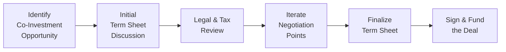

## Introduction

Negotiating co-investment opportunities can feel a bit like walking a tightrope: you’re balancing the desire for attractive deal terms with the reality that timing is tight, competition is fierce, and your leverage may vary from one deal to the next. Co-investment deals, after all, bring multiple parties to the table—General Partners (GPs), Limited Partners (LPs), and sometimes additional syndicate partners. Each party has its own objectives, risk preferences, and bargaining power. 

In this section, we’ll explore essential negotiation tactics and the main investment terms you’ll typically see in co-investment direct deals. Along the way, I’ll sprinkle in a few personal experiences—those “war stories” that make it all the more real—while keeping the focus on the rigorous finance concepts that underpin these negotiations.

## Setting the Stage: Understanding the Co-Investment Context

Co-investments arise when a GP invites one or more LPs to invest directly in a target company or asset on a deal-by-deal basis, often alongside the main private equity or venture fund. This arrangement can give an LP greater exposure to attractive opportunities with potentially lower fees, but it also means taking on more direct risks, performing added due diligence, and, yes, negotiating specific deal terms. 

A co-investment typically has its own term sheet. Even though it often mirrors aspects of the main fund’s Limited Partnership Agreement (LPA), it can incorporate new clauses or adapt existing ones to reflect direct ownership structures. As a result, negotiations can become intricate, with parties focusing on distribution waterfalls, possible carve-outs, protective rights, and more. 

## Key Negotiation Tactics

### Assess Your Bargaining Power
One of the first questions you have to ask yourself is: “Do I have the leverage to push for better economics—like a reduced or no management fee or carried interest?” This can hinge on your reputation, your capital commitments, and even your relationship history with the GP. If you’re a large institutional investor with a track record of committing big checks, there’s a better chance you’ll get favorable concessions. Meanwhile, smaller LPs or first-time co-investors might find their bargaining power limited, especially in a hot market where GPs can have their pick of co-investors.

### Do Your Homework on Market Standards
Ever been in a negotiation across the table and, well, you just felt uncertain about what was “normal” in that space? Maybe you suspected the other side was exaggerating the market norms to get you to concede. Conducting thorough research on market-standard terms—like convertible preferred structures, typical management fee discounts, or lock-up periods—helps anchor your negotiations. Consult industry surveys, talk to other LPs, and analyze recent deals to gain a sense of what is truly fair.  

### Coordinate with Your Legal Team Early
All too often, I’ve seen LPs bring lawyers into the deal conversation too late—maybe right before signing. Then, a flurry of last-minute changes disrupts the entire timeline. Getting legal advice early on can help refine your term sheet approach, highlight red flags, and avoid time-consuming rework. Time is of the essence in co-investments, so you want the transaction to move swiftly, especially if the target company is negotiating final terms with other investors.

### Anticipate Long-Term Relationship Impacts
Co-investments often set the tone for the GP-LP relationship for years to come. If negotiations become too adversarial, it might sour future opportunities or hamper the synergy you’d like to see once you’ve actually invested together. Balancing assertiveness with collaboration is usually the best approach. You can press for certain protective rights, but maintain an environment in which both sides respect each other’s constraints.

### Use a Term Sheet as an Iterative Tool
The term sheet is not just a formal summary; it’s a living document that captures points of agreement and disagreement. Negotiations often proceed in rounds, with each iteration refining the terms. Keep the big risks in focus—like anti-dilution or liquidation preferences—so you don’t get lost in the minutiae.

## Core Investment Terms to Negotiate

Co-investors typically borrow from the main fund’s structure while also tailoring select terms to their unique situation. Below are some major areas to watch closely:

### Anti-Dilution Protection
Anti-dilution clauses protect existing investors from the possibility that a future financing round values the company at a lower valuation (a “down round”). Pro rata rights or “weighted average” anti-dilution provisions are common. If a down round occurs, you might receive additional shares or a price adjustment to mitigate your losses. 

• Full Ratchet vs. Weighted Average:  
  – Full ratchet means your investment price gets adjusted to the lowest share price in subsequent rounds. Super protective of existing investors, but can be seen as overly aggressive.  
  – Weighted average is more moderate, factoring in the size of new financing.  

### Liquidation Preferences
Liquidation preferences detail who gets paid first and in what order if the company is sold or dissolved. Typically, preferred shares have priority over common stock. For instance, a 1x liquidation preference means that preferred shareholders recoup their initial investment before common stockholders see returns.

• Example: Suppose you invest $10 million with a 1x liquidation preference. If the company later sells for $50 million, you first get your $10 million back before any distribution to common shareholders. Depending on the deal, you might then also participate in any remaining proceeds pro rata with common holders.

### Drag-Along Rights
Drag-along provisions allow majority shareholders to “drag” minority holders into a sale approved by a specified majority threshold (e.g., two-thirds of preferred shareholders). This ensures a smooth exit without being blocked by smaller investors who might have different exit timing preferences.

### Veto Rights
Veto rights give certain stakeholders the muscle to block major corporate actions—like issuance of new shares, incurring large debts, or engaging in major acquisitions. An LP might push for veto rights on any transaction that would materially dilute their stake or drastically alter the nature of the investment. However, GPs and company founders tend to resist an excessive laundry list of investor veto rights, as it can hamper speed of execution.

### Management Fees and Carried Interest
In many co-investments, the GP may structure a minimal (or even zero) management fee and a reduced carry for the co-investor, compared to standard fund terms. The rationale is that the GP typically wants to strengthen the relationship with the LP, remain competitive, and reward direct participation. Naturally, GPs also want to ensure they’re properly compensated for sourcing and underwriting the deal.

### Timing and Execution
Time kills deals—at least that’s a familiar mantra in private capital circles. In a co-investment scenario, if you dither too long, the company might close with other investors and leave you out of the party. This is why your negotiation strategy must be streamlined. Many sophisticated LPs have a standard “co-investment playbook” that they can deploy rapidly, referencing standard language for core clauses. 

Below is a simplified diagram that shows a typical process flow for negotiating co-investment terms:

## Reality Check: Balancing Fairness with Strategic Advantage

When deciding how hard to press on any clause, keep these aspects in mind:

• Your Future Pipeline: Co-investments can enhance your relationship with the GP. If you strain the partnership during the negotiation to extract every last basis point, you might limit future pipeline access.  
• Market Comparisons: If you push for terms out of line with industry norms, the GP may interpret it as a sign you’re unfamiliar with typical deal structures—or simply too difficult to work with.  
• Strategic Goals: Is your main aim to secure a seat at the table for governance, or is it purely about maximizing return potential? Negotiation strategies vary by objective.

## Practical Examples and Case Studies

### Example 1: A Large Pension Fund Negotiates Fee Waivers
A large pension fund (LP) invests $100 million in a buyout fund and is offered a $20 million co-investment deal in a specific portfolio company. The pension fund has a history of co-investing with this GP and negotiates zero management fees on the co-investment. The GP agrees because the LP’s capital is critical to close the deal quickly. However, the GP retains standard carry provisions, which the LP accepts, confident that the target valuation is attractive enough to generate a healthy return.

### Example 2: Start-Up Co-Investment with Downside Protection
An early-stage venture corporation is raising capital. An LP invests via a co-investment structure and requests weighted average anti-dilution protection. The GP, eager to secure the LP’s capital and mindful of the LP’s broader relationship, accepts. A year down the line, the start-up hits tough market conditions and triggers a down round. Thanks to the anti-dilution clause, the LP’s position is adjusted, minimizing the harmful valuation shock.

### Example 3: A Real Estate Co-Investment with Veto Rights
In a real estate joint venture, an LP invests in a prime commercial property redevelopment. Concerned about potential changes in project scope, the LP negotiates veto rights for incurring any project-related debt above a set threshold. This ensures no unplanned leverage. The GP, known for prudent financing, finds this acceptable. Both sides see it as a fair term to protect the project from overextension.

## Best Practices for Analysts and LP Teams

• Compare Proposed Terms to the Main Fund’s LPA: Look for inconsistencies or hidden fees. Also check whether you’re inadvertently forgoing protective provisions guaranteed in the LPA.  
• Maintain a Negotiation Checklist: Include key items—fees, carry percentage, protective rights, timeline, governance, reporting obligations.  
• Evaluate Transaction Speed vs. Rigor: Time kills deals, but you still need thorough diligence. Strive for parallel processes: investment, legal, and operational reviews conducted simultaneously rather than sequentially.  
• Document Everything: Keep careful notes of each negotiation round. Summaries of changes in the term sheet can help avoid confusion.  
• Understand Liquidation Waterfalls in Detail: Model out various exit scenarios so you know your likely returns under best- and worst-case conditions.  

## Common Pitfalls

• Waiting Too Long to Negotiate: If you leave critical discussions until the final draft, you could lose leverage or cause the GP to walk away altogether.  
• Overly Restrictive Veto Rights: While protective, they can frustrate management and hamper the company’s operational agility. Balance is key.  
• Lack of Transparency Around Conflicts: If the GP is also taking a co-investment stake, is that well-disclosed? Does the structure favor the GP?  
• Over-Reliance on Boilerplate Deals: Each deal is unique, so referencing standard templates is helpful but rarely enough to address a fast-changing environment.  

## Additional Observations: Behavioral Aspects

It may sound obvious, but negotiation also involves human behavior, not just finance. How the other side perceives your approach can influence the deal significantly. There’s an element of trust-building. One time, I noticed that a GP softened on certain protective rights after discovering that the LP responded quickly to requests, was honest about their constraints, and displayed a real commitment to future deals. Small gestures—like being transparent in communications—can go a long way.

## Closing Thoughts

Negotiating co-investment terms requires both technical expertise in private capital structures and a healthy dose of relationship management. You’ll navigate complex issues like anti-dilution, liquidation preferences, veto rights, and more. By being practical, informed about market standards, respectful of timing, and conscious of your own bargaining power, you set the stage for a successful co-investment—one that fosters growth for the GP-LP relationship and generates strong returns for both parties.

Always keep the bigger picture in mind: a well-negotiated co-investment is not just about the single deal at hand, but about a strategic partnership that can unlock future opportunities.

## Exam Tips

• Be ready to illustrate how different terms (e.g., liquidation preferences, veto rights) directly impact returns or governance rights in scenario-based questions.  
• Distinguish between co-investment structures that replicate a fund’s terms versus those that feature special provisions like reduced fees.  
• Expect essay prompts that test your ability to identify red flags or evaluate the fairness of certain negotiation outcomes in a case study.  
• Practice drafting a mock term sheet with standard protective clauses—this can help you quickly identify critical issues under exam pressure.  
• Know how to quickly define and compare anti-dilution methods (e.g., full ratchet vs. weighted average) in a crunch.  

## References

- Sahlman, W. A. (1990). “The Structure and Governance of Venture Capital Organizations.” Journal of Financial Economics.  
- ABA’s Model Merger Agreement for the Acquisition of a Public Company.  

## Test Your Knowledge: Negotiation Tactics and Co-Investment Terms



### Which of the following can most meaningfully protect an investor’s stake if a down round occurs?

- [ ] Drag-along rights
- [ ] Liquidation preferences
- [x] Anti-dilution provisions
- [ ] Reduced management fees

> **Explanation:** Anti-dilution provisions adjust the purchase price or share count in the event of a subsequent financing at a lower valuation, thus safeguarding the investor’s position.  

### During co-investment negotiations, which factor is most likely to boost an LP’s bargaining power?

- [ ] The GP needs minimal additional capital
- [ ] The co-investment target is broadly unpopular
- [ ] The LP is a first-time investor with a modest track record
- [x] The LP is a large institutional player with a strong capital base

> **Explanation:** A large, reputable LP can provide a larger capital commitment and often has more leverage to negotiate favorable terms.  

### Drag-along rights allow majority shareholders to:

- [x] Force minority shareholders to join them in a sale
- [ ] Block specific corporate actions that change capital structure
- [ ] Maintain a privileged liquidation priority
- [ ] Obtain shares at a future discount

> **Explanation:** Drag-along rights ensure minority shareholders cannot block a sale that meets the approval threshold set by the majority.  

### Which of the following is a key reason why co-investment deals sometimes offer zero management fees?

- [ ] Managers typically prefer to forgo compensation
- [ ] Co-investors assume all governance responsibilities
- [x] LPs provide capital quickly and support the GP’s overall funding needs
- [ ] Regulators mandate fee waivers for co-investors in private deals

> **Explanation:** GPs often reduce or omit management fees for co-investors to attract committed capital, reward large LP relationships, and streamline deal execution.  

### In a co-investment term sheet, what is the main purpose of a liquidation preference?

- [ ] To ensure management can raise subsequent capital quickly
- [ ] To extend veto rights to controlling shareholders
- [x] To determine the amount distributed first to preferred investors upon an exit
- [ ] To grant the GP a carried interest allocation

> **Explanation:** A liquidation preference specifies which investors get paid before others and how much they receive in the event of liquidation or sale.  

### A veto right is best described as an investor’s ability to:

- [x] Block major decisions that could change the investment's risk profile
- [ ] Drag minority shareholders into a sale
- [ ] Claim a proportionate share when a future round is priced lower
- [ ] Assign the investment’s shares to another entity

> **Explanation:** Veto rights give select investors the power to prevent specific corporate actions from moving forward without their consent.  

### In a challenging economic climate that forces a down round, the type of anti-dilution most favorable to existing investors is:

- [x] Full ratchet anti-dilution
- [ ] Weighted average anti-dilution
- [ ] Conversion preference
- [ ] No anti-dilution

> **Explanation:** Full ratchet adjusts the price of all existing shares to the new low price, providing the strongest protection against valuation drops.  

### What is a critical consideration when pushing for multiple veto rights in a co-investment?

- [ ] It guarantees faster exits
- [x] It may delay decision-making and frustrate management
- [ ] It usually lowers carrying costs
- [ ] It waives the GP’s right to carried interest

> **Explanation:** While veto rights protect investors, too many can slow down corporate decisions and alienate the management team.  

### Which example best illustrates an alignment of interests between GPs and co-investors?

- [x] Both parties share proportional upside in success but also share the same downside risks
- [ ] The GP can exit early with a guaranteed return, while co-investors bear ongoing market risks
- [ ] The LP always covers any defaulted capital calls
- [ ] The GP earns carry even if the investment underperforms

> **Explanation:** True alignment means both GP and co-investors win or lose together, sharing the risk/return profile more equitably.  

### True or False: Negotiations that are too aggressive may harm the GP-LP relationship and reduce future co-investment opportunities.

- [x] True
- [ ] False

> **Explanation:** Excessively confrontational tactics can strain the GP-LP partnership, potentially shutting the door on future collaborations.  


