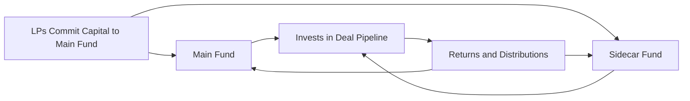

## Introduction

So, let’s chat about something that sometimes feels like an inside secret in private investments: split-vehicle arrangements. If you’ve never heard of them, well—you’re not alone, so don’t sweat it. Split vehicles pop up in scenarios where a traditional private equity or alternative investment fund (let’s call this the “main fund”) runs side-by-side (or in parallel) with a special “co-investment” or “sidecar” vehicle. It’s almost like having two roads leading to the same destination, but with different tolls and speed limits along the way.

At a high level, we’re essentially dividing the overall investment capital into separate buckets. The main bucket is the traditional fund. The second, smaller bucket (the sidecar) invests in specific deals—maybe the plum opportunities or sometimes the more concentrated, higher-risk ones. This approach can be super attractive for limited partners (LPs) who are ready to assume more direct exposure or who want to reduce layered fees. But it also raises big questions about fairness, fee structures, and transparent governance.

## Foundational Concepts

### How Split-Vehicle Arrangements Work
In a typical co-investment setup, the general partner (GP) offers select LPs an opportunity to invest directly in a particular company or project outside the main fund structure. With a “split-vehicle” design, a portion of overall committed capital still goes to the main fund, while another portion is funneled into a sidecar or parallel fund that invests in specific deals.  

This sidecar or parallel fund is not just a casual add-on. It’s usually governed by distinct documentation that spells out rights, obligations, fees, and governance. And, oh yes, each of those details can have a significant impact on overall returns, not to mention the operational complexity and oversight needed.

### Reasons for Using a Split-Vehicle
• Concentrated Exposure: Some LPs want a bigger stake in a specific hot opportunity without the dilution they’d get if the deal was simply part of the larger main fund.  
• Reduced Fees: Sidecars often come with lower or no management fees and reduced carried interest because the GP’s overhead might be offset by the main fund’s fee inflows—or because co-investors are taking on a more direct, concentrated risk.  
• Regulatory or Tax Needs: Sometimes a second vehicle is set up to cater to different jurisdictions, investor types, or regulatory constraints. Parallel funds can help address different tax regimes or local compliance issues.  

### Quick Personal Anecdote
I remember a conversation with a friend who worked at a mid-market private equity shop. He often joked that the sidecar “was where the real action was” because that’s where the largest returns sometimes showed up—particularly for hyper-focused deals in technology or healthcare. But—and here’s the cautionary part—he also mentioned that the sidecar vehicles could become a source of tension if the best deals always seemed to land there rather than benefiting the main fund. It created the potential for conflict among investors and even among the general partners themselves.  

## Key Elements of Split-Vehicle Structures

### Sidecar Funds and Parallel Funds
Let’s define how sidecar and parallel funds fit into the picture:

- Sidecar Fund: A smaller, separate pool of capital that invests alongside the main fund in one or more specific deals. In practice, the sidecar typically allows certain LPs (often favored or strategic ones) to get expanded exposure to promising positions.  
- Parallel Fund: Another distinct legal vehicle that invests “in parallel” to the main fund, often used to accommodate different tax or regulatory requirements. Parallel funds and the main fund typically share similar fee structures but can differ in terms of waterfall distributions and carried interest.  

### Allocation Policies
Everything hinges on fair deal allocation. If you have a sidecar vehicle, you have to define how deals get split. A robust allocation policy sets out:  
• Which opportunities are exclusively for the main fund.  
• Which deals can be shared by both vehicles.  
• How to avoid “double counting” of performance data or duplication of administrative expenses.  

Allocation policies might get more complicated if more than two entities are involved—for example, if you have multiple parallel funds across different geographies.  

### Delineation of Rights
You can’t have a cohesive structure without crisp legal documents specifying who has what rights. This typically covers:  
• Voting rights in portfolio company decisions.  
• Ability to participate on boards or committees.  
• Reporting obligations (timing, format, detail).  
• Who foots the bill for operational or legal expenses.  

A sidecar might get to wave certain fees or might get special priority in co-investment allocations. That’s all spelled out in the agreements—hopefully in a way that doesn’t cause confusion two years down the line.

## Fee Structures in Split-Vehicle Deals

### Main Fund vs. Sidecar Fund
In the main fund, the GP generally charges a management fee (like 1.5%–2.0% per year of committed or invested capital) plus a performance fee (carried interest) that can range from 10% to 20% or more of the profits—subject to hurdles and catch-ups. The sidecar might carry a reduced fee or no management fee at all, with carried interest that might be a fraction of the main fund’s rate.  

Why does the GP often offer a discount on the sidecar? Because co-investors are presumably taking a bigger concentration risk in a specific investment. They’re also typically more sophisticated or strategic. In other words, the GP wants to incentivize them by waiving or lowering certain fees.

### Fee Offsets
In some structures, there’s a provision that management fees may be offset by other sources of income. For instance, if the GP also receives transaction fees or monitoring fees from portfolio companies, a portion of those fees might reduce the management fee charged to investors. This can get extra tricky in a split-vehicle arrangement. If the separate side fund invests in certain deals where the GP garners portfolio-company fees, how are these offsets shared across both vehicles? The last thing you want is double counting or misallocation.  

### Carried Interest Mechanics
Carry in a split-vehicle arrangement is typically accounted for on a deal-by-deal basis for the sidecar fund, as opposed to the main fund’s aggregated approach. This means that success in a sidecar investment might not necessarily offset losses in the main fund, or vice versa. That can create a scenario in which the GP might receive substantial carry from a big sidecar winner, even if other deals in the main fund are floundering.  

A simplified formula for carried interest on the sidecar portion could be expressed as:


\text{Carried Interest}_{\text{sidecar}} = \text{Carry Rate} \times (\text{Realized Gains}_{\text{sidecar}} - \text{Capital Invested}_{\text{sidecar}} - \text{Hurdle})


Where:
• Carry Rate = negotiated percentage share of net profits (e.g., 10%–20%).  
• Realized Gains_sidecar = net proceeds after disposal or partial exit of the co-investment.  
• Capital Invested_sidecar = amount initially invested in the co-investment.  
• Hurdle = a preferred return or hurdle rate that must be exceeded before the GP is entitled to carry.  

### Avoiding Double Counting
It might sound like an obvious problem to avoid, but “double counting” can creep into performance metrics if the same investment is reported at the main fund level and again at the co-investment fund level. For example, the main fund invests in 10% of a company, and the sidecar invests in another 5%. If the GP lumps them both together in marketing materials, guess what—they might be overrepresenting total exposure or returns. Good governance dictates that each vehicle’s portion is distinctly reported, with no overlap in net asset values, performance metrics, or realized distributions.

## Legal Documentation and Governance

### Documenting Rights and Obligations
Side letters, limited partnership agreements (LPAs), or subscription documents must clearly explain:  
• The scope of each vehicle’s portfolio.  
• How performance will be calculated and reported.  
• The respective rights for fees, distributions, and governance.  
• Any cross-default or cross-collateralization provisions.  

This is where the phrase “delineation of rights” really matters. If the sidecar is investing in the same enterprise as the main fund, it’s critical to know exactly what happens if additional capital is needed, or if the main fund has a saying in major corporate decisions and the sidecar does not.

### Compliance and Transparency
A strong governance framework aims to ensure each vehicle adheres to the same level of compliance and operational thoroughness. Regulatory bodies and standard-setting organizations, like the Institutional Limited Partners Association (ILPA), emphasize that side vehicles should not become a loophole for risk or compliance drift. In many cases, sidecar vehicles must produce the same type of audited statements, capital calls, distribution notices, and so forth.  

## Operational Mechanics and a Simple Visual

Below is a simplified mermaid diagram showing how capital might flow in a split-vehicle arrangement:

In this diagram, you can see how the same limited partners (A) might invest in both the main fund and the sidecar fund. The main fund invests in a broad deal pipeline, while the sidecar focuses on specific deals. Returns flow back to each vehicle separately.

## Practical Examples of Fee Arrangements

1. Classic Case: Main Fund Charges 2/20; Sidecar Charges 0/10  
   - The main fund fees for all operational, portfolio monitoring, and admin costs.  
   - The side fund invests in a special growth equity deal that’s highly sought after.  
   - The sidecar pays no management fee and only 10% carried interest once the investment surpasses an 8% preferred hurdle.  

2. Reduced Fee with a Catch-Up: Main Fund 1.5/20; Sidecar 1/15  
   - Both vehicles charge some management fee, but at different levels.  
   - Carried interest rates differ too; the main fund demands a standard 20% carried interest with a typical 8% hurdle, while the sidecar only charges 15% carry but a 6% hurdle.  
   - This example might arise when the GP has to do extra due diligence or operational oversight for the sidecar deals.  

3. Single Vehicle with Sidecar Option  
   - Some main funds are set up with an automatic “sidecar option” for large LPs, which triggers when a particular investment requires additional capital beyond the main fund’s capacity. That sidecar capital invests at reduced fees.  

## Challenges and Pitfalls

1. Conflict of Interest  
   - If the GP is prioritizing deals for the sidecar with better economics, the main fund participants could cry foul. This is a big reason for documented allocation policies.  

2. Over-Concentration  
   - A sidecar invests in a single deal or a small cluster of deals. Great if returns are strong; pretty painful if the investment flops. Investors need to consider that extra layer of risk.  

3. Operational Complexity  
   - Running multiple vehicles simultaneously pulls in more legal, compliance, and administrative overhead. Accounting can become complicated if you’re not careful about how each fund is tracking portfolio costs and distributions.  

4. Fee Transparency  
   - If the GP isn’t transparent about how offsets and carry calculations are handled across vehicles, then LPs might suspect double dipping or undisclosed side deals.  

## Best Practices for GPs and LPs

- Adhere to ILPA Principles: Maintaining consistent reporting formats, showing gross vs. net returns clearly, and fully disclosing side arrangements aligns with best practices.  
- Align Incentives: GPs should design fee structures where both the main fund and sidecar participants feel that the risk-reward balance is fair.  
- Maintain Clear Allocation Rules: If the GP operates multiple funds, including parallel structures, a well-documented allocation policy is crucial.  
- Perform Enhanced Due Diligence: Co-investors should ensure the sidecar is subject to the same governance controls (e.g., board representation and oversight committees) that apply to the main fund.  
- Track and Report Separately: Keep sidecar fund performance metrics distinct from the main fund, ensuring no double counting.  

## Exam Tips and Real-World Relevance

If you’re studying for the CFA exam, especially the advanced levels, you might see scenario-based questions about sidecar or co-investment fund structures. You could be asked to evaluate the fairness of the fee arrangement, or to spot potential conflicts of interest in the GP’s allocation. Time and again, unraveling these complexities requires you to remember:  
• The alignment of incentives among all parties matters more than anything.  
• Proper documentation and consistent, transparent reporting keep you on the right side of compliance.  
• Potential biases can creep in if one vehicle consistently scoops up the best deals.  

In the real world, from a portfolio-management perspective, always consider how an outsized position in a sidecar fund will affect your portfolio’s concentration, liquidity, and correlation exposure. Keep an eye on the big picture. Because, honestly, who wants a brilliant single investment overshadowed by poor diversification?

## References for Further Study
- ILPA Principles on Fee Transparency and Reporting:  
  https://ilpa.org/  
- Private Equity Demystified by ICAEW for an overview of fund structures.  
- CFA Institute Standards of Practice Handbook for guidance on ethical and professional conduct, especially regarding disclosure and conflicts of interest.  

## Test Your Knowledge: Split-Vehicle Arrangements and Fee Structures



### In a split-vehicle arrangement, which component typically invests in a broad array of deals?

- [x] The main fund
- [ ] The sidecar fund
- [ ] A parallel fund limited to co-investments
- [ ] A special-purpose vehicle for distressed deals

> **Explanation:** The main fund typically holds a diverse portfolio. Sidecar (or parallel) funds tend to focus on more concentrated co-investment opportunities or serve different regulatory/tax needs.

### Which of the following is the best reason for offering a discounted fee structure on a sidecar fund?

- [ ] The GP wants to maximize total fees from LPs
- [x] The co-investors typically embrace higher concentration risk
- [ ] Sidecars nearly always underperform the main fund
- [ ] GPs receive no carried interest from sidecar deals

> **Explanation:** LPs face more risk in sidecar funds given the concentrated positions, so a reduced fee or carried interest serves as incentive.

### What does the term “double counting” refer to in the context of split-vehicle arrangements?

- [ ] Misplacing capital calls between the main fund and sidecar fund
- [ ] Charging management fees twice on the same amount of invested capital
- [ ] Using the same legal counsel for both vehicles
- [x] Reporting the same investment or performance data in multiple vehicles

> **Explanation:** Double counting can inflate reported asset values or returns by counting the same portion of an investment for both the main fund and co-investment fund.

### Which of the following is a primary challenge when creating allocation policies for sidecar vehicles?

- [ ] Finding enough limited partners to invest
- [x] Determining fair distribution of deals across vehicles
- [ ] Hiring a third-party fund administrator
- [ ] Implementing IFRS-based accounting

> **Explanation:** Ensuring that all vehicles receive fair allocations and that the best deals are not systematically diverted to one vehicle is a central concern.

### Why might a parallel fund be established rather than simply adding a sidecar to the main fund?

- [x] To accommodate different regulatory or tax needs
- [ ] To replace the main fund entirely
- [ ] To avoid disclosing performance to investors
- [ ] To charge higher management fees

> **Explanation:** Parallel funds are often used when certain investor groups or geographies require distinct legal/regulatory structures.

### Suppose the main fund charges a 2% management fee and 20% carry, while the sidecar charges 0% management fee and 10% carry. Which key advantage do LPs likely receive in the sidecar?

- [ ] Greater portfolio diversification
- [x] Reduced fees and more direct exposure
- [ ] Full authority over all investment decisions
- [ ] A guaranteed return above the hurdle rate

> **Explanation:** A reduced fee structure means cost savings for LPs, which can lead to higher net returns if the co-investment is successful.

### In the context of sidecars, which statement accurately describes a “concentrated position”?

- [x] A single deal or few deals making up a large share of the portfolio
- [ ] A series of diversified smaller positions
- [ ] The exclusive use of passive index investing
- [ ] Any investment that is co-sponsored by multiple GPs

> **Explanation:** By definition, sidecars often invest in a narrow set of deals, increasing concentration risk.

### How can a GP align incentives among investors in a split-vehicle arrangement?

- [x] Ensure consistent fee and carried interest policies that fairly compensate risk
- [ ] Provide unlimited leverage to sidecar deals
- [ ] Prioritize the main fund for higher returns
- [ ] Negotiate deals without transparency

> **Explanation:** A fair and transparent fee/carry structure promotes a strong alignment of interests and helps mitigate conflicts.

### Which documentation most clearly outlines co-investment fees, governance, and allocation rights?

- [ ] A marketing brochure
- [x] The Limited Partnership Agreement (LPA)
- [ ] The GP’s website disclaimer
- [ ] The annual investor conference deck

> **Explanation:** The LPA (and side letters, if applicable) is where you find formal rules regarding fees, deal allocation, governance, and investor rights.

### True or False: Sidecar vehicles always charge the same management fee as the main fund.

- [ ] True
- [x] False

> **Explanation:** A key reason investors use sidecars is the possibility of reduced or waived management fees.  


