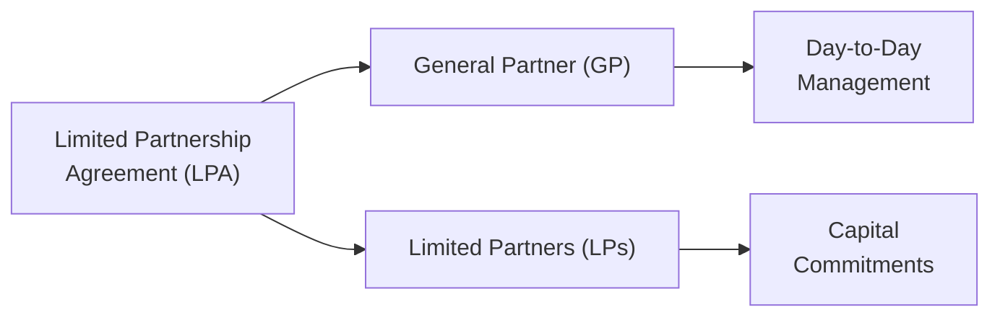

## Introduction

I remember the first time I got my hands on a Limited Partnership Agreement (LPA). It was the size of a small phone book (yes, those used to exist!), and I thought, “Wow, this is intense. Let’s see what’s actually in here.” Over time, I've realized that while LPAs can seem overwhelming, they are essentially the rulebook for everyone involved in a private investment fund. They define who gets to do what, how the money moves around, and—perhaps most importantly—what happens when things don’t go according to plan.

In this article, we’ll examine the key components of an LPA, including its lifespan, governance provisions, economics, and protective clauses. We’ll also look at the interplay between General Partners (GPs) and Limited Partners (LPs), highlight best practices, and discuss how these agreements can shape the day-to-day operations and long-term outlook of private funds. Let’s jump right in.

## Overview of the Limited Partnership Structure

A Limited Partnership (LP) is a popular legal structure used by many private equity and alternative investment funds. It usually consists of:

• A General Partner (GP): The individual or entity responsible for managing the fund’s investments and overseeing daily operations.  
• Limited Partners (LPs): The investors who commit capital to the fund but do not actively manage it.  

The following diagram gives a high-level view of how the LPA typically formalizes these roles and responsibilities:

Under this framework, the LPA spells out the “dos and don’ts”—such as how decisions get made and under what circumstances the GP might be replaced. Some folks like to think of the LPA as a blueprint for a business venture. But given the financial stakes involved, plus the long-term horizon of many private equity funds, it’s more akin to a prenuptial agreement with a detailed code of conduct.

## Key Components of an LPA

### Fund Objectives and Strategy

Right off the bat, an LPA states the fund’s objectives—things like whether it aims to invest in growth-stage tech companies, distressed real estate, or renewable energy providers. The exact language usually includes any restrictions on the types of securities or geographic regions in which the fund can invest. Clarity here ensures LPs know what they’re getting into and helps the GP remain focused on the mandate.

### Lifespan, Extensions, and Termination

Private funds typically have a finite life—often 10 years plus possible one- or two-year extensions. The LPA will outline:  
• The initial term.  
• The process for extending the term (e.g., requiring approval from the LP Advisory Committee).  
• Any provisions for early termination, whether driven by LPs in extraordinary circumstances or triggered by a “key person event.”  

Key Person Clause is a biggie. It steps in if crucial individuals steering the fund depart or can’t fulfill their duties. You can think of it like an emergency brake, enabling LPs to pause or even wind up the fund if the star manager is gone.

### Governance and Decision-Making

Governance terms might outline:  

• Voting rights: how many LPs or what proportion of committed capital must approve changes.  
• Advisory committees: groups of LP representatives who help the GP navigate conflicts of interest or investment deadlocks.  
• Protective provisions for the GP: ensuring that strategic changes (e.g., a different investment strategy) require higher-level approvals.

Sometimes, these governance terms also cover topics like management succession. After all, if the entire investment committee unexpectedly leaves, the remaining staff might not have the expertise LPs originally signed up for.

### Economic Arrangements: Management Fees and Carried Interest

The economics section of the LPA is often the first place that new LPs flip to, and for good reason—this is where the money talk happens.  

• Management Fees: Usually a percentage of committed capital during the investment period (often 1.5%–2%), then shifting to invested capital or net asset value for the remaining fund life. These fees keep the lights on—covering salaries, research, and overhead.  

• Carried Interest: The GP’s performance-based compensation. Often 20% of the fund’s profits after returning LPs’ capital plus a certain preferred return (e.g., 8%). Once the investments are exited and the fund realizes gains, the carry flows to the GP, subject to detailed distribution rules known as the “waterfall.”  

A typical simplified formula for carried interest might look like this:


\text{Carried Interest} = 20\% \times (\text{Realized Gains} - \text{Preferred Return Threshold})


Though in reality, there are nuances and advanced calculations based on net investment gains, management fees offset, and more. Carried interest ensures GPs have skin in the game.

### Distribution Waterfall and LP Returns

The distribution waterfall is how proceeds get divvied up. Often, the LPA lists a waterfall sequence something like:

1. Return of Capital: LPs get their initial capital back.  
2. Preferred Return (Hurdle Rate): LPs receive a set percentage (e.g., 8%) before the GP sees a share of the profits.  
3. Catch-Up Provision: Once the hurdle is met, the GP may get a larger portion (e.g., 80%) of subsequent distributions until it’s “caught up” to a certain ratio.  
4. Carried Interest: After the GP catch-up, future profits typically flow 80% to LPs and 20% to GP.  

This structure hopefully rewards the GP for stellar performance, while ensuring LPs get first dibs on capital distributions.

### Clawback Provisions

The possibility that some early investments might do well but later ones flop is the reason LPAs often include clawback provisions. A clawback ensures that if the GP has already received carry but the fund’s overall performance later dips below the preferred return threshold, the GP must pay back some or all of that carry. It's basically a promise from the GP that, in the long run, they won’t walk away with excessive compensation that never aligns with the final fund performance. If you ask me, that’s just plain courtesy—but it’s also essential to keep everyone’s interests aligned.

### Management and Ownership Protections

These protective provisions govern GP ownership changes or management restrictiveness. For instance, if a GP’s parent company is acquired, the LPA might allow LPs to exit or freeze new investments. This aligns well with the principle that LPs invest not just in a strategy but in a team.

### Transfer of Interests and Confidentiality

LPAs define whether an LP can sell or transfer its interest to someone else (i.e., a secondary sale). Often, transfers require GP approval to keep the partnership from being overrun by unknown investors. Additionally, confidentiality clauses protect sensitive fund data—like portfolio holdings, performance metrics, and so forth.

### Indemnification

In many jurisdictions, the LPA includes indemnification clauses that shield the GP from certain legal liabilities, provided they acted in good faith and within the scope of their authority. This doesn’t mean GPs get a free pass to misbehave, but it does reflect the risk GPs undertake in managing the fund. If a GP faces a lawsuit for decisions made on behalf of the fund, the fund itself typically covers the legal defense.

## Negotiation of LPA Terms

When an LPA is in draft form, LPs and their counsel will often negotiate with the GP to refine terms. A few negotiation hotspots:

• Fees: A large investor might press for a customized fee schedule or a reduction in management fees after a certain investment period.  
• Carried Interest Splits: Early-stage funds sometimes offer a more attractive carry split to draw in anchor investors.  
• Governance and Removal Rights: Big LPs might push for the ability to remove the GP without cause.  
• Side Letters: These formal agreements, separate from the LPA, tailor specific terms for a particular LP.  

Honestly, I’ve seen folks get so deep into negotiating LPA details that they were still revising footnotes a day before the final closing. But at the end of the day, clarity and alignment matter far more than flair.

## Best Practices and ILPA Principles

The Institutional Limited Partners Association (ILPA) publishes best practices that encourage transparency and fair terms. ILPA’s guidelines suggest that LPAs:

• Clearly disclose all fees and expenses.  
• Avoid ambiguous language around key person clauses, governance, and reporting.  
• Provide robust disclosure of potential conflicts of interest and how to resolve them.  
• Balance alignment so that neither the GP nor the LP is inappropriately disadvantaged.  

Many GPs aim to follow these recommendations, as it helps foster trust with large institutional investors who are well-versed in the ILPA Principles.

## Real-World Example

Let’s say you have an early-stage venture capital fund, Fund ABC, raising $100 million. The LPA might specify:

• 2% management fee on committed capital for the first five years.  
• 20% carried interest with an 8% hurdle rate.  
• 10-year term with two optional one-year extensions.  
• Key person clause covering the two managing partners.  
• A standard clawback provision activated at fund termination if the final IRR is below 8%.  

Imagine in year seven, one of the key partners departs for a competitor. The LPA might say the fund is paused—no new investments—until a replacement is found and approved by the LP Advisory Committee. If the committee doesn’t approve the new manager, the fund might be forced into wind-down. That’s real power, and it’s all spelled out in black and white, thanks to the LPA.

## Exam Tips and Pitfalls

• For exam-type questions, make sure you can explain how clawback provisions affect the GP’s net carry across the entire life of the fund.  
• Understand the typical distribution waterfall (return of capital → preferred return → catch-up → split). If you see a numeric item-set question on the distribution of proceeds, carefully track each step.  
• Always watch for special clauses that can be triggered by key person events or changes in fund ownership.  
• Remember that the removal of a GP can be “for cause” or “without cause,” each with different requirements.  
• When it comes to ILPA, be familiar with how their principles can shape negotiation. They might pop up in an ethics or governance question.

## References for Further Study

• Institutional Limited Partners Association – “ILPA Principles”  
  (https://ilpa.org/)  
• John Gilligan and Mike Wright – “Private Equity Demystified”  
• CFA Institute – Publications on private equity and alternative investments  
• If you’re keen to dig into real-life LPA samples, some state pension plans post them publicly for transparency reasons. It’s worth a look for real-world insights.

--------------------------------------------------------------------------------

## Test Your Knowledge: Limited Partnership Agreements Essentials



### Which of the following best describes a Limited Partnership Agreement (LPA)?  
- [ ] A short memo focusing only on tax treatments in private markets  
- [x] A comprehensive legal document governing fund operations, economics, and governance  
- [ ] A standard disclosure form required by regulators for all mutual funds  
- [ ] An informal side letter exchanged only between the GPs and certain anchor investors  

> **Explanation:** An LPA is a foundational legal agreement outlining key aspects of the fund’s governance, fee structures, and overall framework, distinguishing it from brief memos, mutual fund disclosures, or selective side letters.

### A typical distribution waterfall often starts by returning which amount to the LPs first?  
- [x] The LPs’ contributed capital  
- [ ] The GP’s share of carried interest  
- [ ] A catch-up payment to the GP  
- [ ] The management fee reimbursement  

> **Explanation:** Most waterfalls start by ensuring LPs receive their original investment. The next steps generally include the preferred return, the GP catch-up if applicable, and then the split of remaining profits.

### What is a key purpose of the clawback provision in an LPA?  
- [ ] Ensuring that the GP pre-pays management fees before LP commitments  
- [ ] Protecting the GP from lawsuits filed by LPs  
- [x] Requiring the GP to return previously distributed carry if final returns fall short of thresholds  
- [ ] Maintaining confidentiality around fund investments  

> **Explanation:** A clawback provision obligates the GP to refund carry if final performance doesn’t meet the agreed hurdle, keeping the GP’s compensation aligned with long-term results.

### Which scenario might trigger a key person clause in an LPA?  
- [ ] The GP books a profit higher than originally forecast  
- [ ] The LP invests in more than one private fund at a time  
- [x] An essential manager leaves the firm or can no longer fulfill their role  
- [ ] The GP decides to change the fund’s name  

> **Explanation:** Key person clauses typically activate when essential personnel are lost, prompting the partnership to address leadership changes or potentially pause investing until a suitable replacement is found.

### Which of the following statements about ILPA Principles is most accurate?  
- [ ] They only apply to real estate funds in Europe.  
- [x] They offer standardized guidelines promoting transparency and fair dealings between GPs and LPs.  
- [ ] They strictly prohibit any use of management fees.  
- [ ] They are mandatory regulations enforced by the SEC.  

> **Explanation:** ILPA Principles provide guidance to increase transparency and alignment between GPs and LPs, but they aren’t enforced by regulators and don’t ban common fee structures.

### In a typical LPA, the term “Distributions” refers to:  
- [ ] A mandatory annuity payment to each LP after the first year  
- [ ] Management fees used for fund overhead  
- [x] Cash or securities returned to LPs from the sale of underlying investments  
- [ ] Non-cash items included in side letters  

> **Explanation:** “Distributions” normally mean the proceeds returned to LPs when the fund sells portfolio companies or realizes profits on its investments.

### What is a best practice when negotiating special LPA terms with large investors?  
- [x] Use side letters that don’t contradict the main LPA and disclose them appropriately  
- [ ] Eliminate the concept of carried interest from the entire fund  
- [ ] Refuse any negotiation to maintain uniformity among LPs  
- [ ] Extend the fund’s life indefinitely to avoid conflicts  

> **Explanation:** Side letters let GPs offer large LPs certain tailored benefits, provided these arrangements don’t conflict with the main LPA or compromise other investors’ rights.

### Under what circumstances might an LPA allow for the removal of the GP?  
- [x] Upon a supermajority vote of LPs—for cause or even without cause in some agreements  
- [ ] Only if the GP requests it voluntarily  
- [ ] Automatically if a single LP demands it  
- [ ] Immediately after the first capital call  

> **Explanation:** Some LPAs permit GP removal by a specified majority of LPs either “for cause” (e.g., negligence) or in less common cases even “without cause” given certain thresholds.

### Which clause in an LPA typically guards confidentiality around fund performance data and underlying investments?  
- [ ] Key Person Clause  
- [x] Confidentiality Clause  
- [ ] Preferred Return Clause  
- [ ] Clawback Provision  

> **Explanation:** The confidentiality clause restricts disclosure of sensitive operational and performance details, ensuring non-public fund information remains private.

### True or False: The GP rarely agrees to indemnify the fund against misconduct claims.  
- [ ] True  
- [x] False  

> **Explanation:** LPAs often contain indemnification clauses protecting the GP who acts in good faith within the scope of the fund’s mandate. This doesn’t safeguard reckless or criminal behavior, but it does shield the GP in normal decision-making scenarios.


