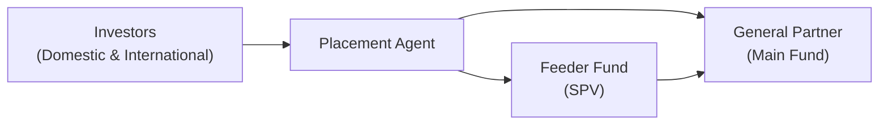

## Big-Picture Context

Picture this: you’re a General Partner (GP) at a small, up-and-coming private equity fund. You’ve got a decent performance record, but you need more capital to scale that next big acquisition strategy. Hunting down investors all by yourself might be—well—tricky and time-consuming, especially if you’re also juggling deal sourcing, due diligence, and a lot of coffee meetings. That’s where placement agents and feeder funds can (hopefully) swoop in to save the day.  

In private markets, fundraising is not just about picking up the phone and calling a couple of high-net-worth contacts. It’s a specialized process involving multiple moving parts—marketing, regulatory compliance, cross-border intricacies, you name it. Placement agents act as well-connected intermediaries to help GPs reach a broader investor base. Meanwhile, feeder funds exist to pool capital from various investor segments and funnel those commitments into a main fund. This step might seem obvious once you’ve been around the block a few times, but for many emerging fund managers and new Limited Partners (LPs), it can be a revelation.  

Below, we’ll explore how these key players operate, how they get paid, what potential conflicts of interest to watch out for, and why you might lean on them for cross-border or specialized fundraising. We’ll also incorporate some best practices drawn from real-world experiences—both successes and faceplants—to illustrate the benefits and risks.  

## The Many Hats of Placement Agents

### What They Do

A placement agent is essentially a capital-raising specialist hired by the GP to market a private fund. Think of them as a boutique marketing firm with deep industry connections and their own “little black book” of institutional and accredited investors worldwide. Their tasks might include:  

- Developing or polishing the fund pitch deck (the marketing materials)  
- Introductions to family offices, pension funds, endowments, high-net-worth individuals, or even specialized feeder funds  
- Coaching GPs on how to spin the story (in a compliant manner, of course)  
- Setting up roadshows or one-on-one investor meetings  
- Organizing data rooms for due diligence, and making sure the dreaded Q&A process runs smoothly  

From an operational perspective, these agents pull levers in marketing, compliance, and relationship management to get the fund in front of the right audience. In many ways, the placement agent’s reputation is everything. A strong track record with previous fundraises can open doors to new or repeat investors quickly. If your fund is fairly new, partnering with a respected agent could put you on the radar of large institutional LPs faster than going it alone.  

### Compensation Models

Usually, placement agents get paid in two steps. First, there might be a retainer set as a monthly or quarterly fee while they gear up your materials, schedule your pitch meetings, and generally run the show. Second, there’s the placement fee—often expressed as a percentage of the capital raised. A typical arrangement might look something like:

- Retainer: US$5,000 to US$25,000 per month (or more, depending on the scope and the agent’s stature).  
- Placement fee: 1% to 2% of total capital raised (though this varies widely and can sometimes exceed 2% for smaller funds).  

If you’re curious, a short example might be:

Let’s say a GP engages a placement agent to raise US$100 million. The agent’s placement fee is 1.5%. Once the fund closes with the full US$100 million, the total success fee is:


\text{Placement Fee} = 100{,}000{,}000 \times 0.015 = \$1.5 million.


On top of that, the GP may have paid a monthly retainer for six months prior to closing—say US$10,000 per month. That adds another US$60,000 to the total. So the combined outlay is US$1.56 million.

The retainer plus percentage structure is fairly standard, but GPs should definitely read the fine print. For instance, if you already have relationships that yield substantial commitments before the agent even picks up the phone, you’d want to establish carve-outs to avoid paying fees on that capital.

### Value-Add Beyond Fundraising

Placement agents aren’t just about hitting up their contact list. They can also serve as an advisory arm, refining your fund strategy and highlighting potential pitfalls. Some GPs enlist these agents early to position the fund more compellingly to institutional LPs—maybe pinpointing the hot theme in your region or refining your unique selling proposition (USP).  

In cross-border deals, they also guide you through local regulatory quagmires—especially in jurisdictions with intense capital-raising restrictions or licensing requirements. A well-networked agent might be the difference between a swift, efficient marketing campaign and a drawn-out slog.

### Potential Conflicts of Interest

It’s important to note that some agents represent multiple funds at once. If they’re working for several GPs all pitching to the same investor pool, you’ve got a potential conflict: how do you ensure they devote sufficient resources to your fund?  

Moreover, there have been historical controversies: certain agents have been accused of “pay-to-play” arrangements, where public pension officials were bribed with either political contributions or other forms of graft to influence investment decisions. That’s obviously a big no-no per the CFA Institute Code of Ethics and Standards of Professional Conduct. Thorough due diligence on your prospective placement agent is essential to avoid reputational and ethical pitfalls.

## Feeder Funds: Structuring Solutions

### Definitions and Core Purpose

A feeder fund is basically a special-purpose vehicle that gathers commitments from a distinct group of investors—maybe smaller institutions or individuals—then channels that pooled capital into a main fund. An investor committing to the feeder effectively invests indirectly in the underlying main fund.  

Why do we need such a middleman vehicle? Well, not all LPs can invest directly in a main fund. Some might face minimum commitment sizes that are too large for them individually. Others might have special regulatory or currency constraints, or require certain local tax treatments. Feeder funds centralize and streamline these complexities, enabling more investors to participate.  

### Feeder Fund Structures

Typical scenarios for feeder vehicles include:

- Geographical segmentation (e.g., a Latin America feeder, a European feeder, and an Asia-Pacific feeder)  
- Investor type segmentation (e.g., one vehicle for high-net-worth individuals, another for small family offices)  
- Accredited vs. non-accredited segmentation (or different regulatory brackets)  
- Currency or local tax preference (e.g., a euro-denominated feeder for European investors)  

In many cases, these vehicles allow GPs to provide a “one size fits all” solution. Meanwhile, each feeder is set up under the relevant local or offshore jurisdiction. That might be the Cayman Islands, Luxembourg, Delaware, or wherever suits the group’s regulatory comfort zone.

### Cross-Border and Regulatory Benefits

Feeder funds can help smaller LPs overcome barriers such as language, currency mismatch, or complicated cross-border regulations. For instance, if your main fund is denominated in US dollars but you’ve got a cluster of eurozone investors, a euro feeder might handle currency conversions en masse, so each LP doesn’t need to figure out foreign exchange hedging individually.  

Likewise, certain investors prefer not to be direct partners in a US-based limited partnership for fear of direct US tax filing obligations. An offshore feeder might remedy those headaches by offering a flow-through structure from a jurisdiction more aligned with the investors’ home country.  

### Investor Accessibility and Compliance

A typical feeder arrangement lowers the minimum check size for prospective LPs. By pooling multiple smaller commitments, the feeder fund meets the GP’s aggregated minimum and invests it in the main fund. This is huge for building a broader capital base.  

Additionally, advanced compliance features can be embedded directly in the feeder. For instance, if certain categories of investors require more stringent anti-money laundering (AML) or know-your-customer (KYC) processes, the feeder’s administrators handle it, instead of burdening the main fund’s administrators with multiple layers of compliance.  

## Interplay Between Placement Agents and Feeder Funds

Sometimes, placement agents themselves might arrange feeders, especially if they cater to a niche group of investors. This synergy can be illustrated in a simple flowchart:

- A (Investors) might have capital but limited knowledge or access.
- B (Placement Agent) coordinates marketing, organizes investor groups.
- D (Feeder Fund) aggregates capital from smaller or specialized pools.
- C (Main Fund) receives the combined capital from both direct LPs and feeder vehicles.

## Personal Story: The Early Mistakes

I once worked with a boutique fund manager—let’s call them “Harbor Investments.” They had a strong strategy in real estate development but were brand-new to the capital-raising circuit. Their internal team tried to go direct, spending months pitching small family offices one by one. It was exhausting, and the fund was barely at 20% of its US$50 million target by the six-month mark.  

Finally, they hired a seasoned placement agent. That agent quickly introduced them to a feeder fund specifically designed for global diaspora investors interested in real estate. Within 90 days, the feeder had raised nearly US$25 million. The difference was night and day. Needless to say, next time around, Harbor Investments started the process with known placement agents from day one.  

## Potential Pitfalls to Avoid

- Overpaying Fees: Some GPs just see the quoted success fee and sign. You should absolutely confirm how that fee is calculated, where carve-outs apply, and what monthly retainers do (or do not) include.  
- Dilution of GP Control: Feeder fund operations could happen slightly outside the GP’s day-to-day purview, especially if there’s a designated feeder sponsor. Make sure the alignment of interests is rock-solid.  
- Regulatory Surprises: Using an unregistered agent in certain jurisdictions can land you in trouble. Always verify that your placement agent is properly licensed where needed.  
- Conflicts of Interest: If a feeder is owned or controlled by an entity with conflicting interests, or if your agent is marketing multiple funds concurrently, you need to ensure fair representation.  

## Best Practices and Professional Standards

Per the CFA Institute’s codes on third-party marketing, especially for private funds, any potential conflict must be disclosed clearly to investors. Ethical guidelines demand transparency in fee arrangements—both with the GP and the investor.

1. Clear Disclosure to Prospective LPs  
   - Let them know if you’re using a placement agent, how fees are structured, and if those fees might indirectly affect net returns.  

2. Thorough Vetting of Placement Agents  
   - Track record, references, prior ethical or regulatory issues—everything should be on the table.  

3. Feeder Fund Due Diligence  
   - GPs must ensure the feeder’s sponsor (the entity running the feeder) meets compliance obligations. Also, confirm that investor-level KYC/AML checks won’t come back to haunt you.  

4. Alignment of Incentives  
   - For feeder sponsors, be crystal clear about fee-sharing arrangements, governance protocols, and any unique investor demands (such as side letters with additional redemption rights).

## Practical Financial Example: Fee Negotiations

Let’s say your target to raise is US$200 million. You consider a placement agent proposing:

- A retainer of US$15,000/month for 12 months.  
- A 1.5% placement fee on all new capital introduced by the agent (no carve-outs).  

You suspect you might bring in US$80 million from existing relationships. If that’s the case, you’d prefer not to pay the 1.5% on capital you’d have raised anyway. In negotiations, you might say: “We’ll pay 1.5% only on the net new capital you source above US$80 million. If we exceed the overall target, then we’ll share a small bonus.”  

Alternatively, if you want them fully aligned with hitting your big number, you could, for instance, build in incremental milestone bonuses—an extra 0.5% if total new capital from the agent surpasses US$60 million, for example.  

Even though these “bonus arrangements” sometimes raise eyebrows, they can motivate top-tier agents to go the extra mile. After all, you need to ensure you’re not overpaying for capital that would have walked in the door anyway.

## Cross-Border Access and Global Marketing

Many GPs want to expand their investor base beyond their home turf. Placement agents with specific regional expertise can be instrumental. For example, a U.S.-based GP might bring onboard a European placement agent to navigate the EU’s Alternative Investment Fund Managers Directive (AIFMD) regime, or to manage marketing compliance in multiple member states.  

Feeder funds play a critical role here as well, as they can reduce or simplify the complex local regulatory burdens for non-U.S. investors. A single feeder can act as the aggregator under an offshore structure, letting the GP focus on deal selection and portfolio operations instead of investor-by-investor compliance.  

## Exam Tips and Integration

For exam scenarios—whether at the advanced or foundational level—consider how a test question might require you to:  

- Evaluate a GP’s use of a placement agent for a new private equity offering.  
- Identify potential conflicts of interest related to placement fees or overlapping relationships.  
- Propose a feeder fund structure that accommodates specific regulatory, currency, or investor-type restrictions.  
- Assess how to cost-effectively align the agent’s incentives with the GP’s fundraising goals.  

The exam might give you a hypothetical capital structure, ask you to compute fees or returns net of the agent’s compensation, or highlight the ethical repercussions of inadequate disclosure. You’ll want to keep an eye out for these red flags to ensure compliance with the CFA Institute’s Standards of Professional Conduct on matters of duty to clients, conflicts of interest, and diligence.

## Further Reading and References

If you’re looking to dig deeper:

- “Placement Agents and Fundraising Strategies” – Preqin articles  
- “Feeder Fund Structures in Private Equity” by Ernst & Young  
- CFA Institute’s codes on third-party marketing and conflicts of interest  
- Chapter 2 (Alternative Investment Performance and Returns) in this same volume for how fees ultimately affect net returns.  
- Chapter 8 (Professional Skills and Best Practices) for broader ethical considerations and best practices in client communications.  

Placement agents and feeder funds can be vital catalysts for scale and efficiency in private markets. Just remember: Earning strong returns is only part of the game if you can’t effectively raise capital. With the right approach, though, these external relationships can power your fund to new heights—provided you manage conflicts, fees, and compliance with a keen eye.

---

## Test Your Knowledge: Placement Agents and Feeder Funds Essentials



### A placement agent primarily does which of the following for a General Partner (GP)?

- [x] Markets the GP’s private fund to prospective investors worldwide.
- [ ] Serves as the fund's regulatory oversight body.
- [ ] Directly manages the operational aspects of portfolio companies.
- [ ] Acts as a custodian for investor assets.

> **Explanation:** Placement agents specialize in marketing and facilitating relationships between GPs and prospective investors. They do not typically manage the fund’s operations or serve as the fund’s regulator or custodian.

### Which of the following best describes a feeder fund?

- [x] A vehicle that aggregates capital from multiple investors into a main fund.
- [ ] A short-term lending facility for GPs in need of liquidity.
- [ ] A hedge fund strategy focused on arbitrage.
- [ ] A regulatory authority that supervises capital-raising activities.

> **Explanation:** A feeder fund is created to pool commitments from smaller or specialized investor groups and invest the combined capital into the main fund.

### In a typical placement agent compensation arrangement, the fee structure includes:

- [x] A retainer and a success fee (placement fee).
- [ ] A lockup fee and an incentive distribution.
- [ ] Only an upfront lump-sum payment.
- [ ] No fees until final fund liquidation.

> **Explanation:** Most placement agent agreements involve a monthly/quarterly retainer plus a success-based placement fee (a percentage of new capital raised).

### What is a common reason a GP might choose to set up multiple feeder funds?

- [x] To cater to different investor jurisdictions, currencies, or regulatory requirements.
- [ ] To inflate the apparent size of the fund artificially.
- [ ] To avoid all compliance reporting obligations.
- [ ] To reduce the overall number of investors.

> **Explanation:** Multiple feeder funds can help tailor structures to specific regulatory and currency requirements across diverse investor bases.

### One potential conflict of interest with placement agents arises when:

- [x] The agent markets multiple funds simultaneously to the same investor base.
- [ ] The agent only works with a single GP at a time.
- [ ] The agent receives no compensation whatsoever.
- [ ] The agent invests personal capital alongside the GP.

> **Explanation:** Marketing multiple funds at once can lead to resource allocation and prioritization conflicts. The agent may prioritize certain funds over others, creating potential issues for GPs.

### Why might a smaller investor prefer to invest via a feeder fund?

- [x] It allows them to gain exposure to a larger main fund despite lower individual capital commitments.
- [ ] It eliminates all fees associated with investing in the main fund.
- [ ] It guarantees that they will achieve higher returns than direct investors.
- [ ] It exempts them from due diligence processes.

> **Explanation:** Feeder funds allow smaller investors to pool resources and meet the minimum investment thresholds required by many main funds. They do not eliminate fees, nor do they guarantee higher returns.

### In cross-border fundraising, a key advantage of using a feeder fund is:

- [x] It can simplify currency conversion and tax treatments for non-domestic investors.
- [ ] It eliminates the need for a placement agent entirely.
- [ ] It automatically qualifies all foreign investors as accredited.
- [ ] It provides an unlimited guarantee against currency losses.

> **Explanation:** Feeder funds can handle currency-matching, tax structuring, and local legal requirements, making it easier for non-domestic investors to commit capital. However, they do not replace placement agents, nor do they guarantee accreditation or currency gains.

### When negotiating fees with a placement agent, GPs commonly seek:

- [x] Carve-outs for capital raised independently of the agent.
- [ ] To pay a higher percentage on committed capital than on called capital.
- [ ] To pay success fees prior to any capital being raised.
- [ ] To remove monthly retainers entirely.

> **Explanation:** GPs often want to exempt capital commitments they bring themselves, so they don’t pay fees for funds the agent didn't source. This is known as a carve-out.

### Which of the following is a best practice for avoiding regulatory issues with placement agents?

- [x] Confirm that the placement agent is registered or authorized to solicit investments in each relevant jurisdiction.
- [ ] Keep fee disclosures confidential to avoid investor confusion.
- [ ] Request that the agent waive any KYC requirements.
- [ ] Require the agent to only approach high-frequency trading firms.

> **Explanation:** Verifying the agent’s regulatory status and ensuring compliance with marketing laws in each jurisdiction are essential steps. Transparency in fees and consistent KYC processes are also critical.

### Using multiple feeder funds can be most effective when:

- [x] Each feeder fund structure addresses unique investor constraints, such as taxation or currency.
- [ ] The GP wants to inflate reported assets under management by double-counting investors.
- [ ] The GP seeks to bypass local anti-money laundering regulations.
- [ ] The GP aims to avoid all regulatory oversight globally.

> **Explanation:** Having multiple feeders is often a strategic move to separately meet the regulatory, currency, and tax requirements of different investor segments.


