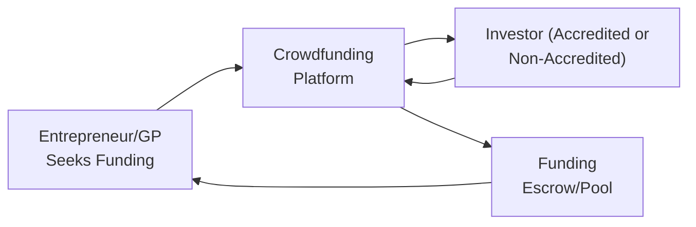

## Overview

Crowdfunding is quite the buzzword these days. We’ve all heard those “overnight success” stories: the smartphone accessory that blew up on a rewards-based site, the new local restaurant that nabbed enough micro-contributions to finally open its doors, or the tech startup that allowed hundreds of small investors to own a slice of the business through an equity crowdfunding platform. But behind all that excitement lies a structured, rapidly evolving segment of the private markets, governed by compliance obligations, platform-specific due diligence, and a mind-boggling variety of investor protections that differ from place to place.

So, what’s the real story behind crowdfunding platforms? And where do they fit into the broader alternative investments framework? In this chapter segment, we dive right into the nitty-gritty of crowdfunding and online capital platforms—discussing everything from how they work and what they promise entrepreneurs and investors, to the potential pitfalls, strategic considerations, and best practices to keep in mind.

## Crowdfunding in Private Markets

Crowdfunding connects entrepreneurs, company founders, or sometimes professional private market sponsors (often referred to as general partners, or GPs) with a vast base of potential investors. Instead of seeking one large capital block from, say, a venture capital or private equity (PE) fund, these issuers raise smaller amounts from a large number of individuals via online platforms. This democratization of access can be especially powerful for emerging companies, niche ventures, and early-stage innovators looking to attract capital outside standard institutional channels.

Traditionally, if you wanted in on, say, a seed-level venture deal, you had to be an accredited investor or an institution well-connected to angel networks or specialized funds. Now, certain jurisdictions permit non-accredited investors to participate (some within carefully imposed caps). The bottom line? A broader set of investment opportunities for individuals, but also a new array of risk and regulatory concerns.

## Types of Crowdfunding

Crowdfunding can take many forms. A quick glance at the market reveals four major models:

• Equity Crowdfunding: Investors obtain ownership stakes in the company (or other entities) in return for their contribution.  
• Debt-Based Crowdfunding (sometimes called peer-to-peer lending): Investors lend money in exchange for interest payments.  
• Reward-Based Crowdfunding: Contributors donate or pre-purchase a product or service, often at a discount (less relevant for typical private equity deals, but part of the overall crowdfunding ecosystem).  
• Donation-Based Crowdfunding: Philanthropic or purely altruistic contributions with no tangible reward besides a “thank you” or project updates.

Our primary focus here is on equity crowdfunding (and to some extent debt-based platforms) since these speak directly to private market fundraising. This is where smaller investors can effectively behave like micro-VCs or micro-creditors—though typically without the same level of professional experience or institutional-grade research.

## Regulatory Landscape

Crowdfunding rules can vary dramatically across global markets. If you’re in the United States, for example, Regulation Crowdfunding (often called Reg CF) under the JOBS Act sets very specific annual caps on how much a non-accredited investor can invest. Other frameworks, like Regulation A+ or certain exemptions under Regulation D, offer different ways to crowdfund while complying with the Securities and Exchange Commission (SEC) guidelines.

Meanwhile, in the UK, equity crowdfunding is often facilitated through the Financial Conduct Authority’s (FCA) operating guidelines. Some countries allow all citizens to invest regardless of accreditation status, subject to certain project or platform-level rules. Others enforce tight controls on the maximum number of investors. The bottom line for prospective GPs? Understand that the administrative burden can be higher, and the compliance tasks potentially more complex, than with a single or small set of institutional investors.

## Equity Crowdfunding Models

Equity crowdfunding typically involves an online platform serving both companies looking to raise money and potential investors seeking new opportunities. Let’s illustrate a simplified process flow:

• The company or entrepreneur connects with the platform, prepares materials (pitch deck, financial projections, disclaimers, etc.).  
• Investors browse offerings, read up on risk factors, and decide where to place their funds.  
• Once the fundraising target is reached (or as capital accumulates in stages), the platform helps finalize legal documents and funnel the capital to the entrepreneur.  
• In exchange, investors (in an equity model) receive shares or some form of ownership stake.

If we compare this to a typical private equity raise, the difference is the volume and diversity of investors. Instead of a few sophisticated LPs, crowdfunding can incorporate hundreds or thousands of small-ticket investors, each reading a summarized pitch on a web portal. That can mean lower average investment sizes, but it can also create powerful marketing momentum—especially if the crowd sees synergy with the product or mission.

## Platform Features and Investor Protections

Crowdfunding platforms can differ wildly in terms of:

• Investor Protections: Some jurisdictions require an intermediary escrow, mandatory disclaimers of risk, or a formal process to verify investor suitability. Others have lighter frameworks.  
• Due Diligence: Certain platforms pride themselves on vetting deals, providing advanced analytics, and ongoing reporting tools. Others are more “list-only,” leaving most diligence to investors.  
• Post-Funding Support: Platforms may offer marketing campaigns, publicity pushes, or even guides for the newly funded venture on governance or growth strategies.  
• Fee Structures: Typically, a success-based commission is charged to the issuer, and sometimes a small transaction fee is levied on investors.

In many platforms, compliance with “anti-money laundering” and “know your customer” (KYC) regulations is paramount. These protocols typically involve verifying the identity of each investor and ensuring the source of funds is legitimate.

## Advantages and Challenges for GPs

If you’re a general partner (GP) or sponsor, you might consider crowdfunding to access retail capital. Let’s be honest, it can be quite exciting to bring a diverse investor base along for the ride. But it’s not all sunshine and roses:

Advantages:  
• Potentially tapping a larger pool of capital while making your brand more visible to the general public.  
• Creating a loyalty effect: many small investors become natural ambassadors or early adopters of the product or service they’ve funded.  
• Showcasing your project to a “crowd” can validate your market concept or highlight consumer demand.

Challenges:  
• You’ll likely face additional compliance steps. If you have 500 or 1,000 micro-LPs scattered worldwide, you must handle more frequent communications and investor updates.  
• Many legal obligations kick in, such as accredited investor checks, SEC or local security regulator filings, and abiding by strict marketing rules regarding forward-looking statements.  
• The administrative overhead is real. Managing a large pool of small investors can require cutting-edge investor relations (IR) technology, thorough record-keeping, and the ability to respond promptly to investor queries.

## Personal Anecdote: The retail capital jigsaw puzzle

I remember a colleague who launched an online craft marketplace and decided to crowdfund the project’s next growth phase. At first, she was amazed at how quickly small investors jumped on board. The local press latched onto the “crowd spirit,” headlines generated buzz, and more folks signed up. But as the round progressed, the operational complexity grew, too. She had to answer daily queries from prospective or new investors, coordinate with the platform’s compliance team on disclaimers, and keep track of each subscription. Ultimately, it was successful—but not exactly the “push-button-and-go” moment she’d initially envisioned.

## Due Diligence from an Investor’s Perspective

If you’re on the investor side, remember that crowdfunding deals can sometimes result in partial or even total loss of capital, particularly at the early-stage. So, do your homework:

• Business Model: Understand the fundamental assumptions behind the company’s growth strategy.  
• Valuation: Early-stage deals can be subject to inflated valuations that might not reflect realistic revenue or market share.  
• Management Team: Does the team have relevant expertise? Are they transparent about their operational plan?  
• Platform Reputation: Has the platform historically had many successful fundraises? Do they conduct any screening of projects?  
• Risk and Liquidity: Exits can be uncertain. Liquidity events—like a merger, acquisition, or public listing—are by no means guaranteed.

In an ideal world, platforms detail these risks clearly, but quite a few only provide broad disclaimers. Investors should proceed with caution, especially if they’re used to more regulated environments (like public equities).

## Integration with Traditional Private Funding Sources

In certain market settings, crowdfunding complements more established forms of private fundraising. You might see “hybrid” deals where a venture capital firm anchors a seed or Series A round, and then the founders open a portion of the round to the crowd. This can help with brand-building or user engagement. Alternatively, some deals remain purely crowdfunded, especially in the arts/entertainment sphere, or in local community-based real estate offerings.

But once again: the regulatory lines can blur. Some countries treat crowdfunded equity raises almost identically to standard private placements, meaning significant compliance. Others define special carve-outs for smaller deals or low annual raise limits. If you’re a sponsor, do your due diligence on the laws of each jurisdiction before launching a cross-border crowdfunding campaign.

## Potential Pitfalls and Considerations

• Overfunding: If a campaign surpasses its minimum target, it suggests higher demand—and that’s great. But oversubscription could lead to complicated cap table expansions, or forced reallocation of membership interests.  
• Inexperienced Investors: Sometimes, the “crowd” invests primarily on marketing hype, ignoring disclaimers. This can lead to unrealistic return expectations. GPs must plan robust communication strategies.  
• Mismatched Time Horizons: Many early-stage businesses need multi-year growth cycles—crowdfunders might want near-term liquidity or some form of yield. Managing these expectations is key.  
• Regulatory Uncertainty: Evolution of regulations (like increased disclosure requirements or changes in accredited investor definitions) can reduce the speed or the freedom of raising capital.

## Best Practices and Risk Mitigation

• Transparent Documentation: Provide a comprehensive business plan, performance milestones, and potential exit pathways.  
• Clear Communication: Use plain language in offering documents. The average crowdfund investor might not have advanced finance knowledge.  
• Cap Table Management: Utilize a nominee or special purpose vehicle structure to keep your official cap table streamlined.  
• Ongoing Updates: GPs should adopt an investor relations portal or system that keeps everyone in the loop. This fosters trust.  
• Regulatory Compliance Upfront: Consult with legal advisors to ensure you abide by all relevant offering limits, marketing restrictions, and ongoing reporting obligations.

## Future Outlook

It seems likely that crowdfunding will continue to gain momentum. There’s a real appetite out there for direct deals and community-based financing. Moreover, advancements in blockchain-based platforms, tokenization of equity or revenue streams, and “smart contract” solutions are already influencing how some forward-thinking GPs approach online capital formation. While these innovations are still emerging, they underscore the drumbeat toward democratized alternative investing.

For the near future, we can expect:  

• More specialized or niche crowdfunding platforms (e.g., green energy, women-led ventures, climate tech).  
• Tighter alignment with environmental, social, and governance (ESG) principles.  
• Enhanced global collaboration among regulators to create consistent investor protections, especially as cross-border deals rise.  
• Robo-advisors or AI-driven tools that help investors pick and choose crowdfunded deals based on their risk profile.

## Exam Tips for CFA® Candidates

• Know your definitions: Accredited/non-accredited investors, the difference between equity vs. reward-based crowdfunding, and typical regulatory constraints.  
• Understand the high-level compliance responsibilities for GPs. On the exam, you might be asked about private placement regulations or how a crowdfunding round fits within broader private equity fundraising.  
• Be able to compare and contrast crowdfunding with traditional PE or VC fundraising structures—particularly fees, governance, and investor composition.  
• Keep risk factors at the forefront. On a scenario-based question, you may need to highlight which parts of a crowdfunded deal structure pose the greatest operational, regulatory, or liquidity risks.  
• Realize that ethics can be tested here. Potential concerns might involve less sophisticated investors, questionable marketing claims, or incomplete disclosures. You should be ready to reference CFA Institute’s Code and Standards on fair dealing and suitability.

## References and Additional Reading

• National Crowdfunding & Fintech Association (NCFA), “Equity Crowdfunding 101.”  
• U.S. Securities and Exchange Commission (SEC), “The JOBS Act and Crowdfunding.” (https://www.sec.gov/)  
• World Bank and OECD, “Global Crowdfunding Trends and Regulation.”  
• “Equity Crowdfunding: Transforming Customers into Loyal Investors,” Journal of Alternative Investments, 2022.

-----------

## Test Your Knowledge: Crowdfunding and Online Capital Platforms



### Under which type of crowdfunding do investors receive an ownership stake in a company?

- [ ] Donation-based crowdfunding  
- [x] Equity crowdfunding  
- [ ] Reward-based crowdfunding  
- [ ] Peer-to-peer lending  

> **Explanation:** In equity crowdfunding, investors acquire shares in the company, constituting an ownership stake.

### What key regulatory aspect often governs how much a non-accredited investor can contribute in equity crowdfunding?

- [ ] Market volatility constraints  
- [ ] Cryptocurrency regulations  
- [x] Caps on individual investment amounts  
- [ ] Anti-trust legislation  

> **Explanation:** Many jurisdictions impose caps on how much a non-accredited investor can invest per year or per opportunity to protect them from excessive risk.

### Which of the following is NOT a typical advantage of crowdfunding for general partners (GPs)?

- [x] Lower administrative burden  
- [ ] Potential brand enhancement from public visibility  
- [ ] Diversified investor base  
- [ ] Ability to tap into retail capital  

> **Explanation:** Crowdfunding typically increases the administrative burden because of the large number of investors and heightened compliance tasks.

### In equity crowdfunding, how is liquidity most likely achieved for an investor?

- [x] Through a future exit event like a merger or acquisition  
- [ ] Via daily secondary market trading  
- [ ] Instant buyback by the company  
- [ ] Non-stop peer-to-peer auctions on the platform  

> **Explanation:** Liquidity in equity crowdfunding generally arises if a larger corporate action occurs (e.g., an acquisition, IPO, or share buyback). Crowdfunding shares are typically locked until such an event.

### Which of these best practices helps maintain a clear share registry when raising capital from many small investors?

- [x] Using a nominee or special purpose vehicle (SPV)  
- [ ] Making each small investor a direct shareholder with voting rights  
- [x] Implementing a digital cap table management system  
- [ ] Restricting updates to investors who contributed above a certain threshold  

> **Explanation:** An SPV or nominee structure pools all the smaller investors under one entity, and a cap table management system ensures the sponsor/GP maintains an accurate record.

### What is one primary reason a crowdfunded company might perform ongoing investor updates?

- [x] To foster transparency and trust among a dispersed investor base  
- [ ] To publicize valuations only for large institutional backers  
- [ ] To repay principal on convertible debt  
- [ ] To meet revenue-based membership interest obligations  

> **Explanation:** Because crowdfunding deals often involve many smaller investors, ongoing communication helps reassure them and maintain trust.

### Which of the following is a major drawback for an investor participating in equity crowdfunding?

- [x] Potential total loss of investment   
- [ ] No possibility of secondary trading  
- [x] Lack of standardization and investor protection across jurisdictions  
- [ ] Guaranteed returns on capital  

> **Explanation:** Crowd investing in early-stage deals has a high chance of capital loss, and varying regulatory standards can further increase the risk.

### From a regulatory perspective, one essential consideration when orchestrating a cross-border crowdfunding campaign is:

- [x] Compliance with each jurisdiction’s securities regulations  
- [ ] Eliminating all KYC processes to simplify funding  
- [ ] Allowing unlimited unverified foreign investors  
- [ ] Guaranteeing immediate liquidity for all participants  

> **Explanation:** Each country has distinct frameworks on securities registration and investor protections; ignoring them can lead to severe legal repercussions.

### How might reward-based crowdfunding differ from equity crowdfunding with respect to investor return?

- [x] Investors in reward-based crowdfunding typically receive products or perks, not an ownership stake  
- [ ] Reward-based investors generally obtain debt claims  
- [ ] Reward-based investors have the same voting privileges as shareholders  
- [ ] Reward-based investors are guaranteed a dividend  

> **Explanation:** Reward-based crowdfunding offers tangible perks or products instead of equity, and no ownership interest is conveyed.

### Crowdfunding can be beneficial to an early-stage venture primarily because:

- [x] True  
- [ ] False  

> **Explanation:** Crowdfunding democratizes access to capital, allowing many smaller investors to participate in raising funds, which can accelerate visibility and growth for an early-stage venture.


