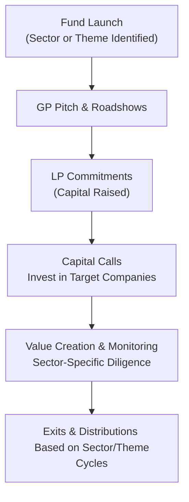

## Introduction
Most private market funds diversify across multiple industries and themes, but not all. Some funds pivot entirely around one over-arching concept—maybe “renewable energy,” “healthtech,” or “consumer goods in emerging markets.” Others drill down to a single sector, such as pharmaceuticals or cybersecurity, leveraging specialized expertise and networks. Both thematic and sector-focused funds can open doors to unique opportunities, but they come with extra layers of complexity in terms of concentration risk, ongoing due diligence, and alignment with macro trends.

In my opinion, thematic investing is sort of a sweet spot when you have a strong conviction in a future trend—like, you’re absolutely convinced that electric vehicles (EVs) will continue to explode in popularity. But, as we’ll explore in this reading, you’ve got to weigh all the angles: regulation, new technologies, the track record of your General Partner (GP), and of course, the question, “What if the theme cools off?”

We’ll break this all down below, from the theoretical underpinnings of thematic investing to the nuts-and-bolts aspects of picking a specialized manager, plus a few personal anecdotes about how I’ve seen these strategies at work in the field. Let’s dig in.

## Defining Thematic vs. Sector-Focused Funds
To set the stage, let’s clarify the difference between a thematic fund and a sector-focused fund:

- Thematic Fund: Concentrates on a broad investment idea, such as “aging populations” or “urbanization.” Connected industries or sectors are included if they fit this overarching story. Imagine a thematic fund centered around “sustainable living” that invests in environmentally friendly consumer products, renewable power solutions, battery recycling technology, and even water desalination startups.
  
- Sector-Focused Fund: Narrowly invests in a particular industry, building a deep bench of expertise. Examples might include specialty healthcare funds that only invest in biotech, pharmaceuticals, or medical devices. Or technology-focused funds that emphasize cybersecurity or software-as-a-service (SaaS) business models.

Both fund types rely on skilled managers who are convinced that their chosen space will outperform broader markets. And since these managers often live and breathe their theme or sector, they have specialized sourcing channels, operational insight, and well-honed diligence processes.

## Concentration Risk and Potential Return
A fundamental trade-off with both thematic and sector-focused funds is that they deliberately reject broad diversification in favor of a narrower slice of the market. Concentration can lead to higher returns if the fund’s segment outperforms. However, if that theme or sector faces headwinds, you may be in for an uncomfortable ride.

Imagine a global slowdown in semiconductor manufacturing, or a regulatory crackdown on data privacy that crippled certain tech companies. Because these funds tend to be less diversified, you could see a dramatic performance swing that might not correlate with broader indices. This is where expert macroeconomic analysis, sector-specific due diligence, and robust risk management frameworks come into play.

## Why Go Thematic or Sector-Focused?
You might wonder: Why not stay diversified and safe? Why chase these specialized bets?

• Deep Expertise: GPs who focus on one arena develop relationships with key companies, subject matter experts, and local regulators. These relationships can generate proprietary deal flow, better negotiation leverage, and sharper risk assessment.

• Alignment With Macro Trends: Some macro trends—like renewable energy—have massive tailwinds from government policies, demographic shifts, or consumer preference changes. A thematically aligned fund may ride those tailwinds more efficiently than a generalized approach.

• Potential Alpha Generation: Sector specialists may find overlooked gems: small or emerging companies that generalist investors miss. Or they might spot early signals of a thematic shift, beating the wider market to it.

• Enhanced Due Diligence: Focused knowledge often means more thorough diving into the technology or regulatory aspects. For instance, a manager specialized in gene therapy might navigate FDA approval processes more effectively than a generalist.

These potential advantages can be highly attractive—especially for institutional investors driven to generate alpha beyond standard benchmark returns.

## Key Considerations for Investors
While a thematic or sector focus can be exciting, it’s not a guaranteed recipe for outperformance. Here are a few big considerations to keep in mind:

### Evaluating GP Expertise
You know, we hear plenty of compelling sales pitches from GPs, but how do you separate hype from substance? Look at:

- Track Record: Has the GP consistently generated returns above comparable benchmarks in that theme or sector? 
- Team Composition: Do the principals have backgrounds in the target area? For example, biotech funds often recruit MDs or PhDs with real R&D experience.
- Industry Relationships: Is the GP recognized as a leader or a frequent collaborator in the sector?

### Macro Alignment and Timing
Investors should understand how broader cyclical or secular trends may impact the fund. For instance, if interest rates spike upward, capital-intensive renewable energy projects might suffer. Or if a strong U.S. dollar makes certain imports more expensive, a global supply chain theme could see its margins squeezed. 

### Regulatory Environment
Themes like clean energy, cannabis, or financial technology are subject to ongoing regulatory shifts. A manager’s experience in reducing regulatory friction or proactively adapting to new policy proposals can be critical to success. 

### Technological Disruptions and Competitive Landscape
A theme that looks rosy today can flip if a new technology emerges that supplants the old. The music streaming business decimated the MP3 player market almost overnight. Investors should ensure that GPs are actively monitoring patent filings, new entrants, and the R&D pipeline.

## Thematic and Sector-Focused Funds in the Fundraising Lifecycle
Let’s see how these specialized strategies fit into the private market fundraising cycle. Typically, GPs form a fund around their sector or theme, then approach Limited Partners (LPs), from institutional investors to family offices. GPs emphasize:

• Market Opportunity: The potential growth and how the target theme or sector might beat the broader index.  
• Deep Network: GPs usually highlight their existing relationships with founders, entrepreneurs, or regulators in the space.  
• Specialized Diligence: They pitch that their knowledge of the domain helps them pick winners more effectively.  

As capital is called, the manager invests in companies that fit the theme. The manager’s exit timeline may look similar to that of a general private equity fund, although the ability to exit can also be heavily influenced by sector cycles. If you’re invested in a real estate technology theme, for instance, the time to exit may align with strong property market sentiment. 

Below is a simple diagram that illustrates these steps for a sector-focused fund:



## Implementation in a Multi-Asset Portfolio
From a portfolio management perspective—particularly for an institutional investor—often the question is how to blend these concentrated bets with broader exposures. One approach might be to keep a core portfolio in a standard global equity or fixed-income mix, then add a small allocation to thematic or sector-focused vehicles.

Mathematically, you can think of your total portfolio return as:


R_{portfolio} = w_{core} \times R_{core} + w_{thematic} \times R_{thematic}


Where \\( w_{core} + w_{thematic} = 1 \\). If you expect the thematic portion to yield higher (yet more volatile) returns, it could boost portfolio returns while only incrementally increasing risk—assuming correlation to the core portfolio is not excessively high.

## Risk Management and Stress Testing
A crucial piece here is stress testing. For instance, you might test a scenario in which sector valuations drop 30% due to new regulation or a competitor’s product causing an industry-wide tumble. Because both thematic and sector-focused funds are more concentrated, you have to apply robust scenario planning, potentially using factor-based risk analysis. For example, a technology-focused fund might have a high factor exposure to “growth” and “momentum,” so if risk-off sentiment hits, the losses can be outsized.

### Using Factor-Based Analysis
Let’s say you want to measure the impact of style factors on a portfolio that includes a thematic technology fund. You might identify relevant factors such as:
- Growth factor  
- Size factor (if your fund invests predominantly in mid-cap or small-cap companies)  
- Momentum factor  

Measuring these exposures can help you better understand how quickly the thematic portion might draw down if, for instance, growth stocks sell off.

## Practical Examples and Anecdotes
A few years ago, I met a GP who was—and still is—obsessed with drones. The manager set up a thematic fund dedicated to drone mapping, drone deliveries, and drone software. Early on, the theme looked unstoppable (think contactless delivery hype). However, regulation around drone flights in residential areas suddenly tightened, limiting expansion for some portfolio companies. The manager had to pivot part of the capital to commercial mapping solutions. Ultimately, because of the manager’s deep ties with local aviation authorities, he navigated the regulatory roadblocks better than a generalist might have. Still, it was a rollercoaster ride that taught me how specialized knowledge can save your portfolio when the theme meets unexpected hurdles.

## Best Practices for Investors
• Thoroughly Vet GP Expertise: Look for specialized team members who genuinely speak the language of the sector or theme.  
• Diversify Across Themes/Sectors: Instead of putting all your eggs in one basket, consider multiple specialized funds to reduce single-theme risk.  
• Watch the Macroeconomic and Policy Backdrop: The best theme in the world can struggle if a macro factor (like rising interest rates) throws a wrench in capital availability.  
• Stay Informed on Technological and Competitive Disruptions: Subscribe to relevant trade journals, attend sector conferences, or follow up-and-coming academic research.  
• Align Time Horizon: Some thematic plays (like new nuclear technologies) might need patience. Others might see shorter cycles if consumer tastes shift quickly.  

## Operational and Regulatory Considerations
From an operational standpoint, sector specialists may invest in smaller, earlier-stage companies, especially in emergent fields like biotech or clean tech. This might mean a heavier lift for compliance and a thorough review of intellectual property rights, partnership agreements, and licensing. 

In line with the CFA Institute Code of Ethics and Standards of Professional Conduct, GPs must ensure accurate and transparent disclosures regarding the specialized nature of these investments. Marketing pitches should avoid overstating expected returns or ignoring the heightened risk.

## Example Allocation in a Hypothetical Portfolio
To show how an institutional investor might integrate a thematic or sector-focused fund, consider:

• 70% Core Equity and Fixed Income  
• 10% Real Estate (balanced strategy)  
• 10% Sector-Focused Technology Fund  
• 10% Thematic Climate Change Fund  

The last 20% is concentrated in specialized funds targeting growth areas. The investor might maintain a consistent rebalancing strategy to keep these proportions in line, recognizing that if the technology or climate change fund outperforms significantly, the weighting could become disproportionate and increase total risk.

## Additional Tools: Python for Return Simulations
If you want to run a quick Monte Carlo simulation to see how a specialized investment might affect your overall portfolio, you could write something like:

```python
import numpy as np

np.random.seed(42)

mean_thematic = 0.12  # 12% annual
std_thematic = 0.25   # 25% volatility

mean_core = 0.06
std_core = 0.10

rho = 0.2
cov = rho * std_thematic * std_core

num_iterations = 100000
thematic_returns = np.random.normal(mean_thematic, std_thematic, num_iterations)
core_returns = np.random.normal(mean_core, std_core, num_iterations)

combined_returns = 0.2 * thematic_returns + 0.8 * core_returns

expected_return = np.mean(combined_returns)
volatility = np.std(combined_returns)

print("Expected Portfolio Return:", expected_return)
print("Portfolio Volatility:", volatility)
```

Such simulations can help you and your investment committee gauge how a thematic fund might tilt your risk-return profile under various assumptions. (Of course, in real life, you’d want to use actual correlation matrices, more nuanced distributions, and quite a bit more detail.)

## Putting It All Together
At the end of the day, thematic and sector-focused funds are not just about zeroing in on the “hot new thing.” They are about focusing your capital in an area where deep expertise, specialized networks, and macro tailwinds converge to create alpha opportunities. But as we’ve discussed, it’s crucial to understand the heightened concentration risk, the need for specialized due diligence, and the importance of aligning with overall portfolio strategy.

## References
• “Sector Specialization in Private Equity” – Academic papers from INSEAD and Harvard Business School.  
• PitchBook and Preqin reports on sector-specific fundraising trends (search PitchBook Annual PE & VC Reports for current data).  
• CFA Institute Reports on Thematic Investing: Wide range of articles in the CFA Institute’s Financial Analysts Journal.  
• Gompers, P., & Lerner, J. (Harvard Business School) for advanced insights on specialization in private equity.  

---

## Test Your Knowledge: Thematic and Sector-Focused Funds Quiz



### An investor is considering a sector-focused fund specializing in healthcare. Which statement best describes a primary benefit of such a focused strategy?

- [ ] Enhanced diversification and hedging against market cycles.
- [x] Deeper industry expertise leading to more informed investment decisions.
- [ ] Lower regulatory burden compared to multipurpose funds.
- [ ] Reduced due diligence requirements due to sector familiarity.

> **Explanation:** Sector-focused funds typically have GPs with deep industry expertise, enabling more nuanced due diligence and a higher likelihood of selecting strong investments. However, they do not necessarily enhance diversification or reduce overall regulatory burdens.

### Which of the following is a key risk associated with Thematic Funds?

- [ ] Excessive liquidity from non-correlated investments.
- [ ] High correlation with broad equity benchmarks.
- [x] Concentrated exposure that amplifies downside if the theme faces headwinds.
- [ ] Lower fees due to specialization.

> **Explanation:** Thematic funds deliberately focus on a single trend or concept, creating concentration risk. If market dynamics turn against this theme, losses can be magnified.

### When evaluating a GP’s specialization for a technology-focused fund, which factor is most relevant?

- [ ] The GP’s experience in consumer goods distribution.
- [x] The GP’s track record and relationships within the tech ecosystem.
- [ ] Evidence of the GP’s low turnover in leadership positions.
- [ ] The GP’s ability to market the fund to institutional investors.

> **Explanation:** The manager’s relevant track record and network in the targeted technology space are critical indicators of potential success.

### A thematic fund manager invests solely in “smart mobility.” Which macro factor could most disrupt their strategy?

- [ ] Low interest rates encouraging heavy borrowing.
- [ ] Stable commodity prices.
- [ ] Economic expansion in emerging markets.
- [x] Regulatory constraints on drone or autonomous vehicle usage.

> **Explanation:** If regulations tighten around autonomous vehicles or drone-based services, the entire concept of “smart mobility” could be delayed or severely impacted.

### What is a commonly cited advantage for sector-focused GPs?

- [x] Proprietary deal flow due to deep sector relationships.
- [ ] Guaranteed outperformance of public benchmarks.
- [ ] Minimal operational costs.
- [ ] Immediate exits with minimal lock-up periods.

> **Explanation:** Specialization often leads to proprietary deal flow, but there is no guarantee of outperformance, and operational costs can be significant. Exits in private markets can remain lengthy.

### Which approach is often used to measure the impact of a thematic fund on a broader portfolio?

- [ ] Only a linear regression on the fund’s returns.
- [ ] The Sharpe ratio alone.
- [x] Scenario testing or Monte Carlo simulations that account for correlation.
- [ ] Peer group performance alone.

> **Explanation:** Scenario analyses and simulations help capture how the thematic fund interacts with the rest of the portfolio, including correlations and potential tail events.

### If an LP wants to reduce single-theme risk but still explore specialized investments, which strategy would be most appropriate?

- [x] Invest in multiple thematic funds covering different areas.
- [ ] Avoid thematic investments altogether.
- [ ] Concentrate on a single thematic fund with the largest market share.
- [ ] Use short selling to hedge exposures in the fund.

> **Explanation:** Diversifying across different themes can help mitigate concentration risk while maintaining thematic exposure.

### A fund’s marketing documents highlight a “deep regulatory relationship” in the healthcare industry. Why might this be a critical selling point?

- [x] The manager can anticipate or respond quickly to changing healthcare regulations.
- [ ] The manager can ignore HIPAA requirements without penalty.
- [ ] Healthcare lenders automatically charge lower rates to specialized funds.
- [ ] Regulators often provide co-investment alongside specialized funds.

> **Explanation:** Navigating healthcare regulations effectively is crucial for any fund focusing on pharmaceuticals, medical devices, or biotech, making robust regulatory expertise a major advantage.

### In a multi-asset portfolio, how might adding a single sector-focused fund impact risk-adjusted returns?

- [x] It can improve risk-adjusted returns if the chosen sector/strategy is less correlated and outperforms.
- [ ] It guarantees a higher Sharpe ratio.
- [ ] It eliminates the need for diversified core holdings.
- [ ] It automatically reduces volatility across the entire portfolio.

> **Explanation:** A specialized fund can enhance diversification benefits if its performance drivers differ from the rest of the portfolio. However, there are no guarantees of improved performance.

### Adding a climate tech thematic fund to a traditional equity portfolio is likely to:

- [x] Increase concentration risk in climate-related companies.
- [ ] Reduce the beta of the overall equity portfolio.
- [ ] Eliminate all interest rate risk.
- [ ] Immediately lower portfolio volatility.

> **Explanation:** Thematic funds narrow investment focus to a specific idea, thus increasing concentration risk and potentially volatility if the climate tech sector experiences adverse events.


