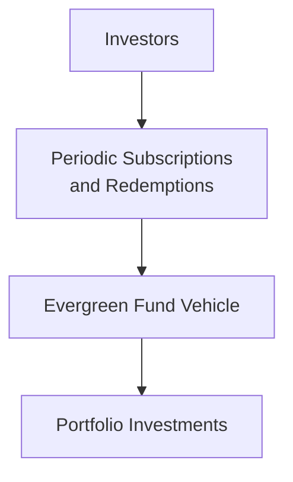
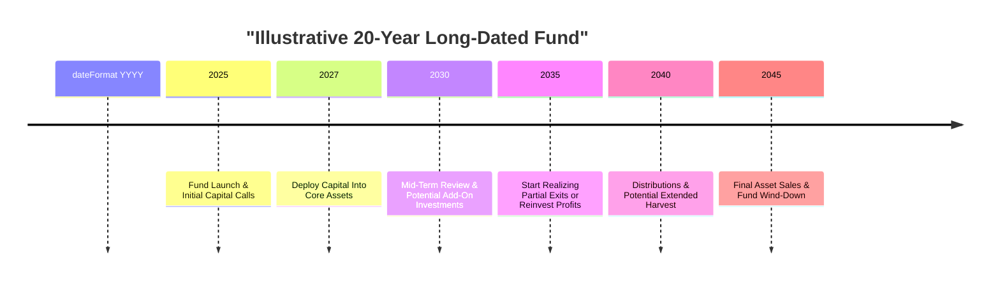

## Introduction

Have you ever wished you could hold on to a valuable private asset for way longer than the usual 10 or so years that most private equity funds allow? Maybe you’ve seen an opportunity that would flourish if only it had enough time—like a big infrastructure project, or a timberland investment that would yield better returns after a couple of decades. That’s exactly where long-dated and evergreen fund structures step in. They’re designed for folks who don’t want the clock ticking too loudly on their private investments—folks who crave more flexibility, a slower unwind, and sometimes the capacity for new investors to join without forcing existing ones out.

In traditional private equity structures—often 10 years plus a couple of optional extensions—there’s a lot of pressure to acquire, develop, and exit investments on a fairly tight timeline. For investments that need a longer runway, or for managers who want to build sustainable, compounding returns over many years, these older-school structures can start to feel, well, a bit restrictive. Enter long-dated and evergreen funds.

In this article, we’ll dig into the mechanics behind these extended lifespan vehicles, look at who they’re suited for, and explore the challenges you may face—particularly on valuation and redemption. We’ll also show a few real-world examples and share some personal thoughts. Because, honestly, if you’ve ever evaluated or worked with these structures, you know it can be a different ballgame altogether. So let’s jump in.

## Key Features and Motivations

Long-dated and evergreen funds are two distinct solutions that emerged to solve challenges in the standard private fund model. They do share overlapping themes, especially around giving general partners (GPs) and limited partners (LPs) greater flexibility for assets with lengthier expected hold periods or for investors who want continuous entry and exit options (within reason).

• Long-dated funds:  
  – Typically have a fund life that extends beyond the standard 10-year horizon (think 15, 20, or even 25 years).  
  – Aim to hold assets over multiple economic cycles, which can allow ownership to nurture growth, capitalize on broader market trends, and even ride out short-term volatility.  
  – May be especially relevant to sectors like real infrastructure, farmland, and timberland—assets you often can’t optimize in just a handful of years.

• Evergreen funds:  
  – Operate with an open-ended concept, where capital can be contributed or withdrawn over time.  
  – Require periodic valuation to strike “fair value” for investor subscriptions and redemptions.  
  – Benefit investors seeking continuous exposure to a strategy without forced exits or a fund wind-down.  
  – Function with a more flexible exit mechanism (a redemption feature), though usually subject to lockup periods, gate provisions, or other constraints.

Both of these structures cater to long-term objectives. If you’re an investor with, say, a 30-year time horizon (like certain foundations or pension plans), the alignment benefits might be huge. GPs also appreciate the breathing room to cultivate investments slowly.

## Structural Overview

### Long-Dated Funds

Long-dated funds usually begin with a traditional private equity style setup—management fees, carried interest, limited and general partner arrangements, etc.—but they extend the commitment period. GPs aren’t under the same pressure to exit. They can hold on to assets through multiple developmental phases. This can be especially critical in:

• Large-scale infrastructure, like toll roads or renewable energy projects that require extended development and ramp-up periods.  
• Resource-based assets like timberland, where growth cycles and harvest timelines span decades.  
• Businesses with strong compounding growth that might flourish if you hold them for 15+ years.

Still, even with extended lifespans, investors in long-dated funds usually have a finite endpoint in mind. The nature of that endpoint—maybe 15 or 20 years—allows for a potential wind-down eventually.

### Evergreen Funds

By contrast, evergreen funds are open-ended from day one. Investors buy in (subscribe) at net asset value (NAV) as determined by the fund’s regular valuation process, and they can typically redeem once they meet certain conditions. Think of it like a private market version of a mutual fund or hedge fund, but with unique restrictions to manage liquidity and preserve investor fairness.

Here’s a simplified diagram of the evergreen fund structure:

In this model, the fund manager continuously raises capital to invest in new deals. At the same time, some investors might redeem their shares, so the fund has to maintain adequate liquidity. That means robust processes for valuation, gating, side pockets (for illiquid positions), and redemption queues. You don’t want to be forced to sell illiquid assets at fire-sale prices if a bunch of investors suddenly ask for their money back.

## Key Benefits

### Extended Holding Period

One of the biggest benefits that both long-dated and evergreen structures share is a more patient approach to investing. If you’re a GP in a typical 10-year fund, you might offload a still-growing enterprise simply because the clock is running out—and that can compromise returns.

• In a long-dated fund, you can let the investment “fully ripen.”  
• In an evergreen fund, you’re not forced to liquidate the portfolio at a certain date purely for closure or final distributions.  

### Alignment with Long-Term Investors

Institutional LPs like pension funds, endowments, and insurance companies frequently have a multi-decade horizon. They often prefer stable returns with minimal forced liquidity events. Private wealth and family offices with intergenerational planning also find a natural alignment here—ever try telling a multi-generational family business that they have to sell in 7 years? Not fun!

### Reduced Transaction Costs

When you’re not forced to flip assets, you might save on transaction or re-investment costs. Instead of constantly churning a portfolio, GPs can let winners ride and keep operational overhead lower. Over time, avoiding repeated acquisition and disposition fees can significantly boost net returns.

### Smoother Return Profile

If the underlying investments are stable, a well-structured long-dated or evergreen vehicle can deliver a relatively smoother, more consistent return pattern. You don’t get as many high-stakes “sell now or never" events that can create lumpy returns in traditional private equity.

## Challenges and Considerations

### Valuation Complexities

Evergreen funds in particular need robust, periodic valuation of illiquid assets so new subscriptions and redemptions happen at “fair” prices. If you’ve ever worked on a valuation committee, you know it can be tricky. A few potential pitfalls include:

• Overvaluing or undervaluing private assets, causing harmful dilution or enrichment of certain investor groups.  
• Dependency on external, third-party appraisers who may lack specific expertise in the fund’s niche.  
• Influence of market cycles: If valuations lag reality, some investors might redeem at inflated NAV while new investors subscribe at those possibly high levels.

### Liquidity Management

It’s not as simple as writing checks and receiving them in the mail. Liquidity in evergreen structures must be carefully planned:

• Lock-up periods: Investors can’t redeem at will for the first few years to keep capital stable.  
• Notice periods: There might be multi-month wait times to process redemption requests.  
• Gates: If redemptions surpass a certain percentage of net assets in a quarter, the fund can limit or “gate” withdrawals to protect remaining investors.

### Managerial Incentives

GPs in a long-dated vehicle may not have the same “time to exit” impetus, which can lead to potential complacency or a lack of discipline in returning capital. On the other hand, it can also encourage a slow and steady approach that might benefit LPs. In evergreen structures, managers typically earn performance fees based on annual or multi-year rolling valuations, so the incentive structure needs to be carefully thought out to avoid rewarding short-term gains over truly long-term performance.

### Regulatory and Governance Hurdles

While not as regulated as mutual funds, these structures can still face scrutiny from regulators and from sophisticated LPs expecting best practices in valuation, reporting, and oversight. Proper disclosures around valuations, conflicts of interest, side letters, and fee calculations are crucial—especially to remain aligned with the CFA Institute Code of Ethics and Standards of Professional Conduct, including honesty, transparency, and diligence in presenting data.

## Real-World Example

I once worked with a small, niche investment firm that specialized in sustainable timberland. They launched a 20-year fund, calling it “Longleaf Partners Growth.” The idea was that they’d buy saplings, cultivate them responsibly, and eventually harvest high-value lumber after 15 to 18 years. (Imagine telling your typical private equity LP: “We won’t see real returns until a decade from now—hang in there!”) But that horizon ended up working out well for their strategy. The extended life gave them time to meticulously manage the forests, navigate fluctuating lumber prices, and eventually exit once the market peaked. In a typical 10-year structure, they probably would have had to harvest too early or close to a cyclical trough, leaving money on the table.

## Practical Best Practices

• Build robust valuation methodologies. This is especially true for evergreen funds, where periodic pricing is mandatory. Use third-party appraisers or industry experts to ensure objectivity.  
• Introduce transparent disposal procedures. Even long-dated vehicles need clarity around how and when to exit. A well-defined exit strategy helps set expectations.  
• Develop strong liquidity controls. Don’t promise redemption on demand if you can’t deliver. Gate provisions and lockups protect legacy investors.  
• Align incentives. Fee structures in both models should reward long-term value creation, not short-term markups.  
• Maintain consistent, detailed reporting. Investors deserve regular updates even if you’re in a “long-haul” strategy. They shouldn’t have to wait years to know where they stand.  
• Stress-test dryness. Take a page from risk management (see Chapter 8: Risk Management Tools and Techniques) and do scenario analyses on how redemptions or capital calls might play out if tough times hit.

## Diagram of a Hypothetical Long-Dated Fund Timeline

In this illustration, the GP may also choose to hold assets beyond 2045 if the partnership agreement allows further extensions (subject to LP approval), but a 20-year horizon is the baseline.

## Exam Relevance (CFA Level III Context)

At the CFA Level III exam, you’re likely to see scenario-based questions that require you to evaluate the suitability of different private market structures for institutional investors with varying risk appetites and liquidity preferences. Be ready to apply:

• Portfolio construction: Determining how to incorporate a long-dated or evergreen fund into an institutional portfolio.  
• Risk and return trade-off analysis: Assessing the illiquidity premium over extended periods and the potential for better alignment with a long-term liability stream.  
• Performance measurement: Understanding how to measure performance fairly in an open-ended structure without standard exit events.  
• Code and Standards: Showing compliance with ethical and professional conduct, including valuation fairness for all participants over time.

Focus on the “why” and “how” behind these structures—why they exist, what investor objectives they serve, and how you monitor them for performance and risk. You’ll often need to illustrate trade-offs, especially around liquidity, time horizon, fees, and the alignment of GP-LP incentives.

## References for Further Reading

• Long-Term Investing in Private Equity by the Global Impact Investing Network  
• Evergreen Structures in Private Markets (white paper by Cambridge Associates and other institutional consultants)  
• CFA Institute Journal articles on long-horizon investment strategies, available to members on the CFA Institute website  

The above resources shed deeper light on the rationale, design, and industry trends behind these fund vehicles.

## Sample Exam Questions: Long-Dated and Evergreen Fund Structures



### A hypothetical portfolio manager is considering a 20-year private infrastructure fund versus a standard 10-year fund. Which of the following is the most likely benefit of extending the fund life to 20 years?

- [ ] Increased ability to raise capital quickly in the short term.  
- [x] Greater flexibility to develop long-term assets and potentially achieve higher returns.  
- [ ] Reduced need for periodic valuations.  
- [ ] Lower management fees due to the longer duration.  

> **Explanation:** A primary advantage of a long-dated fund is the flexibility to hold and develop long-term assets. This can enhance returns, especially for infrastructure or natural resource investments.

### Which statement best describes an evergreen fund structure?

- [x] It is an open-ended vehicle where investors can subscribe or redeem periodically, subject to valuation and liquidity constraints.  
- [ ] It is a fund that invests exclusively in evergreen trees.  
- [ ] It prescribes a maximum 25-year life but has no mechanism for early redemption.  
- [ ] It requires mandatory yearly distributions of profits to all investors.  

> **Explanation:** Evergreen funds are open-ended, with periodic valuations that allow investors to enter or exit subject to the fund’s redemption rules.

### In an evergreen fund, subscriptions and redemptions typically occur:

- [ ] Only once at fund inception.  
- [x] On a periodic basis reflective of the fund’s updated NAV.  
- [ ] Twice: once for subscriptions, once for redemptions.  
- [ ] Every week, with no restrictions.  

> **Explanation:** By design, evergreen structures’ open-ended approach allows ongoing subscription and redemption at intervals tied to updated valuations.

### Why are robust valuation processes especially critical in evergreen funds?

- [ ] Because investors don’t care about accurate pricing when redeeming.  
- [ ] Because the general partner is paid only on realized exits.  
- [x] Because new investors purchase shares based on reported NAV and existing investors redeem the same way.  
- [ ] Because the fund invests only in highly liquid, mark-to-market assets.  

> **Explanation:** Fair and frequent valuation ensures that all investors subscribe and redeem at an equitable price, preventing dilution or overpayment.

### Which of the following is most likely a challenge specific to long-dated fund structures?

- [ ] High frequency of investor redemptions.  
- [x] Potential complacency by the GP due to the extended duration.  
- [ ] Inability to invest in illiquid assets.  
- [ ] Forced exits at predetermined intervals.  

> **Explanation:** One known challenge with long-dated funds is that the GP may lose discipline or become complacent if not properly incentivized over the extended time horizon.

### An investor seeking continuous exposure to private equity markets with the option to redeem capital on a schedule would most likely prefer:

- [ ] A traditional closed-end fund with a 10-year term.  
- [x] An evergreen fund structure.  
- [ ] A special purpose acquisition company (SPAC).  
- [ ] A short-dated credit fund with a 3-year term.  

> **Explanation:** Evergreen structures are open-ended, making continuous exposure and periodic redemption feasible.

### From a risk management perspective, what tool is commonly employed in evergreen funds to handle large redemption requests?

- [ ] Immediate payout within 24 hours.  
- [x] Gate provisions that cap the percentage of NAV that can be redeemed in a given period.  
- [ ] A mandatory private placement lock-up lasting the entire life of the fund.  
- [ ] Unlimited redemption rights at fair market value.  

> **Explanation:** Gating mechanisms help protect the fund and remaining investors when redemption requests spike beyond manageable levels.

### A potential downside of an evergreen model is:

- [ ] The requirement for a very short lock-up period.  
- [x] The need for periodic NAV calculation, which can be complex for illiquid assets.  
- [ ] The prohibition on new investor subscriptions.  
- [ ] The impossibility of re-investing proceeds.  

> **Explanation:** Periodic valuations of illiquid or complex assets are logistically challenging but essential for accurate pricing in open-ended structures.

### How might a long-dated fund minimize the risk of GP complacency?

- [ ] By reducing its lifespan to five years.  
- [ ] By allowing investors to redeem at will.  
- [x] Through incentive structures that reward performance over multiple periods.  
- [ ] By requiring annual distribution of realized and unrealized gains.  

> **Explanation:** Properly designed incentive mechanisms (e.g., performance fees tied to long-term benchmarks) can align a GP’s interests with a fund’s extended investment horizon.

### True or False: Long-dated funds can be ideal for assets that have short, frequent exit windows.

- [ ] True  
- [x] False  

> **Explanation:** Long-dated funds are best suited for assets that benefit from patient, extended holding periods—exactly the opposite of frequent, short exit windows.


