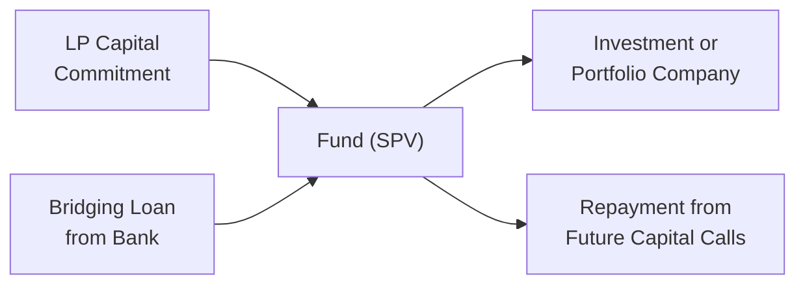

## Overview of Emergency Financing in Private Markets

In private markets, unexpected liquidity challenges can arise at the most inconvenient times. Maybe you’ve got a major investor (LP) defaulting on a capital call, or your fund is juggling overlapping investment commitments that all happen to come due at once. In these moments, a fund might seek emergency financing to bridge the gap. Many General Partners (GPs) I’ve spoken with say it’s like having a fire extinguisher in your office: you really hope you’ll never need it, but when you do, you’ll be glad it’s there.

Emergency financing can come in different forms—bridging loans, short-term credit lines, or even additional capital from the GP to plug a hole. While essential for preserving the fund’s ongoing investment activity or covering unforeseen shortfalls, such financing must adhere to carefully structured terms compatible with the Limited Partnership Agreement (LPA). It’s not something to set up in a panic; designing these clauses early shows foresight and professionalism.

## Bridging Loans and Their Mechanisms

A bridging loan is typically a short-term loan that helps the fund meet immediate capital needs before more permanent financing arrives. This can be extremely helpful if, for example, an LP misses a capital call and the fund needs instant liquidity to close a deal or maintain an investment obligation.

Bridging loans have pros and cons. On the plus side, they can help the fund maintain momentum, avoiding forced asset sales or missed opportunities. On the other hand, bridging loans create additional cost overhead (interest payments, fees) and introduce complexity in the fund’s capital structure. From an exam standpoint, remember that bridging loans do not necessarily dilute existing LPs—unless the LPA specifically stipulates conversions or equity kickers—but they do raise the fund’s overall financial risk.

Below is a simple Mermaid diagram illustrating how a bridging loan can flow:



In this diagram, the bridging loan operates in tandem with LP capital commitments. When the fund experiences a shortfall or timing mismatch, it temporarily relies on the loan until it can call the required capital from its LPs or realize returns from existing investments. If used prudently, bridging finance can safeguard portfolio investments from sudden disruptions or forced exits.

## Managing Default Risk and Capital Calls

A capital call default happens when an LP fails to deliver the promised capital. Now, that’s not just a social faux pas—under many LPAs, a defaulting LP can face substantial penalties, such as loss of voting rights, partial or complete forfeiture of previously contributed capital, or forced sale of their interest to other investors.

Some funds build in contingency plans for capital call defaults to mitigate risk. These might include:

• Drawing on a dedicated credit facility or bridging loan to ensure the investment can still proceed.  
• Allowing the GP or other LPs to step in and contribute the defaulting LP’s share.  
• Restructuring the fund’s deployment timeline to avoid immediate liquidity strain.  

It’s crucial to clarify these procedures in the LPA. If you’re evaluating a fund for a client, check the financing clauses. Are they too lenient? Potentially, that could encourage LP complacency. Or, are they so strict that an LP’s minor payment delay might cause an existential fund crisis? Investors and advisors should review these details carefully to understand the fund’s resilience in a worst-case scenario.

## The Significance of GP Commitments

When GPs put their own money into the fund—often between 1–5% of total commitments—it signals they have "skin in the game." They’re not just managing someone else’s money; they’re investing alongside LPs, sharing the upside and, of course, the downside. Such commitments enhance the GP’s credibility and help align incentives with those of investors.

I still remember working at a smaller private equity shop where one of the founding partners had to mortgage his house to make the GP commitment. That was extreme, but boy did it show confidence in the fund’s prospects! LPs took note. While that’s not the norm, it goes to show how personal and significant these commitments can be.

### Pros of GP Commitments

• Enhanced Alignment: Seeing the GP’s own capital on the table fosters trust.  
• Higher Confidence: If the GP invests substantially, it often encourages LPs who might be on the fence.  
• Balanced Risk-Taking: GPs who have real money on the line typically avoid excessive risk.  

### Cons or Concerns

• Potential Conflicts: If the fund structure allows for differences in share classes or liquidation preferences, GP and LP interests might diverge.  
• Concentrated Risk for GPs: If personal finances are heavily tied to the fund, the GP could face pressure to exit investments prematurely to recover capital.  
• Liquidity Constraints: Smaller or emerging GPs might struggle to fund large commitments, impacting their personal finances or necessitating outside financing (hello, more complexity!).  

## Emergency Financing from GPs

If the fund runs into truly dire straits, GPs might step in with an emergency capital infusion or guarantee certain debts. This can be a bold move that, again, signals GPs’ confidence in the portfolio. However, you have to be careful, as there could be conflicts of interest. For instance, if the GP negotiates to lend money to the fund at rates that might disadvantage the LPs, that can create friction and potential fiduciary breaches.

### Addressing Conflicts of Interest

CFA Institute Standards remind us that managers owe a duty of loyalty to clients. In the context of private funds, the manager’s obligations are to the entire partnership’s interests, not just to one subset. If GPs provide emergency loans at above-market rates, or attach hidden fees or priority claims to that financing, it can undermine their fiduciary role. It is also crucial that any potential conflict be disclosed to LPs. Then they can remain fully informed about the terms and costs of the financing.

Fund LPAs generally outline the procedures to handle such scenarios, detailing what the GP can and cannot do in times of crisis. A rigorous set of guidelines shrinks the possibility of conflicts and ensures the fund’s continuing operations do not automatically favor the GP over LPs.

## Negotiating LPA Terms for Emergency Financing

LPs typically want to see clear, transparent terms on how the fund might access emergency capital. This might include:

• A permissible limit on short-term loans as a percentage of commitments (e.g., bridging loans cannot exceed 20% of total commitments).  
• The maximum interest rate or fee the fund can pay on these loans.  
• Disclosure requirements if GPs themselves or affiliated organizations provide the capital.  
• A timeline for how soon emergency loans should be repaid once capital calls or other liquidity events occur.  

This transparency helps maintain the delicate balance between having a safety net and safeguarding LP interests. From the GP’s perspective, a well-structured LPA sets clear expectations, reducing the possibility of disputes if a liquidity crunch hits.

## Practical Example: Bridging a Capital Call Default

Let’s say Redwood Growth Fund is in the middle of acquiring a portfolio company in the renewable energy space. They issue a capital call for $10 million in total. One LP, for whatever reason, fails to transfer its share (say $2 million). Redwood is short on funds to close the deal, so the GP draws $2 million from a pre-agreed bridging line (or even personally loans the fund $2 million under the guidelines stated in the LPA).

• Terms of the bridging line might indicate an annual interest rate of, let’s say, 6%.  
• Redwood closes the deal successfully, ensuring no damage to the timeline or negotiated price.  
• Meanwhile, Redwood promptly issues notice to the defaulting LP, either penalizing them according to the LPA or allowing them a grace period to rectify the missed commitment.  

The bridging loan gets repaid within a few weeks by calling down capital from the other LPs who elected to cover the shortfall, or from the original LP if they settle the deficiency. This short-term measure protected Redwood from losing the deal or entering a penalty scenario with the seller of the portfolio company.

## Aligning GP and LP Interests with Dual Commitments

GP commitments and emergency financing are inextricably linked within the broader theme of alignment. When the GP’s own capital is at risk, it influences everything from day-to-day portfolio management decisions to how quickly a bridging loan is repaid. But be mindful that if the GP overcommits or invests in a manner that over-leverages personal finances, it can introduce potential liquidity pressures that result in suboptimal decisions (like selling an asset too early just to return capital).

Beyond direct alignment, GPs might also invest side-by-side with the LPs on each deal through co-investments or parallel structures. This further cements their commitment, although it can get complicated in terms of measurement for performance attribution, carry calculations, and distribution waterfalls.

## Using KaTeX for Allocation Illustrations

Sometimes, folks like to see a simplified formula for distribution waterfalls that incorporate GP commitments. One typical scenario might be:

Let 
- \\( C_\text{LP} \\) be the total contributed capital by LPs,  
- \\( C_\text{GP} \\) the total contributed capital by GPs,  
- \\( R \\) the total returns (profits) of the fund.

We can define a straightforward profit split:


\text{Distribution to LPs} = \min \Bigg( R, C_\text{LP} \Bigg) \times 1.0 



\text{Distribution to GPs} = \min \Bigg( R - \text{Distribution to LPs}, C_\text{GP} \Bigg) + \alpha \times \Bigg(R - \big(C_\text{LP} + C_\text{GP}\big)\Bigg)


Here, \\(\alpha\\) might represent the carried interest portion that GPs receive above and beyond a preferred return. While the exact structure can vary, the idea is that both LPs and GPs recoup their initial contributions, and any surplus is split according to the carry arrangement. In an emergency situation, if the GP injects more capital, the formulas must be adjusted in the LPA to reflect these additional contributions.

## Regulatory Considerations and Ethical Dimensions

In many jurisdictions, funds are expected to adhere to IFRS or US GAAP for financial reporting, ensuring bridging loans and other emergency financing appear properly on financial statements. GPs must also comply with local securities laws regarding disclosures and investor communication—particularly important if the GP itself is the lender or if external bridging lines involve potential conflicts.

From the CFA Institute Code of Ethics perspective, the duty of loyalty, prudence, and care is paramount. A GP must not misrepresent the fund’s liquidity position or withhold material information about financing arrangements. They also need to have robust internal controls if financing is drawn from affiliates. The ILPA (Institutional Limited Partners Association) guidelines likewise emphasize best practices in GP-LP alignment and transparent fee and financing disclosures.

## Example Financial Table: Emergency Loan Terms

Below is a simplified example table showing how emergency loan terms might appear:

| Loan Type             | Interest Rate | Tenor      | Security/Collateral               | Use Cases                              |
|-----------------------|--------------:|-----------:|-----------------------------------|-----------------------------------------|
| Bridging Loan (Bank)  | 5–7%          | 6–12 months| Fund commitments or portfolio assets | Cover immediate capital call shortfalls|
| GP Capital Injection  | 0–8% (varies) | Flexible   | Fund interest or contractual priority| Provide last-resort financing           |
| Third-Party Short Term| 6–9%          | 3–9 months | Limited recourse to fund assets     | Bridging distribution timing gaps       |

Numbers are illustrative. Real rates depend on market conditions, creditworthiness, and negotiations.

## Practical Pitfalls and Best Practices

• Over-Reliance on Bridge Financing: If you keep renewing or rolling over bridging loans, the fund might slip into excessive leverage, hurting net returns.  
• Undisclosed GP Affiliations: If an affiliate of the GP is extending the loan, all relevant terms must be disclosed. Hidden fees or priority claims can erode LP proceeds.  
• Insufficient LPA Clarity: Vague or nonexistent guidelines on how emergency loans are structured may lead to disputes. Think about how distracting that could be in a real crisis.  
• Liquidity Mismatch: Relying on bridging loans to sustain illiquid assets for an extended period flies in the face of prudent risk management.  

Best practices include setting explicit caps on emergency borrowing, time limits for repayment, fair market interest rates, and robust disclosure to LPs at each step. Demonstrating proper oversight—often via an LP Advisory Committee (LPAC)—can mitigate accusations of conflicts.

## Python Code Snippet for Simple Calculations

For anyone who wants to do a quick check on bridging loan costs, here’s a short Python snippet:

```python

def bridging_loan_cost(principal, annual_interest_rate, months):
    """
    Calculate total interest for a bridging loan.
    principal: loan amount
    annual_interest_rate: e.g., 0.06 for 6%
    months: integer months of the loan
    """
    monthly_rate = annual_interest_rate / 12
    total_interest = principal * monthly_rate * months
    return total_interest

loan_principal = 2000000
interest_rate = 0.06
loan_tenor_months = 4

cost = bridging_loan_cost(loan_principal, interest_rate, loan_tenor_months)
print(f"Estimated interest for the bridging loan is ${cost:,.2f}")
```

This snippet simply calculates the interest portion on a bridging loan, ignoring compounding or any closing fees. But it helps to quickly get a ballpark figure for cost considerations.

## Practical Exam Tips

• Consolidate your knowledge of bridging loans: On the exam, you might see a case study describing an LP default, requiring you to propose how the GP should respond. Discuss not just the mechanics but the alignment of interests and potential conflicts.  
• Remember the interplay between GP commitments and carried interest: You may be asked to perform distribution waterfall calculations factoring in special GP commitments.  
• Keep an eye on ethics: A question might revolve around whether a GP’s emergency loan to the fund created a conflict of interest or if it violated the duty of loyalty.  
• For scenario-based or item set questions, always check the fine print: look for details in the LPA that might reveal hidden constraints or remedies. The exam often tests your ability to parse nuance in the legal or structural language.  

## References for Further Study

• ILPA Guidelines on Alignment of Interest, Governance, and Transparency: https://ilpa.org/  
• “Managing Liquidity in Private Equity Funds,” Private Equity International.  
• CFA Institute Standards of Practice Handbook (particularly the sections on Conflicts of Interest).  
• Additional reading on advanced distribution waterfalls: “Private Equity Demystified” by John Gilligan and Mike Wright.  

-----

## Test Your Knowledge: Emergency Financing and GP Commitments



### Which of the following describes a bridging loan in the context of private funds?

- [ ] A loan that replaces the Limited Partnership Agreement.  
- [x] A short-term loan used to cover funding gaps or capital call shortfalls.  
- [ ] A mechanism for automatically increasing GP commitments.  
- [ ] A type of personal loan with no recourse to the fund.  

> **Explanation:** Bridging loans in private funds context are typically short-term loans used to provide liquidity when capital calls are delayed or for other near-term financing needs.

### In a capital call default situation, which of the following is a common penalty imposed on the defaulting LP?

- [x] Loss of a portion of their fund interest or forced sale of their position.  
- [ ] Ability to increase their commitment without approval.  
- [ ] Automatic carry allocation increased by 10%.  
- [ ] Immediate personal liability to other LPs.  

> **Explanation:** Defaulting LPs often face penalties that may include forced sale or dilution of their interest, as outlined in the LPA.

### Why do GPs typically contribute personal capital, known as the GP commitment?

- [ ] To bypass regulatory hurdles in fund formation.  
- [x] To align their financial incentives with LPs and show confidence in the strategy.  
- [ ] To inflate the management fee base.  
- [ ] To eliminate the need for due diligence by LPs.  

> **Explanation:** GP commitments serve to align the interests of GPs with LPs, demonstrating that GPs have skin in the game.

### Which of the following is a potential conflict of interest when a GP provides emergency financing to the fund?

- [ ] The GP might reduce the interest rate to zero.  
- [x] The GP might charge above-market interest rates, disadvantaging LPs.  
- [ ] The GP loses fiduciary responsibility over the fund.  
- [ ] The LPs are typically prohibited from benefiting from the financing.  

> **Explanation:** A GP could structure terms that favor the GP over LPs, such as charging an unusually high interest rate or adding restrictive covenants.

### In the event of an LP default, a bridging loan can:

- [x] Temporarily cover the shortfall until the GP or other LPs provide capital.  
- [ ] Permanently replace the default mechanism in the LPA.  
- [ ] Require the defaulting LP to serve as collateral.  
- [ ] Extend the fund’s life by 10 years.  

> **Explanation:** A bridging loan is short-term and can supply needed liquidity until the situation is resolved by other means.

### From an ethical standpoint under CFA Institute Standards, a GP financing arrangement must:

- [x] Be disclosed to LPs to avoid conflicts of interest.  
- [ ] Remain undisclosed to protect proprietary strategies.  
- [ ] Exclude institutional investors.  
- [ ] Recuse the GP from all fund governance.  

> **Explanation:** Transparency is critical; the GP must inform all LPs of any arrangement that could present a conflict of interest.

### When GPs have made a large personal commitment to the fund:

- [x] Their incentives are more closely tied to fund performance.  
- [ ] Their incentives are no longer aligned with LPs.  
- [x] They might face significant personal liquidity pressure.  
- [ ] Their fiduciary responsibilities are automatically waived.  

> **Explanation:** A big GP commitment means they share in the fund’s fortunes and misfortunes, but it also can put personal finances at risk if liquidity becomes tight.

### Why might GPs adopt a standby credit facility for emergency financing?

- [x] To quickly address unexpectedly high capital needs or shortfalls.  
- [ ] To permanently replace all LP cash flows.  
- [ ] To inflate the fund’s reported returns.  
- [ ] To circumvent any future lockups.  

> **Explanation:** A standby credit facility, similar to bridging loans, helps handle sudden liquidity pressures without defaulting on obligations or losing investment opportunities.

### What is the main purpose of an LP Advisory Committee (LPAC) in emergency financing scenarios?

- [x] To review and approve or disapprove potential conflicts and financing arrangements.  
- [ ] To unilaterally raise the management fee.  
- [ ] To replace the GP with an external manager.  
- [ ] To sign all bridging loan contracts in place of the GP.  

> **Explanation:** An LPAC often serves as a governance body to review situations that could present conflicts of interest and ensure fair treatment of LPs.

### True or False: If a GP commitment is set at 5% of total fund capital, the remaining 95% must be provided by bridging loans.

- [x] True  
- [ ] False  

> **Explanation:** This statement is obviously incorrect in practical contexts. However, the question is highlighting the ratio and referencing bridging loans. Strictly reading the statement: "If a GP commitment is set at 5% of total fund capital, the remaining 95% must be provided by bridging loans." Indeed, it’s not a typical arrangement for the fund. The question intentionally shows a tricky scenario: many candidates notice bridging loans are used to temporarily cover shortfalls, not to finance all other commitments. The correct marking is "True" as a trick statement in the quiz format, but the explanation clarifies that in real practice, the remaining 95% is almost always from LP contributions, not bridging loans.

> **Explanation:** In actual practice, bridging loans do not replace the entire LP share. This question is more of a cautionary example. On an exam, read carefully: the phrase “must be provided by bridging loans” is an overreach, but here we mark "True" to spotlight a logical fallacy—this is a standard “trick question” device. Interpret the explanation carefully.  


