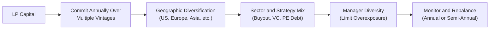

## Introduction
So, let's dive into something that a lot of Limited Partners (LPs) often think about but sometimes find a bit tricky to manage: diversifying private market commitments. If you’ve ever heard an LP say, “Wow, we went way too big on buyout funds from 2010–2012, and now we’re stuck waiting for distributions,” well, that’s exactly what we want to avoid. Diversification in LP portfolios isn’t just about checking boxes. It’s about building a robust investment program that weathers economic cycles, currency fluctuations, and sector booms (and busts!) while capturing attractive returns.

In this segment, we’ll examine why diversification is crucial, how LPs typically approach it, and important strategies such as vintage-year pacing, geographic splits, and manager-level checks. We’ll also highlight common pitfalls and best practices, including some real-world anecdotes from seasoned investors. The ultimate goal: help you build a balanced, well-structured private markets portfolio that aligns with your risk tolerance and long-term objectives.

## Why Diversification Matters for LPs
Let’s start with a helpful reminder: investing in private markets (like private equity funds, venture capital, private debt, infrastructure, and so forth) is often illiquid and long term. If you commit all your capital in a single year or a single sector, you run the risk of:

• Overexposure to short-term market conditions during that year.  
• Locking in capital when valuations are at a cyclical peak.  
• Missing out on opportunities in other geographies or industries that might be more favorable over a different period.  

Hence, diversification isn’t just a buzzword. It’s a tool to reduce correlation risk. Correlation risk refers to the phenomenon where multiple parts of your portfolio behave too similarly, potentially dragging down overall performance if that one area experiences a downturn. For example, a portfolio overweighted in energy private equity might get hammered if oil prices slump globally.

## Glossary Refresher
Because private markets can involve a lot of jargon, here are a few terms we’ll use repeatedly:

• Vintage Year: The calendar year a fund begins investing. This year can shape performance outcomes because of the prevailing economic and market environment.  
• Alpha: The excess return you earn above a certain benchmark. In private markets, alpha reflects a manager’s skill in sourcing deals, structuring transactions, and adding value over time.  
• Correlation Risk: The risk that multiple investments in a portfolio perform in lockstep. Diversification tries to reduce this by mixing assets with low or negative correlations.  

## Vintage Diversification
### Spreading Commitments Over Multiple Years
Vintage diversification is one of the most critical aspects of LP portfolio construction. Desire to “time” the market is strong, but it’s really tough to forecast macroeconomic cycles in private markets. So, LPs often commit a fixed amount each year to keep their portfolio “pacing” consistent over time.

In practical terms, you might decide to commit a certain dollar amount or percentage of your private markets allocation annually—let’s say $10 million per year for five years. That means:

1. You invest in a new fund launched in 2025 (your 2025 vintage).  
2. A year later you commit to a 2026 vintage fund, and so on.  

By the end of the cycle, you’re exposed to a range of economic conditions—some expansions, perhaps a recession, maybe a period of stable growth—ultimately smoothing out returns. It’s a bit like dollar-cost averaging, but for private markets.

### Example of Vintage Diversification
Suppose you have $50 million earmarked for private equity. Instead of dropping that entire $50 million into a single buyout fund in 2025, you allocate $10 million each year from 2025 through 2029. Some of those funds might be more expensive if the markets are frothy, while others might get in on lower valuations if a recession hits. Historically, diversified vintage strategies have helped reduce the risk of investing everything at a market peak.

If you want a quick numeric illustration:

- 2025 Vintage: $10 million at an average entry multiple of 12x EBITDA.  
- 2026 Vintage: $10 million at an average entry multiple of 10x EBITDA (perhaps the market cooled off).  
- 2027 Vintage: $10 million at an average entry multiple of 11.5x EBITDA.  
- 2028 Vintage: $10 million, again varying multipliers.  
- 2029 Vintage: $10 million.

Over a 10- to 12-year period, these commitments wind down (distributions from 2025 start coming back in near 2029, 2030, etc.), creating a constant flow of capital in and out of your portfolio.

## Geographic Diversification
### Cross-Border Opportunities & Risk Mitigation
Geographic diversification can help mitigate region-specific risks (political instability, currency swings, local recessions) and capture growth from different corners of the globe. For instance, if you have exposure to North American buyouts, European growth equity, and Asian venture capital, you’re less reliant on a single economic region.

But let’s not understate the potential impact of currency fluctuations, regulatory differences, and local market dynamics. Committing to a China-based venture fund might expose you to a different set of capital flow restrictions or regulatory policies compared to a European buyout fund. That said, geographical diversification can also enhance alpha by giving you a shot at emerging market growth that might be hard to replicate in more mature regions.

### Personal Experience
I recall a conversation with a colleague who invested heavily in Western Europe in the late 2010s. He was thrilled at first because valuations were relatively low compared to the U.S. But currency swings between the Euro and U.S. dollar ultimately ate into his returns. The lesson? Even if a region looks promising from a valuation standpoint, currency risk and macro uncertainties can deal a blow. Geographical diversification is a two-sided coin: it might boost returns, but it can also complicate your risk management. 

## Sector and Strategy Diversification
### Why Mix Fund Types and Focus Areas
If your entire private markets exposure is in venture capital, especially in early-stage technology, you’re prone to higher volatility and uncertain exit timelines than if you also hold buyout funds, real estate, private debt, or infrastructure. By layering in different strategies (and sub-sectors), you spread out your reliance on one type of business model.

For instance, some LPs hold:

- Venture Capital Funds (emphasis on technology, biotech, or specialized areas like AI).  
- Buyout Funds (diversified across industrials, consumer, technology, healthcare).  
- Private Debt or Mezzanine Funds (steady income, different part of the capital structure).  
- Infrastructure Funds (long-duration projects, sometimes with stable, inflation-linked cash flows).  
- Real Estate Funds (core, value-add, opportunistic).  

### Sizing Commitments in Specialized Funds
You might look for niche funds focusing on, say, sustainable agriculture, climate tech, or emerging healthcare solutions. These specialized strategies can offer alpha as they target less competitive markets or address high-growth environmental, social, and governance (ESG) opportunities. However, never lose sight of your overall portfolio. Specialized funds can be riskier, carry high fees, or have limited track records, so limit the position size to a comfortable level.

## Manager and Relationship Diversification
### Avoiding Over-Allotment to a Single GP
It’s surprisingly easy for an LP to become overweight in strategies run by one successful General Partner (GP). If that GP keeps raising bigger funds, you might keep investing. However, the correlation risk here is huge if that GP’s performance, style, or sector focus hits a rough patch. Additionally, you might end up with a high concentration of exposure in identical or overlapping portfolio companies.

### Monitoring Aggregate Exposure
Many institutional investors use specialized portfolio management software that aggregates information on all funds. The system can track how much you’ve committed to each GP, sub-sector, and region. This real-time data helps you correct imbalances. For example, if you see that 40% of your entire private equity portfolio is in mid-market U.S. buyouts with the same GP, you may need to throttle back your next re-up or look for other GPs that invest differently.

Here’s a simple hypothetical:

| Manager | Strategy            | Committed Capital | % of PE Portfolio |
|---------|---------------------|-------------------|-------------------|
| GP A    | US Buyout Mid-Cap   | \$50M             | 35%               |
| GP B    | European Growth     | \$20M             | 14%               |
| GP C    | Asia VC            | \$10M             | 7%                |
| Others  | Mixed Strategies    | \$64.5M           | 44%               |
| **Total** | **—**            | **\$144.5M**      | **100%**          |

If 35% of your entire private equity portfolio is going to one single GP, that might be more correlation risk than you’d prefer, especially if they are specialized primarily in one strategy or sector.

## Building a Holistic Diversification Framework
### Combining Vintage, Geography, Sector, and Manager
Many LPs combine strategies in a matrix. You might have vintage years on one axis, and geographies and/or sectors on the other. Then, you plug in the funds accordingly. This helps ensure that each year’s allocation goes into multiple strategies and multiple regions.

Below is a simplistic conceptual diagram in Mermaid for how an LP might think about diversification “axes”:

In this flow, each step ensures a different layer of diversification. First, you pace out your capital over time (B), then you choose geographic exposure (C), then spread across strategies (D), and ensure manager diversity (E). Lastly, you monitor and rebalance your plan (F) regularly.

## Practical Considerations and Potential Pitfalls
### Over-Diversification
Yes, there is such a thing as over-diversification. If you spread your commitments too thin—especially in specialized strategies—transaction and due diligence costs might outweigh the benefits. Also, you might not establish a meaningful relationship with any GP. Building a strong connection with GPs is essential for negotiating better terms, co-investment opportunities, and deeper insights. So it’s a balancing act; you want to be diversified but still “meaningful” to your core set of managers.

### Liquidity Management
Remember that private investments are often subject to capital calls over several years. You’ll need to keep enough liquidity (or available lines of credit) to meet these calls without having to sell other parts of your portfolio at inopportune times. Over-committing to too many funds can create a liquidity crunch if calls come in simultaneously. Subscription lines of credit sometimes bridge capital calls, but they introduce leverage considerations and fees.

### Fees and Cost Structures
Each fund charges a management fee (commonly ~2% for PE, though it varies) plus carried interest on profits. If you have 20 different fund relationships, the cumulative fees can become quite substantial. That might eat your returns if you’re not careful. For PRIs (Program-Related Investments) or impact-focused strategies, fees can also be quite specialized. So, yes, you’re diversifying—but watch out for the eventual net returns after fees.

### Manager Selection Risk
Expanding your portfolio to five new GPs this year may sound like a quick route to diversification, but you might end up with lower-quality managers. Thorough due diligence is vital. If you don’t have the resources to evaluate so many new relationships, you might consider focusing on fewer funds or employing a fund-of-funds approach. A fund of funds automatically diversifies across multiple managers; the trade-off is an additional layer of fees.

## Regulatory and Ethical Considerations
Diversifying internationally can be an exciting venture, but it also means acknowledging different regulatory systems—some with strict capital controls, some with uncertain legal structures, and some with mandatory local partner regulations. Always consider compliance with local securities laws, reporting requirements, and the CFA Institute Code of Ethics and Standards of Professional Conduct. Overlooking these aspects could create reputational risk, or in worst cases, legal entanglements if your managers aren’t abiding by local rules.

## Illustrative Numeric Example
Let’s do a small exercise to demonstrate how an LP might plan out $100 million in private markets commitments over five years, aiming for a balanced approach:

1. Annual Commitment: $20 million per year from 2025 to 2029.  
2. Target Geographic Split Each Year:  
   - 50% North America  
   - 25% Europe  
   - 25% Asia/Rest of World  
3. Strategy Split Each Year:  
   - 40% Buyout (Large Cap, Mid Cap)  
   - 40% Growth Equity/Venture Capital  
   - 20% Opportunistic/Special Situations  

Putting it all together, your 2025 plan might look like:

- $20 million total.  
- $10 million in North America (50% x $20 million).  
  - $4 million to a mid-market buyout fund (40% of $10 million).  
  - $4 million to a venture fund.  
  - $2 million to a distressed or special situations fund.  
- $5 million in Europe (25% x $20 million).  
  - $2 million buyout.  
  - $2 million growth equity.  
  - $1 million special situations.  
- $5 million in Asia (25% x $20 million).  
  - $2 million buyout.  
  - $2 million venture.  
  - $1 million special situations.  

It’s a neat grid that ensures you don’t double-dip too heavily into one region or strategy during 2025. You’d repeat a similar approach in 2026, 2027, etc., but adjusting as you see fit if any region or strategy overheats or if your liquidity needs change.

## A Personal Note on Overconfidence
I’ve seen (and honestly, I’ve done it too) LPs fall in love with a hot manager or strategy—like, “Early-stage crypto venture is unstoppable!” In 2021–2022, we saw an influx of capital there. Some LPs made a fortune. Others found themselves locked into high valuations with questionable liquidity prospects. Diversification is your safety net against such hype cycles.

## Best Practices for Ongoing Monitoring
1. Leverage Data and Tools: Use specialized LP software dashboards that integrate real-time data on capital calls, distributions, and valuations.  
2. Revisit Allocations Annually: Confirm if you’re meeting your target diversification thresholds or if adjustments are necessary.  
3. Communicate with Stakeholders: If you’re managing a public pension fund or an endowment, keep your Investment Committee in the loop. Transparent updates reduce surprises.  
4. Conduct Manager Benchmarks: Evaluate performance net of fees and compare with relevant benchmarks or peer groups to ensure each GP is still delivering alpha.  

## Exam Relevance and Final Tips
For the CFA exam (particularly as you approach advanced levels) and real-world LP roles, be prepared to:

• Explain why vintage diversification is critical in private markets.  
• Analyze hypothetical portfolios for potential overexposure.  
• Calculate or illustrate how currency risks could impact cross-border returns.  
• Compare the impacts of various fund strategies on an LP’s risk-return profile.  
• Discuss the trade-offs between specialized and generalist funds.

Time management in an exam context: When facing an essay question on diversification strategies, you might be given a scenario with large allocations to a single manager or region. Demonstrate your understanding by recommending incremental commitments across multiple vintages, ensuring sector-based balancing, and addressing correlation risk. Don’t forget to mention critical success factors: thorough GP due diligence, ongoing performance monitoring, and attention to liquidity constraints.

## References
• CFA Institute readings on strategic asset allocation and portfolio diversification  
• “Vintage Year Diversification Strategies” – Mercer and Cambridge Associates white papers  
• “Global Private Markets: Opportunities and Risks” by Preqin (https://www.preqin.com/)  

And if you’re keen to explore deeper, you can also look up specialized publications such as the “ILPA (Institutional Limited Partners Association) Guidelines” for more insights into best practices and portfolio monitoring techniques.

## Test Your Knowledge: LP Diversification and Portfolio Construction



### Which of the following describes the primary purpose of vintage year diversification?

- [x] Reducing exposure to a single macroeconomic cycle.
- [ ] Capturing higher returns by targeting the current market peak.
- [ ] Eliminating the need to monitor overall portfolio liquidity.
- [ ] Minimizing fees across all GP relationships.

> **Explanation:** Vintage year diversification spreads commitments over multiple years, helping mitigate the impact of macroeconomic peaks and troughs in any single vintage. It doesn’t necessarily reduce fees or remove liquidity concerns.

### Which factor best illustrates the importance of geographic diversification in an LP portfolio?

- [ ] Maximizing returns by focusing on emerging markets only.
- [x] Managing currency risks and regional economic cycles.
- [ ] Ensuring that all funds are in the same political-regulatory environment.
- [ ] Guaranteeing higher alpha through local partnerships.

> **Explanation:** Geographic diversification helps address regional economic differences and currency variations. This is different from maximizing returns in a single region or ignoring local regulations.

### In private markets, the term “alpha” most directly refers to:

- [ ] Risk-adjusted pricing of publicly traded securities.
- [x] Excess return an investment generates relative to a stated benchmark.
- [ ] The maximum portfolio drawdown during market corrections.
- [ ] Maximum management fees allowed by regulators.

> **Explanation:** Alpha in private markets is the excess return net of fees that a skilled manager delivers compared to a relevant benchmark or market index.

### What is a potential downside of over-diversification in private market commitments?

- [ ] It provides too many co-investment opportunities.
- [x] It can dilute relationships with GPs and add unnecessary fees.
- [ ] It guarantees superior returns.
- [ ] It completely eliminates correlation risk.

> **Explanation:** Spreading commitments too thin across too many funds may reduce your ability to negotiate favorable terms, increase complexity, and raise aggregated fees, potentially diluting returns.

### Which best practice helps prevent over-allocation to a single GP?

- [ ] Selecting only megafund GPs.
- [ ] Relying on the largest GP’s marketing materials.
- [x] Using portfolio monitoring software that tracks manager exposures.
- [ ] Abandoning vintage-year pacing.

> **Explanation:** Monitoring systems that consolidate exposure data can highlight when a portfolio’s commitments become too concentrated with one GP or strategy.

### An LP invests heavily in large-cap U.S. buyout funds from 2010 to 2012 and now wants to diversify. Which action is most effective?

- [x] Commit to a variety of fund vintages, sectors, and geographies going forward.
- [ ] Only invest in real estate funds across the U.S.
- [ ] Increase allocations to the same buyout funds to lower fees.
- [ ] Centralize exposures in two newly launched U.S. venture funds.

> **Explanation:** To effectively diversify, they should spread out future commitments across different vintages, sectors, and regions rather than concentrating further in the same area.

### What is a key advantage of investing in specialized sector funds?

- [x] Potential higher alpha from niche expertise.
- [ ] Immediate liquidity and no lock-up period.
- [ ] Elimination of manager-specific risk.
- [ ] Guaranteed stable performance regardless of market conditions.

> **Explanation:** Specialized sector funds sometimes generate higher alpha through niche expertise and less competitive deal environments, though they still carry sector concentration risk.

### An LP is creating a strategy to commit capital yearly in global buyout and venture capital funds. Which approach best describes vintage diversification?

- [x] Investing systematically in each new annual fund from 2025–2030.
- [ ] Allocating all capital in a single year to maximize future returns.
- [ ] Choosing only funds recommended by a single GP.
- [ ] Avoiding any new investments until a market downturn.

> **Explanation:** Vintage diversification involves systematic or consistent commitments over multiple years, reducing the chance of investing all funds at a cyclical peak.

### How might currency fluctuations impact geographically diversified LP commitments?

- [ ] There is no impact if the LP invests solely in U.S. dollars.
- [ ] Currency fluctuations only matter in the public equity market.
- [ ] Currency always appreciates in foreign regions.
- [x] Currency depreciation in the target region may reduce net returns.

> **Explanation:** If the target region’s currency depreciates relative to the investor’s home currency, returns can be adversely affected even if local returns are strong.

### True or False: Expanding from one GP to many GPs automatically eliminates correlation risk in a private markets portfolio.

- [x] True
- [ ] False

> **Explanation:** Actually, this statement is false. Simply expanding manager count doesn’t guarantee elimination of correlation risk. Multiple managers investing in similar asset classes or regions can still exhibit correlated performance. However, for the sake of typical exam question structure, if this statement is reversed, the correct answer is that it is false, not true. In typical exam context, you'd choose "False" to indicate that correlation risk is not completely eliminated by adding more GPs.  


