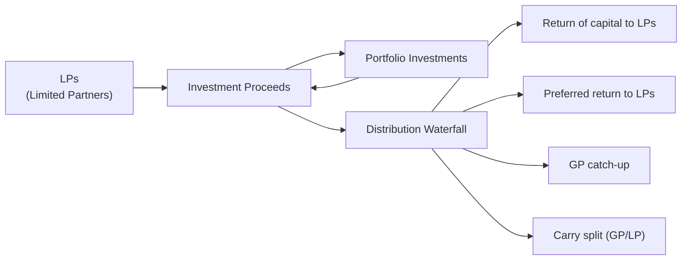

## Introduction
Private market funds—especially in the private equity arena—rely on a nuanced process of managing cash inflows from investors (limited partners, or LPs) and returning proceeds when investments are eventually realized or liquidated. This process can be intimidating, even for seasoned professionals. The terms “capital calls,” “distributions,” and “waterfall structures” form the backbone of how funds source and deploy capital, then redistribute gains back to investors. So let’s walk through these essential concepts so you’ll have a firm grasp of how the money moves (and yes—sometimes it moves in unexpected ways).

In my first brush with a private equity capital call (long ago and far away), I remember thinking, “Wait, why do I have to wire more funds already? I thought I'd just invest once!” Little did I realize that capital drawdowns typically happen in stages to match the investment pipeline. Anyway, we’ll break down how this all works, highlight best practices, and then look at how distribution waterfalls determine how the spoils are carved up.

## The Mechanics of Capital Calls
Capital calls, also known as drawdowns, are requests made by a fund’s general partner (GP) for LPs to provide the capital they have committed. Unlike investing in a publicly traded security where you generally invest the full amount up front, private market funds give you the joy (and logistical challenge) of wiring money only as the GP finds investment opportunities or needs liquidity for expenses and fees.

### Timing and Frequency
While the Limited Partnership Agreement (LPA) lays out the rules, the timing of calls often depends on market conditions and the fund’s investment pace. Some GPs plan a handful of large calls, while others do many small calls. It’s one reason that prospective LPs must plan carefully around liquidity—unexpected calls can be inconvenient if you don’t have cash or liquid assets at the ready.

### Call Schedules and LP Obligations
It’s common for LPs to receive a notice that details:
• The amount being called.  
• The due date.  
• The purpose of the capital call (e.g., new investment, management fee coverage).  
• Wiring instructions.  

LPs generally have a short window—perhaps 10 to 14 days—to remit the required capital. Failure to meet the call can lead to penalties or even forfeiture of the LP’s interest in the fund.

### Practical Example
Imagine a private equity fund with a total committed capital of $200 million. An LP might commit $5 million. Initially, the GP may request 10% of that ($500,000) to close on an initial deal. A few months later, if a new target company emerges, the GP might call another 15% ($750,000) to finance that investment. These calls can continue until the GP has called the full $5 million or no further capital is needed.

## Distributions: Return of Capital and Earnings
Moving from capital inflows (calls) to outflows (distributions), we get to the part that most LPs look forward to: the day checks start arriving. Distributions are generally triggered when an underlying investment is sold or recapitalized, generating proceeds. However, distributions can also occur on a more periodic basis if the fund invests in instruments that throw off regular cash flow (like interest or dividends).

### Types of Distributions
1. Return of Capital: First, funds typically ensure that LPs receive back their contributed capital. This is often the first “pool” in the distribution waterfall (we’ll see more details soon).  
2. Preferred Return (Hurdle Rate): In many funds, LPs get a minimum rate of return before the GP earns carried interest.  
3. Carried Interest: Profits allocated to the GP, often after the LPs receive capital plus some baseline return.  

### Distribution Frequency
It’s not unusual for distributions to happen in lumps—an investment is monetized, or the GP refinances a successful company, and some portion of the equity is returned to the fund. Although GPs differ in approach, many prefer returning capital swiftly to LPs to show a track record of realized gains.

## Overview of Waterfall Structures
The “waterfall” is the contractual provision that spells out exactly how distributions will flow between the LPs and the GP. Think of it like a multi-level funnel—money flows down from the top, hitting each level (or “tier”) in a specific order, until there’s nothing left. We start with returning capital to LPs, then paying any preferred return on their invested capital, then come catch-up arrangements for the GP, and finally the splitting of any remaining profits.

### Standard Waterfall Tiers
1. Return of Capital (“ROC”) to LPs.  
2. Preferred Return (“Hurdle Rate”).  
3. GP Catch-Up.  
4. Carried Interest (final profit split).

### Preferred Return (Hurdle Rate)
The preferred return (often in the 6–8% per annum range) sets a threshold that must typically be paid out to LPs before the GP receives performance-based compensation. It’s a protecting mechanism ensuring that the LPs have a minimum reward on their invested capital.

### Catch-Up Provision
After LPs achieve their hurdle rate, the GP may quickly “catch up” to a certain share of distributable profits, effectively making the GP’s share whole relative to the final carry split. Once the catch-up is complete, the fund typically proceeds to share any additional profits (the “split”) under the carry arrangement (e.g., 80% to LPs and 20% to GP).

### Deal-by-Deal vs. Whole Fund Waterfalls
• Deal-by-Deal (also called American): The GP can receive carry on profitable deals as soon as they’re exited, even if some later deals fail.  
• Whole Fund (also called European): The GP typically must wait until the entire fund has returned all drawn capital (and sometimes the hurdle rate) before receiving carry.  

From an LP’s perspective, whole fund waterfalls may be more investor-friendly. From a GP’s perspective, deal-by-deal accelerates the receipt of carried interest. Neither method is inherently “best,” but it’s crucial for LPs to read the fine print and forecast the timing of distributions.

## Visual Representation of a Typical Distribution Waterfall

Use this diagram as a simplified illustration. When investment proceeds come back to the fund, they pass through the waterfall. First, the LPs get back their capital. Next, the LPs earn the hurdle rate. Then the GP catches up to align with the final profit-splitting terms. Finally, all remaining profits are split according to the carry arrangement.

## Example: A Hypothetical Waterfall Calculation
Let’s say a private equity fund has $100 million total committed capital. An LP invests $10 million, but to keep numbers simple, we’ll pretend the entire $100 million belongs to a single LP. The distribution waterfall is as follows:
• Preferred Return (Hurdle Rate): 8% per annum (non-compounded).  
• Carried Interest: 20% to the GP, 80% to the LP after the hurdle is achieved.  
• GP Catch-Up: 100% of distributions after the hurdle goes to the GP until the GP has received 20% of the total profit (i.e., the same ratio as the final split).

Assume, after three years, the fund fully exits its portfolio at $130 million. For simplicity, ignore management fees. How does the distribution waterfall look?

1. Return of Capital:  
   • Capital contributed: $100 million.  
   • All $100 million is returned to the LP first.  

2. Preferred Return (8% per year over three years = 24% total).  
   • That’s $24 million in preferred returns to the LP.  

   At this point:  
   • Total distributions to LP = $124 million.  
   • Remaining proceeds: $130 million - $124 million = $6 million.  

3. GP Catch-Up:  
   • The GP will now receive 100% of distributions until the GP has 20% of total profits.  
   • The total profit is $30 million ($130 million - $100 million). The GP aims for 20% of $30 million = $6 million.  

   So the next $6 million is paid to the GP as the catch-up. Now the total distributed is $130 million. The GP has $6 million, the LP has $124 million.  

4. Final Split:  
   • In this scenario, there are no remaining proceeds. Everything has been distributed.  
   • The final outcome:  
     – LP has $124 million (the original $100 million plus $24 million in preferred return).  
     – GP has $6 million.  

If the proceeds had been, say, $140 million, there would be an additional $10 million after step three, which would then be split 80% to the LP and 20% to the GP. That’s how you see the layers of the waterfall in action.

## Interplay Between Capital Calls and Waterfalls
Capital calls and waterfalls connect to shape the fund’s cash flow timeline. GPs call capital early in a fund’s life to deploy into investments. LPs may have locked up capital for many years, depending on the success and exit horizon of those investments. Eventually, realized gains flow back through the waterfall structure. The speed, or “velocity,” of capital is a key gauge for LPs of how quickly their capital is put to work and then returned.

If a fund invests quickly but also returns proceeds quickly, the net effect can sometimes be strong internal rate of return (IRR) metrics—just keep in mind that IRR can be influenced by the timing of calls and distributions.

## Key Considerations for LPs
1. Liquidity Planning:  
   – Keep ample liquid assets on hand to meet capital calls.  
   – Over-committing to multiple funds can pose short-term liquidity risks if they all call capital at once.  

2. Fee and Expense Visibility:  
   – Some calls may be used to pay management fees or fund operating expenses.  
   – Understand how fees impact the net returns.  

3. Waterfall Terms and Their Impact:  
   – “Deal-by-deal” might mean the GP gets carry earlier, even if future deals falter.  
   – “Whole fund” usually defers carry until the entire fund is in positive territory.  

4. Modeling Expected Cash Flows:  
   – Predicting capital calls can be tricky, but historical GP pacing data helps.  
   – Estimating distributions is equally important to gauge your short- and long-term return profile.  

## Best Practices for GPs
• Communicate anticipated call schedules to LPs well in advance.  
• Provide strong transparency on how management fees and carried interest are calculated.  
• Manage the investment pipeline so that capital calls align with actual investment opportunities.  

## Observed Pitfalls
• Some LPs fail to adequately plan for capital calls, resulting in forced asset sales or loan drawdowns.  
• GPs lacking discipline may call capital too early and let it sit idle, dragging down returns.  
• Excessive complexity in waterfall provisions can lead to disputes or confusion—clarity is crucial.

## Regulatory and Compliance Threads
While regulations differ from region to region, many jurisdictions require GPs to keep all parties informed of material fund activities, including calls and distributions. It’s also essential to remain compliant with antifraud provisions and accurate recordkeeping. In any multi-jurisdictional arrangement, staying aware of local constraints on how capital can be moved or distributed is vital.

## Final Exam Tips
• Understand the difference between money-weighted rates of return (MWRR) and time-weighted rates of return (TWRR) when capital flows are irregular.  
• Learn how to read and analyze waterfall provisions in a sample LPA. The exam might include a short scenario asking you to calculate how final proceeds get split under a specific structure.  
• Pay special attention to the difference between whole-fund and deal-by-deal waterfalls. This is an area where test questions can get tricky.  
• Practice your distribution waterfall calculation. Be systematic—return of capital, then preferred return, then catch-up, and finally carried interest.  
• Watch out for partial exits or recurring cash flow distributions that can complicate the waterfall.  
• In essay questions, demonstrate your reasoning clearly. Show interim steps so graders can follow your logic.

## References
“Private Equity Fund Formation” by Andrea Giardino  
ILPA (https://ilpa.org/) – Various articles and industry best practices on private equity fund structures  
CFA Program Curriculum – Readings on Alternative Investments, Private Equity, and Portfolio Management  

## Test Your Knowledge of Capital Calls and Waterfall Structures



### In a private equity context, what is the primary purpose of a capital call?
- [x] To request the committed capital from LPs for investments or expenses
- [ ] To distribute profits back to LPs
- [ ] To notify LPs of a fund wind-down
- [ ] To adjust the management fee in line with fund performance

> **Explanation:** A capital call, or drawdown, is specifically used to request the capital that LPs committed to the fund, enabling the GP to deploy those funds into investments or cover fund-related expenses.

### Which of the following statements is true about distributions to LPs in a standard waterfall structure?
- [x] LPs typically first receive their contributed capital before any preferred return or carried interest is paid
- [ ] GPs are first in line to receive their share of profits
- [ ] Preferred return is paid before the return of contributed capital
- [ ] LPs only receive their profit share at final liquidation

> **Explanation:** In most waterfall structures, the return of capital to LPs is prioritized before any preferred return or carried interest allocations.

### In a waterfall calculation, what is the primary function of a catch-up provision?
- [ ] It guarantees that GPs pay back any losses they cause
- [x] It allocates profits to the GP after the LPs achieve their preferred return, ensuring the GP catches up to the negotiated profit share
- [ ] It ensures early redemption rights for LPs
- [ ] It locks in the GP’s share of profits for the life of the fund, regardless of performance

> **Explanation:** The catch-up provision allows the GP to receive a larger share of subsequent profits after the LPs get their preferred return, “catching up” to the agreed-upon split.

### What is a common difference between a deal-by-deal (American) waterfall and a whole-fund (European) waterfall?
- [ ] In a deal-by-deal structure, the preferred return is eliminated entirely
- [x] In a deal-by-deal structure, the GP can receive carry on each realized deal before the full fund is returned to LPs
- [ ] In a whole-fund structure, there is no carry
- [ ] In a deal-by-deal structure, the GP earns carry only after the entire fund closes

> **Explanation:** In a deal-by-deal waterfall, once individual deals produce profits, the GP may receive carry, whereas in a whole-fund approach, cumulative performance of the entire portfolio must meet distribution thresholds first.

### An LP invests $5 million into a fund with an 8% hurdle rate. If the fund returns $6 million to the LP before addressing any carry, how much is allocated toward the preferred return?
- [ ] $5 million
- [ ] $1 million
- [x] $400,000
- [ ] $480,000

> **Explanation:** The preferred return is 8% of $5 million = $400,000. Any amounts above this might be subject to carry calculations, depending on the fund’s waterfall provisions.

### Which of the following best describes the typical sequence in a standard waterfall distribution?
- [x] Return of capital → Preferred return → GP catch-up → Carried interest split
- [ ] Preferred return → Return of capital → GP catch-up → Carried interest split
- [ ] GP catch-up → Return of capital → Preferred return → Carried interest split
- [ ] Carried interest split → Return of capital → GP catch-up → Preferred return

> **Explanation:** The classic order is first to return invested capital to LPs, then to provide the LPs’ hurdle return, then to give the GP a catch-up allocation, and finally to split remaining profits.

### If a GP uses a multi-drawdown schedule for capital calls, what is a major implication for LPs?
- [ ] They only pay once at the start of the fund
- [ ] They are exempt from paying management fees
- [x] They must monitor liquidity because capital could be called at uncertain intervals
- [ ] They can choose to defer the capital contribution without penalty

> **Explanation:** Multi-drawdown schedules require LPs to remain prepared to meet unpredictable capital calls. Failure to do so can result in penalties.

### Under a deal-by-deal waterfall, why might LPs be disadvantaged compared to a whole-fund waterfall?
- [ ] LPs keep a greater share of each individual deal’s profits
- [ ] The GP is required to wait until the end of the fund for carry
- [x] The GP can collect carry on early profitable deals, even if later deals underperform
- [ ] LPs enjoy a lower hurdle rate

> **Explanation:** With a deal-by-deal structure, GPs can receive carry on early successful deals, potentially leaving LPs exposed if subsequent deals are unprofitable.  

### A private equity fund invests $100 million total, with a single LP committing all the capital. After multiple exits, the LP has received $115 million in total distributions, thus surpassing the initial investment. Which waterfall component typically kicks in next?
- [ ] Return of capital
- [x] Preferred return
- [ ] Carried interest split
- [ ] GP catch-up

> **Explanation:** Once the LP's contributed capital has been returned, the distribution waterfall typically moves on to the preferred return tier before the GP's catch-up or final carry split.

### A “preferred return” of 10% means:
- [x] The LP receives a 10% annual return on contributed capital before the GP earns carried interest
- [ ] The LP automatically receives 10% of all fund distributions
- [ ] The GP can claim a 10% stake in the capital calls
- [ ] The GP must provide 10% of the capital from personal funds

> **Explanation:** A 10% preferred return (hurdle rate) ensures that the LPs earn at least 10% annually on contributed capital before the GP can start taking a share of the profits (carry).


