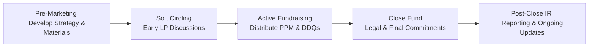

## Introduction
Fundraising in private markets can feel like juggling flaming torches—it’s thrilling, sometimes a bit scary, and timing matters more than ever. Most General Partners (GPs) are constantly evaluating when to launch their next fundraise, how fast to deploy capital, and which limited partners (LPs) to bring onboard. In my experience chatting with GPs over countless cups of coffee, the tension between building a strong track record and timing the market cycle is a real juggling act. You don’t want to start too soon, or you end up with little to show prospective investors; go too late, and the best investors might have allocated elsewhere.

This section takes a deep dive into the planning and execution of fundraising cycles, plus the crucial role of investor relations (IR). We’ll explore how macroeconomic conditions, track record, investor sentiment, and anchor commitments weave together in a tapestry of strategic planning. We’ll also look at some best practices for GPs in maintaining strong investor relationships over time—because let’s face it, raising capital is only half the battle; keeping your LPs informed, confident, and happy is an ongoing mission.

## Overview of the Fundraising Cycle
The typical private fund “vintage year” is the period in which a fund is first launched and begins actively accepting capital commitments. Many GPs will build a pipeline of deals prior to or during this timeframe, while simultaneously marketing to new and existing investors. The fundraising cycle can be broken into three major phases: (1) Pre-Marketing and Planning, (2) Active Fundraising, and (3) Post-Close Relationship Management.

### Pre-Marketing and Planning
In this phase, GPs usually review their existing accomplishments and investment track record. They analyze their prior funds’ Internal Rates of Return (IRRs), cash distributed to paid-in (DPI) ratios, and what we might call the “soft stuff,” like team cohesion and operational improvements. They also prepare marketing materials, refine their investment thesis to reflect current market conditions, and begin “soft circling” potential investors (i.e., getting non-binding indications of interest).

Timing can be super tricky. If the GP’s prior fund is still in its investment period, potential LPs will likely want to see how that fund is performing before committing to a new one. That said, GPs often start pre-marketing well before the prior fund is fully invested—especially if they sense that market sentiment is turning favorable, or if they see the possibility of marquee anchor investors coming on board soon.

### Active Fundraising
Once marketing officially kicks off, GPs distribute Private Placement Memorandums (PPMs) and host investor meetings, roadshows, and perhaps even “virtual data rooms” for more detailed due diligence. The process can take anywhere from a few months to over a year, depending on:

- Macroeconomic climate (bullish or bearish sentiment)  
- Strength of the GP’s performance track record  
- Terms offered (management fees, carried interest, preferred returns, etc.)  
- Availability of anchor investors who can create momentum  

During this time, GPs engage in extensive negotiations with prospective LPs. Each investor might request additional performance data, references, or a standardized Due Diligence Questionnaire (DDQ) that covers everything from the fund’s governance to the GP’s track record on Environmental, Social, and Governance (ESG) issues. The goal here is to secure enough commitments to reach or exceed the fund’s target size. Sizable commitments from highly regarded institutional investors can often encourage others to join—kind of like a restaurant that’s busy is more enticing than an empty place down the street.

### Post-Close Relationship Management
Closing the fund is a major milestone, but it’s not the end. After the final close, GPs embark on the actual investment phase—calling capital from LPs as deals are sourced and executed. During this stage, effective investor relations are crucial to building trust and setting the stage for potential follow-on funds. Regular updates on investment progress, realized exits, valuations, and changes in strategy must be provided with consistency and transparency.

## Investor Relations: The Backbone of Successful Fundraising
Sometimes, we imagine investor relations (IR) as sending out a quarterly newsletter or an annual financial statement. Actually, it’s so much more—IR is the strategic art of nurturing the alliance between GP and LP across the entire fund lifecycle. Here are some core responsibilities and best practices:

- Proactively communicating good and bad news (no one likes unexpected surprises).  
- Sharing performance updates, portfolio company highlights, and risk management approaches.  
- Hosting annual investor meetings or webinars to facilitate direct LP-GP dialogue.  
- Maintaining a dedicated IR team to address day-to-day inquiries from LPs.  

### Transparency and Reporting
Transparent reporting fosters trust. GPs often distribute quarterly and annual reports detailing each portfolio company’s progress. Typical key performance indicators (KPIs) include IRR, total value to paid-in (TVPI), and DPI. These can be supported with commentary on broader market conditions and any strategic pivots. As is common with many private market funds, valuations can be subjective; GPs are thus expected to follow recognized accounting standards (IFRS or US GAAP) for fair value measurement and document their methodology thoroughly.

### Aligning Interests
Alignment of interest between GPs and LPs is often discussed in fundraising pitch decks, but it’s in the IR function that it truly lives day to day. If, for instance, the GP invests a significant amount of its own capital (i.e., a GP commitment) in the fund, LPs see proof of true partnership. Performance fees—carried interest—are another point of alignment: the better the performance, the greater the upside for both GP and LP.

### Dynamic Communications
Communication strategies should adapt to changes in the market environment and fund lifecycle. Early on, GPs might do a lot of “selling” about the fund’s prospects; later, the conversation shifts to monitoring portfolio progress, discussing exit timelines, and picking the best moment to harvest value from investments. Staying connected and approachable—via phone calls, in-person updates, or virtual meeting platforms—helps GPs respond effectively to investor queries. In my experience, GPs that open a channel for real-time or near real-time updates go a long way in forming lasting relationships.

## The Role of Anchor Investors
An anchor investor is typically a large or influential LP who commits early, thereby signaling confidence in the fund’s strategy and team. This can act like a magnet, attracting other institutions or high-net-worth individuals who want to join a fund that’s already garnered significant backing.

- Anchor investors sometimes negotiate preferential terms or reduced fees (e.g., a fee discount if they commit above a certain threshold).  
- Early anchor commitments can significantly reduce the overall time it takes to complete the fundraising cycle because other LPs are reassured by the lead investor’s thorough due diligence.  

## Soft Circles and Commitments
“Well, I can’t guarantee, but I’m in for at least $10 million.” This statement from a prospective LP might represent a “soft circle,” which is a non-binding expression of interest. It’s helpful for GPs to tally these soft circles in their IR pipeline in order to forecast whether the final fund size will meet or exceed targets. Of course, it’s essential to remain pragmatic because soft circles are often subject to last-minute changes or investor-specific conditions.

## A Simple Flow of the Fundraising Process
Below is a Mermaid.js diagram illustrating a simplified version of the fundraising cycle.

- A: Pre-Marketing. GPs shape the fund strategy, gather data, and prepare marketing materials.  
- B: Soft Circling. GPs approach existing relationships and new leads, building preliminary interest.  
- C: Active Fundraising. GPs formally share the PPM and other documents. LPs begin their detailed due diligence.  
- D: Closing. Commitments are finalized. The fund is legally established, and capital calls can later commence.  
- E: Post-Close IR. Continuous investor communications, performance updates, and unfolded portfolio strategies.

## Practical Case Study
Imagine a mid-market buyout firm, “Green River Capital,” that recently closed Fund III at $800 million. Their second fund had an impressive DPI of 1.8x in just five years. As soon as Fund II was nearly 70% deployed, the partners at Green River started drafting their next pitch deck. They reached out to their largest LP, a college endowment, to gauge interest in anchoring the new vehicle. With a $100 million anchor commitment secured, they launched the formal fundraising process. Over the next four months, they met with over 40 prospective LPs and used a robust virtual data room to make due diligence more efficient. Given the endorsement from the anchor investor, many smaller LPs decided to jump in quite early, allowing Green River to exceed its $750 million target.

## Best Practices and Common Pitfalls
Best Practices:
- Begin planning the next fund early, especially if you have a strong track record to showcase.  
- Cultivate personal relationships with LPs—relationships often matter as much as performance, especially if markets tighten.  
- Provide consistent, transparent reporting to instill confidence in existing and future LPs.  

Common Pitfalls:
- Over-promising and under-delivering on performance metrics. Investors will notice any discrepancy between your pitch and reality.  
- Misalignment of interests, such as excessive management fees with insufficient GP commitment.  
- Failing to provide prompt and thorough updates when markets turn volatile or crisis scenarios arise.  

## Key Terms and Glossary
Fundraising Cycle (Vintage Year): The period during which a fund is marketed, capital is raised, and the final close is completed.
  
Anchor Investor: A large or influential LP that commits early to a fund, often galvanizing other commitments.

Investor Relations (IR): The function or team responsible for ongoing communications with LPs regarding performance updates, inquiries, and relationship management.

Due Diligence Questionnaire (DDQ): A standard form used by LPs to assess a GP’s processes, capabilities, and performance history.

Soft Circle: A non-binding indication of investment interest from a prospective LP, often used to gauge potential commitments.

## Conclusion and Exam Relevance
Fundraising cycles and investor relations go hand in hand—like two sides of a coin. On the CFA exam, you might encounter scenario-based questions testing your understanding of how GPs strategically time their fund launches, manage investor communications, or secure anchor commitments. You could also face questions that delve into performance reporting standards, alignment of interests, or the finer points of due diligence processes.

From an exam perspective, remember the following:
- Demonstrate a strong grasp of the cyclical nature of private market fundraising and common triggers for launching a fundraise.  
- Be prepared to discuss the interplay between macroeconomic conditions, track record, and investor sentiment.  
- Highlight best practices in maintaining investor relations—transparent communication, proper reporting, and alignment of incentives.  
- Understand the significance of anchor investors, and how they can set the tone for a successful or challenging fundraise.  

Time management pointers for constructed-response questions:  
- Respond directly to scenario prompts around IR strategy and anchor commitments.  
- Reference standard metrics (IRR, DPI, etc.) in performance discussions.  
- If you see questions about a GP’s approach to crisis updates, recall best practices in transparency and frequent communication.  

## References
- Invest Europe (European Private Equity and Venture Capital Association):  
  “Best Practices in Private Equity Fundraising”  
  Website: [https://www.investeurope.eu/](https://www.investeurope.eu/)
- Christopher B. D. and Dirk V. (2022). “Private Equity and Venture Capital.”  
- CFA Institute readings on the role of investor relations in private equity funds.

## Test Your Knowledge: Fundraising Cycles and Investor Relations Quiz



### Which phase of the fundraising cycle involves non-binding (“soft”) indications of interest from LPs?
- [ ] Post-Close Relationship Management
- [x] Pre-Marketing and Planning
- [ ] Final Closing
- [ ] Investment Period

> **Explanation:** Soft circling typically happens in the pre-marketing and planning phase, where GPs gauge investor interest before the official start of fundraising.

### During the active fundraising phase, which document do GPs usually distribute to prospective investors for detailed review?
- [ ] Internal Code of Conduct
- [ ] ESG Policy Statement
- [ ] Shareholders’ Agreement
- [x] Private Placement Memorandum (PPM)

> **Explanation:** The PPM outlines the key terms, strategy, and expected returns, serving as the central disclosure document.

### Which investor type, if they commit early, is most likely to attract other investors into a new fund?
- [ ] Retail investor with a modest check
- [x] Anchor investor with a large, prestigious commitment
- [ ] Passive index fund manager
- [ ] Small local bank

> **Explanation:** Anchor investors signal credibility and confidence, thus encouraging other LPs to join.

### What is the main role of investor relations (IR) after a fund has closed?
- [x] Facilitating ongoing communications and reporting
- [ ] Conducting external audits of fund financials
- [ ] Leading portfolio company recruitment
- [ ] Approving exit decisions

> **Explanation:** IR manages consistent and transparent updates to LPs, ensuring trust throughout the fund’s lifecycle.

### Which of the following is NOT typically part of the GP’s alignment of interests with LPs?
- [x] Everyday cash bonuses to IR teams
- [ ] Significant GP commitment to the fund
- [x] Performance-based carried interest
- [ ] Preferred returns

> **Explanation:** Alignment methods include GP commitments, carried interest tied to performance, and hurdle/preferred returns. Cash bonuses to staff are not typically structured for LP alignment.

### What might happen if a GP heavily overstates projected returns during fundraising?
- [x] Future credibility issues and strained LP relations
- [ ] Immediate surge in anchor commitments
- [ ] Guaranteed success in future fundraising
- [ ] Automatic regulatory suspension

> **Explanation:** Overstating returns can backfire when actual performance underdelivers, harming credibility and relationships.

### How can macroeconomic conditions affect a GP's fundraising strategy?
- [x] They can shorten or prolong the fundraising timeline
- [ ] They remove the need for a track record
- [x] They influence investor risk appetite
- [ ] They have no real effect on private market capital flows

> **Explanation:** Both changes in interest rates, economic cycles, and investor sentiment can shift risk appetite and availability of capital, thus impacting fundraising timelines.

### Which metric measures the ratio of total fund value (held + distributed) to paid-in capital?
- [ ] IRR
- [ ] DPI (Distributions to Paid-In)
- [x] TVPI (Total Value to Paid-In)
- [ ] Picard Ratio

> **Explanation:** TVPI is a common performance metric that includes both realized and unrealized value relative to total paid-in capital.

### Which of the following is a benefit of publishing frequent, transparent portfolio updates to LPs?
- [x] Fewer unexpected surprises and higher LP confidence
- [ ] Guaranteed improvement in IRR
- [ ] Elimination of regulatory requirements
- [ ] Diminished perceived risk in the fund

> **Explanation:** Regular communication helps manage expectations, builds trust, and reduces unpleasant surprises—but it doesn’t guarantee improved returns or reduced risk.

### True or False: An anchor investor’s early commitment ensures a fund will always meet its target size.
- [x] True
- [ ] False

> **Explanation:** While having an anchor investor is a strong positive signal, it doesn’t 100% guarantee reaching the target size—though in practice, it significantly boosts fundraising momentum.


