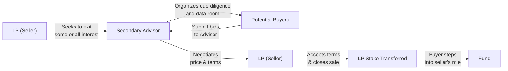

## Introduction
If you’ve ever sat around chatting with a friend who’s invested in private equity, you’ve probably heard them sigh, "Man, I wish I could easily sell my stake—it’s been locked up for years." Well, that’s the universal gripe when you buy into a private fund: you typically can’t just cash out whenever you want. However, thanks to secondary markets, investors (often called limited partners, or LPs) have a way to find liquidity—sometimes at a discount or premium to the underlying value. In other words, the secondary market is where LPs can sell (or new investors can buy) existing stakes in private funds.

In this discussion, we’ll delve into how these secondary transactions work, why they exist, and how they can serve as a powerful tool for portfolio rebalancing. We’ll look at the practical aspects—like how to handle discounts to net asset value (NAV), what drives pricing, and the role of specialized advisors—so that you can approach the secondary space with confidence.

## Key Terms
**Secondary Market**  
A market where existing LP interests in private funds can be sold or transferred to new investors. Secondary transactions typically involve specialized secondary buyers or “secondary funds,” aiming to purchase LP stakes at attractive valuations.

**Liquidity Event**  
Any occurrence that allows an investor to convert illiquid interests into cash. While “liquidity event” often refers to an acquisition or initial public offering (IPO), secondary transactions can also serve as liquidity events for investors looking to exit private positions.

**Net Asset Value (NAV)**  
Represents the total value of a fund’s assets minus its liabilities. NAV often serves as the baseline for secondary sale prices but can lag actual market conditions or the fund’s intrinsic performance.

**Secondary Fund**  
A private equity fund—or a broader alternative fund—dedicated to acquiring LP stakes on the secondary market. These funds have become increasingly popular as the secondary market has matured, providing liquidity and price transparency.

## Why Secondary Markets Exist
Originally, if you committed capital to a private fund, you were in it for the long haul—no easy exit until the fund manager sold off the assets or took them public. But real-world conditions can change. LPs might have a sudden cash flow need, or they might want to reduce exposure to a certain asset class for strategic reasons. Secondary markets came to the rescue by allowing LPs to sell their interests to buyers willing to step into their shoes.

Think about it: these transactions remind me of when I swapped an old collectible coin with a friend who was super into numismatics. He got something he valued, and I got quick cash for, well, plane tickets. It’s just that in private equity, we’re talking about multi-million-dollar stakes—and the stakes themselves can be quite complex to value. That’s why a specialized market and set of advisors have evolved around these deals.

## Drivers of Secondary Transactions
Asset accumulation and rebalancing needs don’t always align with private fund lock-up periods. Here are some reasons LPs approach the secondary market:

- **Liquidity Needs.** Institutions sometimes face unplanned liabilities or want to free up capital for new opportunities.
- **Portfolio Rebalancing.** Shifting allocations or rebalancing to meet investment policy targets can drive partial or full sales of private stakes. (For instance, see Chapter 8.1 for discussions on holistic portfolio integration.)
- **Regulatory Changes.** Rules limiting certain investments can force institutions, such as insurance companies or pension funds, to lighten or exit certain positions.
- **Strategic Considerations.** Large LPs might sell “tail-end” positions in older funds with minimal upside to simplify their overall portfolio.
- **Performance Dissatisfaction.** If a particular fund underperforms or deviates from an LP’s expectations, it might go on the chopping block.

## The Portfolio Rebalancing Angle
Rebalancing is that periodic readjustment of asset classes to match desired risk/return profiles. Traditional asset classes (equities, bonds) are simpler to rebalance because you can easily sell stock or reallocate capital. But in alternatives—especially private markets—rebalancing used to be a headache. Now, secondary markets let LPs tweak their exposures. By selling a stake in, say, a buyout fund, they free up capital to invest in a venture capital or real estate opportunity that better aligns with current portfolio objectives.

Rebalancing can be particularly vital for endowments and foundations with strict distribution requirements. Picture a university that needs stable annual cash flows. If their private equity holdings become too large as a share of the endowment, they might face liquidity challenges. That’s where a secondary transaction can help them rebalance and free up cash for scholarship commitments.

## Pricing in the Secondary Market
A big question for secondary transactions: at what price are these stakes changing hands? The starting point is often the fund’s latest NAV. Buyers and sellers then negotiate based on factors like:

- **Fund Maturity and Remaining Life.** Interests in older funds nearing exit can trade closer to or even above NAV if distributions appear imminent.
- **GP Track Record and Underlying Asset Quality.** Strong performance or premium-quality assets tend to narrow bid-ask spreads.
- **Market Liquidity and Competition.** A strong buyer appetite may push prices upward (potentially above NAV). In uncertain markets with fewer buyers, discounts can widen substantially.
- **Unfunded Commitments and Future Capital Calls.** Buyers must evaluate future obligations. If the remaining capital calls are large, the buyer’s willingness to pay top dollar decreases.
- **Macroeconomic Conditions.** Broad market volatility, interest rates, and other macro factors can heavily influence secondary pricing.

When the market is robust, you might see transactions at or near par. In weaker markets, or when assets are perceived as riskier, you’ll see double-digit discounts. A simple formula to measure the discount (or premium) to NAV is:


\text{Discount} = 1 - \frac{\text{Transaction Price}}{\text{NAV}}


A positive number indicates a discount; a negative number indicates a premium.

## Dedicated Secondary Funds
Given investor demand for liquidity and the attractive risk/return profile of secondaries, an entire ecosystem of specialized funds—known as “secondary funds”—has developed. These funds focus exclusively on buying LP interests in the secondary market. They often have the following characteristics:

- **Diversification Across Vintage Years.** Secondary funds can invest in multiple funds that are at different stages, giving them a more predictable distribution schedule.
- **Potentially Lower J-Curve.** Because they’re investing into funds in mid-life, secondary funds often avoid the early “J-Curve” effect common in primary private equity commitments.
- **Expertise in Valuation and Structuring.** Secondary funds have dedicated teams that analyze the underlying portfolio companies, the general partner’s track record, capital call schedules, and more.

It reminds me of a friend who specialized in flipping houses. He never buys new construction; he buys mid-project or near-finished properties at a decent discount, invests a bit in finishing touches, and aims to sell at a profit. Secondary funds employ a similar mindset.

## Role of Advisors and Secondary Specialists
Secondary transactions can be complicated: from understanding the legal restrictions in the limited partnership agreement (LPA) to negotiating with the general partner (GP) on consent rights, and from analyzing the underlying valuations to structuring sale agreements. Advisors—often investment banks or boutique firms specialized in secondaries—help in:

- **Identifying Potential Buyers or Sellers.** They have databases of potential market participants.  
- **Coordinating Due Diligence.** They help organize data rooms, facilitate calls with GPs, and ensure all relevant documents are accessible to potential buyers.  
- **Negotiating Terms.** They assist with finalizing price, representations and warranties, and any post-closing obligations.  

Of course, these advisors typically charge a fee, so LPs should evaluate the cost-benefit of using them. In large or complex transactions, their expertise often pays off by narrowing the discount or accelerating the closing timeline.

## Due Diligence and Risk Considerations
For buyers, stepping into the LP’s shoes means inheriting the partnership’s track record, risk exposures, and future obligations. Thorough due diligence is paramount. Buyers typically want to know:

- **Quality of Underlying Assets.** Are the portfolio companies in growth sectors or cyclical industries?  
- **GP’s Reputation and Performance.** Has the GP delivered in prior funds? How have actual distributions compared to expectations? (See Chapter 2.14 on performance persistence and survivorship bias.)  
- **Unfunded Commitments.** How much capital is left to be called? Are there near-term capital calls?  
- **Legal Constraints.** Some funds may have restrictions on transfer or require formal GP approval.  
- **Time Horizon.** Assess how much longer the fund will operate and the likelihood of near-term distributions.  

Sellers, on the other hand, should understand that once they sell, they forfeit any upside from future fund performance and distributions. Selling at a high discount might prevent capturing potential gains if the fund’s underlying positions surge in value.

## Portfolio Rebalancing Strategy
Rebalancing with secondaries typically follows a structured process:

- **Define Target Allocations.** Determine your desired exposure to various alternative asset classes, factoring in your liquidity needs and risk tolerance (see Chapter 8.1 on multi-asset portfolio integrations).  
- **Identify Over- or Under-Exposure.** If your private markets exposure has grown to 20% of the portfolio—but your policy says 15%—you might consider partial secondary sales.  
- **Engage Advisors (If Needed).** For large or intricate transactions, professional intermediaries can expedite the process and potentially secure better pricing.  
- **Solicit Bids and Negotiate.** Potential buyers will scrutinize your holdings, times to exit, and any unfunded capital. Expect back-and-forth on pricing.  
- **Complete Transfer Requirements.** Ensure GP approval (where applicable) and comply with LPA terms. Once legal docs are signed and the transaction closes, you’ll receive your distribution, while the buyer steps into your role.

## Common Pitfalls
- **Selling Without Thorough Research.** If you panic and sell into a weak market, you’ll face deeper discounts.  
- **Ignoring Future Capital Calls.** Buyers who skip analyzing impending capital calls risk being caught off-guard by large cash outflows. Sellers, meanwhile, must be transparent about these obligations.  
- **Underestimating Legal Hurdles.** Certain funds may have restrictions on transfers that can delay or even block a transaction.  
- **Unrealistic Pricing Expectations.** Overestimating your stake’s value can lead to a prolonged sale process or no sale at all.

## Real-World Example: University Endowment
A prominent university endowment found itself overly concentrated in late-stage buyout funds right before a period of capital calls on newly committed venture and growth equity vehicles. Wanting to raise liquidity, it engaged a secondary market advisor:

1. The advisor identified multiple buyers, especially secondary funds looking for mid-life buyout assets.  
2. Bids came in around an 8% discount to the endowment’s latest NAV, reflecting moderate market volatility.  
3. After negotiating, the endowment settled at a 6% discount, freeing up capital to meet future capital calls in venture and growth equity and bring its private equity allocation down from 22% to closer to its 18% target.  

Sure, selling at a discount wasn’t ideal, but it helped the endowment rebalance its portfolio, avoid short-term liquidity strains, and maintain long-term allocation objectives.

## Mermaid Diagram: Secondary Transaction Flow

This diagram maps out the basic process: the seller engages an advisor who solicits bids from potential buyers, negotiates terms, and facilitates the final transfer after all approvals are secured.

## Best Practices for LPs
- **Stay Informed on Fund Performance.** Monitor the GP’s quarterly/annual updates and track metrics like internal rate of return (IRR) and cash-on-cash multiples.  
- **Plan Ahead for Liquidity.** Don’t wait until a week before you need cash. Secondary sales take time, typically a few months or more.  
- **Compare Multiple Bids.** If your stake is large or in a high-demand fund, competition among buyers might tighten discounts.  
- **Assess All Costs and Fees.** Intermediary fees, legal expenses, and potential tax implications can reduce net proceeds.  

## Conclusion
Secondary markets have transformed private investing by offering a liquidity valve in an otherwise illiquid domain. Whether you’re seeking to rebalance your portfolio, generate cash for new opportunities, or simply de-risk your allocation, the secondary market is an increasingly robust pathway. But approach it with eyes wide open: thorough due diligence, realistic pricing expectations, and alignment with your broader portfolio objectives are crucial.

When stepping into (or out of) a secondary transaction, ask yourself: “Am I confident in the underlying assets and the GP’s track record? Does this sale truly serve my strategic goals, or am I just reacting to short-term market nerves?” If you can answer confidently, you’ll be in a better position to optimize your results.

## Final Exam Tips
- Understand how secondary transactions can appear in scenario-based questions—especially those involving portfolio rebalancing or short-term liquidity constraints.  
- Practice discount (to NAV) calculations. They’re straightforward but can be part of a broader question about evaluating an offer.  
- Be prepared to integrate knowledge of Private Equity (Chapter 3), Real Estate (Chapter 4), and Hedge Funds (Chapter 6) when analyzing a multi-asset portfolio reallocation scenario.  
- Review the CFA Institute Code and Standards on fair dealing and disclosure requirements if you are an advisor or manager facilitating secondary transactions.  

## References
- Secondary Market Transactions Handbook by ILPA: [https://ilpa.org/](https://ilpa.org/)  
- Secondary Markets in Private Equity by David Babbel, The Wharton School  
- Articles from the CAIA Association on secondary market trends and analytics  
- CFA Institute Level III Curriculum—Alternative Investments Readings  
- Refer to your local regulatory frameworks (e.g., SEC in the US, ESMA in the EU) for rules governing assignments or transfers of fund interests  

---

## Sample Exam Questions: Secondary Markets and Portfolio Rebalancing



### Which factor most directly contributes to secondary fund interests trading at a discount to NAV?

- [ ] Underlying fund cash flows
- [ ] High inflation rates
- [ ] Low interest rates
- [x] Liquidity risk

> **Explanation:** Secondary fund interests may trade below the GP’s reported NAV due to the inherent illiquidity of the investment, uncertainty regarding future exit values, and potential difficulty enforcing rights.  

### During a liquidity squeeze, what is the most likely rationale for an LP to sell its private equity stake on the secondary market?

- [x] Freeing up capital to meet immediate obligations
- [ ] Avoiding capital calls in other funds
- [ ] Securing a better fee structure
- [ ] Taking advantage of a premium to NAV

> **Explanation:** Portfolio rebalancing and meeting short-term liquidity needs are common reasons for LPs to use the secondary market.  

### Which of the following best describes why a buyer might be concerned about unfunded commitments when purchasing a secondary stake?

- [x] They will be responsible for future capital calls.
- [ ] They need a higher purchase price.
- [ ] They must avoid distributions.
- [ ] They cannot resell the stake.

> **Explanation:** A secondary buyer assumes the seller’s obligations, including future capital calls. Consequently, the presence of substantial unfunded commitments can reduce the buyer’s willingness to pay.  

### In secondary transactions, a higher-than-expected discount to NAV often reflects:

- [ ] Superior fund performance.
- [x] Perceived risk or uncertain cash flows.
- [ ] Absence of legal transfer restrictions.
- [ ] Low market volatility.

> **Explanation:** Discounts widen when the market perceives higher risk, potential underperformance, or significant uncertainties regarding future returns.  

### Which role do secondary market advisors typically play in a secondary sale?

- [x] They manage the due diligence process and solicit bids.
- [ ] They act as limited partners within the fund.
- [x] They negotiate terms between buyers and sellers.
- [ ] They perform a comprehensive SEC audit of the fund.

> **Explanation:** Advisors coordinate the transaction process, organize information for potential buyers, and assist in negotiating sale terms. They do not generally become LPs themselves, nor do they conduct formal securities audits.  

### Which of the following exemplifies a portfolio rebalancing outcome enabled by secondary transactions?

- [x] An endowment reduces an overexposure in buyout funds.
- [ ] A manager invests in an emerging market fund for diversification.
- [ ] A limited partner initiates redemption from an open-end mutual fund.
- [ ] A hedge fund manager shifts from short to long positions.

> **Explanation:** Secondary markets allow institutions to trim or exit private equity exposures that exceed target allocations, facilitating rebalancing to align with policy objectives.  

### When secondary transactions occur at a premium to NAV, which condition is most likely?

- [x] The underlying portfolio has strong near-term liquidity events.
- [ ] The GP is under scrutiny for poor governance.
- [x] Competitive bidding is driving the deal price higher.
- [ ] The fund is in its initial capital-raising phase.

> **Explanation:** Premiums can result if buyers believe imminent exits or distributions will exceed the stated NAV, or if multiple buyers compete aggressively, pushing the price above NAV.  

### The main benefit of a dedicated secondary fund's approach is:

- [x] Reduced J-Curve effect by investing in mid-life funds.
- [ ] Increased exposure to start-up companies.
- [ ] Mandatory forced exits within one year.
- [ ] Cap on management fees after initial close.

> **Explanation:** Secondary funds often see a shorter horizon from investment to exit because they enter mid-life portfolios, thus avoiding the early portion of the J-Curve where investments typically underperform.  

### A private equity LP might decide not to rely on a secondary sale if:

- [x] The fund is close to a major exit event with potential upside.
- [ ] The fund is too illiquid to sell.
- [ ] The legal paperwork has already been completed.
- [ ] They have too many other alternative vehicles.

> **Explanation:** If an LP anticipates a meaningful near-term liquidity event, they may forgo selling at a discount and wait for direct distributions, capturing the upside themselves.  

### True or False: While secondary markets provide liquidity for private equity investors, they have no role in portfolio rebalancing.

- [x] True
- [ ] False

> **Explanation:** This statement is actually false. Secondary markets play a significant role in helping investors rebalance their portfolios by allowing them to adjust allocations in otherwise illiquid asset classes. However, the phrasing of the statement might lead to confusion. The correct viewpoint is that secondary markets do help with rebalancing.  


