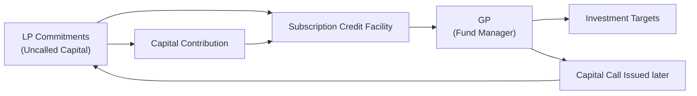

## Introduction

Ever had that moment when you’ve agreed to pay for something big—like a group gift with friends—but the organizer just doesn’t ask for your share right away? Maybe they front the money and then collect from you later. Well, subscription credit facilities (often called “subscription lines”) in the private equity world are somewhat similar in spirit. Instead of immediately calling investors for capital when an investment opportunity pops up, the General Partner (GP) of a fund might use a short-term loan to handle the purchase, then wait a bit before “calling” the capital from Limited Partners (LPs). It’s kind of like fronting the money. But the difference here is that the fund uses uncalled (but committed) capital from LPs as the collateral for that loan.

Now, subscription lines may sound like just a handy cash-management trick, but they bring along some serious implications for both GPs and LPs. They can affect measures such as internal rate of return (IRR), risk, and the overall transparency of a fund’s performance. Let’s walk through this in simpler terms, discuss why these lines matter so much, and explore how to keep things in check.

## A Closer Look at Subscription Credit Facilities

Subscription credit facilities are essentially short-term loans secured by LPs’ uncalled capital commitments. Instead of the fund’s assets themselves acting as collateral, the “promise” of LPs to contribute capital when called is the base for borrowing. GPs might say, “You know what, rather than bugging our LPs for small capital calls at random times—which can be a hassle for everyone—we’ll just take out a short-term loan, invest swiftly, and then call the capital later.”

### How Do These Facilities Work?

Here’s a simplified sequence of what typically happens:

1. The GP secures a subscription credit facility with a lender.  
2. The lender reviews the creditworthiness of the fund, focusing on the quality of the LP base and the legal enforceability of their commitments.  
3. When an investment opportunity arises, the GP draws on the facility to fund that deal.  
4. Later, to repay the borrowed amount, the GP issues a capital call to LPs, using the contributions to settle the outstanding loan.  

This arrangement might spare LPs from receiving multiple small calls every other month. That can be especially helpful for LPs like pension plans or endowments who have to plan around certain bureaucracy or liquidity constraints. On the other hand, GPs appreciate not having to wait for capital to trickle in and can maintain better agility in seizing time-sensitive investments.

### Why Bother with These Lines?

You might wonder: “If the money’s eventually going to come from the LPs anyway, why does a fund even need a loan?” A few reasons:

• Short-term bridging: Let’s say an extremely attractive deal suddenly appears. With a subscription line, the GP can act quickly before calling capital.  
• IRR Enhancement: Because IRR calculations are sensitive to the timing of cash flows, delaying capital calls can theoretically polish performance metrics (at least in the short run).  
• Operational ease: Subscription lines can free the GP (and the fund operations team) from making repeated capital calls, which can be logistically complicated and might strain LP relationships if done too frequently.  
• Competitive Edge: Funds might also appear more nimble and thus potentially more attractive to prospective investors who dislike repeated capital calls or uncertain timelines.

## Impact on Performance and Transparency

### The IRR Effect

The Internal Rate of Return (IRR) is perhaps one of the most closely watched metrics in private equity. In normal circumstances, the IRR is calculated based on actual cash inflows (distributions) versus outflows (contributions). With a subscription line in play, the initial outflows (the capital you’d expect to be called from LPs at the start of an investment) can be postponed until some future date.

• Earlier Deal, Later Cash Flows: When you delay calling capital, you’re effectively reducing the “time” that LP capital is at work—on paper—while still capturing the full returns once the investment is exited.  
• Enhanced IRR: Because IRR calculations treat capital not yet called (i.e., not yet shown as an LP outlay) as if it’s not invested, the short-term IRR figures can look better than if capital had been drawn down at the actual point of investment.  
• Potential Overstatement: If a fund relies too heavily on these facilities, the reported IRR might look artificially high compared to the underlying “real” performance.  

Often, investors and industry groups like the Institutional Limited Partners Association (ILPA) encourage GPs to provide adjusted metrics or additional reporting that clarifies the effect of subscription lines on returns. That way, LPs can see both the IRR with and without the facility usage.

### When Leverage Risks Creep In

Even though these subscription lines might not be direct leverage on the portfolio assets—since they’re secured by uncalled capital—they still represent leverage in the sense that the fund is borrowing money. If used excessively or if capital markets tighten, there’s a chance those lines become more expensive or less available. In a worst-case scenario, you could see mismatches between investment liquidity and the ability to draw down capital to repay the loan. Essentially, funds end up with a potential mismatch of timing or, in more extreme cases, a liquidity crisis.

I once had a colleague who remarked, “It’s all good until you need to call capital immediately and find out half your investors are facing their own liquidity challenges.” While that might be an extreme example, it highlights the fundamental reliance on LP capital. If ever that capital is not readily available to repay the subscription line, the fund could be in trouble.

Moreover, from a portfolio perspective, you want to keep an eye on the total leverage in the structure. A moderate subscription line can be a neat smoothing tool, but if the line grows large relative to uncalled capital or invests in particularly volatile assets, it’s adding leverage and risk many LPs might not have bargained for.

## Covenants and Legal Considerations

No lender will just hand out a facility without some guardrails in place, right? The same logic applies to subscription lines. Traditionally, lenders set various covenants in the credit agreement, including:

• Strength of LP base: The facility often depends on the ratings or perceived creditworthiness of top-tier LPs (e.g., sovereign wealth funds, large pension plans, etc.).  
• Maximum Borrowing Limits: The subscription line might be capped at a specific percentage of total uncalled capital.  
• Legal Enforceability: The lender will want to ensure that LP commitments are legally binding and that the fund’s partnership agreement doesn’t restrict raising debt in this manner.  

If any of the fund’s large LPs default or suffer a severe credit downgrade, the fund might lose access to the facility or face tougher terms. Also, typically, the moment the GP calls capital, LPs are legally bound to meet that call. If for any reason LPs cannot or do not pay, the fund’s default provisions (and in turn the lender’s rights) come into play, which can be quite messy. Keeping a strong handle on covenant compliance is thus crucial for the GP to maintain a smooth relationship with lenders and protect the fund’s reputation.

## Practical Examples and Case Studies

Let’s dig into some simplified examples to illustrate the outcomes:

### Example 1: Short-Term Bridge for an Acquisition

• A fund spots a mid-market buyout deal requiring $10 million.  
• The GP doesn’t want to call capital immediately, so it draws $10 million from a subscription line.  
• Two weeks later, the GP issues a capital call to LPs, who provide $10 million.  
• The GP repays the line in full the following day.

End result? The time that LP capital is actually in the fund is shortened by two weeks in the IRR calculation, potentially improving IRR if the asset is sold at a profit down the road. This keeps the capital call process simplified, but the difference in IRR might be negligible unless multiple deals and extended bridging periods accumulate.

### Example 2: Delayed Calls to Enhance IRR

• A fund invests in a portfolio of companies over a 12-month period using repeated draws from its subscription line.  
• LP capital calls are delayed significantly, say until close to the second year.  
• The portfolio matures, and some investments are exited within four or five years.  
• On paper, the IRR might disproportionately benefit from these delayed inflows, because the clock on LP capital involvement starts later than the real economic exposure of the deal.

Such a scenario can inflate reported IRRs in fund marketing materials, which can be misleading if the effect isn’t disclosed.

### A Mermaid Diagram to Visualize the Flow

Below is a simple Mermaid diagram illustrating how capital moves between LPs, the GP, and the subscription line. Picture each box as an actor in this short funnel of money:

1. The GP secures a subscription credit line based on the uncalled capital from LPs.  
2. The GP taps the line to invest in opportunities.  
3. At a later date, a capital call is issued and LPs contribute the required capital.  
4. Those contributions repay the subscription line.  

## Best Practices and Transparency

• Limit the facility’s duration: Subscription lines are best kept short. Extended usage can distort returns and overshadow the true capital at risk.  
• Disclose subscription line usage clearly: Provide LPs an adjusted IRR (or additional performance figures) that reflect what the IRR would’ve been if capital had been called in a more traditional (timely) manner.  
• Monitor overall leverage: Recognize that subscription lines do introduce borrowings; keep track of the fund’s total leverage, including any portfolio-level debt.  
• Align with LP objectives: Understand that some institutional investors actually favor the convenience, while others may be uncomfortable with the idea that reported performance is being “smoothed” or “enhanced” through a facility.  
• Respect covenants: Stick to covenant requirements (e.g., maximum facility draws). Breaching these is not only legally problematic but can also sour relationships with lenders—and in severe cases, hamper the fund’s ability to invest effectively.  

## Potential Pitfalls

1. Artificial Performance Boost: Delayed capital calls can make reported IRRs higher than the actual economic reality. LPs should question whether they’re seeing the underlying returns or a “timing trick.”  
2. Higher Fees: Some subscription facilities carry non-trivial interest rates and fees, which might ultimately reduce net returns for LPs.  
3. Sleepwalking Into Leverage: Over-reliance on borrowed funds always adds risk, even if it’s backed by capital commitments.  
4. Liquidity Mismatch: If a capital call is unexpectedly large or poorly timed, LPs may struggle to meet contributions quickly, placing stress on the fund and possibly triggering default provisions.  

## Summing It Up

Subscription lines can be a wonderful tool for bridging investments, smoothing capital calls, and maybe even boosting IRR—at least on the surface. But the story doesn’t end there. Excessive or prolonged use of these facilities can raise leverage, mask true performance, and even lead to potential liquidity pitfalls. So, if you’re a GP, use these lines accurately, responsibly, and transparently. If you’re an LP, keep a close eye on them and request that your GPs provide “with and without line usage” metrics for performance.

In other words, subscription lines shouldn’t be demonized outright. They can make life easier for both fund managers and investors. Just be sure that the trade-off between convenience and genuine performance measurement is well understood and well managed.

## Glossary

• Subscription Credit Facility (Subscription Line): A short-term loan to a fund collateralized by LP capital commitments rather than the fund’s portfolio assets.  
• IRR (Internal Rate of Return): A performance metric that can be temporarily boosted by the delayed calling of investor capital.  
• Covenants: Legally binding conditions in a credit agreement, often limiting how a borrower can use the loan, dictating maximum leverage, and ensuring the presence of sufficient collateral.

## References

• CFA Institute content on leverage in private funds  
• “A Comprehensive Guide to Subscription Credit Facilities” by Global Legal Insights (https://www.globallegalinsights.com/)  
• ILPA guidelines on reporting the impact of subscription lines  

## Final Exam Tips

• Clarify IRR Adjustments: You might see exam questions that ask for the calculation of IRR both with and without a subscription line’s effect. Practice adjusting cash flow timelines accordingly.  
• Covenant Monitoring: Expect scenario-based questions on how a breach could occur or how covenant requirements might restrict fund operations.  
• Risk Assessment: Be prepared to discuss how subscription lines affect the overall risk profile of a fund, especially in a multi-asset portfolio context.  
• Ethical Implications: The CFA® Program often emphasizes transparency. Demonstrate awareness of how subscription lines could obscure performance and the best practices for disclosures.

## Test Your Knowledge: Subscription Credit Facilities and Fund Leverage



### Which of the following best describes the main purpose of a subscription credit facility?

- [ ] To invest in high-yield bonds within a fund portfolio.
- [ ] To guarantee a fund’s portfolio returns.
- [x] To provide short-term loans to a fund, secured by uncalled LP commitments.
- [ ] To enhance the fund’s cash flow by selling off portfolio assets.

> **Explanation:** Subscription credit facilities allow a fund to borrow against uncalled capital commitments, ensuring short-term liquidity without immediately calling capital from LPs.

### Which of the following can happen due to the delay of capital calls using a subscription credit facility?

- [x] An artificially inflated IRR in the short term.
- [ ] A guaranteed increase in absolute returns.
- [ ] A reduction in portfolio risk across all assets.
- [ ] Elimination of all fund-level borrowing costs.

> **Explanation:** By postponing the actual capital outflow from LPs, the fund can shorten the measurement period for IRR, thus potentially boosting reported short-term IRR figures.

### If an LP defaults on its capital commitment, which of the following is most likely to occur in the context of a subscription line?

- [ ] The subscription line converts to an equity stake in the fund.
- [x] The lender may restrict or reduce the fund’s borrowing capacity.
- [ ] The GP is automatically required to close the fund.
- [ ] The IRR is unaffected by the LP’s default.

> **Explanation:** Lenders commonly base subscription line availability on the creditworthiness of the LP pool. A defaulting LP could force lenders to revise the terms or reduce the credit line.

### A key covenant in a subscription credit facility might limit:

- [ ] The price at which the fund buys portfolio companies.
- [ ] The selection of auditors for the fund.
- [x] The maximum proportion of uncalled capital that can be borrowed.
- [ ] The choice of location for the GP’s main office.

> **Explanation:** Lenders typically cap the amount a fund can borrow as a percentage of total uncalled capital, ensuring adequate collateral at all times.

### Which statement about subscription lines is accurate?

- [x] They are secured by LP capital commitments.
- [ ] They uniformly increase total fund distributions.
- [x] They can lead to timing distortions in reported performance metrics.
- [ ] They always reduce overall fund risk.

> **Explanation:** A subscription line is collateralized by uncalled investor commitments; using these facilities can create timing distortions in IRR calculations. While they may help with cash management, they do not inherently reduce the fund’s risk level.

### What is a significant downside of prolonged use of subscription credit facilities?

- [x] The IRR may become less reflective of the true economic performance of the fund.
- [ ] They permanently increase the number of GP staff needed.
- [ ] All LP commitments must be converted to equity upfront.
- [ ] They allow unlimited draws from the central bank.

> **Explanation:** When usage of these facilities is extended, the timing mismatch between actual investments and recorded capital calls can obscure the real performance.

### In a stress scenario where LPs face liquidity challenges, how might a subscription facility exacerbate risks?

- [x] The fund may be unable to repay the line if the LPs delay or default on capital calls.
- [ ] The IRR automatically increases, lowering fund performance risk.
- [x] The facility is legally converted into equity by the lender.
- [ ] The GP can cancel the facility at zero cost to avoid any risk.

> **Explanation:** The biggest concern is that subscription lines rely on LPs to fulfill their capital commitments when the GP needs to repay the loan. If LPs cannot or do not meet the call, the fund can fall into significant liquidity trouble.

### Why might a lender be comfortable offering a subscription line to a private equity fund?

- [ ] They assume the fund’s underlying businesses can easily be sold.
- [x] They examine the creditworthiness of committed LPs and rely on binding LP commitments.
- [ ] This type of lending is always backed by a government guarantee.
- [ ] They do not require any collateral or covenants.

> **Explanation:** The subscription line is secured by the LP commitments, which are legally binding. Lenders assess the LP base and covenants to ensure creditworthiness.

### In practice, how can a GP balance the use of subscription lines without compromising fund transparency?

- [x] They provide detailed disclosures on the impact of subscription lines on IRR.
- [ ] They avoid using subscription lines altogether.
- [ ] They only call capital once the final investment exits are known.
- [ ] They use subscription lines exclusively for all cash inflows and outflows.

> **Explanation:** The best practice is to communicate openly with LPs about how the facility is used and provide metrics illustrating performance both with and without these short-term loans.

### True or False: A subscription credit facility never introduces any leverage or risk to a fund because it is backed by LP capital commitments.

- [x] True
- [ ] False

> **Explanation:** Actually, this statement is tricky. While subscription lines are often considered “low-risk” because they’re backed by LP commitments, they still introduce leverage at the fund level. This statement, as worded, suggests they add no risk, which is misleading. A more accurate perspective is that they are typically lower risk compared to some forms of leverage, but they certainly don’t eliminate risk altogether.


