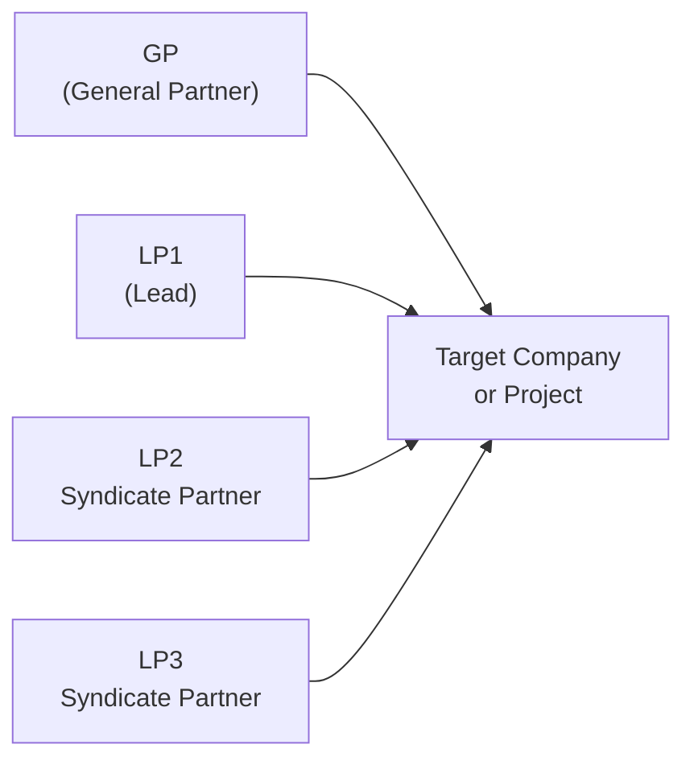

## Introduction
Syndication and co-investment relationships have become pivotal tools across the private markets spectrum. From a personal perspective, I vividly recall the first time I assisted in a midsize buyout deal: our general partner (GP) recognized that the opportunity exceeded our single-investment limit—basically, we had a maximum amount the fund could dedicate to one target. So the GP invited partners from another fund to join. It felt almost like calling a friend to help carry a really heavy couch upstairs. That call made the difference, ensuring risk was spread out and the deal got done.

But there's more to syndication than simply dividing the tab, and co-investments push that logic even further, creating an opportunity for limited partners (LPs) to invest directly in a company or project—often at better economic terms. If you're thinking, “So, it’s mostly about saving on fees, right?” Well, sure, but it also changes the risk profile and governance structure. And it’s these nuances that matter most for your CFA exam and, frankly, your career in private investments.

Below, we'll talk about what syndication and co-investment are, the mechanics behind them, their greatest benefits and hazards, plus best practices drawn from real-world experiences. Get comfortable—there’s a lot to unpack.

## The Role and Mechanics of Syndication
When a GP structures a deal syndication, they’re essentially inviting multiple investors to share in a single investment. This can happen if the deal size surpasses the GP’s single-investment limit or if specialized expertise is beneficial: maybe one investor is an industry expert, while another has unique geographic insights.

Syndication is also about sharing the love—and the load. Each syndicate member invests a portion of the equity, thereby diffusing capital exposure. The GP typically negotiates the main terms, but each participating LP or external investor has its own negotiated rights and obligations. Key items to watch include:
• Allocation of economics across participants  
• Governance, including which investor has board representation  
• Alignment on the exit strategy (timing, strategy, who calls the shots)

Communication across these parties is vital. Syndicated deals can shift direction if the GP’s plan changes, if some participants are short on capital calls, or in the (hopefully rare) case of a disagreement that triggers buy-sell clauses. You might be thinking, “Wow, that sounds complicated.” Indeed, it can be. But the advantage of harnessing multiple capital sources, specialized skill sets, and risk diversification often outweighs the complexity.

### Diagram of a Typical Syndicated Transaction



In this diagram, the GP and multiple LPs (or syndicate partners) invest capital directly into the target company or project. Each party may hold a distinct ownership percentage, as set forth in a syndication agreement.

## Co-Investment Opportunities
Co-investments let LPs invest alongside the main fund—often at a reduced or even zero management fee or carried interest. Here’s the typical scenario: the GP identifies a compelling investment opportunity, and the main fund invests up to its allowable threshold. But if there’s a gap or if the GP simply wants to minimize concentration in their fund, the GP offers selected LPs the “privilege” to put more capital into that very same deal, directly. Some see it as an opportunity for a bonus round—others see it as a concentrated risk to watch carefully.

### Pros of Co-Investment
• Lower Fees: Typically, co-investment capital is spared the layer of standard management fees and carried interest that apply to the main fund.  
• Direct Exposure: LPs get a seat at the table (albeit a smaller one) to shape or review major decisions in a single company.  
• Flexibility: LPs can be more selective—opting in for the deals they find most compelling.  

### Cons of Co-Investment
• Concentration Risk: Putting more eggs in one basket if that co-investment is also a large chunk of the LP’s overall portfolio.  
• More Demanding Diligence: LPs usually have a shorter window to evaluate the opportunity, and co-investment deals can move quickly.  
• Potential Conflict: Some LPs might suspect that GPs reserve the best deals for themselves, while pushing out lesser ones to co-investment partners.  

## Aligning Strategies and Governance
Whether you go the syndicate route or join a co-investment, keep your eyes on alignment. You don’t want to end up in a situation where the GP wants to exit in three years, but your key co-investor is itching for a quick flip in a year. Governance alignment clarifies:
• Decision rights (voting thresholds, board seats)  
• Exit horizons and conditions (e.g., forced sale triggers, tag-along/drag-along rights)  
• Follow-on capital decisions  

If the deal environment changes—maybe there’s an economic downturn, or the target’s strategic pivot—strong governance ensures that none of the parties are blindsided. These aspects show up on the CFA exam in scenario-based questions. You might be presented with a complicated set of inputs: for instance, the GP’s desire for a quick exit vs. the co-investor’s preference to hold for synergy with another portfolio company. You’ll need to parse the best solution given the investment policy statement (IPS) restraints and the overarching portfolio strategy.

## Single Investment Limits and Deal Sizing
Most closed-end funds define a single investment limit in the partnership agreement. This is commonly 10–20% of total committed capital, though it varies by strategy. If a fund with $500 million in committed capital has a maximum single investment limit of 15%, that means any one deal cannot exceed $75 million from the fund. Here’s where syndication or co-investment can bridge the difference: the GP can bring in partners or offer co-investment rights so that the total deal size might be, say, $100 million or $125 million.

The primary reason for these limits is diversification. A fund with a single company comprising 50% of the portfolio is a high bet that can upend everything if that investment goes sour. Another angle is regulatory or internal risk policy frameworks—especially relevant for pension funds or insurance companies who must abide by risk-based capital rules.

## Economic Calculations and IRR Perspectives
From a numerical standpoint, these syndication and co-investment strategies also affect net returns. When co-investments bypass or reduce fees and carried interest, the difference in net IRR versus the main fund’s IRR can be notable. Imagine the net annual management fee is 2% and the carry is 20%. If an LP invests additional capital outside that fee structure, they keep that portion of the returns for themselves, net of only direct deal expenses.

Mathematically, the standard Internal Rate of Return (IRR) is the rate r such that the net present value (NPV) of cash flows is zero:


\text{NPV} = \sum_{t=0}^{T} \frac{CF_t}{(1 + r)^t} = 0


For a co-investment, you would discount your direct capital outflows and inflows separately from the main fund’s flows—resulting in a potentially higher net IRR if the investment performs well. However, keep in mind negative scenarios: a concentrated co-investment that goes bust will weigh heavily on your overall return.

## Example: Python Simulation of Concentration Risk
Below is a tiny snippet of Python code that simulates how increasing your co-investment slice might affect your total portfolio volatility. (Don’t worry if you’re not a coding whiz; the script is meant to illustrate how you can model risk scenarios in a pinch.)

```python
import numpy as np

np.random.seed(42)

num_sims = 10_000
base_returns = np.random.normal(loc=0.08, scale=0.15, size=num_sims)  # 8% mean, 15% std dev
coinv_returns = np.random.normal(loc=0.12, scale=0.25, size=num_sims) # 12% mean, 25% std dev

for co_perc in [0.0, 0.05, 0.1, 0.2]:  # fraction of entire portfolio used for co-invest
    port_ret = (1 - co_perc)*base_returns + co_perc*coinv_returns
    print(f"Co-invest at {co_perc*100:.0f}% -> Mean Return: {port_ret.mean():.2%}, Volatility: {port_ret.std():.2%}")
```

In this hypothetical, the co-investment is higher return on average but also higher volatility. Notice how, as you increase the fraction of your portfolio allocated to co-investments (co_perc), you might boost returns—but also your overall risk (standard deviation) climbs.

## Practical Considerations and Pitfalls
1. Time Constraints: Co-investments often come with a short fuse. LPs have to mobilize diligence quickly, or risk missing out.
2. Conflicts of Interest: The GP might prefer to keep the best deals in-house. Meanwhile, the LP wants the best deals for sure. Transparent selection criteria are crucial to maintain trust.
3. Over-Concentration: Even though co-investing can yield better returns, you might end up overexposed to a single deal. This can disrupt your portfolio’s correlation structure and risk profile.
4. Legal Complexities: Cross-border syndications can muddy the waters with different tax treaties, regulatory constraints, IFRS vs. US GAAP reporting, and so on. I recall a deal bridging three continents once—our attorneys spent weeks figuring out the patchwork of tax implications.
5. Fee Arrangements: The main draw for co-investors is typically reduced or no additional carry. But watch out for hidden fees such as deal-related expenses or administrative fees in side agreements.

## Best Practices for Syndication and Co-Investment
• Thorough Due Diligence: Resist the temptation to say “yes” to every co-investment. Conduct deal-specific analysis or outsource it to a trusted adviser.  
• Strong Communication: Keep lines open between GP and all syndicate members. Everyone should be crystal clear on exit scenarios, capital calls, and governance.  
• Align Incentives: Ensure the fee structure and carried interest split feel fair. As an LP, you want the GP to have “skin in the game.”  
• Document Everything: Use robust side letters or subscription agreements that outline each party’s rights, obligations, and fees.  
• Oversee Internal Compliance: For regulated institutions such as insurance companies or pension funds, ensure that adding syndicated or co-investment exposure adheres to capital requirements.

## Real-World Anecdote
I once worked with a mid-sized pension fund that hopped on a co-investment deal involving a tech start-up. It was a dream: the GP was a well-known name, the star founder had an incredible track record, plus the co-investment terms were sweet—no management fee, half the standard carry. But after a year, the founder pivoted the company’s strategy drastically. The pension fund found itself heavily reliant on the GP’s judgment, with minimal say in daily operations. The relationship eventually led to tension, but having the right governance structure in place resolved most issues. Despite a rocky year, that company eventually soared in value, generating a net IRR well above the main fund’s performance. Moral of the story? The short-term storms can lead to big payoffs, provided you do your homework and keep an alignment in place.

## Exam Relevance and Final Thoughts
For the CFA exam, especially at upper levels, you might be asked to:  
• Evaluate an LP’s decision to accept a co-investment, factoring in risk constraints and fee reductions.  
• Compare and contrast outcomes of a pure fund investment vs. a syndicated or co-investment stake.  
• Navigate potential conflicts of interest or limited governance rights in a scenario-based question.  
• Propose how to structure a side letter that addresses a co-investor’s unique needs.  

It’s wise to practice scenario-based problems that incorporate real, tangible complexities—especially around fee waterfalls and alignment. Syndication and co-investment are not simply definitions on a page: they’re living processes that shape your portfolio’s risk and return profile.

## References
• “Co-Investment in Private Markets” by Preqin  
• “Syndicated Investments in Practice” – Harvard Business Review Case Studies  
• CFA Institute Materials on Partnership Governance  
• IFRS 10 & IFRS 12 for guidance on consolidation and disclosure of interest in other entities  

Remember, if you’re approaching these structures in real life, spend time on the legal docs—you’ll thank yourself later!

## Exam Tips
• Read each scenario carefully—pay attention to the single investment limit, management fee structures, and potential conflicts of interest.  
• Know the difference between net IRR from the main fund vs. the co-investment. Shifting fees and carried interest can exert a significant influence.  
• Emphasize risk management, especially around a potential mismatch in time horizons or exit strategies among syndicate partners.  
• If a question references reporting standards, consider IFRS or local GAAP regulations that might dictate consolidation or disclosures.  
• When building your answer, connect the dots back to your portfolio’s overall strategic asset allocation. Don’t treat co-investments as an isolated pocket of capital.

--------------------------------------------------------------------------------

## Test Your Knowledge: Syndication and Co-Investment Options



### A GP is most likely to form a syndicate when:
- [x] The deal size exceeds the fund’s single-investment limit.
- [ ] Multiple LPs request fee reductions.
- [ ] The GP wants to avoid all forms of partnership governance.
- [ ] The GP needs to maintain 100% control over investment decisions.

> **Explanation:** Syndication is essentially about sharing a deal that surpasses a fund’s single-investment limit and/or leveraging specialized expertise. Fee reduction is more characteristic of co-investment deals rather than syndication.

### Which of the following is a primary advantage of co-investing for an LP?
- [ ] Increased exposure to management fees.
- [x] Opportunity to invest at lower or no additional fee structures.
- [ ] Enhanced requirement to cover all GP expenses.
- [ ] Guaranteed board seats in the target company.

> **Explanation:** Co-investments often come with reduced or no fees or carry, which is their main appeal to LPs. They do not automatically guarantee a board seat or increased management fees.

### Two LPs co-invest in a project along with the main fund. Their biggest risk is:
- [ ] They will inadvertently diversify their portfolios further.
- [ ] They will retain excessive liquidity.
- [x] They might become over-concentrated in a single deal.
- [ ] They will reduce their returns due to high carried interest.

> **Explanation:** By co-investing, LPs risk concentrating their capital in one particular investment. If that investment underperforms, it can have an outsized effect on their portfolio.

### A key governance concern in a syndicated deal is:
- [ ] Lack of any contractual documentation.
- [x] Proper alignment on exit strategies and distribution of decision rights.
- [ ] Choosing the highest management fee possible to incentivize the GP.
- [ ] Ensuring the GP overrules all LP input for consistency.

> **Explanation:** A major governance challenge is making sure all participants agree on issues like exit timing and who holds voting power. Contracts must establish clarity for future decisions.

### An LP should conduct thorough due diligence on co-investment deals primarily because:
- [x] Co-investments often involve shorter decision windows and higher risk concentration.
- [ ] The GP handles most of the diligence anyway, so LP diligence is optional.
- [ ] Co-investments always involve lower returns than fund investments.
- [x] Comprehensive diligence is rarely necessary for smaller allocations.

> **Explanation:** Co-investments typically require accelerated diligence, and they can lead to higher concentration in a single investment. LPs need to ensure they fully understand the underlying risk.

### A single investment limit in a partnership agreement is meant to:
- [ ] Force the fund to invest minimally in every opportunity.
- [ ] Provide a legal reason to avoid large deals entirely.
- [x] Encourage diversification and limit overexposure to any one investment.
- [ ] Guarantee maximum carry payments for the GP.

> **Explanation:** Single investment limits reduce the risk of heavy concentration in a single deal, ensuring more diversified fund exposure.

### One potential conflict with co-investment deals is:
- [ ] The GP offering exclusive co-investments to only smaller, unknown investors.
- [x] GPs might retain top-performing deals for themselves while offering lesser deals to co-investors.
- [ ] No side letters are ever used in such arrangements.
- [ ] All co-investments must be offered to every LP equally.

> **Explanation:** A classic conflict is that GPs could be tempted to keep the most attractive deals for the main fund or themselves, leading LPs to worry about adverse selection on co-investment offerings.

### With a co-investment approach, an LP’s net IRR may be higher because:
- [ ] The manager charges the highest fees possible on co-investment capital.
- [x] Reduced fees and carried interest on the co-investment portion can enhance returns.
- [ ] The LP is forced to invest for a longer lock-up period.
- [ ] Co-investment deals usually produce negative returns, boosting net IRR by contrast.

> **Explanation:** Because co-investment deals typically come with reduced or waived fees, the net IRR for that portion of capital can exceed what the standard fund investment would yield.

### From a risk-management standpoint, syndicated deals:
- [ ] Are inherently safer because no agreement is necessary among partners.
- [ ] Always include government guarantees.
- [x] Allow multiple investors to share capital exposure and specialized knowledge.
- [ ] Are only available to unaccredited investors.

> **Explanation:** The core benefit of syndication is sharing both the financial risk and the specialized expertise. There’s no government guarantee involved, and syndicated opportunities typically require accreditation.

### In a scenario where a GP approaches an LP with a co-investment proposal after the fund is fully committed, which statement is TRUE?
- [x] The LP can commit additional capital outside the regular fund structure, often with reduced or no fees.
- [ ] The LP cannot legally invest since the fund has no remaining capacity.
- [ ] The GP is always prohibited from approaching LPs for extra capital.
- [ ] Co-investment is deemed a violation of standard diversifying principles.

> **Explanation:** Even if the fund itself is near or at its limit, a GP may still offer co-investment deals to an LP. This external, direct investment typically benefits from cost savings for the LP.


