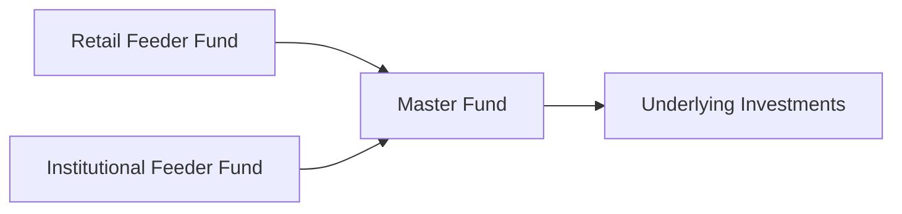

## Introduction and Context

So, have you ever wondered why big pension funds, endowments, and huge insurance companies usually dominate private market investing? If you look around at the limited partners (LPs) in a typical private equity or private credit fund, it’s these large, sophisticated, institutional investors that often have the biggest seats at the table. This dynamic has started to change in recent years, though, as more retail investors (individual or smaller-scale) want in on the private market action. 

I remember chatting with a neighbor who was super excited about the idea of buying a piece of a private equity fund. She got the tip from a friend who’d bragged about the big returns they’d racked up investing in “exclusive” deals. My neighbor discovered, however, that the minimum investment requirement was practically the size of a house down payment. The conversation inevitably turned to feeder funds and newly created retail-friendly structures. Suffice it to say, this shift toward broader, more democratized access is real—yet it also carries complexities worth exploring.

Below, we’ll walk through how these institutional and retail LP structures differ, why they matter, and what trade-offs arise for investors and general partners (GPs) designing private-market products.

## Key Distinctions Between Institutional and Retail LPs

Before we dive into specialized fund structures, it helps to understand how institutional and retail investors differ in terms of resources, expectations, and overall approach:

• Capital Size and Consistency: Institutions tend to write much larger checks, often spanning tens or hundreds of millions of dollars. Retail investors, in contrast, might invest anywhere from a few thousand to a few hundred thousand.  
• Investment Horizon: Institutions often have long-term liabilities (think pension obligations or university endowments) and thus are more comfortable locking up capital for extended periods. Retail investors can be more liquidity-sensitive and might need access to their funds on shorter notice.  
• Due Diligence Capabilities: Institutional LPs usually have entire teams devoted to analyzing fund strategies, manager track records, and the fine print of limited partnership agreements. Most retail investors lack the same bandwidth, often relying on simplified marketing materials or external advisors.  
• Regulatory Protections: Institutions are assumed (legally) to be more sophisticated and need fewer regulatory shields. Retail investors fall under stricter protections—everything from minimum investment thresholds to strict marketing rules that limit who can even see a “private fund” pitch.

All these differences shape how funds must structure themselves to accommodate either (or both) investor groups.

## Why Institutional Investors Continue to Dominate

Institutional investors have occupied the spotlight in private markets for decades. Here’s why:

• Larger Commitments: Pension funds, insurance companies, and sovereign wealth funds often serve as anchor investors. This not only helps GPs reach their fundraising targets but also signals credibility to other potential LPs.  
• Negotiating Power: With large check sizes, institutions frequently negotiate custom reporting, better fee terms, or side letters (extra contractual clauses) that might be unavailable to smaller investors.  
• Extended Horizons and Patience: Institutions generally understand the illiquid nature of private markets. They have liabilities measured in decades, enabling them to “park” capital without worrying about short-term volatility.  
• Sophistication: Most institutions run thorough due diligence on a potential manager’s track record, risk controls, operational setup, etc. This approach fosters deeper partnerships with GPs, who often cater to institutional demands for specialized mandates or theme-based investments.

Yet, as more individual investors crave the returns and diversification perceived in private markets, the question becomes: how do we create structures that allow smaller investors to participate safely and effectively?

## Retail Investors’ Pathways to Private Markets

Retail investors, by definition, are individuals or smaller non-institutional entities with less bar-setting capital. But that doesn’t mean they’re not eager to invest. Traditional private equity or real estate funds usually set million-dollar (or high six-figure) minimums, effectively excluding the general public. Nowadays, GPs utilize multiple approaches to meet growing retail demand:

• Feeder Funds: A feeder fund “feeds” capital from multiple smaller investors into a master fund. This approach aggregates smaller commitments and pools them to reach the higher hurdle that GPs typically require.  
• Registered Closed-End Funds: These are publicly registered vehicles, often under stricter regulatory regimes. By registering, the fund can market to a broader audience, typically with smaller minimum investments, but must offer greater disclosure and possibly some liquidity provisions.  
• Interval Funds or Tender Offer Funds: These specialized structures allow periodic redemption windows, giving retail investors an opportunity to exit at certain intervals rather than being locked in for 10+ years.  
• Broker-Dealer Platforms: Some broker-dealers and wealth management platforms facilitate private market access through special offerings that meet certain regulatory criteria.

## Regulatory and Compliance Considerations

Now, this is where things can get a bit tricky (and it’s also where I see my neighbor’s eyes start to glaze over). Retail-oriented funds must:

• Adhere to Strict Marketing Rules: GPs must ensure all promotional material meets compliance guidelines suitable for non-accredited or semi-accredited investors.  
• Provide Enhanced Disclosure: Retail-oriented offerings often come with lengthy prospectuses, standardized risk statements, and plain-English disclaimers for potential investors to review.  
• Maintain Liquidity Options: Regulatory bodies frequently require some form of periodic liquidity or redemption mechanism for retail investors, which influences portfolio construction and the fund’s overall strategy.  
• Ongoing Reporting Requirements: Managers may need to provide more frequent and transparent updates, which can be costly and operationally intensive.

GPs weigh these considerations carefully because broadening their investor base to retail can create administrative complexity, increased overhead, and potential compliance risks.

## Institutional vs. Retail: Structural Trade-Offs

Accommodating both institutional and retail investors in a single fund can be tempting for GPs aiming to increase total assets under management (AUM). But it’s rarely straightforward:

• Side Letters vs. Standard Terms: Institutions might demand separate side letters with custom liquidity or fee terms. Retail investors typically cannot negotiate individually, so they must accept a standard set of rules.  
• Investor Education: Institutions arrive with specialized knowledge and dedicated staff; retail investors often need more handholding, marketing materials, and simplified performance metrics.  
• Fee Structures: Institutional investors often push for lower management fees, or different carry structures, due to their large commitments. Retail investors might face slightly higher expense ratios if the entire fund’s compliance costs increase.  
• Reporting and Governance: Extra regulatory oversight for retail brings stricter governance. For example, compliance procedures for a registered closed-end fund exceed the typical private fund approach—translating into higher overhead.

Some managers launch separate vehicles: one for institutional investors and another “parallel” or “feeder” structure for retail. This setup ensures targeted compliance and operational differences that suit each group.

## Example: Master-Feeder Structure

A classic approach to blending retail and institutional capital is the master-feeder structure. Let’s illustrate in a quick diagram:

In this setup:

• The Master Fund is where actual investment activity (i.e., the portfolio of assets) resides.  
• Institutional investors feed capital into the Master Fund through the Institutional Feeder Fund, often enjoying negotiated terms.  
• Retail investors feed capital through the Retail Feeder Fund, which is subject to additional regulations and might have smaller minimums.  
• From a portfolio perspective, both feeder funds typically share proportionate economic exposure, but each has distinct fee schedules, reporting, and compliance frameworks.

## Potential Challenges and Best Practices

So, is opening the door to retail capital a panacea for GPs? Not always. Below are a few big challenges that crop up and some best practices on how to handle them:

• Regulatory Complexity: More investor protections mean higher legal and administrative costs. GPs may hire specialized counsel or compliance experts to navigate local and international regulations.  
• Liquidity Mismatch: Retail-friendly vehicles that promise periodic redemptions must carefully manage liquidity, often holding higher cash buffers or more liquid assets. This can dampen returns compared to purely illiquid private equity strategies.  
• Operational Scale: Handling thousands of smaller investors (as opposed to a handful of big institutions) requires robust back-office systems, technology solutions, and investor relations resources.  
• Educating Investors: Retail participants often need help understanding fee structures, performance measurement periods, capital calls, distribution schedules, and the inherent risks of private market allocations. Providing comprehensive (yet comprehensible) materials is key.

On the bright side, managers who navigate these hurdles successfully can tap into a broader pool of capital and diversify their LP base—spreading risk if a few large institutions decide to pull back.

## Personal Reflections

Honestly, I’ve seen how excited budding investors get about the notion of investing alongside large pension funds. They hang on to the idea that institutions are reaping handsome returns and want a piece of that pie. But it’s vital to realize that big institutions have entire teams performing deep analyses. Retail investors can benefit by piggybacking on a fund’s expertise, sure, but it’s crucial to go in with eyes wide open. Expenses, fees, lock-up periods, and layered complexity can be significant. 

Sometimes, if you’re a retail investor, it’s worth paying for an advisor who’s well-versed in private market opportunities to help you navigate the labyrinth. If you’re a GP exploring retail structures, be prepared for an entirely different level of investor communication and regulatory oversight.

## Conclusion and Exam Tips

For the CFA exam, especially at advanced levels, expect questions that compare and contrast how institutional versus retail LP structures influence fund design, investor protections, fee arrangements, and compliance burdens. A scenario-based question might ask you to evaluate the pros and cons of adding a retail feeder fund to a private equity strategy. Or you might see a question about how a manager’s liquidity management changes when retail investors are involved. 

Key things to remember:

• Institutions bring large, stable capital and often enjoy negotiating strengths.  
• Retail investors require more regulatory scrutiny, more accessible product structures, and potentially more frequent liquidity.  
• Feeder funds and parallel vehicles can help separate the regulatory overhead for each investor type.  
• The growth of democratized private investing is real but not without increased fund manager complexity.

Remaining mindful of these dynamics helps you tailor fund strategies to your LP base. And from an exam perspective, understanding these differences is crucial for both conceptual questions and case-based scenarios that test your ability to recommend appropriate fund structures.

## References

• “Retail Involvement in Private Markets” – CFA Institute Blog  
• “SEC Regulations on Private Investments for Retail Markets” – U.S. Securities and Exchange Commission (https://www.sec.gov/)  
• “Feeder and Master-Feeder Structures” by Thomson Reuters  

## Test Your Knowledge: Institutional vs. Retail LP Structures



### Which of the following statements best describes a key difference between institutional and retail LPs in private markets?

- [ ] Institutional LPs usually invest smaller amounts, leading to a diverse investor base.
- [ ] Retail LPs typically negotiate better terms due to their extensive due diligence capabilities.
- [x] Institutional LPs often negotiate custom fee arrangements and side letters based on their larger capital commitments.
- [ ] Retail LPs prefer longer lock-up periods.

> **Explanation:** Institutions commit significantly larger capital and possess greater negotiating power, often resulting in specialized provisions such as reduced fees. Retail investors typically invest smaller amounts and therefore often face standardized terms.

### Retail investors typically access private funds through which of the following?

- [ ] Direct subscriptions of $100 million or more. 
- [x] Feeder funds or registered closed-end funds designed for smaller commitments.
- [ ] Offshore special purpose vehicles only accessible to sovereign wealth funds.
- [ ] Sub-advised pension accounts with multi-decade lock-ups.

> **Explanation:** Retail investors commonly invest via feeder funds or special vehicles, such as registered closed-end funds, which allow smaller commitments but also require additional disclosure and compliance.

### One of the main reasons GPs often prefer institutional investors is:

- [x] They provide large, stable commitments and often have fewer liquidity demands.
- [ ] They are more heavily regulated, reducing the GP’s compliance burden.
- [ ] They typically require weekly redemptions.
- [ ] They rely solely on marketing brochures for due diligence.

> **Explanation:** Institutional investors supply significant and stable capital, which is vital for long-term, illiquid strategies. They also understand the complexities of private markets, minimizing short-term liquidity demands.

### In a master-feeder structure with both institutional and retail feeders:

- [ ] Retail and institutional investors share the same operational and reporting requirements.
- [ ] The master fund invests solely in government bonds.
- [x] The institutional feeder might have negotiated fee schedules, while the retail feeder faces standard terms and additional compliance requirements.
- [ ] The GP is mandated to return capital within 6 months.

> **Explanation:** Master-feeder setups let GPs tailor different feeder funds with distinct fee, reporting, and compliance structures. The institutional feeder often has negotiated terms, while the retail feeder adheres to broader rules.

### What is the primary regulatory challenge for GPs aiming to admit retail investors into a private fund?

- [ ] Negotiating side letters with large institutional investors.
- [ ] Establishing direct lending partnerships with government agencies.
- [x] Complying with stricter marketing rules and added disclosure requirements.
- [ ] Hiring an external asset manager to oversee daily operations.

> **Explanation:** Admitting retail investors triggers a more complex regulatory landscape focused on investor protection, which means stricter guidelines for marketing materials, disclosure, and operational transparency.

### Which of the following best characterizes an advantage of acquiring retail investors in a private fund?

- [ ] Reduced need for operational staff and compliance oversight.
- [ ] Guaranteed institutional capital levels.
- [ ] Immediate liquidity at zero cost.
- [x] Broader capital sources and diversification of the LP base.

> **Explanation:** While institutional money is larger, retail investors broaden the fund’s sources of capital. This can help managers diversify LP concentration risk, although it adds complexity in compliance and communication.

### What is a potential downside of offering an interval fund to retail clients?

- [ ] Increased restrictions on capital flows from institutional investors.
- [x] Reduced investment flexibility due to forced liquidity windows.
- [ ] Widespread dissatisfaction among institutional investors who prefer daily redemptions.
- [ ] No specific marketing restrictions from regulators.

> **Explanation:** Interval funds allow periodic redemptions for retail investors, which can constrain the fund manager’s ability to invest in longer-term, illiquid assets. This forced liquidity window is one key trade-off.

### Why might a GP create a parallel fund specifically for retail investors instead of combining institutional and retail investors in a single vehicle?

- [ ] To provide immediate redemptions to institutional investors.
- [x] To separate regulatory and compliance requirements for retail investors from those of institutional investors.
- [ ] To eliminate minimum investment thresholds for institutional investors.
- [ ] To ensure institutional side letters apply equally to retail investors.

> **Explanation:** Parallel vehicles allow GPs to tailor strategies, fee structures, and compliance processes to each investor type. Retail structures often face more stringent oversight, so separating them can be more efficient.

### Which of the following is a common requirement when marketing private equity feeder funds to retail investors?

- [ ] Minimal or no documentation to expedite fundraising.
- [ ] Flexible lock-up periods of less than one month.
- [ ] Guaranteed returns to adhere to retail regulations.
- [x] Plain-language disclosures and risk statements in compliance with regulatory guidelines.

> **Explanation:** Retail regulations typically mandate user-friendly disclosures, highlighting the risks. The emphasis is on ensuring non-institutional investors understand potential pitfalls and illiquidity risks.

### True or False: Institutional investors generally demand greater liquidity provisions than retail investors.

- [ ] True
- [x] False

> **Explanation:** Institutional investors typically have longer horizons and are more comfortable with illiquid assets. Retail investors are often more concerned about liquidity and shorter redemption windows.


