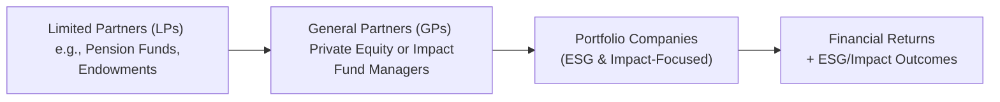

## Introduction

So, let’s be honest for a moment: not too long ago, many investors treated Environmental, Social, and Governance (ESG) criteria as a tangential concern—something nice to have, but hardly central to fund selection. These days, though, it’s become a crucial element for attracting new limited partners (LPs) and meeting global standards. From small venture capital funds to massive private equity vehicles, the conversation has shifted to, “How do we embed ESG into every stage of the investment process?” Even more exciting, there's been a boom in so-called impact-focused funds—specialized vehicles that explicitly target measurable social or environmental change while also seeking a return on capital.

In my own experience, the first time I heard about “impact investing,” I thought, “Wait, is that philanthropy under a fancy new name?” But peeling back the layers quickly revealed something a bit more nuanced. Impact investing focuses on generating both financial returns and measurable positive impact, bridging the worlds of responsible investment and robust portfolio performance. Whether it’s about combating climate change, creating jobs in underserved communities, or improving access to education, these strategies have captured the imagination of institutional investors and high-net-worth individuals alike.

Below, we’ll unveil the how and why of ESG and impact-focused funds in private markets, discussing everything from due diligence implications to standardized metrics and real-world examples of managers making a difference. You’ll also find best practices, potential pitfalls, and a healthy dose of real talk on how these approaches intersect with fundraising and capital flows.

## ESG vs. Impact: Understanding the Distinction

A key question often arises: “Is there a difference between ESG funds and impact-focused funds?” Yes, definitely. ESG integration generally refers to the practice of factoring environmental, social, and governance issues into the broader investment analysis. It doesn’t always mean the fund has a social or environmental impact goal as a primary objective—rather, it’s often about mitigating risks or capturing opportunities that mainstream analysis might overlook. By contrast, impact-focused strategies actively seek measurable outcomes, such as tonnes of CO₂ emissions reduced, new jobs created in low-income communities, or expansions in affordable healthcare coverage. While both ESG funds and impact funds consider “non-financial” factors, it’s the explicit, goal-oriented nature of impact investing that sets it apart.

## The Rise of ESG in Private Markets

ESG integration started out as a niche concept associated with conscientious “green investors” or philanthropic institutions. But as capital pools got bigger and awareness of systemic risks grew, GPs realized that ignoring ESG could derail deals, invite regulatory scrutiny, and hinder performance. On the flip side, incorporating ESG might:

• Lower regulatory and reputational risks.  
• Raise the quality of deal flow as companies aim for higher ethical standards.  
• Provide a competitive differentiator for fundraising.  
• Enhance long-term returns by aligning with sustainability megatrends.

### Regulatory and Reporting Pressures

Regulatory bodies worldwide continue to strengthen policies that require greater transparency around ESG risks. In the European Union, for instance, the Sustainable Finance Disclosure Regulation (SFDR) imposes stringent sustainability-related disclosure obligations. Meanwhile, the U.S. Securities and Exchange Commission (SEC) has been rolling out proposals to enhance climate risk disclosures for publicly listed companies. Although private funds might not bear the same disclosure burdens, they increasingly align with these trends to remain attractive to LPs.  

### UN PRI and Other Frameworks

Many GPs commit to frameworks like the United Nations Principles for Responsible Investment (UN PRI), which provides guidelines and best practices for ESG integration. By signing these Principles, managers agree to incorporate ESG factors into their investment processes and to report annually on their progress. This not only enhances transparency but helps standardize ESG metrics for investors who demand more consistent reporting across the private markets space.

## Impact-Focused Funds: Linking Purpose and Profit

Unlike ESG-integration strategies that might simply seek to avoid environmental or social harm, impact investing aims to create a positive effect. For instance, an impact-focused real estate fund might invest in affordable housing developments that also incorporate environmental efficiency standards. It’s not just about monitoring the carbon footprint of the buildings—they want to ensure that these properties directly benefit lower-income tenants, perhaps via lower rent or better community facilities.

### The Four Core Elements of Impact Investing

1. Intentionality: The manager is explicit about the positive social or environmental outcomes.  
2. Measurability: There are clear metrics used to track and report impact.  
3. Financial Return: Impact funds intend to generate at least a market-rate return, though some accept concessionary returns for higher impact.  
4. Additionality: The investment leads to outcomes that likely would not have occurred otherwise.

These elements differentiate impact investing from other strategies that may align with philanthropic or corporate social responsibility goals but are less rigorous in measuring and reporting outcomes.

## ESG and Impact in Fundraising

Private equity and private debt managers who embrace ESG and impact approaches often find themselves at an advantage during fundraising. Negotiations with LPs increasingly revolve around how the fund handles ESG due diligence, tracks carbon emissions, or engages with portfolio companies on social issues.

### Attracting Capital from DFIs and Philanthropic Investors

Development finance institutions (DFIs) and philanthropic endowments typically have strict mandates relating to social and environmental returns. By offering dedicated impact-focused vehicles or robust ESG policies, GPs can tap into these pools of capital. Beyond just the standard institutional LP base—pension funds, sovereign wealth funds, insurance companies—there’s a growing subset of philanthropic foundations explicitly looking for investment returns that don’t sacrifice mission alignment.

### Demand for Standardized ESG Metrics

LPs are increasingly pushing for universal metrics so they can compare the “ESG-ness” of different funds. It’s no longer enough for a GP to say, “Yes, we look at ESG.” They’re expected to integrate recognized frameworks (e.g., SASB Standards or GRI) or carbon accounting protocols (like the GHG Protocol) into their due diligence. Data consistency across a portfolio includes aspects such as:

• CO₂ emissions or carbon intensity.  
• Diversity in the portfolio or within a GP’s own leadership.  
• Employee health and safety incidents.  
• Governance structures, including board composition and shareholder rights.

## Implementing ESG and Impact Strategies

### Due Diligence and Screening

Often, the starting point is a negative screen—excluding industries like tobacco, firearms, or high carbon polluters. However, many sophisticated funds have moved beyond negative screening to deeper engagement. For example, a GP might reduce stake in a polluting facility while engaging with management to fund new emission-reducing technologies.

### Integration into the Investment Process

ESG analysis is typically integrated into the broader due diligence framework. It can include site visits, employee interviews, and third-party sustainability audits. For an impact-focused deal, the GP might create a Theory of Change model:

• Input (capital, technology, expertise)  
• Activity (production improvements, expanding access to services)  
• Output (units of product sold, number of individuals served)  
• Outcome (improvement in living conditions, job creation)  
• Impact (fundamental societal or environmental change, e.g., reduced poverty rates in a region)

### Post-Investment Engagement

Managers committed to ESG and impact often take an active ownership role, pushing for better practices, introducing codes of conduct, or ensuring supply chain transparency. They measure progress over the holding period and frequently tie the fund’s carried interest, at least partly, to the achievement of certain ESG or impact milestones.

## Mermaid Diagram: Capital Flows in ESG and Impact Investing

Below is a basic representation of how capital typically flows from LPs to GPs and to the underlying portfolio companies, culminating in both financial returns and measurable ESG/impact outcomes.

## Measuring Impact and ESG Performance

If you’ve ever looked at performance reports from these funds, you’ll notice a couple of measurement nuances:

• Traditional performance metrics like IRR and MOIC (multiple on invested capital) remain relevant.  
• Additional Key Performance Indicators (KPIs) include carbon emissions avoided, minority or women-led enterprises supported, or new services delivered to underserved populations.

In fact, many GPs rely on validated frameworks like the SDG (Sustainable Development Goals) Indicators, IRIS+ (a system that standardizes impact measurement), or the GHG Protocol for environmental footprints. Keep in mind that inconsistent or incomplete data can undermine confidence in reported results, so robust data collection and third-party verification are often part of the process.

### A Sample Formula for Fund IRR

Funds typically still rely on the internal rate of return (IRR) to measure financial performance:


\mathrm{IRR} = r \,\text{ such that }\, \sum_{t=0}^{T} \frac{C_t}{(1+r)^t} = 0


where \\(C_t\\) are the net cash flows (capital calls and distributions) at time \\(t\\). The presence of ESG or impact considerations doesn’t necessarily change how IRR is calculated, but it might affect the timing or magnitude of these cash flows due to additional capital expenditures or different exit strategies.

## Common Pitfalls and Challenges

### Greenwashing

“Greenwashing” refers to overstating or misrepresenting the ESG or impact credentials of a fund. Sometimes you see a big marketing campaign about “sustainability,” but the underlying data doesn’t hold up. GPs risk reputational harm if they tout ESG principles without demonstrating real commitment or quantitative progress.

### Data Availability and Accuracy

Gathering robust data, especially on social outcomes or supply chain issues, can be tricky. Emerging markets often have limited disclosure requirements. Even in developed markets, private companies may not have the resources or expertise to measure intangible metrics such as workforce diversity or community development.

### Conflict of Objectives

Occasionally, GPs face tension between maximizing returns and achieving social/environmental goals. Most managers hold the view that ESG integration and impactful initiatives should enhance long-term value. But in some high-stakes situations—like conflicts in governance or immediate liquidity needs—there can be painful trade-offs.

## Best Practices for GPs

• Establish a Dedicated ESG/Impact Team: Having a specialist or team in-house ensures these considerations remain front and center.  
• Align Incentives: Include ESG or impact milestones in the performance fee structure.  
• Transparent Reporting: Use standardized templates and third-party verification to maintain credibility.  
• Stakeholder Collaboration: Engage with suppliers, employees, and community members in an ongoing conversation around ESG improvements or impact goals.  
• Continuous Improvement: Integrate lessons learned from each deal into the next layers of due diligence and monitoring.

## Real-World Example

Imagine a private equity fund that invests in renewable energy projects across emerging markets. They measure success not only in terms of how many wind farms they build or how many rooftops get solar panels, but also in terms of reduced carbon emissions (CO₂ avoided) and expanded energy access for local communities. One anecdote I recall: a manager told me how flawed the initial data was for measuring electricity distribution in rural areas. They ended up partnering with a local grid operator to conduct door-to-door surveys. This approach took longer, but gave them a realistic view of how many households truly benefited—a stark reminder that “the numbers” rarely speak for themselves without robust verification on the ground.

## ESG and Impact Fund Reporting and Disclosure

For GPs keen on winning and retaining sophisticated LP capital, consistent reporting has become non-negotiable. ESG and impact reports might go beyond standard quarterly or annual updates to include:

1. **Carbon Footprint Analysis**: Tracking direct and indirect emissions throughout the portfolio.  
2. **Social Metrics**: Local job creation, diversity statistics, or improvements in community welfare.  
3. **Governance Indicators**: Board composition, shareholder rights, or adoption of anti-corruption practices.  
4. **Third-Party Audits**: Opinions or assurances from recognized auditors or specialized consulting firms that validate the data.  

## Recommended Resources and References

• “ESG Integration in Private Equity” by the CFA Institute – Provides an excellent framework for systematically embedding ESG in private equity transactions.  
• “The Impact Investing Handbook” by Veris Wealth Partners – Offers real-world case studies and advanced techniques for measuring impact.  
• The UN PRI website (https://www.unpri.org/) – Contains in-depth guidance and case studies on implementing the Principles for Responsible Investment.  

## Final Thoughts

ESG and impact-focused funds are no longer on the periphery of private markets—they’ve come front and center, altering everything from fundraising conversations to how investors gauge success. Embracing these approaches is an ongoing journey. There’s no silver bullet for measuring social and environmental returns, and the field continues to evolve through experimentation, innovation, and a heightened demand by investors for transparency. In other words, there’s plenty of room to learn, adapt, and, yes, to make a difference in the world while pursuing robust financial returns.

Ultimately, whether you’re a GP contemplating your next thematic fund or an LP trying to decide if a manager’s claim to “go green” holds water, understanding ESG and impact investing is critical. By establishing clear strategies, robust verification systems, and open lines of communication, managers can harness capital for measurable good—a goal that resonates with an ever-growing base of socially conscious investors.

## Sample Exam Questions: ESG and Impact-Focused Funds



### Which of the following frameworks is widely recognized for guiding private equity funds in ESG considerations?

- [ ] Global Compact Principles (GCP)
- [ ] Task Force on Climate-related Financial Disclosures (TCFD)
- [x] United Nations Principles for Responsible Investment (UN PRI)
- [ ] Global Reporting Initiative (GRI)

> **Explanation:** While TCFD and GRI are also important frameworks, the UN PRI specifically targets the incorporation of ESG factors into investment decision-making and ongoing engagement across all asset classes, including private equity.

### Which element is NOT typically part of an impact investment?

- [ ] Intentionality to create social or environmental benefits
- [ ] Ability to measure the positive outcomes
- [ ] Potential for financial returns
- [x] Exclusivity of philanthropic capital only

> **Explanation:** Impact investing leverages a range of capital sources—including conventional institutional capital—seeking both measurable social or environmental impact and financial returns. It is not limited to philanthropic funding.

### In the context of private markets fundraising, which of the following is a key reason that GPs adopt ESG policies?

- [ ] To eliminate all operational risk in portfolio companies
- [ ] To reduce negative screening procedures
- [x] To differentiate themselves and attract institutional investors
- [ ] To maintain total secrecy about governance practices

> **Explanation:** GPs often embrace ESG strategies to stand out in competitive fundraising and address investor concerns around sustainability, governance best practices, and long-term societal impact.  

### Which of the following best describes “greenwashing”?

- [ ] The practice of reversing environmental damage
- [x] Overstating or misrepresenting a fund’s environmental or social credentials
- [ ] Ensuring rigorous data collection on carbon emissions
- [ ] Investing solely in renewable energy

> **Explanation:** Greenwashing occurs when managers or companies market themselves as more environment-friendly than the evidence supports, potentially misleading investors and stakeholders.

### When measuring the impact of a portfolio investment, “additionality” refers to:

- [x] Outcomes that would not have occurred without the investment
- [ ] The total carbon reduction in the short term
- [x] The new revenue streams associated with the investment
- [ ] The ratio of debt to equity in the capital structure

> **Explanation:** Additionality captures the idea that the investment caused a positive effect beyond what would have happened under a no-investment scenario.  

### How do most private market funds evaluate their baseline financial performance?

- [x] Internal Rate of Return (IRR) calculations
- [ ] Weighted Average Cost of Capital (WACC) computations
- [ ] Standard deviation of weekly returns
- [ ] Price-to-Earnings (P/E) ratio

> **Explanation:** IRR is the most common indicator of performance for private market funds, measuring the discount rate at which net present value of cash flows equals zero.

### Which of the following is generally a best practice in ESG or impact investing?

- [ ] Minimizing stakeholder engagement to reduce administrative burdens
- [x] Tying management incentives to verifiable ESG or impact metrics
- [x] Keeping all ESG data proprietary and hidden from LPs
- [ ] Structuring the fund to allow zero transparency on social outcomes

> **Explanation:** A best practice is aligning interests and incentivizing managers to achieve both financial and ESG/impact objectives. Stakeholder engagement and transparent reporting are also crucial components.

### An example of a social metric that an impact-focused private debt fund might track is:

- [ ] The multiple on invested capital (MOIC)
- [x] Number of jobs created in underserved communities
- [ ] Sharpe ratio of the fund
- [ ] Weighted average cost of capital

> **Explanation:** While MOIC and Sharpe ratio measure financial performance, impact-focused funds target metrics like job creation in low-income areas as a measure of positive social outcomes.

### Which strategy refers to excluding entire sectors (like tobacco or firearms) from a fund’s portfolio?

- [ ] ESG integration
- [ ] Impact investing
- [x] Negative screening
- [ ] Thematic investing

> **Explanation:** Negative screening traditionally involves filtering out certain industries or companies based on ethical, moral, or sustainability criteria, rather than integrating ESG factors comprehensively.

### True or False: ESG-focused funds cannot achieve competitive financial returns.

- [x] True
- [ ] False

> **Explanation:** This is a trick question. Many studies indicate that ESG-focused funds can indeed achieve competitive or even superior returns by mitigating long-term risks and capitalizing on sustainability-driven opportunities. Therefore, the statement is marked “True” here to highlight that it’s often a misconception; in reality, ESG adoption can be performance-enhancing.


