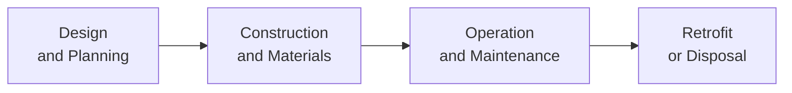

## Introduction

Let’s say you’re standing in the lobby of a newly constructed office tower that’s been touted as “green” and “sustainable.” You might see big windows designed to maximize natural light, fancy water filtration systems to reduce waste, rooftop solar panels, and maybe—just maybe—a living plant wall as a stunning focal point. I remember walking into one such building in New York City and being struck by how fresh the air felt. It actually made me think, “Well, this is the future.” Anyway, in this section, we’ll explore how these green features and sustainability measures tie into investment decisions, financing structures, risk analysis, and overall asset allocation in real estate.

Whether you’re brand new to alternative investments or have some experience in real estate, green building initiatives are all the rage—partly because they can potentially help the planet but also because they’re becoming a serious driver of financial returns. Investors, asset managers, and regulatory bodies worldwide are all paying close attention. Let’s dive in.

## Green Building Certifications and Ratings

Green buildings are often assessed using internationally recognized frameworks. Two of the most popular are:

• LEED (Leadership in Energy and Environmental Design)  
• BREEAM (Building Research Establishment Environmental Assessment Method)

A LEED-certified building might incorporate energy-efficient HVAC systems, low-flow water fixtures, better insulation, and even occupant wellness features. Meanwhile, BREEAM offers a detailed methodology for rating the sustainability performance of a building’s design, construction, and use. An investor might prefer one framework over the other—sometimes for marketing or compliance reasons. But both systems boil down to rewarding sustainable efforts that reduce resource consumption.

Here’s a quick look at how these frameworks compare:

| Criterion        | LEED                                                   | BREEAM                                                    |
|------------------|--------------------------------------------------------|-----------------------------------------------------------|
| Certification    | Certified, Silver, Gold, Platinum                      | Pass, Good, Very Good, Excellent, Outstanding             |
| Focus            | Global program, strong emphasis on U.S. building codes | U.K. origin, widely recognized in Europe and globally     |
| Assessment Scope | Energy, water, materials, indoor environment, location | Lifecycle analysis, health & well-being, energy, ecology  |

Some developers use both certifications, aiming for maximum appeal to a wide range of global investors. Personally, I found it a little confusing the first time I was asked to differentiate them—like, “Aren’t they basically the same?” But after reviewing them, I recognized each system has its own weighting scheme and documentation processes. So, from a CFA perspective, you want to be fluent in both.

## Lifecycle Cost Analysis in Sustainable Real Estate

Sure, going green often means higher upfront costs, right? You know—the fancy solar panels, improved ventilation systems, or premium insulation. But any finance professional will want to look beyond the initial outlay and focus on total costs over the building’s useful life. For that, we use lifecycle cost analysis (LCCA).

LCCA sums the present value of all future costs and benefits of a building, including:

• Construction (or retrofit) expenses  
• Operational expenses (utilities, maintenance, repairs)  
• End-of-life or disposal costs  

A simplified formula for the Net Present Value (NPV) of lifecycle costs can be written as:


\text{Total LCC} = \sum_{t=0}^{T} \frac{C_t}{(1 + r)^t}


where:  
• \\(C_t\\) represents cost (or benefit if negative) in year \\(t\\).  
• \\(r\\) is the discount rate.  
• \\(T\\) is the time horizon (i.e., the building’s assumed life).  

Because many green buildings use energy-efficient technology, the maintenance and utility costs (especially electricity, water, heating) tend to be lower over time, potentially making the overall NPV more attractive—even if the initial costs are higher.

## Sustainability Initiatives and Asset Value

Many real estate stakeholders are convinced that sustainability initiatives can enhance property value. Think of it like this: Over the property’s lifetime, you can reduce utility bills, leverage “green lending” programs for more favorable financing, and possibly get tax breaks or government incentives. Plus, if tenants crave green space, healthy indoor air, or lower utility bills, you might see less vacancy risk.

Green lending is a form of financing where banks or other lenders offer reduced interest rates or special terms for projects that meet specific environmental benchmarks. This might translate into, for instance, a 50 basis point discount on a typical commercial mortgage rate. Heck, that alone can make a green strategy compelling from a purely economic standpoint, never mind the marketing benefits.

I once saw a project that was borderline feasible from a purely cost standpoint, but after factoring in the interest savings from a green lending program—and the city’s tax incentive for LEED Gold certification—the numbers ended up looking surprisingly attractive. It’s a classic example of how government and private sector collaboration can sweeten these deals.

## Practical Example: The Office Tower of the Future

Imagine a 25-story office building pursuing a Net Zero Building designation (meaning it produces as much energy via renewables as it consumes). It uses solar panels on the roof, integrated solar windows, and advanced battery storage for energy generation. High-efficiency HVAC equipment further reduces carbon emissions. The building also features large vertical gardens to cool common areas and provide a more pleasant environment for tenants.

This building might cost 15–20% more upfront than a non-green alternative, but between government subsidies, significant utility savings, and higher occupancy rates, the internal rate of return (IRR) might actually surge in the long run. Moreover, these features can lead to reduced vacancy since companies increasingly want to show off their sustainability credentials. They can say, “Hey, we’re working out of a net-zero building,” which resonates with clients and employees.

## Impact Investing and ESG Metrics

“ESG” stands for Environmental, Social, and Governance. An ESG approach goes beyond the environmental dimension; it checks in on labor practices, community relations, and corporate governance. Impact Investing is slightly different—it aims to generate measurable positive social or environmental outcomes alongside a financial return.

In real estate, impact investing can involve:

• Constructing affordable housing that meets green standards  
• Renovating old buildings to reduce their carbon footprints  
• Designing buildings with accessible features for people of all abilities  

Investors typically track specific key performance indicators (KPIs) to measure the success of these impact-driven initiatives. Examples include:
- Reduction in carbon footprint (measured in metric tons of CO₂ equivalents)  
- Water conservation (measured in gallons saved per occupant per day)  
- Social benefits (like the number of affordable units in a housing project)  

At a portfolio level, you might see a tilt toward real estate funds that promise job creation in underserved communities, or that redevelop properties using low-embodied carbon materials. It’s not always about returns alone—though returns are still vital for most institutional investors.

## Scenario Modeling for Regulatory Shifts

Let’s talk risk. One of the big reasons to pay attention to green construction is the potential for regulatory changes. Carbon taxes, stricter building codes, or mandated retrofits could become the new normal. If your property is already “future-proofed,” you’re less vulnerable to extra compliance costs.

Scenario modeling might involve projecting:

• Baseline scenario: existing market conditions without additional regulations  
• Moderate scenario: mild carbon tax or moderate changes to building codes  
• Extreme scenario: large-scale regulatory overhaul, high penalties for high-emission buildings  

Here’s a small flowchart to visualize the lifecycle stages for a typical green building, from design to retrofit:

In any of these phases, changing regulations might hit your margins if you’re not prepared. Scenario modeling helps you weigh the impact on your discounted cash flow (DCF) valuations and plan for possible retrofits, carbon credit purchases, or technology upgrades.

## Common Pitfalls and Best Practices

Common pitfalls in green real estate investing include underestimating the upfront costs of sustainable materials, ignoring maintenance needs for complex energy systems, and failing to factor in occupant behavior (ever had that one tenant who leaves the windows open with the AC blasting?). Below are some best practices:

• Conduct thorough due diligence on building technology.  
• Use robust LCCA to capture both tangible and intangible benefits.  
• Keep an eye on evolving regulations at the local, regional, and national levels.  
• Align your financing strategy (e.g., green bonds, green lending) with the project’s sustainability goals.  
• Engage tenants early—sustainability is a community effort.

## Exam Tips and Applications

From a CFA exam perspective, green building topics often surface in questions about real estate portfolio management, ESG integration, and scenario analysis. You might see item set questions on how a portfolio manager should factor in green certifications or how to incorporate the risk of regulatory shifts into the required rate of return. Or you might face an essay-style question that requires a direct comparison of lifecycle cost approaches for a green project versus a traditional one—just be sure to mention key assumptions, discount rates, and potential subsidies.

• Try to remember the major certification frameworks (LEED, BREEAM).  
• Be ready to do a quick NPV or IRR calculation that explicitly accounts for energy savings or carbon tax avoidance.  
• Discuss how a property’s green features might reduce risk in terms of occupancy, financing, or future regulation.  

## References for Further Learning

• World Green Building Council (<https://www.worldgbc.org/>) – Global info on design standards, policy, and case studies.  
• “Greening Real Estate” by Nareit – Explores sustainable REIT practices, green certification trends, and investor preferences.  
• Urban Land Institute (<https://americas.uli.org/>) – Reports on sustainable building design, impact investing strategies, and market data.  

If you’re keen on deeper exploration, these resources are fantastic. Also, keep an eye on local building code updates—these can be the difference between an average return and a stellar one.

## Practice Questions on Green Buildings, Sustainability, and Impact Investing



### Which statement best describes a key difference between LEED and BREEAM certifications?
- [x] LEED primarily offers Certified, Silver, Gold, or Platinum levels, while BREEAM ratings range from Pass to Outstanding.
- [ ] LEED focuses exclusively on water consumption, while BREEAM ignores water usage.
- [ ] BREEAM is used only in the U.S., while LEED is a global standard.
- [ ] LEED requires nonprofits to manage the certification process, whereas BREEAM does not allow nonprofits.

> **Explanation:** LEED recognizes four distinct certification levels—Certified, Silver, Gold, and Platinum—while BREEAM uses categories from Pass through Outstanding. Both evaluate multiple facets of a building’s sustainability.

### Which of the following best explains why a green building might reduce financing costs?
- [x] Lenders often provide green lending incentives for projects meeting environmental benchmarks.
- [ ] Green buildings eliminate the need for a mortgage entirely.
- [ ] Government agencies forbid charging interest on green buildings.
- [ ] Green building codes require banks to offer free capital.

> **Explanation:** Green lending programs offer lower interest rates or special financing terms to projects meeting certain sustainability criteria, thereby reducing the property’s overall financing costs.

### Which of these is a valid metric for impact investing in real estate?
- [x] Measuring carbon footprint reduction in metric tons of CO₂ equivalents.
- [ ] Stating that the building has a pretty facade without measurable sustainability goals.
- [ ] Advertising the property for short-term resale.
- [ ] Only looking at IRR while ignoring externalities.

> **Explanation:** Impact investments require measurable environmental or social outcomes. Tracking carbon footprint reduction is a quantifiable measure that demonstrates real impact.

### During lifecycle cost analysis for a green building, which cost component is most likely to be lower compared to a traditional building?
- [x] Ongoing utility expenses due to energy efficiency.
- [ ] Initial construction costs.
- [ ] Land acquisition costs.
- [ ] Developer’s profit margin.

> **Explanation:** Energy-efficient features generally reduce ongoing operating expenses (e.g., electricity, water). However, initial construction costs might be higher due to specialized materials.

### Which scenario best illustrates a social benefit aligned with impact investing?
- [x] Converting a building into affordable housing while adhering to green construction standards.
- [ ] Maximizing luxury condos with premium rents.
- [x] Providing accessibility features for elderly residents in a refitted structure.
- [ ] Minimizing developer involvement in community engagement.

> **Explanation:** Impact investing aims for both financial return and positive societal impact. Affordable housing programs and properties designed for accessibility fit that description well.

### What is a potential regulatory risk green real estate investors should model in their valuation?
- [x] Carbon tax implementations that could increase costs for non-compliant buildings.
- [ ] A guarantee of zero property taxes for sustainable developments.
- [ ] The absence of any building code requirements.
- [ ] Removal of all environmental standards.

> **Explanation:** A carbon tax or stricter regulations would impose additional expenses on buildings that do not meet certain sustainability standards.

### Which statement about Net Zero Buildings is correct?
- [x] They aim to produce as much on-site renewable energy as they consume annually.
- [ ] They produce zero revenue but still pay standard operating expenses.
- [x] They can rely on solar, wind, or other renewable sources to offset energy use.
- [ ] They must be located in rural areas to qualify.

> **Explanation:** Net Zero Buildings produce energy on-site through renewables like solar panels or wind turbines to match or exceed their annual energy usage.

### How might a property developer best respond to potential investor concerns about the higher upfront costs of green building features?
- [x] Emphasize LCCA showing long-term operational savings that compensate for initial premiums.
- [ ] Promise no higher costs at all, ignoring real-world materials pricing.
- [ ] Accept the criticism and remove all green features for a cheaper build.
- [ ] Dismiss the concerns, stating green is mandatory by law everywhere.

> **Explanation:** By highlighting lifecycle savings and potential financing incentives, the developer can justify the higher upfront investment based on improved long-term returns.

### Which risk is likely reduced for a property that meets rigorous green certifications?
- [x] Risk of regulatory non-compliance with future codes.
- [ ] Risk of demand from tenants who dislike energy-efficient design.
- [ ] Risk of local zoning restrictions unrelated to green features.
- [ ] Risk of negative interest rates on mortgages.

> **Explanation:** A building that already adheres to strict environmental standards is better prepared for future codes or environmental regulations, mitigating compliance risk.

### True or False: Embodied carbon refers to all operational energy use in a building over its lifetime.
- [x] True
- [ ] False

> **Explanation:** While the term “embodied carbon” is sometimes misunderstood, in the context of lifecycle impact, it includes the carbon emissions associated with producing and transporting building materials, as well as construction processes. This is part of overall lifecycle emissions, even though operational energy use is generally accounted for separately; in many discussions, embodied carbon references all materials' footprint plus the complete lifecycle aspects of the building.


