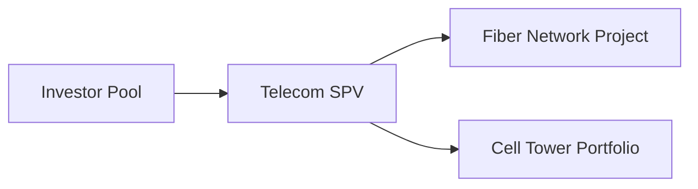

## Introduction

Data infrastructure and telecom assets—like data centers, fiber networks, and cell towers—are becoming the new gold rush in modern real estate and infrastructure investments. It’s kind of amazing, right? When I first heard about “servers as real estate,” I remember thinking: “Wait, you mean those giant warehouse-size rooms with blinking lights are basically part of a real estate asset class?” But that’s exactly where we are. In a digital economy, IT workloads, broadband connectivity, video streaming, e-commerce, and even gaming rely heavily on physical sites and utility infrastructure to keep data humming 24/7.

As technology keeps evolving, especially with the rollout of 5G and the explosive growth of cloud computing, investors are increasingly viewing data infrastructure as a distinct asset class—one that is quite different from your standard office building or multifamily property. This shift is partly fueled by stable demand for internet-based services, robust lease structures, and the potential for long-term cash flows. But let's be real: data infrastructure is no walk in the park. There are specialized risks (like obsolescence or regulatory changes), high capital expenditures (think power redundancy or advanced cooling systems), and a need for constant adaptation as new technologies emerge. 

Below, we’ll break down the fundamentals of data infrastructure and telecom assets, examine the factors that are driving interest, and explore the operational, regulatory, and financial complexities that come with investing in these assets. We’ll also touch on best practices, potential pitfalls, and ways to manage risks in this rapidly changing sector.

## The Growing Importance of Digital Infrastructure

In a nutshell, if you’re streaming a movie, joining a video call, or playing an online game, a series of real, physical assets makes that process possible. Let’s say you’re playing a massive online role-playing game (and who doesn’t love a bit of escapism). The data travels through fiber optic cables (the “fiber network”) to one or several data centers, which might be owned by a dedicated real estate investment trust (REIT) or a private equity fund. Cell towers beam cellular signals to your phone if Wi-Fi isn’t available. These tangible assets—servers, cables, distributed antenna systems—are often referred to collectively as “digital infrastructure.” 

One major reason for their popularity is the simple, unstoppable growth in data usage. Video platforms, cloud services, connected devices (a.k.a. the Internet of Things), and 5G networks are putting enormous demands on telecom networks. Many large organizations (think Netflix, AWS, or Google) either build and operate their own data infrastructure or they lease capacity from specialized providers. For investors, this demand represents a stable revenue source with relatively high utilization rates.

## Core Telecom Assets: Data Centers, Fiber Networks, and Cell Towers

### Data Centers
Data centers are secure facilities designed to accommodate servers, storage equipment, and telecommunications hardware. They have specialized cooling, power redundancy, and robust security measures to minimize downtime. A data center’s success depends heavily on its uptime; in fact, reliability levels are often measured in “nines.” For instance, “five nines” (99.999% availability) implies only about five minutes of downtime per year.

A common business model is co-location, where multiple tenants—sometimes competitors—lease space in the same data center. This co-location model allows tenants to house their servers and equipment in a single building, sharing power, cooling, and security systems. It can be a pretty sweet deal for all parties on both cost efficiency and location synergy (tenants often want to be near each other for low-latency connections).

### Fiber Networks
Fiber networks use strands of glass or plastic to transmit data in the form of light pulses. They offer higher capacity and faster speeds than traditional copper cables. Fiber is the backbone of modern internet connectivity, ensuring data travels quickly between data centers, end users, and global internet hubs.

Investing in fiber often involves building or acquiring “dark fiber” (unused fiber cables) or “lit fiber” (cables already in use). The revenue comes from leasing fiber capacity to telecom operators, big corporations, or internet service providers, usually through long-term contracts.

### Cell Towers
Cell towers facilitate wireless communication by housing antenna arrays, transceivers, and related equipment. Carriers like Verizon, AT&T, or Vodafone typically lease space on these towers to host their antennas, paying recurring rent to the tower owners. The lease structures are usually multi-year with renewal options, making them highly attractive to income-seeking investors.

In many markets, cell tower companies operate on a multi-tenant model, allowing different carriers to co-locate on the same tower. This can significantly boost returns if three or four carriers share one tower, each paying rent.

## Key Revenue Drivers

The revenue drivers for digital infrastructure hinge on data consumption and connectivity needs. While that might sound intangible, it’s quite predictable in many respects:

• Connectivity demand: We live in a world of 24/7 internet usage, so telecom operators need to keep up with the load. More data usage = more network capacity required.

• Data storage capacity: Companies store enormous volumes of information. Cloud providers or indeed any large enterprise will pay for reliable, secure facilities to store, process, and distribute data.

• Rollout of new technologies: 5G networks are a prime example. The jump to 5G requires more cell sites, fiber densification, and data center capacity to handle faster speeds and lower latency. Each technology upgrade often means more leasing demand and new capital inflows.

• Edge computing: This concept places data processing closer to end users. It requires smaller, distributed data centers in more locations. Edge data centers can be a new revenue vertical, especially as IoT usage grows.

• Multi-tenancy: Whether it’s a cell tower or a co-location data center, the ability to house multiple tenants means each incremental tenant can increase the property’s revenue with minimal additional cost.

## Lease Structures and Unique Models

Data infrastructure and telecom investments come with specialized lease structures that differ from traditional real estate. For instance:

• Co-Location Contracts: Data center operators lease space (often measured in square footage or by power usage, such as kilowatts) to multiple tenants. Charges might be set up per kilowatt of power capacity, plus service fees. Contracts typically last three to five years but can extend longer depending on the data center class.

• Carrier-Neutral Arrangements: Data centers might be “carrier-neutral,” letting tenants bring in their own network providers. They earn revenue from cross-connect fees—basically the cables connecting one tenant’s server rack to another service.

• Master Service Agreements (MSAs): Fiber operators often use MSAs, which set out terms for long-term usage rights for fiber strands (Dark Fiber IRU agreements) or capacity (Wave or Ethernet services).

• Multi-Tenant Cell Tower Contracts: Each carrier on a tower has its own lease. The tower operator’s profitability grows with each new tenant as the incremental cost is usually modest.

Investors need to be mindful of these contract structures because they define the stability and potential growth of future cash flows. In many data center deals, for example, tenant concentration risk can be a big deal—just imagine what happens if your largest tenant, maybe a big-tech giant, decides to build their own facility elsewhere.

## Resilience and Operational Considerations

### Power Redundancy
Data centers must have robust power redundancy measures (like dual power feeds, uninterruptible power supplies, and backup generators). An outage of even a few seconds can carry huge reputational and financial risks for both the data center operator and its tenants.

### Cooling Infrastructure
Servers generate a lot of heat. We’re talking about rows upon rows of machines that need consistent cooling and humidity control. Traditionally, data centers have used air conditioning, but new strategies—liquid cooling, free cooling in cool climates, or immersion cooling—are emerging to reduce power costs. The capital expenditures can be high, but failing to maintain a proper environment can risk server damage.

### Physical Security
Data centers are typically built like fortresses, often with gated perimeters, biometric access controls, and 24/7 on-site security personnel. Operators also invest heavily in fire suppression and advanced monitoring systems. In a co-location environment, you have multiple tenants wanting ironclad confidentiality and protection for vital equipment, so security must be top notch.

### Upgrades and Technology Refresh
A facility might be well-equipped today, but new demands (e.g., 5G edge computing, next-gen GPUs, or some new data-hungry technology) can quickly change what’s considered “state of the art.” Operators and investors must consider ongoing capital expenditures to keep facilities modern and competitive.

## Regulatory Environment and Spectrum Licensing

Telecom assets also live in a heavily regulated world. Spectrum availability, licensing fees, and government oversight can shape the viability or the constraints on certain projects. For instance, cell tower operators might need to follow local zoning laws, safe antenna placement, or environmental impact rules. 

Spectrum licensing is a critical factor for wireless networks. Government agencies allocate frequency bands, sometimes through auctions. The fees can be massive, and smaller carriers or new entrants face challenges in competing with major carriers’ deep pockets. For fiber builds, municipalities might have regulations on “digging up” roads to lay fiber cables, or they may require certain public-private partnerships to expedite expansions. 

Regulatory changes can also open or close investment opportunities—for example, government incentives for rural broadband expansions might create a big push for new fiber networks. At the same time, stricter rules on electromagnetic exposure or tower siting might hamper expansions in certain areas.

## Shift From Traditional Real Estate to Digital Infrastructure

Historically, real estate portfolios focused on commercial offices, retail, industrial, and residential. But the unstoppable rise in data usage has prompted large institutional investors, pension funds, and private equity firms to pivot toward digital infrastructure. Indeed, you might see “digital infrastructure” or “telecom assets” as standalone allocations in real estate or infrastructure portfolios. 

Why the shift? One major lure is the relatively inelastic demand for connectivity. Even if the economy slows down, people still use the internet, watch Netflix, store files in the cloud, and rely on cell services. Additionally, the sector has embedded growth potential from technology upgrades like 5G or new data-hungry applications like artificial intelligence, augmented reality, or self-driving cars.

## Specialized Risk Factors

### Obsolescence Risk
Technology changes fast—really fast. A data center built to accommodate 2kW of power per rack might fall behind new standards that require 10kW or 15kW per rack. Without constant reinvestment, an infrastructure asset could become obsolete within five to ten years.

### Tenant Concentration
A single anchor tenant might occupy half your data center. That’s great for stable cash flow—until the lease expires, or the tenant decides to move to a competitor’s site. Monitoring concentration risk is vital, just like having too many eggs in one basket in the equities world.

### Competition From Cloud Services
Ironically, while data centers house cloud servers, large cloud providers might build their own facilities (known as “hyperscale” data centers). This can push smaller co-location facilities to adapt or risk losing big tenant revenues.

### Regulatory Changes
5G rollout, for instance, depends on government approvals. A shift in regulations—like local restrictions on tower heights or community opposition to new fiber lines—can stall projects and reduce potential returns.

### Operational Disasters
Data centers can be susceptible to natural disasters—floods, earthquakes, severe weather—especially if they lack robust design features or are in risk-prone areas. A meltdown or extended downtime can be catastrophic financially.

## A Quick Mermaid Diagram of Telecom Asset Structures

Below is a simple illustration of how a telecom infrastructure investment might organize its projects:

In this simplified setup, multiple investors pool capital into a special purpose vehicle (SPV), which then allocates funds to specific telecom infrastructure projects like fiber networks or cell tower portfolios.

## Example: Assessing a Hyperscale Data Center Investment

Let’s walk through a hypothetical scenario. Suppose an institutional investor is evaluating a 500,000-square-foot “hyperscale” data center that is 70% pre-leased to a large cloud provider. The data center operator invests heavily in redundant power feeds, backup generators, and advanced cooling. Some considerations:

• Lease Terms: The anchor tenant has a 10-year lease with extension options, which might look good. However, if that tenant decides not to renew, the data center has to scramble to fill a large space relatively quickly.

• Tenant Concentration: With one anchor tenant at 70%, the facility’s revenue is heavily dependent on a single player. But because that tenant is a major, financially solid tech giant, the risk is moderated. Still, the investor might prefer 50% or less concentration.

• Capex for Expansion: The data center’s design allows for expansion to 1,000,000 square feet over time. This expansion potential could be a positive if demand grows. But expansions bring additional capital expenditures, so the investor must carefully model the timing and cost of such expansions.

• Operational Expertise: The operator’s track record for maintaining “100% uptime” might be a deciding factor in concluding that the facility is a market leader. Conversely, an operator with little track record or a shaky history of outages may pose a bigger risk, even if the yield looks tempting.

• Market Competition: Are there new facilities being built in the same region? Overbuilding can push lease rates down. Choosing a location with natural advantages—for instance, cheap electricity, cooler climate, and robust fiber connectivity—can provide a competitive edge.

Investors would run scenario analyses, incorporate discount rates that reflect the obsolescence risk, and compare net operating income (NOI) or projected internal rates of return (IRRs) with other alternative investments. All of this might show up on a CFA exam question, hinting at the potential for scenario-based analysis.

## Best Practices and Pitfalls

• Stay on top of technology trends: If there’s one near-constant in digital infrastructure, it’s change. From HPC (High-Performance Computing) needs to next-gen immersion cooling, adopting new technologies can preserve competitiveness.

• Diversify tenant mix: Relying on one anchor occupant can be lucrative but amplifies risk. Try to reduce tenant concentration risk or ensure very strong credit covenants with anchor tenants.

• Evaluate local markets and regulatory constraints: Some regions have abundant cheap energy and welcoming municipal policies, while others have tight restrictions. Considering these factors can drastically alter the investment thesis.

• Understand total cost of ownership: Beyond acquisition price, data infrastructure owners often need to budget for ongoing upgrades or expansions. Underestimating such costs is a classic pitfall.

• Address ESG considerations: Data centers devour electricity, so environmental sustainability is a growing concern. Some operators use renewable energy or more efficient cooling methods to meet pressure from tenants, regulators, or the public.

## Final Exam Tips

If you’re prepping for exam questions about data infrastructure and telecom assets, expect scenario-based items that test your ability to:

• Identify unique lease structures and revenue drivers.
• Evaluate the impact of tenant concentration and obsolescence risk.
• Assess how regulatory or technological changes can affect valuations.
• Calculate or interpret IRRs, cap rates, or net present values under different growth or cost assumptions.
• Apply risk management frameworks, especially in portfolio context: how do these digital assets correlate with other real estate or equity exposures?
• Incorporate power redundancy, location feasibility, and ESG considerations into your analysis.

When facing a constructed-response question, focus on articulating not just the “what” but the “why.” For example, don’t just say a data center’s revenue is stable—explain that the co-location model allows multiple tenants, which supports recurring cash flows even if one tenant decides not to renew.

## References for Further Exploration

• “The Internet Infrastructure Handbook” by IDC. An excellent resource for structured frameworks on data center and fiber network valuations.  
• Uptime Institute (https://uptimeinstitute.com/), offering industry-leading certifications for data center resilience, design, and operations.  
• GSMA (https://www.gsma.com/), for insights on global mobile industry trends and emerging 5G developments.  
• Chapter 4 of this text for more context on infrastructure investment fundamentals, including risk assessment and return characteristics of real assets.  

Feel free to check out these resources if you’re craving a deeper dive into practical due diligence or technology standards in telecom and data infrastructure.

---

## Test Your Knowledge: Data Infrastructure and Telecom Assets



### Which factor primarily differentiates a data center from traditional real estate?

- [ ] Location relative to downtown areas
- [ ] Available parking spaces for tenants
- [x] Power redundancy and specialized cooling requirements
- [ ] Casual office wear for staff

> **Explanation:** Data centers require robust power redundancy and cooling systems that are distinct from typical real estate assets like offices or warehouses.

### How do multi-tenant cell towers typically boost revenue?

- [ ] By charging tenants based on hourly usage
- [x] By leasing tower space to multiple carriers simultaneously
- [ ] By facilitating short-term vacation rentals
- [ ] By increasing monthly maintenance fees to carriers

> **Explanation:** Multi-tenant cell towers allow operators to earn recurring lease payments from several carriers on the same physical tower, increasing revenue without incurring large incremental costs.

### Which best describes obsolescence risk in data centers?

- [ ] The probability that data usage will decline permanently
- [x] The possibility that a facility becomes outdated as technology evolves
- [ ] The chance that fiber cables will physically degrade from overuse
- [ ] The risk that tenants will overpay on their power bills

> **Explanation:** Given the fast pace of technological innovation, data centers may fall behind if they lack the power density or cooling needed for new servers, thus becoming obsolete.

### Why is tenant concentration risk a key concern in large data centers?

- [ ] Too many tenants lead to frequent disputes
- [ ] Data centers cannot support more than one tenant
- [x] A single tenant might account for a significant portion of revenue, increasing exposure if that tenant leaves
- [ ] Regulatory authorities limit the number of tenants in one building

> **Explanation:** High reliance on one or two large tenants raises cash flow vulnerability should those major tenants decide to exit or renegotiate.

### Which organization is known for providing data center certification standards related to uptime?

- [ ] The Cloud Security Alliance
- [x] Uptime Institute
- [ ] The National Association of Real Estate Brokers
- [ ] The Computer Ethics Commission

> **Explanation:** The Uptime Institute is widely recognized for data center design, construction, and operational standards that define varying levels of resiliency.

### Which of the following is considered a regulatory factor affecting telecom asset viability?

- [x] Spectrum licensing and allocations
- [ ] Seasonal shifts in tourist activity
- [ ] Urban preference for modern architecture
- [ ] Local rates of personal income tax

> **Explanation:** Spectrum licensing is crucial for wireless telecom services and is subject to government regulations that can affect feasibility and profitability.

### How do “dark fiber” investments generate revenue?

- [ ] They sell specialized installation tools to fiber technicians
- [ ] They use archaic copper networks to power massive data flows
- [x] They lease unused fiber cables to telecom operators under long-term agreements
- [ ] They rely on the real-time sale of data center credentials

> **Explanation:** Dark fiber refers to fiber optic cables already installed but not currently “lit” for data transmission. Investors lease these cables to telecom operators seeking extra capacity, generating a revenue stream.

### In a co-location model, which is most commonly charged to the tenant?

- [ ] Per-employee desk fees
- [x] Power usage (e.g., kilowatts), plus additional cross-connect or service fees
- [ ] Standard mortgage interest rates
- [ ] Admission fees to the data center

> **Explanation:** Co-location data centers typically charge tenants based on power consumption, allocated server rack space, and cross-connection services within the facility.

### What could be a significant advantage for data centers located in cooler climates?

- [x] Reduced cooling expenses
- [ ] Easier zoning approvals
- [ ] Higher vacancy rates
- [ ] Lower fiber connectivity needs

> **Explanation:** Cooler climates may naturally help in dissipating heat, thus reducing the energy costs associated with intensive cooling systems.

### True or False: 5G rollouts typically require fewer cell towers overall because of more powerful signals.

- [ ] True
- [x] False

> **Explanation:** 5G technology generally involves higher-frequency signals with shorter range, so it often requires additional small-cell sites and a denser tower network rather than fewer towers.


