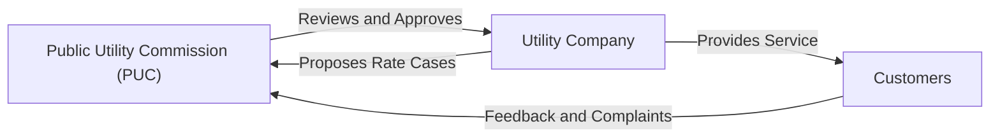

## Introduction
Well, let’s be honest: utility bills rarely make for riveting conversation at a dinner party. Yet, there’s a fascinating system behind how your local electricity or water company decides what to charge you each month. You might be surprised at how much thought and scrutiny goes into determining utility rates. From multi-day public hearings to complex cost-allocation formulas, the rate-setting process is chock-full of checks and balances aimed at ensuring fairness for consumers, while also permitting utilities to earn a reasonable rate of return.

Regulated utilities operate under frameworks laid out by government bodies—often called public utility commissions (PUCs). In many countries, these commissions exist to protect consumers from sky-high prices while ensuring essential providers (water, electricity, gas) can reliably serve the public. In this section, we’ll explore the nitty-gritty of how regulators and utilities work together (and occasionally butt heads) to establish rates. We’ll look at cost-of-service regulation, performance-based regulation (PBR), decoupling mechanisms, and the growing challenge of new technologies like solar and smart grids. Ultimately, we aim to equip you with a strong grasp of the frameworks shaping the utilities sector, both as an investor and a curious consumer.

## Understanding the Regulatory Framework
Regulated utilities have a unique position. They often enjoy a near-monopoly in a specific geographic area—nobody wants multiple sets of power lines or water pipes racing down the same street. Because customers typically have only one provider to choose from, regulation steps in to keep that provider from overcharging. Moreover, these companies often have a legal obligation to maintain certain service standards, such as reliability and network expansion, which can affect their cost structures.

Public utility commissions oversee these matters. Yes, it can get lengthy—commission meetings, stakeholder hearings, reams of testimony, and financial analyses. Trust me, I once sat through a 6-hour hearing on a proposed rate increase for a regional electric utility, and it was eye-opening. You’d hear from company executives, consumer advocacy groups, and local businesses all in one day, each with their own perspective on what the “fair” rate should be.

### Key Players
• Public Utility Commission (PUC): The government body that evaluates utility rate proposals, performance metrics, and investment plans.  
• Utility Company: The service provider that incurs operational and capital expenses while earning a regulated return.  
• Consumer Advocacy Groups: Representatives for residential or commercial customers focusing on affordability, service quality, and transparency.  
• Other Stakeholders: Environmental organizations, labor unions, and business associations, among others.

Below is a simple Mermaid diagram illustrating the rate-setting relationship among these key players:

## Cost-of-Service Regulation
Under cost-of-service regulation, the utility’s rates are guided by the principle: “Recover costs plus a fair return.” Essentially, the utility must demonstrate to the regulator that its ongoing expenses (e.g., maintenance, labor, fuel) and its capital expenditures (e.g., building new power plants, upgrading transmission lines) are reasonable. Then the regulator allows the company to earn a certain rate of return on its invested capital, typically tied to a calculation involving the weighted average cost of capital (WACC).

Let’s break that down:

- The utility’s revenue requirement includes:  
  (1) Operating expenses (OPEX), such as salaries, raw materials, and administrative costs.  
  (2) Depreciation expenses.  
  (3) Taxes.  
  (4) A return on the rate base (i.e., the value of assets used to provide utility service).

- The rate of return is determined by the utility’s cost of debt and cost of equity (often set via a regulatory process). In many cases, regulators use models like the Capital Asset Pricing Model (CAPM) to estimate what equity investors require. Here’s a common formula in KaTeX:


\text{Required Return on Equity} = R_f + \beta (R_m - R_f)


Where:  
• \\( R_f \\) = Risk-free rate  
• \\( \beta \\) = Systematic risk measure  
• \\( R_m \\) = Expected market return

- The final rate is calculated so that if the utility operates efficiently, it will earn this return on equity. Conversely, if the utility’s costs skyrocket or it runs operations poorly, it might fall below that target return.

Cost-of-service regulation fosters predictability: utilities know that necessary investments can likely be recovered over time. However, critics argue it can reduce incentives for efficiency since the utility is assured coverage of prudent costs plus a margin.

## Performance-Based Regulation (PBR)
Performance-based regulation aims to address efficiency concerns of cost-of-service methods. Instead of just paying utilities for their incurred costs, PBR ties a portion of utility earnings to specific outcomes—like reliability, customer satisfaction, or environmental goals. You might see a utility earn bonus returns if it meets or exceeds certain benchmarks, or face penalties if it falls short.

### The PBR Process
1. Establish Performance Metrics: Regulators and utilities define metrics—maybe the average duration of service interruptions (SAIDI/SAIFI indices), or greenhouse-gas emission targets.  
2. Determine Financial Incentives: Bonus points (or basis points) on the rate of return if the utility surpasses goals, or a reduction if it underperforms.  
3. Periodic Review: Performance is reported over a set period (e.g., annually), with adjustments made to future rates or direct financial incentives.

Performance-based regulation can encourage innovation, like adopting smart grid technology or using advanced analytics to detect outages faster. But it’s tricky to design robust and fair metrics. Too many metrics can create measurement chaos, too few might oversimplify local needs and hamper accountability.

## Decoupling Mechanisms
Traditionally, utilities earned more if they sold more energy or water. This might sound great for the utility, but there’s a downside: it discourages them from promoting energy efficiency or conservation. Decoupling addresses this by “decoupling” the utility’s revenues from sales volume, ensuring they can remain financially healthy even if consumers use less energy.

### How Decoupling Works
Under decoupling, the regulator sets an allowed revenue for the utility based on forecasted costs and usage. If the actual usage falls below forecast, the utility is permitted to recoup the shortfall through a rate adjustment (sometimes called a “true-up”). Similarly, if actual usage rises above forecast, the utility must issue rebates or lower charges to avoid windfall profits at consumers’ expense.

This way, utilities don’t feel penalized if they launch aggressive energy-saving programs or if external factors—like milder weather or consumer solar installations—reduce overall consumption. However, decoupling can be controversial, as some consumer advocates fear it reduces the incentive for utilities to keep rates low. That said, many states and countries have experimented with forms of decoupling to balance utility financial health with efficiency goals.

## Rate Cases: The Formal Process
Ever wondered how a utility goes from “We need more revenue” to actually getting regulatory approval for higher rates? It’s called a rate case. Rate cases can be highly formal with testimony, cross-examinations, and robust data analysis. When the utility files a rate case, it must detail:

1. Its operating and capital costs.  
2. The rate of return it is requesting.  
3. Justifications for any changes in costs.  
4. Revenue projections over the next period (often 1–3 years).

Stakeholders—like consumer groups—can intervene and present their own evidence. Finally, the commission deliberates and issues a ruling. If approved, new rates take effect, though typically under strict guidelines. And guess what? The utility might have to come back in a few years to show they’re still using that money wisely.

## Capital Projects and Pass-Through Costs
Utilities consistently face large capital expenditures (CapEx): think new power plants, extending the electric grid, upgrading pipeline infrastructure, or building advanced metering systems. Regulators generally allow the utility to recover these costs through rates, but only if:

- The projects are deemed prudent, meaning necessary and cost-effective for delivering reliable utility service.  
- The assets are used and useful in serving customers’ needs.

Pass-through costs are another layer. Something like fuel expenses for an electric utility or wholesale gas costs for a natural gas distributor might fluctuate. Often, these expenses are passed directly to customers without adding profit margins. Some utilities even have “fuel adjustment clauses,” allowing them to charge more (or less) in near-real-time based on actual fuel costs—reducing financial risk from commodity price swings.

## Impact of New Technologies
Now, let’s talk about the fun stuff: how new technology is reshaping the utility world and stirring up the old rate-setting models. Smart grids, roof-mounted solar panels, battery storage, and electric vehicles (EVs) have changed how electricity is generated and consumed. Suddenly, it’s no longer a one-way supply pipeline from the utility to the customer. Consumers are producing their own energy via solar and selling excess power back to the grid.

Regulators and utilities are scrambling to adapt existing frameworks. Some states or countries introduce “net metering” policies, where households are billed only for their net energy usage. Others have developed time-of-use (TOU) rates to encourage off-peak consumption, helping to even out demand spikes. These evolutions can have massive impacts on utility revenues and require innovative rate designs to ensure cost fairness while still encouraging greener energy usage.

## Example: A Hypothetical Rate Filing
Let’s imagine a scenario in which a water utility files for a rate increase:

1. The utility invests \$100 million in upgrading old pipelines.  
2. It projects that the interest cost on funding this upgrade is 5%, and its equity cost of capital is 10%.  
3. Equity is 40% of the capital structure, and debt is 60%. Based on these, it proposes an allowed return on rate base (simplified approach) around 7%–8% (a blend of the costs of equity and debt).  
4. It includes operational expense data—like maintenance, salaries, and water treatment chemical costs—and claims it needs a 10% rate hike overall.

Consumer advocates argue that some of these pipeline replacements could have been done more cheaply, or that 10% is too high. The PUC steps in, experts are called, and after a thorough review, the final approval might be a 7.5% rate hike, with a narrower allowed return on equity.

## Challenges and Best Practices
• **Balancing Act**: Regulators must weigh consumer protection, investor interests, and societal goals (e.g., environmental sustainability).  
• **Transparency**: Utilities should maintain transparent accounting and cost allocation. Anything shady can trigger a rate disallowance.  
• **Stakeholder Engagement**: Encouraging broad participation in rate cases fosters fairness and ensures lesser-heard voices are at the table.  
• **Evolving Technologies**: Rate structures must adapt; static frameworks may stifle innovation.  
• **Decoupling and Efficiency**: When done right, decoupling can encourage greater energy or water efficiency. But the design must be equitable and transparent.

## Conclusion
Anyway, rate-making may not spark a flurry of social media hashtags, but it’s critical to ensuring that vital services remain affordable, reliable, and efficient. From cost-of-service regulation to performance-based frameworks and decoupling mechanisms, the regulatory environment is ever-changing—especially now with the rise of smart technology and distributed energy resources. Whether you’re a future industry analyst, an investor, or a curious ratepayer, understanding the interplay of costs, returns, and regulatory oversight is paramount. Remember, the next time you open that utility bill, you’re seeing the final outcome of an intricate and deliberate process—one designed to balance your interests with the needs of the utility.

## References
• Hempling, Scott (2013). “Regulating Public Utility Performance.” American Bar Association.  
• Edison Electric Institute (EEI) Resources:  
  – https://www.eei.org/  
• Various state Public Utility Commission websites (e.g., California Public Utilities Commission, New York State Public Service Commission) provide real-rate case filings and rulings.  

---

## Rate-Setting Mechanisms for Regulated Utilities: Practice Questions



### A utility operating under traditional cost-of-service regulation is generally allowed to do which of the following?

- [ ] Earn an arbitrarily high profit based on market supply and demand.
- [x] Recover prudently incurred costs plus a fair return on invested capital.
- [ ] Determine rates for residential customers independently, without regulatory oversight.
- [ ] Bill customers based solely on performance benchmarks.

> **Explanation:** Under cost-of-service regulation, a utility recovers costs deemed reasonable by the regulator and earns a return on capital, typically matched to its weighted average cost of capital (WACC).

### The purpose of a decoupling mechanism in utility rate-setting is primarily to:

- [ ] Encourage utilities to increase sales volume to boost revenues.
- [x] Break the link between the utility’s revenues and total consumption.
- [ ] Increase the utility’s capital budget for infrastructure investments.
- [ ] Replace cost-of-service regulation with performance-based regulation.

> **Explanation:** Decoupling solutions let utilities earn stable revenues regardless of how much or how little service is consumed, thereby encouraging efficiency and conservation measures.

### Under performance-based regulation (PBR), utility returns:

- [ ] Depend exclusively on total certified costs, including capital and O&M.
- [x] Are partially tied to achieving pre-stated operational or customer-focused goals.
- [ ] Are guaranteed to be higher than under cost-of-service regulation.
- [ ] Are structured to eliminate regulatory oversight once initial benchmarks are set.

> **Explanation:** PBR assigns financial incentives and/or penalties based on performance metrics such as service reliability, customer satisfaction, and environmental targets.

### A “rate case” is best described as:

- [x] A legal or quasi-legal process where the utility requests official permission to change its rates.
- [ ] A licensing procedure for new entrants to a utility market.
- [ ] A judicial ruling that automatically sets regulated utility returns at the risk-free rate.
- [ ] A closed-door meeting to set unregulated utility prices.

> **Explanation:** Utilities file rate cases with their regulators, initiating a transparent process that scrutinizes costs, required returns, and the appropriate rates for customers.

### In cost-of-service regulation, the utility’s rate base generally includes:

- [x] Capital invested in physical infrastructure recognized as used and useful.
- [ ] Operating expenses such as fuel and salaries.
- [x] Depreciation expense on utility plant.
- [ ] All marketing and administrative overhead without review.

> **Explanation:** Rate base often consists of the net value of utility plant plus any working capital costs approved. Operating costs are treated separately, and overhead items require regulatory scrutiny.

### Which of the following is a direct advantage of adopting time-of-use (TOU) rates?

- [x] Helps balance demand by charging more during peak hours and less during off-peak times.
- [ ] Guarantees higher returns for the utility’s shareholders.
- [ ] Ensures the utility never faces regulatory proceedings.
- [ ] Eliminates the need for consumer advocacy groups.

> **Explanation:** TOU rates encourage shifting consumption away from high-demand periods, improving the overall efficiency of the utility system.

### Regarding capital expenditures under a regulated model:

- [x] Utilities must show that these investments are necessary and cost-effective.
- [ ] All proposed capital projects automatically become part of the rate base.
- [x] Regulators often review them to confirm prudence before awarding returns.
- [ ] They are not subject to review if deemed Fuel Adjustment Clause items.

> **Explanation:** Regulators approve new capital spending when it is prudent and beneficial for customers, allowing the utility to add these assets to its rate base for cost recovery plus a reasonable return.

### A disadvantage of cost-of-service regulation is that it:

- [x] May limit incentives for utilities to pursue cost efficiencies.
- [ ] Can never set prices high enough to ensure utility viability.
- [ ] Is typically combined with decoupling mechanisms in all circumstances.
- [ ] Eliminates the utility’s need to file a rate case.

> **Explanation:** Under cost-of-service, utilities may face weaker profit motives to reduce operational expenses, given that higher costs can be passed to customers if deemed prudent.

### In a performance-based regulation (PBR) environment, bonus returns typically arise when:

- [x] The utility exceeds predetermined service or efficiency benchmarks.
- [ ] The utility significantly lobbies the regulator for higher revenues.
- [ ] The utility requires large capital investments in short periods.
- [ ] Rate cases last more than one year.

> **Explanation:** PBR fosters better-than-required performance with financial incentives, awarding proactive efforts in areas such as reliability or clean energy adoption.

### Decoupling is motivated by the idea that:

- [x] True
- [ ] False

> **Explanation:** It helps utilities promote energy efficiency and demand-side management without jeopardizing their revenue due to lower volume sales.


