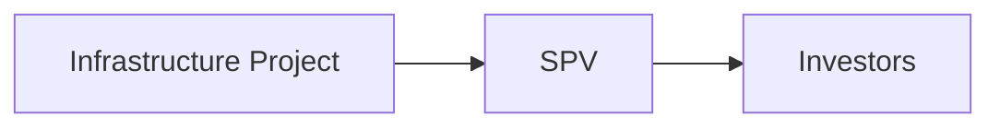

## Introduction
Securitizing infrastructure cash flows is one of those financial innovations that can seem both brilliant and intimidating at first glance. I remember being a junior analyst, nervously running projections on a toll road project and thinking, “Um… so, is it really possible to package these future toll collections into a tradable bond and sell it to investors?” The short answer: Yes, absolutely—and it’s been done many times over. But let’s unwrap the details carefully.

This topic is all about taking the revenue streams from large physical assets—like toll roads, airports, pipelines, or even public utilities—and turning them into marketable securities. That means splitting that predictable (though not always) flow of future cash into bonds or notes that are sold to investors. And because these assets often benefit from stable demand, regulated tariffs, and public necessity, the cash flow can be quite attractive—provided you structure it right.

Securitization of infrastructure cash flows is not just about fancy Wall Street engineering. For many municipalities or project owners, it unlocks immediate funding without giving up equity or raising taxes. For investors, it’s a chance to access a relatively stable, long-term yield. But as with anything in finance, the devil’s in the details—especially around legal structures (think Special Purpose Vehicles, or SPVs), credit enhancements, covenants, and market appetite.

## Understanding the Basics of Infrastructure Securitization
At its core, securitization is the process of packaging streams of cash flows into tradable securities. For infrastructure, these streams can come from:

• Toll collections on a highway or bridge  
• Passenger service charges, terminal fees, and concession revenues for airports  
• Capacity charges and throughput fees for energy pipelines  
• Utility fees for water, electricity, or other services  

You might be thinking, “So, how do investors really get comfortable with these revenue streams?” They first look at usage trends (traffic, passenger volumes, pipeline throughput), concession agreements (how long do you get to collect tolls?), and any regulatory or rate-setting frameworks that define future pricing. They want to see evidence that—barring extraordinary events—the revenue is going to flow.

## Why Cash Flow Stability Matters
Cash flow stability is a cornerstone of securitization. Typically, a strong user base and regulated pricing (or at least well-structured tariff escalation schedules) reduce the uncertainty around future cash flows. This can sometimes resemble the reliability of municipal bonds, where a local government’s tax authority or user fees back the repayment structure.

But in infrastructure, stability often hinges on:

• Long-term concession contracts or licenses  
• Predictable demand (e.g., a highway near a city center that everyone uses)  
• Firm government or regulatory frameworks that set usage fees  
• Lengthy track records of stable project operations  

If, for example, your toll road is the only highway connecting two major cities, usage tends to be more predictable—people have no real alternative, short of a time-consuming side route. On the other hand, an airport reliant on budget airlines might face more variability in flight volumes. Investors will meticulously analyze these dynamics to gauge the likelihood of receiving consistent interest and principal payments.

## Role of Special Purpose Vehicles (SPVs)
When you securitize an infrastructure asset, you typically isolate its cash flows by placing them into an SPV. The SPV:

• Owns the rights to the asset’s future revenues  
• Issues bonds or notes to investors  
• Pays bondholders from those revenues  
• Is separate from the originator’s balance sheet to shield investors from unrelated corporate risks  

Let’s visualize this with a simple flow diagram:

A typical rationale for using SPVs is to reduce the risk that any problems at the parent company (like bankruptcy) affect the securitized cash flows. The SPV is designed to “stand alone,” so to speak. This isolation is huge for investors’ peace of mind.

## Credit Enhancement: Elevating the Bond Rating
One of the best ways to make infrastructure bonds attractive to a wider investor base—and perhaps get that investment-grade credit rating—is to incorporate credit enhancements. These might include:

• Government guarantees: The sponsoring government might agree to step in if revenues fall below a certain level.  
• Over-collateralization: More assets or more cash flow is pledged than is strictly needed.  
• Tranching: Some tranches have a higher priority claim to cash flows, making them less risky (and thus rated higher).  
• Reserve accounts: Setting aside a chunk of cash in a debt service reserve fund can help cover short-term revenue shortfalls.  

I once worked on a pipeline securitization deal that had multiple “layers” of protection—everything from an initial reserve account to a coverage covenant requiring a 1.3x ratio of cash flow to debt service. You know, it’s like wearing a belt, suspenders, and maybe tying on some rope for extra measure. The point was to elevate the bond rating from BBB- to a solid A-.

## Multiple Tranches and the Capital Stack
Infrastructure asset-backed securities often come in various tranches to attract different types of investors:

• Senior tranches: Paid first. Lower yield, but lower risk.  
• Mezzanine tranches: Paid after senior claims. Higher yield, medium risk.  
• Equity or subordinate tranches: Highest yield, but last in the priority line.  

Each tranche has its own interest rate and risk level, which is essential in attracting a broad base of investors with different risk/return appetites. Insurance companies might love the senior tranches for their stable, bond-like qualities, while hedge funds or more adventurous investors might go after the junior or mezzanine pieces for the higher coupon.

## Steps in the Securitization Process
Although each securitization deal is slightly unique, a typical approach might look like this:

• Identify suitable cash flows: Evaluate whether the infrastructure’s usage patterns, concession terms, and regulatory environment are robust enough.  
• Structure the SPV and define payment priorities: Establish a legal entity that will house the assets, and specify how bondholders get paid.  
• Secure credit enhancements: This might be a government backstop or over-collateralization.  
• Obtain ratings from credit rating agencies: Fitch, Moody’s, Standard & Poor’s, or others. A strong rating can significantly lower borrowing costs.  
• Market the securities: Investment banks or underwriters go to the market, explaining the deal to potential investors.  
• Post-issuance monitoring: Investors will keep an eye on usage data, interest coverage ratios, and compliance with covenants.  

## Practical Example: Toll Road Cash Flow Securitization
Imagine a 50-kilometer toll road connecting two major urban centers. The road operator has a 30-year concession, with toll rates indexed to inflation. Traffic demand is projected at around 100,000 vehicles per day. To finance expansions and maintenance, the operator decides: “Let’s securitize the expected toll revenue over the next 25 years.”

Data might look like this:

- Average daily traffic (ADT): 100,000 vehicles  
- Average toll per vehicle: \$2.00  
- Operating expenses per year: \$10 million  
- Desired proceeds: \$500 million  

From these basics, you’d run a Net Present Value (NPV) analysis to see whether projected toll revenues can support, say, \$500 million in bonds plus interest.

A simple KaTeX expression for the discounted toll revenue over T years might be:


\text{NPV} = \sum_{t=1}^{T} \frac{(\text{Traffic}_t \times \text{Toll Rate}_t) - \text{Expenses}_t}{(1 + r)^t}


Where:
- \\(r\\) is the discount rate (reflecting cost of capital and risk).
- \\(\text{Traffic}_t\\) is the projected usage in year t.
- \\(\text{Toll Rate}_t\\) might be either fixed or inflation-indexed.

Then, if the NPV comfortably exceeds your bond principal plus any credit enhancements or reserve requirements, the deal can proceed. A rating agency will test the resilience of these cash flows under stress scenarios like a 20% drop in vehicular traffic or an unexpected rise in operating costs.

## Secondary Trading and Liquidity
You might ask, “So, how liquid are these securities?” Well, they do trade on secondary markets—but the trading volume typically isn’t as large and consistent as, say, government Treasuries or even corporate bonds. However, some deals have become fairly liquid, especially when structured by large, reputable issuers or guaranteed by government entities. Over time, a robust secondary market can develop if the transaction is high-profile and marketed to a broad range of institutional investors.

When a securitized infrastructure bond is structured similarly to municipal or corporate bonds (in terms of documentation and listing), it can attract a global pool of investors. But keep in mind that liquidity still depends a lot on overall market conditions—rising interest rates or a slump in infrastructure demand can dampen trading.

## Market Appetite and Interest Rate Environment
Securitization markets can be sensitive to interest rate changes. When rates are low, investors often chase yield in less traditional assets, including securitized infrastructure. But if rates spike, newly issued government or corporate bonds become more competitive, and investors may retreat from these specialized deals.

Market appetite also revolves around broader economic conditions. In a stable environment, a highway’s user base might be considered reliable and “essential.” But in a recession or if telecommuting drastically reduces daily commutes, traffic might drop (and so might toll collections). Hence, these deals often come with scenario analyses highlighting how robust the cash flows are under different economic cycles.

## Potential Challenges in Structuring
Securitizing infrastructure projects can be lengthy and costly. From forming the SPV to drafting legal documents, from obtaining a favorable rating to marketing the securities, complexities can arise:

• Regulatory Hurdles: Some jurisdictions may require special permissions or impose constraints on transferring rights to toll revenue or passenger fees.  
• Opaque Usage Data: If usage patterns are not well-tracked or easily predictable, rating agencies might discount the projected cash flows.  
• Complexity for Investors: Infrastructure deals can have multiple tranches and cross-collateralization, which can be challenging to fully understand.  
• Government Oversight: Politically or socially sensitive assets (e.g., public highways) might face backlash if toll increases are used for profit.  

Anyway, it’s not uncommon for deals to undergo multiple rounds of adjustments before everything is locked down. Frequently, an anchor investor or government sponsor might want extra covenants or guarantees to feel entirely comfortable.

## Behavioral and Psychological Factors
It may sound surprising, but investor psychology plays a role here. Institutional investors might overemphasize the historical traffic patterns and “anchor” on recent usage data. This anchoring could cause them to underestimate the risk of usage disruptions. Conversely, negative headlines—say about toll hikes or local protests—can spur fear and lead to a higher risk premium. A balanced, data-driven due diligence process is essential to navigate these behavioral biases.

## SPV Governance and Ongoing Monitoring
Infrastructure SPVs typically have a trustee or administrator (sometimes a corporate trust bank) ensuring that the cash flow waterfall is followed. For example, each month’s incoming toll revenue might be allocated in this order:

1. Operating expenses  
2. Senior bond interest and principal  
3. Reserve funds (if needed)  
4. Subordinate bond interest and principal  
5. Equity tranche residual  

This process is documented from day one. If usage is significantly lower, the SPV might allocate less or skip payments to junior tranches. This structured approach is intended to shield the senior investors from as much volatility as possible.  

## Real-World Anecdote: Airport Securitization
I once encountered a fascinating airport securitization where revenue from terminal leases and passenger facility charges (PFCs) was pledged to service the debt. The initial model assumed annual passenger growth of 3%. Then a global economic downturn hit, slicing passenger volumes. The SPV quickly dipped into its reserve accounts to keep paying senior bondholders. While everything turned out okay by year’s end, it was a wake-up call—these deals are sensitive to broader economic swings, and complexity must be accompanied by thorough stress testing.

## Exam Tips and Takeaways
• Look for the presence (or absence) of strong credit enhancements. They’re often the key drivers of rating and investor confidence.  
• Don’t ignore negative demand scenarios or potential disruptions in usage (economic downturns, competing transport routes, changes in consumer behavior).  
• Be mindful of the regulatory frameworks: Are there government restrictions on rate hikes or usage fees?  
• Understand the difference between municipal bond financing and infrastructure securitization—especially regarding who bears the risk and how the structure is set up.  
• Review legal structures carefully. SPVs are there for a reason: they isolate risk.  

## References for Further Study
• “Infrastructure as an Asset Class” by Barbara Weber and Hans Wilhelm Alfen  
• Fitch Ratings and other credit rating agencies’ special reports on infrastructure securitizations  
• International Capital Market Association (ICMA) guidelines (https://www.icmagroup.org/)  
• Global Infrastructure Hub’s resources on financing options for public–private partnerships  

## Final Exam Tips
• Practice scenario-based questions: The CFA exam loves asking how you’d handle a drop in revenues or a spike in interest rates under a securitization structure.  
• Be prepared to contrast these securities with other types of fixed-income instruments (short duration, high yield, etc.).  
• Take note of the waterfall structure, and who gets paid first (senior tranche) in the event of cash flow shortfalls.  
• Understand how and why a government might step in to provide a guarantee—and how that affects bonds’ credit profiles.  
• Time management: In essay (constructed-response) questions, outline your approach to analyzing a securitization, then dive into details. Don’t spend too long on one step.

And that’s pretty much the story on securitizing infrastructure cash flows. In my view, it’s a fascinating intersection of real assets, finance, and good old-fashioned risk management.  

---

## Test Your Knowledge: Securitization of Infrastructure Cash Flows



### Which key element makes infrastructure cash flows suitable for securitization?

- [x] Predictable revenue streams from user-fees or concession agreements 
- [ ] Speculative real estate development 
- [ ] Aggressive equity price fluctuations
- [ ] Lack of government involvement

> **Explanation:** Infrastructure assets typically have stable, predictable revenue streams, a key requirement for securitization.  

### Which method of enhancement is most likely to elevate the credit rating of an infrastructure-backed security?

- [ ] Reducing the concession term 
- [ ] Removing the SPV structure 
- [x] Over-collateralization or government guarantees 
- [ ] Paying bondholders only if usage exceeds forecast

> **Explanation:** Credit enhancements such as over-collateralization or a government guarantee can significantly improve an issue’s credit profile.  

### Why are SPVs commonly used in infrastructure securitization?

- [x] They isolate project cash flows and shield investors from the originator’s other risks
- [ ] They automatically guarantee higher yields
- [ ] They remove regulatory compliance requirements
- [ ] They are only used for equity financing

> **Explanation:** SPVs prevent commingling of assets and liabilities, reducing credit risk for the investor.  

### Which statement best describes credit enhancement in infrastructure securitization?

- [ ] A process that reduces the duration of the bonds to zero
- [x] Techniques that improve a bond’s credit quality (e.g., government backstop)
- [ ] The exclusive use of floating-rate coupons
- [ ] The removal of all default risk

> **Explanation:** Credit enhancement reduces default risk through reserves, guarantees, and similar mechanisms without eliminating risk fully.  

### Which is a possible challenge when structuring an infrastructure securitization?

- [x] Obtaining reliable usage projections
- [ ] Excessive liquidity in the capital markets
- [ ] Absence of underwriting standards
- [ ] Guaranteed unlimited demand

> **Explanation:** Securitization relies heavily on accurate projections, and infrastructure usage can fluctuate unexpectedly.  

### Which option below best describes a tranching structure?

- [ ] Issuing a single class of notes where all bondholders share equal risk
- [x] Issuing multiple layers of debt with different risk/return profiles
- [ ] Only subordinated debt
- [ ] Only common equity

> **Explanation:** Tranching involves splitting the capital stack into layers, each with different payment priorities and risk exposures.  

### How do rising interest rates typically affect an infrastructure securitization offering?

- [ ] They reduce the issuer’s cost of capital
- [x] They may dampen investor demand for new issues
- [ ] They lower the credit enhancement requirements
- [ ] They invariably lead to default

> **Explanation:** As interest rates rise, alternative investments such as government bonds become more attractive, potentially reducing demand for new securitizations.  

### Which factor could reduce the liquidity of infrastructure-backed securities in the secondary market?

- [ ] A large pool of investors
- [x] A lack of comparable transactions or limited secondary trading volume
- [ ] Standardized reporting formats
- [ ] Government-guaranteed payments

> **Explanation:** Limited issuance volume and fewer comparable “benchmark” securities can hamper liquidity in the secondary market.  

### What is one advantage that securitizing infrastructure cash flows may offer to a project owner?

- [x] Immediate access to capital without relinquishing equity ownership
- [ ] Complete elimination of risks
- [ ] Guaranteed government subsidy
- [ ] Exemption from regulatory oversight

> **Explanation:** By securitizing, the project owner monetizes future cash flows upfront, retaining ownership while transferring certain risks to investors.  

### Securitization of infrastructure cash flows often uses a debt service reserve fund. Which statement is TRUE?

- [x] The reserve fund acts as a buffer to cover shortfalls in interest or principal payments.
- [ ] The reserve fund can be used at any time for unrelated business expenses.
- [ ] Reserve funds are required only in equity-based deals.
- [ ] Reserve funds negate the need for an SPV.

> **Explanation:** The reserve fund is often set aside to ensure uninterrupted bond payments in the event of an unexpected drop in cash flow.  


