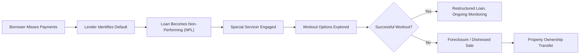

## Overview

Distressed real estate often conjures up images of boarded-up buildings, foreclosures, or properties that seem stuck in limbo. But let me tell you, there’s so much more to it than meets the eye. The phrase refers to properties in financial or operational trouble—maybe the owner can’t service their mortgage, the building has severe maintenance issues, or the tenants have all but disappeared. In these scenarios, both risk and opportunity can be substantial. For opportunistic investors, distressed real estate provides a chance to acquire properties at prices below their perceived intrinsic value, then (hopefully!) turn them around through improved management, capital injections, or renegotiating debt terms.

The process, however, isn’t simple. It involves due diligence, legal know-how, attention to cash flow, and probably a good bit of patience. In fact, distressed real estate transactions will frequently align with broader market cycles—meaning the availability of these opportunities often increases in times of economic or sector-specific stress. Regardless, let’s dive into the ins and outs, explore how workouts can prevent foreclosures, and talk about what it really means to breathe new life into troubled properties.

## Key Characteristics of Distressed Real Estate

Distressed real estate typically involves at least one of the following elements: default risk, operational weakness, or severe underperformance relative to the broader market. Owners may be unable to meet their loan obligations, or the property’s net operating income (NOI) can’t cover essential expenses. For example, a piece of commercial real estate—like a shopping center—might lose major anchor tenants. Without adequate tenant income, the landlord can’t pay utilities, maintenance, or mortgage debt. The property, once thriving, becomes a candidate for workout or foreclosure.

### Indicators of Financial Distress

• Payment Delinquencies: Missed mortgage payments or accumulating property tax arrears.  
• Elevated Vacancy Rates: Declining occupancy suggests the property’s revenue stream is weakening.  
• Reduced Cash Flow: A mismatch between the property’s income and its debt service or operating expenses.  
• Physical Deterioration: Ongoing maintenance issues signal potential financial constraints or neglect.

In the CFA context, analyzing distressed real estate often requires a thorough understanding of credit risk, real estate market dynamics, and the legal ramifications of default.

## Workout Strategies and Process

A “workout” is essentially a negotiation-driven approach designed to help the property’s owner and lender avoid foreclosure. Workouts aim to restructure the loan in a way that’s mutually beneficial. The idea is this: the lender stands to lose money and time if they go to foreclosure, and the borrower wants to keep the property if they can get the financial terms to pencil out.

### Common Workout Approaches

• Loan Modification: The lender might lower the interest rate or extend the maturity date to reduce monthly payments.  
• Longer Amortization Schedule: Stretching the amortization timetable can lower the borrower’s principal payments.  
• Partial Debt Forgiveness: In rare cases, lenders might write off a portion of the principal—though typically in exchange for equity or performance-based arrangements.  
• Capital Injection: A timely injection of new equity or subordinated debt can shore up the property’s finances, covering urgent repairs or partial pay-down of the outstanding loan balance.  

### Example: DSCR Calculation

Evaluating whether a property qualifies for a restructured loan often hinges on metrics like the Debt Service Coverage Ratio (DSCR). Formally:


\text{DSCR} = \frac{\text{NOI}}{\text{Annual Debt Service}}


If the DSCR is too low—say below 1.0—it means the property’s cash flow won’t even cover principal and interest payments, let alone maintenance or upgrades. Through a workout, the lender might reduce payments so that the DSCR meets some threshold (e.g., 1.20×). That offers a little breathing room to get the property stabilized.

## Legal and Financial Aspects of Workouts

Working out of trouble is never guaranteed. Frankly, it can involve a big legal puzzle—amended loan documents, complicated negotiations, and potential liabilities. Each party tries to minimize loss. A few key considerations:

• Forbearance Agreement: The lender temporarily halts foreclosure actions, giving the borrower time to rectify defaults.  
• Mezzanine or Bridge Financing: Short-term finance might provide capital for repositioning or bridging a gap in liquidity.  
• Collateral Re-evaluation: Lenders review other borrower assets to secure the restructured loan if the current property value has declined.

## Special Servicers and Non-Performing Loans

When loans become non-performing (i.e., severely delinquent), they’re often handed over to special servicers. These are specialized firms hired by lenders or investors to manage troubled loans and find an optimal resolution. You’ll see them in the commercial mortgage-backed securities (CMBS) world a lot. A special servicer’s primary goal is to design a strategy that maximizes the recovery for bondholders or the original lender. It might mean:

• Pursuing a workout or discounted payoff if the borrower can bring new equity.  
• Repossessing the property and overseeing the foreclosure process.  
• Coordinating with turnaround professionals or real estate management teams to fix operational issues.

## Turnaround and Repositioning

Redeeming a distressed property usually requires more than balanced books. You might have to change the property’s entire positioning in the market. For example, let’s say you have a struggling retail center that’s outdated. The “turnaround strategy” might involve:

1. Physical Renovations: Upgrading the façade, modernizing the interiors, or installing new amenities.  
2. Management Overhaul: Bringing in a dynamic property manager or new leasing team.  
3. Branding and Marketing: Rebranding the space to attract higher-quality tenants.  
4. Tenant Mix Adjustments: Reorganizing the mix—maybe adding entertainment or fitness tenants to draw foot traffic.  

In my early days, I remember working with a sponsor who bought an abandoned office complex. They turned it into a vibrant tech campus by upgrading the broadband infrastructure and adding open-floor office concepts. This repositioning took time and money but ultimately rescued the property from near-certain foreclosure.

## Macroeconomic Factors and Distressed Opportunities

Distressed real estate is often cyclical. The 2008–2009 global financial crisis, for example, produced a wave of foreclosures and distressed sales across residential and commercial properties. Properties linked to industries facing severe headwinds—like hotels during an economic downturn—can also enter the distressed pipeline.

### Key Market Catalysts

• Interest Rate Shocks: Rising rates might worsen payment burdens and lower property values.  
• Sector-Specific Declines: Overly leveraged property types—like retail—may be more prone to default in e-commerce booms.  
• Liquidity Crises: When credit markets tighten, refinancing can be tough, increasing default rates.  

Staying alert to market signals, supply-demand imbalances, and economic cycles is crucial in anticipating when and where distressed opportunities might arise.

## Scenario Planning and Extended Hold Periods

Let’s not sugarcoat it: distressed real estate isn’t a quick flip. Investors may face extended holding periods to nurse a property back to health. It’s possible the property’s condition gets worse before it improves—maybe the roof collapses or you discover expensive environmental problems. Scenario planning includes:

• Stress-test budgets under lower occupancy or rent assumptions.  
• Evaluate regulatory or zoning constraints that might slow redevelopment.  
• Plan for additional capital calls if the market experiences a secondary downturn.

## Common Pitfalls and Best Practices

• Inadequate Due Diligence: Overlooking structural or environmental issues can kill your returns.  
• Underestimating Costs: Renovations, legal fees, and marketing expenses can balloon.  
• Over-Leverage: Even a partial market downturn or cost overrun might trigger default—again.  
• Lack of Expertise: Workouts and property repositioning take specialized skill sets. Hiring the right consultants or property managers can make all the difference.

Meanwhile, best practices revolve around thorough feasibility studies, conservative underwriting, and partnering with turnaround professionals who know your market. Regular communication with lenders or special servicers can also keep lines open for renegotiations if needed.

## Quick Mermaid Diagram: Distressed Real Estate Workflow

Below is a simple flowchart to illustrate a typical path from early payment issues to either foreclosure or successful workout.

This chart captures the high-level process flow. In reality, every property is unique, and negotiations can move in a non-linear fashion.

## Conclusion and Exam Tips

Distressed real estate and workouts represent a niche but critical area within alternative investments. Mastering the legal, financial, and operational elements requires a multi-disciplinary approach. Recognize the triggers of distress, know how to assess a workout, and consider specialized roles such as special servicers and turnaround teams. In the CFA exam context, expect scenario-based questions testing your ability to evaluate default risk, propose loan restructuring terms, or identify which strategy might best salvage a property’s value.

• Understand the legal frameworks around foreclosures, the role of special servicers, and how to measure feasibility of a loan restructuring.  
• Practice analyzing distressed property metrics like DSCR or loan-to-value (LTV) in hypothetical scenarios.  
• Stay aware of moral hazard issues and compliance with the CFA Institute Code of Ethics and Standards of Professional Conduct, especially regarding fairness to borrowers, full disclosure, and integrity of capital market dealings.

Good luck, and remember, a careful blend of financial analysis and creative strategy often underpins success in distressed real estate investing.

## References

- Moyer, S. G. (2005). Distressed Debt Analysis. J. Ross Publishing.  
- Commercial Real Estate Finance Council (CREFC):  
  https://www.crefc.org/  
- Turnaround Management Association (TMA):  
  https://turnaround.org/  

## Practice Questions: Distressed Real Estate and Workout Strategies



### A distressed property is best described as:
- [ ] A property valued below market rents but generating positive net income.
- [ ] A recently developed property not fully leased.
- [x] A property in default or under severe operational/financial difficulties.
- [ ] A newly stabilized CMBS property with lower capitalization rates.

> **Explanation:** Distressed real estate typically involves properties in default, foreclosure, or those suffering from substantial operational or financial stress.

### Which of the following is a likely goal of a workout agreement?
- [ ] Maximizing the interest rate charged to the borrower.
- [x] Restructuring the debt to avoid foreclosure.
- [ ] Immediately foreclosing on the borrower.
- [ ] Decreasing the length of the loan term.

> **Explanation:** A workout aims to preserve value by restructuring loan terms and avoiding a costly foreclosure process.

### Special servicers usually become involved when:
- [ ] Lenders proactively decide to increase interest rates for profitable loans.
- [ ] Tenants protest property improvements.
- [x] Loans become non-performing or are significantly delinquent.
- [ ] Borrowers seek expansion capital for new acquisitions.

> **Explanation:** A special servicer manages non-performing loans by either pursuing workouts or channeling the property through foreclosure.

### One of the primary reasons lenders might agree to a loan modification is:
- [ ] They benefit from writing off the entire loan.
- [x] To minimize losses that might arise from foreclosure.
- [ ] They prefer to increase legal costs.
- [ ] It's mandated by all local real estate laws.

> **Explanation:** Foreclosure can be expensive and time-consuming. A structured workout often minimizes potential losses.

### In evaluating a distressed commercial property, which metric is most commonly scrutinized?
- [x] DSCR (Debt Service Coverage Ratio)
- [ ] Price-to-earnings (P/E) ratio
- [ ] Return on Equity (ROE) only
- [ ] Weighted Average Cost of Capital (WACC)

> **Explanation:** DSCR compares net operating income to debt service obligations, providing insight into the borrower’s ability to meet payments.

### Which of the following best defines a partial debt forgiveness in a workout?
- [ ] Extending the repayment term without changing the interest rate.
- [x] The lender agrees to reduce a portion of the outstanding principal.
- [ ] Immediately increasing the interest rate for the borrower.
- [ ] Eliminating the borrower’s obligations entirely without conditions.

> **Explanation:** Partial debt forgiveness means erasing a portion of the borrower’s principal balance, usually in exchange for concessions or equity stakes.

### One key risk when repositioning a distressed retail center is:
- [ ] Increased credit availability.
- [x] Failure to attract new anchor tenants due to outdated infrastructure.
- [ ] Demand for lower Lease-To-Value ratios.
- [ ] Government mandates to reduce common-area maintenance fees.

> **Explanation:** Repositioning might involve capital-intensive renovations and uncertain tenant demand, which can negatively impact potential returns.

### In scenario planning for a distressed real estate investment, an important consideration is:
- [x] The possibility of market conditions deteriorating further before recovery.
- [ ] The guaranteed immediate return on investment.
- [ ] The absolute immunity from economic cycles.
- [ ] The automatic extension of loan maturity regardless of negotiations.

> **Explanation:** Distressed situations can worsen before they get better, making scenario planning essential.

### A typical foreclosure process includes:
- [x] Legal action to repossess the property from the borrower.
- [ ] Lender automatically releasing the borrower from liability.
- [ ] Automatic system that sells the property within 24 hours.
- [ ] Zero involvement of legal documents or court procedures.

> **Explanation:** Foreclosure involves a legal mechanism that states use to allow a lender to take back the property upon default.

### True or False: Special servicers not only manage troubled loans but may also oversee the rehabilitation or sale of the underlying properties.
- [x] True
- [ ] False

> **Explanation:** Special servicers often oversee everything from loan modifications to property management or sale, aiming to maximize recovery values.


