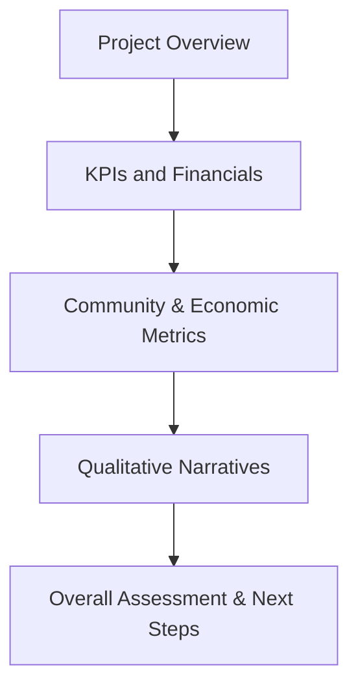

## Introduction

Measuring social and economic impact in real estate and infrastructure can sometimes feel like trying to capture lightning in a jar. You’re not just tracking financial returns—you’re also aiming to gauge how a given project may influence communities, jobs, local economies, and overall societal well-being. In the long run, these impacts can be every bit as significant as a project’s internal rate of return (IRR) or net operating income (NOI). So, why do we do it? And how on earth do we make these measurements consistent and reliable?

This topic helps us understand that investments in real assets often have broader ripple effects. Real estate developments, for example, can raise property values in surrounding areas, stimulate small businesses, and potentially enhance the long-term tax base for local governments. Infrastructure additions like bridges or roads can unlock entire regions for trade, tourism, or new housing construction, elevating quality of life (though sometimes introducing displacement or environmental concerns). So yes, you have to watch both sides of the ledger: returns for your investors and benefits (or harms) to the community.

Below, we’ll step through the main theories, frameworks, and best practices for measuring social and economic impact in the realm of advanced real estate and infrastructure. By the time we’re done, you should have a pretty good idea of how to create, evaluate, and report on Key Performance Indicators (KPIs) that capture both monetary and non-monetary results.

## Defining KPIs for Social and Economic Impact

Let’s begin with the nuts and bolts: the specific Key Performance Indicators (KPIs) we can use to measure a project’s social and economic outcomes. If we’re not thoughtful here, we’ll end up with a massive laundry list of data that seems relevant but doesn’t truly tie back to the project’s objectives.

Common KPIs in real estate and infrastructure include:

• Job Creation: How many new jobs were generated directly or indirectly?  
• Community Engagement: Did local residents or stakeholders participate in the project’s planning and upkeep?  
• Infrastructure Utilization: What percentage of capacity (e.g., usage rates for transportation nodes, occupancy rates for new buildings) is realized?  
• Local GDP Growth: Is there an observable boost to local economic activity due to the new investment?  
• Tax Revenue: Did property, sales, or income tax revenues increase for the municipality in question?

It’s helpful to categorize KPIs into immediate (short-term) vs. ongoing (long-term) metrics. For instance, the number of construction jobs created might be a short-term metric, whereas improved high school graduation rates (due to better local employment opportunities, for example) could be a longer-term indicator of socioeconomic health—though it’s trickier to isolate your project’s role in that shift.

Below is a simplified example table that outlines some KPIs often used in measuring impacts for a hypothetical infrastructure expansion (e.g., building a new airport terminal).

| KPI                        | Definition                                | Measurement Frequency | Short-Term or Long-Term |
|----------------------------|-------------------------------------------|-----------------------|-------------------------|
| Direct Jobs Created        | Number of jobs directly attributable      | Quarterly            | Short-Term             |
| Indirect/Induced Jobs      | Jobs supported in local supply chains     | Annual               | Long-Term              |
| Infrastructure Utilization | Passenger throughput or capacity usage    | Monthly              | Short-Term             |
| Tax Revenue Contribution   | Increase in property & income taxes       | Annual               | Long-Term              |
| Community Engagement Index | Level of stakeholder involvement          | Semi-Annual          | Mixed                  |

## Standardized Frameworks: IRIS+ and Beyond

Many of us have heard of IRIS+ (Impact Reporting and Investment Standards), developed by the Global Impact Investing Network (GIIN). This system offers a catalog of standardized metrics that apply across various impact investing sectors, including real estate, renewable energy, and larger infrastructure. IRIS+ is often praised for providing consistency—so you’re not just going, “Um, well, I think we created 100 jobs,” while your neighbor claims 2,000. 

IRIS+ organizes metrics by theme or sector, enabling investors to select appropriate indicators that are relevant to their intended outcomes. For infrastructure, IRIS+ might guide you toward metrics like:

• Client Individuals: The number of unique clients (or residents) served by the new facility.  
• Energy Distributed: If we’re talking about a power grid extension, how many kilowatt-hours are provided to previously unserved areas?  
• Land Directly Controlled: For real estate, the acres of land used or preserved in the process.

### Diagram: Simplified Impact Measurement Flow

Below is a Mermaid diagram illustrating a high-level process for employing a standardized framework such as IRIS+. The aim is to show how an infrastructure or real estate project moves through goal-setting, KPI selection, data gathering, and the eventual reporting stage.

By following a framework like IRIS+, you can document each step thoroughly and ensure you’re using well-defined, comparable metrics—making it easier to measure, report, and compare impacts across multiple projects.

## Balancing Financial Returns and Non-Financial Outcomes

Believe it or not, you can’t just wear your “finance hat” to measure impact effectively. Part of this process often involves forging partnerships with local governments, NGOs, or community groups to tease out intangible dimensions like social cohesion or quality of life improvements. In many respects, big pension funds and sovereign wealth funds are increasingly open to the idea that “impact” doesn’t come at the expense of returns. 

To integrate social impact measures into the investment decision process, you might:

• Include an “Impact Score” in your investment committee memos, right alongside the expected IRR and debt coverage ratio.  
• Incorporate scenario analyses that highlight trade-offs between short-run profitability (e.g., cheaper building materials) and longer-term community benefits (e.g., local sourcing, green design).  
• Engage external consultants or rating agencies that specialize in evaluating the social dimension of real estate or infrastructure deals.  

Sometimes, a small sacrifice in short-term returns—perhaps due to environmental compliance or local workforce development—can pay off in long-term goodwill, brand enhancement, or reduced regulatory risk. And yes, making that case usually involves both quantitative (cash flow modeling) and qualitative (community feedback) data.

## Governments, NGOs, and Economic Development Metrics

When governments invest public funds or provide subsidies for large-scale development, they typically want to see broad-based social and economic benefits—like the creation of high-paying, stable jobs or improved transport linkages that reduce commute times. At the same time, local NGOs may be monitoring environmental impacts, ensuring that vulnerable populations aren’t displaced, and verifying that local voices are considered.

### Government Tracking Tools

• Local GDP Growth: A straightforward macro snapshot of overall economic activity.  
• Labor Market Statistics: Unemployment rates pre- and post-project.  
• Housing Affordability Index: How have rental or purchase prices shifted?  
• Infrastructure Performance: Road or port congestion, network reliability, safety metrics.

### NGO Tracking Tools

• Stakeholder Surveys and Focus Groups: Understanding community sentiment around displacement, noise, etc.  
• Environmental Impact Assessments: Air quality, biodiversity, carbon footprint.  
• Social Equity Indicators: Access to essential services, improved literacy or health outcomes in the local population.

Collaborative efforts can dovetail nicely if you craft clear data-sharing agreements. The ultimate goal is to generate a holistic view that marries your financial data with on-the-ground social and economic realities.

## Stakeholder Surveys and Community Feedback

Ah, stakeholder surveys. They can be a goldmine of qualitative data—or a total headache if they’re done poorly. You know how frustrating it can be to chase after questionnaire responses when everyone’s busy. But the upside is huge. Rather than just speculating about how your project might be helping or harming the community, you get real, lived experiences.

### Best Practices for Stakeholder Surveys

• Keep them short and straightforward.  
• Use a mix of quantitative scales (e.g., 1–5) and open-ended questions to capture nuance.  
• Disseminate them in local languages and mediums that stakeholders actually use (online may be great for some populations but not for others).  
• Track responses over time to see if community sentiment shifts.  

Now, once you gather that data, integrate it with your financial and operational indicators. For instance, if local businesses are reporting increased foot traffic since the new retail complex opened, you can correlate that with your micro-level leasing data.

## The Attribution Challenge

Here’s the big question: Did your project actually cause the observed change, or was it due to broader economic factors? If you decide to build a solar farm in a region already experiencing robust job creation, attributing an uptick in local employment directly to your project might be less than accurate. Isolating a project’s specific impact calls for robust analytical methods, such as:

• Counterfactual Analysis: Attempting to identify what would have happened otherwise (the “but-for” scenario).  
• Before-and-After Comparisons: Using baseline data from pre-project conditions.  
• Control Groups: Observing a similar region that did not experience the intervention.  

While these methods decrease the guesswork, they also require careful planning before the project begins. In some cases—particularly multi-year infrastructure or real estate developments—documenting baseline metrics early is critical.

## Reporting Best Practices

Once you’ve done all this hard work collecting and analyzing data, you’ll need to organize it into a coherent impact statement. Typically, real estate and infrastructure investment groups produce these statements on an annual or quarterly basis, covering:

• Project Name, Location, and Objectives.  
• Financial Performance Summary (ROI, IRR, etc.).  
• Key Social Indicators (jobs created, community feedback scores, social programs implemented).  
• Key Economic Indicators (change in local tax revenue, improvement in local GDP).  
• Qualitative Narratives or Case Studies (personal stories or quotes from local residents).  

### Example: Annual Impact Statement Components

A simple structure here helps ensure your audience—investors, regulators, and community members—can quickly grasp the project’s performance. Clarity is key. Avoid burying your readers under endless charts with no context. Summaries, bullet points, and executive overviews provide easy entry points into technical details.

## Practical Financial Example

Suppose you’re part of a consortium that invests in building a hospital in an underdeveloped region. Your goal might be both financial (to earn returns from the hospital’s operations) and social (to improve healthcare access, create local jobs, etc.).

1. Baseline Metrics: Local unemployment stands at 12%, and 50% of residents lack access to adequate healthcare.  
2. Construction Phase: You create 200 temporary construction jobs over two years.  
3. Operational Phase (Year 1 to Year 5):  
   - 120 permanent positions (nurses, administrative staff, etc.).  
   - A 10% reduction in local unemployment.  
   - 60% of local residents now have improved access to healthcare.  
   - Potential improvements in local GDP due to a higher labor participation rate and new demand for ancillary services.  

By Year 5, you report that the hospital’s internal rate of return is 12%, well above your hurdle rate. But you also highlight the social benefits: how doctors are training local nurses and how maternal mortality rates have dropped by 15%—partially attributed to this new facility. If you’re using IRIS+ metrics, you might present the number of patients served, the reduction in travel time to receive care, and some data on local wages.

## Challenges and Pitfalls

• Data Reliability: Respondents to surveys may inflate or understate data if they see potential personal gain.  
• High Costs: Setting up robust monitoring and evaluation frameworks can be expensive, especially across large geographies.  
• Changing Conditions: External shocks like economic recessions, pandemics, or natural disasters can obscure underlying trends.  
• “Greenwashing” or “Impact Washing”: Overstating benefits to attract certain types of capital.  

Amid these challenges, transparency and ongoing communication with stakeholders are crucial. If a negative impact emerges (like unanticipated displacement), proactively address it in your reporting and revising project strategies.

## Exam Tips and Real-World Applications

For the exam, you’re likely to see scenario-style questions where you have to evaluate how an investor might measure social or economic outcomes. You might need to:

• Identify appropriate KPIs given a project’s objectives.  
• Propose methods for isolating a project’s contribution from external factors.  
• Discuss reporting formats to satisfy both financial and societal stakeholders.  

Remember, the exam loves it when you make connections between different parts of the curriculum—so consider how measuring impact interacts with ethics (CFA Institute Code and Standards often emphasize honesty in disclosures), portfolio construction (balancing sustainable investment with returns), and risk analysis (reputation, regulatory, and operational risks can all be shaped by project impacts).

## Conclusion and Final Thoughts

Measuring social and economic impact in real estate and infrastructure can be an art as much as a science. You’ll gather data, interpret it through the lens of frameworks like IRIS+, and deliver reports to investors and communities. The complexity of these projects—spanning everything from short-term job creation to decades-long local GDP changes—demands a structured, transparent approach. But don’t forget: you’re always dealing with real people and real places, so community engagement and stakeholder feedback can’t be overlooked if you want a fully rounded picture.

By merging financial performance with meaningful social and economic metrics, investors can align their objectives with broader development goals, garner community support, and foster sustainable growth for everyone involved.

## References and Further Reading

• Global Impact Investing Network (GIIN): https://thegiin.org/  
• IRIS+ Metrics: https://iris.thegiin.org/  
• Social Value International: https://socialvalueint.org/  
• Allman, Keith A. (2020). “Impact Investment: A Practical Guide to Investment Process and Social Impact Analysis.”  
• Additional Guidance: The CFA Institute’s materials on ESG and impact investing contain relevant resources for standardizing impact measurement.  

---

## Test Your Knowledge: Social and Economic Impact in Real Estate and Infrastructure



### Which of the following best describes the primary purpose of IRIS+ (Impact Reporting and Investment Standards)?

- [ ] To provide a government-mandated set of accounting rules for impact investments.
- [x] To offer standardized metrics enabling consistent measurement of social and environmental outcomes.
- [ ] To rank real estate projects based on their profitability alone.
- [ ] To prevent NGOs from participating in infrastructure projects.

> **Explanation:** IRIS+ provides a standardized system for reporting and measuring social, environmental, and financial performance, facilitating consistent cross-project comparison.

### When measuring the economic impact of a new infrastructure project, which metric is often used to reflect broad changes in local economic activity?

- [ ] Debt-to-Equity Ratio
- [ ] Weighted Average Cost of Capital (WACC)
- [x] Local GDP Growth
- [ ] Dividend Yield

> **Explanation:** Local GDP growth is a macro-level measure that can reflect the effect of major infrastructure projects on a region’s economy.

### A real estate manager is trying to attribute an observed drop in unemployment to the construction of a mixed-use development. Which approach can help establish causation more accurately?

- [x] Comparing post-development employment data to pre-development baseline data and a control group in a similar area.
- [ ] Measuring only the developer’s financial returns.
- [ ] Relying on the developer’s testimonials.
- [ ] Publicizing qualitative statements without verifying job numbers.

> **Explanation:** To properly establish attribution, comparing pre- and post-development outcomes while also utilizing a control group is the most reliable method.

### Which of the following is typically included in an annual impact statement for a large-scale real estate project?

- [ ] Only the property’s net operating income.
- [ ] A forecast of future GDP for unrelated markets.
- [ ] A signed affidavit from each local resident confirming their satisfaction.
- [x] A summary of financial returns, KPIs (e.g., job creation), and stakeholder feedback.

> **Explanation:** A robust impact statement should include financial performance, social and economic KPIs, and community/stakeholder perspectives.

### What is a major challenge with stakeholder surveys in measuring social impact?

- [ ] They are free to conduct and thus often overused.
- [x] Low response rates and potential bias in responses.
- [ ] They require advanced AI for analysis.
- [ ] They have been outlawed in most countries.

> **Explanation:** Stakeholder surveys can suffer from sampling bias, low participation rates, and inconsistent data, making them challenging but still valuable when properly designed.

### Which term refers to the technique of estimating changes in economic activity resulting from a specific project or policy?

- [ ] Correlation Analysis
- [ ] Tax Assessment
- [x] Economic Impact Analysis
- [ ] IRR Sensitivity Analysis

> **Explanation:** Economic Impact Analysis is a key method for evaluating how a project influences broader economic factors like employment, output, and income.

### A government-funded infrastructure project reports a 20% increase in local tax revenue two years after completion. However, during the same period, a major employer unrelated to the project moved to the region. What concept accounts for distinguishing the project’s specific contribution?

- [ ] Reciprocity
- [ ] Capital Budgeting
- [ ] Social Value Chains
- [x] Attribution

> **Explanation:** Attribution involves isolating the effect of the project from external factors that might also influence observed outcomes.

### In IRIS+ reporting for a health-related infrastructure project, which of the following metrics would be most relevant?

- [x] Number of new patients served.
- [ ] Percentage of roads receiving routine maintenance.
- [ ] Annual carbon emissions from heavy manufacturing.
- [ ] Share price fluctuation of a biotech company.

> **Explanation:** IRIS+ emphasizes sector-specific indicators. For a health infrastructure project, measuring the number of patients served is directly relevant.

### Which of the following is an example of a short-term KPI in construction projects?

- [x] Number of temporary jobs created.
- [ ] Patient outcomes 10 years post-project.
- [ ] School graduation rates several decades later.
- [ ] Changes in citywide real estate prices 15 years after completion.

> **Explanation:** Temporary job creation typically occurs during the construction phase, making it a clear short-term KPI.

### True or False: Government agencies and NGOs often collaborate to provide a holistic view of a project’s social and economic impacts by sharing relevant data and insights.

- [x] True
- [ ] False

> **Explanation:** Collaboration among multiple stakeholders can yield more comprehensive data, reducing information gaps and improving the overall quality of impact assessment.


