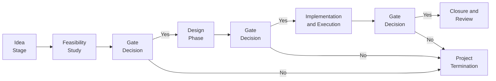

## Introduction

So, let’s say you decide to invest in a massive real estate development—maybe it’s a sprawling shopping complex or a high-tech logistics hub. Someone else is building an ambitious infrastructure project—like a new bypass or a major wind farm. These ventures can look fantastic on a pro forma spreadsheet (they might even make your eyes gleam with excitement). But the moment you commit to building tall skyscrapers or labyrinthine rail tunnels, you’re in capital-intensive territory—meaning huge up-front costs, multi-year timelines, and no small amount of risk.

This section explores the crucial techniques and strategies for mitigating risk when undertaking capital-heavy real estate and infrastructure projects. It draws upon best practices from project management, insurance, regulatory awareness, and scenario analysis—ultimately aiming to help you keep your returns on track (or at least help you avoid too many sleepless nights). We’ll talk about contract structures that can shift or share risk, how to employ robust project management tools like Earned Value Management (EVM), and how to plan for unexpected disruptions, from labor shortages to regulatory whiplash. Let’s dive in.

## Common Risk Factors in Capital-Intensive Projects

It seems obvious: large-scale construction and infrastructure projects carry a lot of uncertainty. Yet time and again, I’ve seen (and personally experienced) how easy it is to underestimate how many things can go wrong when you’re pouring concrete or dealing with complicated site conditions.

• Construction Delays: Weather issues, design revisions, accidents, or unexpected site conditions can slow progress.  
• Labor Shortages: Skilled workers might be in short supply, driving up wages and increasing the likelihood of labor disputes.  
• Material Price Fluctuations: Steel and cement prices sometimes ping-pong with no warning, hitting your budget.  
• Regulatory Changes: Permitting or zoning shifts can toss your timeline around like a rag doll.  
• Political Risk: For cross-border or government-partnered projects, a sudden change in leadership or policy can freeze everything.  

We’ll examine how focusing on robust management methodologies and contractual strategies can help us corral these risks.

## Project Management Methodologies

Capital-intensive projects really need strong, transparent frameworks for monitoring progress and costs. Without a disciplined approach, you can blink twice and find that costs have ballooned beyond reason.

### Stage-Gate Processes

If you’ve ever felt you were on a runaway train of “scope creep,” a Stage-Gate system can be your friend. The idea is to break a project into distinct stages (for example, feasibility, design, construction, etc.). At the end of each stage, there’s a gate—a critical checkpoint to see if the project is healthy enough to proceed.

Below is an example flowchart in Mermaid that shows a basic Stage-Gate structure:



Benefits of a Stage-Gate approach:
• Systematic check-ins ensure you wouldn’t move forward if the project environment is suboptimal.  
• You can pivot or terminate early, saving time and cash.  
• Accountability: Each gate requires the team to confirm resources, timelines, and budgets before moving on.

### Earned Value Management (EVM)

At some point, you’ll likely want more quantitative structure—day-to-day cost tracking, comparing planned vs. actual progress, that kind of thing. Earned Value Management (EVM) is a classic tool. If you’re unfamiliar, it basically measures how much work you’ve completed (the “earned value” or EV) against the actual costs (AC) and planned costs (often called BCWS, or Budgeted Cost of Work Scheduled).

They say that a project’s Cost Performance Index (CPI) can shed light on whether your spending is efficiency-friendly or heading toward the red zone. Formally:


\text{CPI} = \frac{\text{EV}}{\text{AC}}


• CPI > 1 indicates you’re spending less than planned for the work you’ve accomplished (yay!).  
• CPI < 1 means you’re facing cost overruns.  

From a risk-mitigation perspective, EVM is invaluable because it gives an early warning. If you see CPI dropping, it’s time to investigate. That way, you can address cost and schedule problems before they become catastrophes.

## Contract Structures That Share or Transfer Risk

I remember once hearing someone say, “A contract is just a piece of paper—if something big goes wrong, we’ll handle it later.” Well, I’d prefer to be more proactive. Proper contract structures can significantly mitigate risk in capital-intensive projects.

### Fixed-Price Contracts

A fixed-price contract locks in the project price. If you’re the project owner, you know exactly what you’ll pay. But if costs exceed that agreed amount, the contractor typically foots the bill. This structure is great for owners who want budget certainty. Of course, contractors might build in a premium to protect themselves from surprises. 

### Guaranteed Maximum Price (GMP)

A Guaranteed Maximum Price sets a hard ceiling on how much the owner will pay. Overruns beyond the GMP become—generally—the contractor’s headache. Meanwhile, if the final costs come in under that amount, sometimes there’s a gainshare that both owner and contractor can split, aligning interests. GMPs are often used for large private developments, providing owners with an extra layer of cost security.

### Cost-Plus with Incentives

Here, the owner reimburses the contractor for actual costs, plus an agreed-upon fee or margin. The “with incentives” part might tie a bonus to finishing early or beating cost targets. This can keep the contractor motivated to avoid overspending. However, if the contractor’s not well-managed, the owner can still face higher-than-expected costs.

## Contingency Budgets: Preparing for the Unknown

No matter how impeccable your planning is, projects of this scale love to throw curveballs. That’s where contingency budgets come in. You often hear people talk about a “contingency allowance” as a certain percentage of total project cost—maybe 5% or 10%. But the exact number should be based on risk assessment, not just a guess.

Key points when building contingency budgets:
• Conduct a thorough risk assessment to identify potential cost blowouts.  
• Differentiate between “known unknowns” (e.g., possible design changes) and “unknown unknowns” (like discovering ancient artifacts that require an archaeological dig).  
• Track usage of contingency funds separately, so you see if you’re depleting them too fast.  

## Insurance Solutions

Insurance may not be glamorous, but it’s a staple risk-mitigation tool. For capital-intensive projects, a few stand out.

### Builder’s Risk Insurance

Builder’s risk insurance covers physical damage to the project during construction, such as from fire, storms, or vandalism. I once saw how it saved a homebuilder when a freak storm caused partial building collapse on a multi-unit development. If the coverage had not been in place, the project timetable and finances might have been wrecked.

### Performance Bonds

A performance bond is like a safety net if a contractor fails to meet contractual obligations. If they default or simply vanish (heaven forbid), the bonding company steps in—usually providing financial compensation to the owner or ensuring another contractor finishes the job. It’s particularly vital for public sector jobs or big private developments where time is money and you just can’t endure indefinite delays.

To learn more about performance bonds, check out resources from the Surety & Fidelity Association of America (https://www.surety.org/).

## Scenario Analysis

Scenario analysis is all about, “What if...?” It might sound simple, but systematically modeling best-case, worst-case, and moderate-case outcomes can reveal how close you are to catastrophic cost overruns. You can incorporate parameters like interest rate changes, supply chain disruptions, or labor cost spikes.

Below is a short Python snippet that demonstrates a rudimentary scenario analysis for cost estimates. It’s just an example to whet your appetite:

```python
import numpy as np

def scenario_analysis(cost_estimate, scenarios):
    results = {}
    for scenario, factor in scenarios.items():
        results[scenario] = cost_estimate * factor
    return results

base_cost = 1_000_000  # base cost
scenario_factors = {
    "mild_delay": 1.05,
    "severe_delay": 1.2,
    "labor_shortage": 1.1,
    "materials_spike": 1.15
}

analysis_result = scenario_analysis(base_cost, scenario_factors)
print(analysis_result)
```

This code snippet clarifies how a simple scenario approach can highlight cost variation under different assumptions. Of course, larger-scale infrastructure projects use far more robust scenario modeling tools (maybe integrated with project management software). Still, the principle remains: better to test how your project reacts to stress now than to discover it painfully later.

## Monitoring Political and Regulatory Shifts

Let’s face it: real estate and infrastructure often play out in political spotlights. Permits, zoning, environmental regulations—any shift can set your budget spinning. If you’re working internationally, you might also face currency risk or changes in foreign investment laws.

• Stay connected with local authorities to anticipate rule changes.  
• Because regulatory approvals can be slow, factor them into your stage-gates.  
• In cross-border projects, watch for exchange rate volatility when paying contractors in multiple currencies.

If you want some real-life case studies on large-scale infrastructure risk, the World Bank Group (http://www.worldbank.org/) has an extensive library.

## Additional Best Practices

• Aligning Interests: A well-structured contract that shares cost savings or penalizes overruns can keep both owner and contractor motivated.  
• Progressive Budget Reviews: Return to your budget every month or quarter with an unflinching eye.  
• Team Communication: If management and labor don’t communicate effectively, even small misunderstandings can balloon.  
• Comprehensive Due Diligence: Evaluate the contractor’s financial health, track record, and project backlog. A financially shaky contractor is a recipe for nightmares.  
• Integrated Reporting: Consider a system that consolidates financial data, schedule data, and resource usage in one place.

## Glossary

Capital-Intensive  
Projects requiring substantial initial investment in buildings, infrastructure, or equipment.

Stage-Gate Process  
A project management approach that divides development into stages, with “gates” at each milestone to determine if the project should proceed.

Earned Value Management (EVM)  
A method for measuring project performance objectively by comparing planned and actual progress.

Fixed-Price Contract  
A contractual arrangement in which the contractor is bound to deliver the project at a specific, locked-in cost.

Guaranteed Maximum Price (GMP)  
A contractual ceiling on how much the owner will pay for a project, shifting any cost overruns to the contractor.

Performance Bond  
A guarantee by a bonding company that a contractor will fulfill its obligations under a contract.

Builder’s Risk Insurance  
Coverage that protects structures under construction from damage, such as from fire, storms, or vandalism.

Scenario Analysis  
An analytical method of evaluating potential risks by imagining various outcomes (e.g., best-case, worst-case).

## Practical Examples

You might be curious, “How does all of this look in the real world?” Based on personal experiences and conversations in the field, here are a couple of short case vignettes:

• Commercial Real Estate Tower in an Urban Center  
  – Structure: The developer opted for a GMP contract with a major construction firm.  
  – Risk Mitigation: They used EVM to keep track of monthly spending. The contractor had a skilled labor pool, but they still layered in builder’s risk insurance.  
  – Outcome: Several late design changes triggered a portion of the contingency budget, but the GMP prevented catastrophic cost overrun.  

• Highway Extension Project  
  – Structure: A cost-plus contract with incentives for early completion.  
  – Risk Mitigation: The project used scenario analysis to prepare for possible changes in asphalt and steel prices. They also budgeted a robust 8% contingency.  
  – Outcome: The project faced some supply chain backlogs for specialized construction materials, causing schedule delays, but the cost-plus arrangement allowed for a balanced overhead coverage, ensuring the contractor’s willingness to procure materials quickly.

## Final Exam Tips

• Revisit Key Formulas: Earned Value, Cost Performance Index, and relevant project metrics. Understand how to interpret them for real-world decisions.  
• Watch for Contract Details: In exam questions, you might be asked to pick the best contract structure for a hypothetical scenario. Know the difference between fixed-price, GMP, and cost-plus.  
• Mind the Gate Decisions: A scenario question might revolve around a Stage-Gate approach. Remember how each gate is a critical “go/no-go” checkpoint.  
• Remember to Tie It to Ethics: The CFA Institute’s Code of Ethics might intersect with major project decisions—ensure conflicts of interest are handled, and disclosures are transparent.  
• Time Allocation: If you see an item-set question referencing project risk, identify the key risk type (cost overruns, schedule delays, contract misalignments) and relate it to the recommended strategy.  

## References

• PMI’s “A Guide to the Project Management Body of Knowledge (PMBOK® Guide)” for a deep dive into risk management and EVM.  
• Surety & Fidelity Association of America (https://www.surety.org/) on performance bond details.  
• The World Bank Group (http://www.worldbank.org/) for global large-scale infrastructure case studies.  
• For IFRS perspectives, see IFRS guidelines on construction contracts and intangible assets for capitalized costs.  

## Test Your Knowledge: Risk Mitigation in Capital-Intensive Projects



### Which of the following best describes why a Stage-Gate process is useful in large capital projects?

- [ ] It provides a single, final checkpoint before construction begins.  
- [x] It establishes multiple decision points, allowing for early termination or scope adjustments.  
- [ ] It offers a fixed price to reduce construction expenses.  
- [ ] It improves liquidity by consolidating financing streams.  

> **Explanation:** A Stage-Gate framework breaks the project into phases, with “gates” at each milestone to decide whether to continue, modify, or stop, reducing risk as the project evolves.

### Which contract structure places the greatest overrun risk on the contractor?

- [ ] Cost-plus with incentives  
- [ ] Cost-plus with no incentives  
- [x] Fixed-price contract  
- [ ] Stretch goal contract  

> **Explanation:** Under a fixed-price contract, the contractor carries the risk if costs exceed the agreed-upon amount, protecting the owner from overruns.

### What is the primary role of a performance bond in a construction project?

- [x] It guarantees that the contractor will fulfill contractual obligations.  
- [ ] It provides coverage for property damage during construction.  
- [ ] It emphasizes that the project scope remains flexible.  
- [ ] It serves as a direct replacement for scenario analysis.  

> **Explanation:** A performance bond ensures that if the contractor fails to perform their duties or defaults, the bonding entity compensates or arranges project completion.

### A Guaranteed Maximum Price (GMP) contract is most beneficial for which scenario?

- [x] Projects where the owner wants a cost ceiling but might incur bonus payouts for the contractor if costs come in lower.  
- [ ] Government projects seeking to reduce daily volatility in labor rates.  
- [ ] Short-term projects with negligible scope changes.  
- [ ] Complex projects with an undefined scope.  

> **Explanation:** A GMP contract sets a maximum cost for the owner and often allows for a shared savings arrangement if actual costs are lower, balancing risk between owner and contractor.

### Which of the following statements about contingency budgets is true?

- [x] They should be based on a risk assessment rather than simply an arbitrary percentage.  
- [ ] They are unnecessary for projects backed by a performance bond.  
- [ ] They only apply to labor cost overruns.  
- [ ] They can be ignored once the project commences.  

> **Explanation:** Contingency funds should be sized according to project-specific risk analyses, ensuring they’re neither excessive nor insufficient.

### Under Earned Value Management, if the Cost Performance Index (CPI) is less than 1, which conclusion can be made?

- [ ] The project is under budget.  
- [ ] No contingency funding is required.  
- [x] The project is experiencing cost overruns relative to the earned progress.  
- [ ] The timeline is ahead of schedule.  

> **Explanation:** A CPI below 1 indicates the actual costs exceed the planned earned value, signaling overruns.

### How does scenario analysis add value to a capital-intensive project plan?

- [ ] It eliminates all existing project risks.  
- [x] It tests how changes in variables (like cost or timelines) affect project feasibility.  
- [ ] It ensures contractors always meet deadlines.  
- [ ] It replaces the need for construction permits.  

> **Explanation:** Scenario analysis helps explore how different risk factors (e.g., material price hikes, interest rate changes) might influence budget and timeline.

### Which tool best measures project schedule and cost progress in a unified manner?

- [ ] Fixed-price contracting  
- [x] Earned Value Management (EVM)  
- [ ] Performance bonding  
- [ ] Builder’s Risk Insurance  

> **Explanation:** EVM is used to measure both time and cost progress together, providing a comprehensive view of overall project performance.

### What is a key advantage of a cost-plus with incentives contract?

- [x] It motivates the contractor to control costs or meet schedule targets by offering bonuses.  
- [ ] It imposes a rigid price ceiling on the overall project.  
- [ ] It shifts all project risk to the owner.  
- [ ] It negates the need for a performance bond.  

> **Explanation:** In cost-plus with incentives arrangements, the contractor is reimbursed for actual costs plus a fee, but can earn additional payments for meeting or exceeding performance targets, aligning interests with the owner.

### True or False: Builder’s risk insurance specifically addresses the scenario where a contractor fails to meet its contractual obligations.

- [ ] True  
- [x] False  

> **Explanation:** Builder’s risk insurance generally covers damage to a construction project from events like fire or storms. A performance bond, not builder’s risk insurance, addresses contractor default or failure to perform work.


