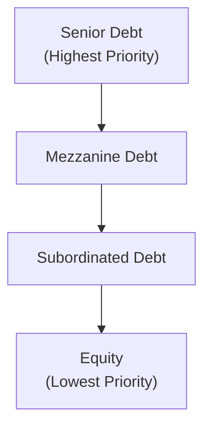
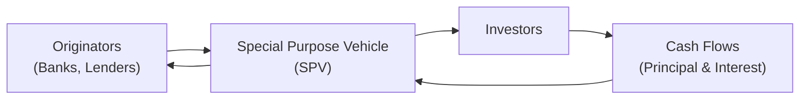

## Introduction to Debt Financing and Project Finance

I remember chatting with a friend who worked on a massive infrastructure deal—something about building a renewable energy plant in an emerging market—and being fascinated by how they pulled together different financing layers. A few years into my career, I realized that what sounded like a complicated patchwork of loans, bonds, and sponsor agreements was actually pretty typical of project finance structures worldwide. It’s all about how project cash flows (or asset cash flows) become the primary means of paying back debt.

Debt financing in real estate or infrastructure usually involves borrowing money from lenders (banks, bondholders, or institutional investors) under defined conditions. But we can do it in multiple ways:

• Traditional corporate balance sheet debt, where a company with existing assets borrows money and puts the debt on its own balance sheet.  
• Project finance, where only the cash flows from the project in question (like a toll road or a power plant) provide the main source of repayment, with limited or no recourse to the firm’s broader balance sheet or the sponsor’s personal guarantees.

Understanding these two approaches—and then layering on how securitization can aggregate and repackage these debts for investors—forms a cornerstone of advanced real estate and infrastructure analysis.

## Distinguishing Corporate Balance Sheet Debt from Project Finance

In corporate balance sheet lending (sometimes referred to as “corporate-backed” loans), the lender’s repayment comes from the overall financial strength of the borrowing entity. So if your Real Estate Investment Trust (REIT) has a strong balance sheet, it can borrow more cheaply because lenders see the entire portfolio of properties as collateral, plus the company’s overall financials.

Project finance, by contrast, is typically “non-recourse” or “limited recourse,” meaning lenders rely on the project’s own revenues. That might be road tolls, user fees from a power plant’s electricity sales, or lease payments from a single asset. If those revenues fall short, the sponsors (equity providers) are not necessarily on the hook beyond their initial project equity. This structure can be especially attractive if you don’t want to tie up your entire company’s credit.

You’d see project finance in large-scale infrastructure deals: airports, bridges, pipelines, power plants, or big real estate developments. The idea is: “Build it, let it generate revenue, and repay the loan from that revenue. If it fails, the lender can seize the project’s assets, but can’t come after everything else.” From the developer’s perspective, it’s a neat way to manage risk; from the lender’s perspective, it often involves tighter covenants, more due diligence, and specialized documentation.

## Exploring the Capital Stack

One of the biggest eye-openers for me in real estate and infrastructure deals was how the “capital stack” concept breaks down. The capital stack includes everything from senior debt to equity, each with a unique position in the repayment hierarchy. If the project does well, everyone may get paid. But if the project struggles, those at the bottom of the stack feel the losses first.

Senior debt has the first claim on project or company cash flows. It’s perceived as the safest slice, typically offering the lowest return. Mezzanine financing sits beneath senior debt but above equity; mezz lenders charge higher interest rates and may negotiate an option to convert part of their debt into equity if default occurs. Subordinated debt ranks below all other forms of debt but is still ahead of equity. Equity is last in line, carrying the highest risk but also potentially the highest upside from project success.

In a typical arrangement:

• Senior Debt  
• Mezzanine Debt  
• Subordinated Debt  
• Preferred Equity (if any)  
• Common Equity

These layers shape the overall risk–return profile. Let’s show a simple diagram of the capital stack in a project:

As you can see, if there’s a default, senior debt holders are first in line to get repaid from any salvageable value. Equity holders only get whatever remains after senior, mezzanine, and subordinated claims are met. That’s why equity can be super risky in a capital-intensive project—yet also can yield handsome returns if the project thrives.

## The Anatomy of Key Project Finance Documents

When banks or investors lend to a project, they don’t just say, “Sure, here’s money, pay me back whenever.” They require a well-structured set of documents that delineate each stakeholder’s rights and responsibilities. Some of these critical documents include:

• Loan Agreement: Outlines the terms under which the lender provides funds, interest rates, repayment schedules, and the security or collateral pledged.  
• Intercreditor Agreement: If multiple lenders are involved, it’s crucial to define their respective priorities. This document clarifies which lenders get paid first in case of liquidation or limited cash flow.  
• Security Agreements: Provide the legal framework that specifies how the borrower’s assets (in this case, the project assets) serve as collateral.  
• Construction Contracts, Offtake Agreements, and Operating & Maintenance (O&M) Agreements: In many project finance deals—especially infrastructure—lenders want to know exactly who’s building the project, who’s managing it post-completion, and who’s buying the output (electricity, water, real estate leases). These contracts help assure lenders of stable revenue.  

One critical point about project finance: you’ll often see explicit ring-fencing of project revenues, which means revenue is deposited into dedicated bank accounts that cannot be used for any purposes other than project operation and debt service. This process helps ensure lenders feel secure that they’ll be repaid from the project’s cash flow.

## Securitization in Real Estate and Infrastructure

So, you have these massive projects generating stable, long-term cash flows—like monthly mortgage payments from homeowners or revenue from a toll road. How do you give large numbers of investors access to this stable stream of payments? That’s where securitization steps in.

Securitization pools similar types of debt—mortgages, project loans, auto loans, even credit card receivables—then issues securities (bonds) backed by those pooled cash flows. Real estate deals often show up as mortgage-backed securities (MBS), while other assets might underpin asset-backed securities (ABS). For infrastructure, you might see specialized vehicles that package toll revenues, utility receivables, or public–private partnership (PPP) project cash flows into bonds.

In the diagram above:

• Originators create or hold the underlying loans (e.g., mortgages, infrastructure loans).  
• They sell these loans to a Special Purpose Vehicle (SPV).  
• The SPV issues securities (bonds) to Investors, who receive payments as the underlying borrowers make principal and interest payments.  
• Because the SPV is bankruptcy-remote (it only exists to hold the assets and issue bonds), investors are somewhat shielded from the originator’s financial troubles.

### Tranching in Securitizations

A hallmark of securitization is its creation of different “tranches.” Each tranche has its own unique risk–return profile, just like the capital stack concept. For instance, you might see:

• Senior Tranche (“A” Notes): Lower risk, lower yield.  
• Mezzanine or Junior Tranches (“B,” “C,” Notes, etc.): Progressive layers of higher risk, higher yield.  
• Equity or Residual Tranche: Sometimes the sponsors or originators keep this portion. It’s the first tranche to absorb any losses from underlying loan defaults but could reap returns above the stated bond coupons if default rates are lower than expected.

## Credit Ratings Process and Covenants

Whether for project finance loans or securitizations, credit rating agencies (like S&P Global Ratings or Moody’s) play a major role. They evaluate the probability that debt holders will get repaid in full and on time. In real estate deals, they’ll look at:

• Asset quality: Condition of the property, location, and synergy with local real estate markets.  
• Tenant stability: Type of tenants, lease terms, occupancy rates.  
• Sponsor track record: Past success in developing or managing similar projects.  
• Financial metrics: Loan-to-Value (LTV) ratio, Debt-Service Coverage Ratio (DSCR), interest coverage ratio, etc.

Agencies also pay keen attention to the structural features of the debt. For instance, strict covenants can significantly lower perceived credit risk. Common covenants might include:

• A maximum LTV ratio. The lender might say, “We won’t lend more than 70% of the property’s appraised value.”  
• Minimum DSCR. Lenders commonly require that operating income is at least some multiple (e.g., 1.25×) of annual debt service.  
• Restrictions on additional borrowing, so you can’t pile on new loans that might impair existing lenders’ seniority.

These covenants help keep borrowers in check. Sometimes, though, you see “covenant-lite” loans in hot markets where lenders compete aggressively. But that can come back to bite them if the market cools or the project’s revenue falters.

### Loan-to-Value (LTV)

An important ratio in real estate financing is the LTV:  


\text{LTV} = \frac{\text{Loan Amount}}{\text{Property or Asset Value}}


High LTV implies the lender is lending a large percentage of the asset’s value—riskier from the lender’s standpoint. Low LTV means there’s more equity cushion, which might lead to more favorable borrowing terms for the sponsor.

### Debt-Service Coverage Ratio (DSCR)

DSCR measures how comfortably the project’s operating cash flow covers its debt payments:


\text{DSCR} = \frac{\text{Operating Cash Flow (or NOI)}}{\text{Principal + Interest Payments}}


A DSCR > 1 indicates that there’s enough cash flow to cover scheduled debt service, which is crucial in project finance because lenders can’t rely on recourse to the sponsor’s entire balance sheet.

## Refinancing Risks

Refinancing risk can be a real headache in real estate and infrastructure deals. Let’s say you have a balloon payment scheduled at the end of a loan’s term (common in commercial real estate), or you have a shorter-term construction loan that you plan to refinance once the project is operational. If interest rates rise or capital markets freeze up, you may struggle to refinance on acceptable terms—or at all.

• Sponsors might face higher interest costs that reduce project profitability.  
• If credit markets are tight, you might have to accept onerous covenants, put more equity in, or potentially lose the asset if you can’t refinance.  
• Some deals rely on an extended stable rate environment. If that changes, it creates an unwelcome puzzle at maturity.

## Practical Examples and Case Study

Imagine a renewable energy project that uses wind turbines to supply electricity under a 20-year power purchase agreement (PPA) with a government entity. Here’s a simplified structure:

• Senior Lenders: Provide 60% of project cost. They have first lien on the turbines, the land lease, and the revenues.  
• Mezzanine Investors: Put in another 20% for a higher yield. If the wind farm can’t meet senior debt obligations, mezz eventually steps aside, letting senior get paid first.  
• Equity Sponsors: Put in the remaining 20%. They only earn returns after everyone else is paid.  

With a stable PPA, lenders see fairly predictable cash flows. The law firm drafts an intercreditor agreement clarifying that senior lenders must receive interest and principal before mezzanine lenders take a dime. Mezzanine lenders have step-in rights if the project sponsor fails to operate the turbines properly, but they still rank behind the senior lenders.

After the wind farm is stable and generating profits, the sponsors might decide to securitize that revenue stream, packaging the future cash flows into bonds. Investors who buy these bonds effectively buy the right to a portion of the monthly revenue stream from the PPA. S&P or Moody’s would then rate those bonds based on the creditworthiness of the off-taker (the government entity paying for the electricity), the proven performance track record of the turbines, and legal risks such as changes in government policy.

## Best Practices and Pitfalls

• Thorough Due Diligence: Sponsors and lenders must fully assess the project’s technical, operational, and market risks.  
• Realistic Cash Flow Forecasts: Overly optimistic revenue projections can lead to loan defaults.  
• Proper Layering in the Capital Stack: Make sure each source has the right priority of claim. Too much mezzanine debt without enough equity cushion can scare away senior lenders.  
• Solid Covenants: If the covenants are too loose, the borrower might take actions that are detrimental to the project without lender oversight. If they’re too strict, the sponsor might feel suffocated and hamper project flexibility.  
• Plan for Refinancing Early: Relying on future capital market conditions is risky. It’s often wise to build in extension options or partial amortization.  
• Market Timing for Securitization: Wait for stable or favorable market conditions to securitize for better pricing.

## Exam Tips

From a CFA exam perspective:

• Understand how to differentiate non-recourse project finance from simple corporate-backed loans. Make sure you can spot which type is being described in a scenario-based question.  
• Memorize the basics of the capital stack. Senior debt is “safer” than mezzanine or equity. This often appears in exam questions about risk exposures or yields.  
• Covenant-based questions: LTV caps and DSCRs are frequently tested. You might see a constructed-response question where you have to evaluate a borrower’s financial metrics against covenant thresholds.  
• Securitization’s role in redistributing risk is central. Know how different tranches carry different credit risks and yields.  
• Real-life examples might appear, like rating agencies analyzing an office building’s tenant structure or an infrastructure project’s contract terms. They’ll test your ability to interpret or critique a credit rating rationale.  

## References and Further Reading

• Finnerty, John D. (2013). “Project Financing: Asset-Based Financial Engineering.”  
• S&P Global Ratings and Moody’s websites for detailed infrastructure debt methodologies.  
• International Project Finance Association: https://www.ipfa.org/  
• CFA Institute Level I and II Corporate Finance and Fixed Income Curriculum (for deeper coverage of bond pricing, securitization, and covenants).  

## Test Your Knowledge: Debt Financing, Project Finance, and Securitization



### A project is financed primarily through its own revenue streams, with limited recourse to the sponsor. What type of financing structure is this?

- [ ] Corporate balance sheet financing
- [x] Project finance
- [ ] Revolving credit facility
- [ ] Operating Lease

> **Explanation:** Project finance relies mainly on the project’s own cash flows for debt repayment, limiting recourse to the sponsor’s other assets.

### Which portion of the capital stack typically has the highest risk but potentially the highest returns?

- [ ] Senior debt
- [ ] Mezzanine debt
- [ ] Subordinated debt
- [x] Equity

> **Explanation:** Equity is last in line for repayment and will absorb losses first if the project underperforms. However, any upside beyond debt obligations accrues to equity.

### In a securitization process, which entity typically holds the pooled assets and issues the securities?

- [ ] The original lender
- [x] A special purpose vehicle (SPV)
- [ ] The government treasury
- [ ] A mezzanine fund

> **Explanation:** An SPV is formed to purchase the underlying loans/receivables and issue asset-backed securities to investors, acting as a bankruptcy-remote entity.

### If a project’s net operating income is $400,000 per year and its annual debt service is $320,000, what is its DSCR?

- [ ] 1.00
- [x] 1.25
- [ ] 0.80
- [ ] 1.40

> **Explanation:** DSCR = 400,000 ÷ 320,000 = 1.25.

### Which best describes the role of an intercreditor agreement?

- [ ] Determines the interest rate for the senior lender
- [x] Defines the priorities and rights among multiple lenders
- [ ] Outlines the engineering specifications of the project
- [ ] Sets the LTV ratio

> **Explanation:** An intercreditor agreement ensures that lenders know how to handle repayment and collateral issues among themselves, so there is no confusion in potential default scenarios.

### Which of the following typically has the lowest yield in a securitized structure?

- [x] Senior tranche
- [ ] Mezzanine tranche
- [ ] Subordinated tranche
- [ ] Equity tranche

> **Explanation:** Senior tranches are at the top of the waterfall, so they carry the least risk and consequently the lowest return in a securitization.

### A sponsor in a renewable energy project wants to avoid tying up its entire corporate balance sheet. Which method of financing is most appropriate?

- [ ] A standard corporate bond issue
- [ ] An unsecured revolving credit facility
- [x] Project finance
- [ ] Sale-leaseback arrangement

> **Explanation:** Project finance allows the sponsor to limit recourse only to the project’s cash flows and assets, rather than having a general claim on the corporation’s balance sheet.

### Which best describes a loan-to-value (LTV) ratio?

- [ ] The project’s EBITDA relative to interest expense
- [ ] The percentage of equity relative to total capital
- [x] The loan amount divided by the property’s appraised value
- [ ] The ratio of equity to senior debt

> **Explanation:** LTV compares the loan amount to the fair market value (or appraised value) of the underlying real estate (or asset).

### What is one major drawback of a “covenant-lite” loan?

- [ ] It provides the lender with greater control over the borrower.
- [ ] It reduces the borrower’s freedom to operate.
- [x] It may reduce lender protections, increasing risk.
- [ ] It makes equity more likely to lose money.

> **Explanation:** Covenant-lite loans reduce stricter oversight of the borrower’s actions, potentially exposing the lender to higher risks if the borrower’s finances deteriorate.

### True or False: In securitization, tranches can be structured so that lower-rated tranches absorb losses first, thereby protecting the higher-rated tranches.

- [x] True
- [ ] False

> **Explanation:** The loss waterfall structure in securitization ensures that the more junior tranches absorb initial losses, safeguarding senior tranches unless losses become severe.


