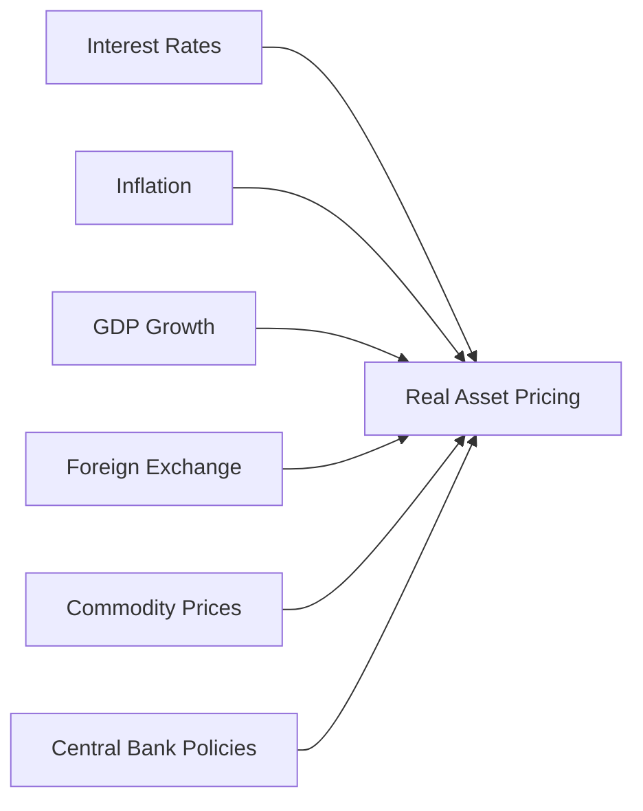

## Introduction
I’ll never forget the first time a sudden rate hike completely reshaped the financing of a real estate project I was helping to underwrite. We’d run months of models at one set of cost assumptions, and—boom—overnight, that magical “cost of debt” line item shot up. My team’s entire pro forma analysis, which had looked so promising, suddenly went sideways. That’s real-life proof that macroeconomic factors can drastically alter the pricing and viability of real assets, whether you’re talking about commercial real estate, toll roads, or wind farms.

Real asset pricing is traditionally influenced by long-term fundamentals. However, short-term macro factors can pack a serious punch when it comes to financing costs, valuation models, and investment returns. These factors include interest rates, inflation, GDP growth, employment levels, foreign exchange rates, commodity price fluctuations, and central bank policies (like quantitative easing). Moreover, economic indicators such as the Consumer Confidence Index (CCI) and the Purchasing Managers’ Index (PMI) provide valuable clues as to how demand patterns may shift for real estate and infrastructure.

Below, we’ll explore the most critical macroeconomic levers and show how each of them can swing cap rates, lease viability, and deal structures in ways both subtle and dramatic. We’ll keep this a tad informal—think of it like two colleagues chatting over coffee about all the big-picture stuff that shapes real estate and infrastructure outcomes. But rest assured, we’ll dive into the financial nitty-gritty, too.

## Interest Rate Cycles and Cap Rates
Interest rates are often the most visible macro factor influencing real estate and infrastructure valuation. When central banks adjust short-term rates, the ripple effect is felt across lending markets, credit spreads, risk premiums, and ultimately capitalization rates (cap rates). The cap rate (Capitalization Rate) is the ratio of a property’s net operating income to its market value. Even a small tweak in interest rates can change the risk-adjusted discount rates used to value future income streams.

In practical terms:
• When interest rates rise, borrowing becomes more expensive. Investors demand higher returns to compensate for elevated financing costs, which usually drives cap rates up (and inversely lowers property valuations).  
• When interest rates fall, financing is cheaper. This increases the pool of potential buyers who can support higher property prices, typically compressing cap rates.

Let’s add a quick numeric example. Suppose you’re looking at an office building generating an annual Net Operating Income (NOI) of USD 1 million. At a 5% cap rate, the property’s value is USD 20 million (1 million / 0.05). If, due to changes in interest rates and broader risk sentiment, the cap rate moves up to 6%, the property’s estimated value falls to about USD 16.7 million (1 million / 0.06). That’s a big difference, and we haven’t even gotten into operational complexities.

One might say real estate is all about location, location, location. But in reality, it’s also about financing, financing, financing—interest rates shape the entire cost side of the equation.

## Inflation’s Effect on Real Estate and Infrastructure
Inflation is another macro factor that can stealthily sneak up on real asset prices. In moderate doses, inflation can actually support real estate values because it can lead to higher rents or user fees in infrastructure settings. If lease agreements or concession contracts include clauses that adjust for inflation, property owners or infrastructure operators may benefit from increased revenue streams to offset rising costs. 

On the flip side, high inflation can erode purchasing power, drive up construction costs, and dampen consumer sentiment. Consider that a toll road operator might face higher operational expenditures (maintenance, labor, energy) while also trying to push toll adjustments onto drivers. If wage growth doesn’t keep up with price increases, users might reduce consumption—maybe fewer discretionary car trips, or less use of certain infrastructure services.

As an example, imagine a multi-year infrastructure concession that depends on stable cement, steel, and labor prices. If inflation doubles the cost of these inputs, you either:
• Need more capital on the front end, raising your financing risk.  
• Pass the costs on to end users—if your contract allows it.  
• Absorb the losses if there’s no pass-through mechanism.

Moreover, for cross-border projects, inflation differentials can create big headaches for investors who borrow in one currency but earn revenue in another. You’ll often see sophisticated hedging strategies to limit the volatility from inflation differentials, but hedging costs can eat into returns fast.

## The Influence of GDP Growth and Employment Rates
GDP growth and employment are typically the big-picture indicators of overall economic health. When GDP is steadily expanding, businesses often lease more commercial space to accommodate activity, while individuals with stable or rising incomes may seek better housing. Both dynamics can boost occupancy rates and rental yields.

Infrastructure usage also tends to track GDP growth. Freight movement, passenger volumes at airports, and utility usage typically follow the broader economic cycle. That said, the relationship isn’t always linear—some infrastructure assets are recession-resistant (think essential utilities), while others, like toll roads or airports, can see big swings in usage based on consumer spending or tourism.

Employment rates matter as well, especially in residential real estate. High employment means more people can qualify for mortgages, pay rent on time, and support the local retail and service sectors. Meanwhile, a jump in unemployment can lead to tenant defaults, reduced consumer spending, and downward pressure on real asset valuations. 

On the exam or in real-life analysis, you might incorporate a range of scenarios involving job market strength. Maybe you run a scenario where unemployment rises 2% over the next year—how might that affect your property’s occupancy, or the toll revenues on an urban highway?

## Foreign Exchange Risks and Cross-Border Transactions
Cross-border transactions are commonplace in both real estate and infrastructure, especially with institutional investors seeking geographic diversification. But with that diversification comes foreign exchange (FX) risk. If you’re investing in a country where the currency is volatile relative to your home currency, your returns can swing wildly. 

For instance, let’s say you’re a U.S. investor who buys an office building in Europe. If the euro depreciates significantly against the dollar, any euro-based rental income might translate into fewer U.S. dollars at repatriation, eroding your return. Conversely, a favorable exchange rate movement can enhance returns.

The complexity grows if there’s a mismatch between your debt and revenue currency. Perhaps you’re financing the purchase with U.S.-dollar-denominated debt but collecting rent in euros. A sudden exchange rate shift might make your debt service more expensive in local currency terms. This is why cross-border deals often require robust FX hedging strategies and a keen eye on macro developments in multiple regions.

## The Global Economic and Political Environment
Global trade policies, geopolitical tensions, and commodity price fluctuations may show up on the front page of the newspaper, but they also worm their way into real estate and infrastructure projects. For example, trade tariffs can make construction materials (steel, lumber) more expensive, raising development costs or forcing project delays.

Political risks—ranging from election outcomes to broader sovereign risk—can also influence real asset pricing. Regulatory frameworks might shift, investment incentives could disappear, or new taxes might be introduced. Infrastructure, in particular, can be highly regulated. If a government changes policies related to public-private partnerships (PPPs), concession terms, or environmental requirements, it can reshape the entire business model for a toll road or energy pipeline. 

We’ve seen this scenario: a new administration halts a major infrastructure program or renegotiates existing power purchase agreements. Investors caught on the wrong side of this volatility face potential write-downs, or at least a reevaluation of their cost of capital. So it’s not just about economics—political and regulatory factors can abruptly reshape real asset pricing too.

## The Role of Central Bank Policies
Beyond the nominal tool of interest rate targets, central banks influence markets through a variety of methods. Quantitative Easing (QE) is a big one. QE essentially involves central banks purchasing longer-term securities (like government bonds, and sometimes mortgage-backed securities) to inject liquidity into the system. By driving down yields, QE can encourage investors to chase higher returns in riskier assets—including real estate and infrastructure funds.

When QE is abundant, financing tends to be relatively cheap and capital is flowing freely. That can inflate asset prices, sometimes pushing valuations higher than fundamentals might justify. Conversely, when central banks taper QE programs or start balance sheet runoff, yields can tick up. This typically leads to price adjustments in real assets, as investors update discount rates and risk premiums.

The interplay between global central banks is often crucial, too. A tightening cycle in one region might push capital to regions with looser monetary policies, affecting FX rates and cross-border investments. In some cases, if multiple major central banks are easing (like we saw in parts of the last decade), money floods global markets, spurring real estate booms in top-tier cities worldwide.

## Economic Indicators: CCI and PMI
Two shorter-term measures—Consumer Confidence Index (CCI) and Purchasing Managers’ Index (PMI)—provide insight into near-term demand for real assets.

• Consumer Confidence Index (CCI): A higher CCI suggests consumers feel good about current and future economic conditions. This optimism often translates into higher retail sales, stronger household formation (people moving out on their own), and robust real estate absorption rates. A drop in consumer confidence, on the other hand, might signal reduced discretionary spending, lower retail occupancy, and slower home purchases.

• Purchasing Managers’ Index (PMI): This gauge captures business sentiment in manufacturing and services. If the PMI is above 50, it indicates expansion; below 50 suggests contraction. A consistently high PMI might mean industrial space is getting absorbed quickly, or that infrastructure usage (e.g., freight corridors) is set to rise. When the PMI starts trending down, it might be time to worry about industrial property demand and the pace of new infrastructure projects.

Keeping tabs on these indices can help you anticipate shifts in demand before they appear in official GDP or employment data. It’s a bit like reading tomorrow’s headlines today—you see whether manufacturers or consumers are spending more or tightening belts.

## Visualizing Key Macroeconomic Drivers

In this diagram:  
• “Interest Rates,” “Inflation,” “GDP Growth,” “Foreign Exchange,” “Commodity Prices,” and “Central Bank Policies” all feed into “Real Asset Pricing.”  
• We see “Cap Rates and Cost of Debt” as one of the key linkages that gets influenced by changes in interest rates, inflation, and other macro factors.  

## Best Practices and Common Pitfalls
In analyzing macroeconomic factors for real assets, it’s important to:

• Build Robust Scenario Analyses: Always stress-test your model. How does a 50 bps or 100 bps rise in interest rates affect your property’s or project’s valuations? What if inflation doubles?  
• Consider Local Nuances: A high-level view of a country’s GDP might be positive, but local market conditions (such as supply gluts or regional job losses) could tell a different story.  
• Keep an Eye on Regulatory Shifts: Changes in zoning laws, property taxes, or PPP frameworks can rewrite the short-term profitability of a project.  
• Manage Cross-Border Risks: Use currency hedges when feasible, understand your exposure to political and sovereign risk, and track differences in inflation expectations across countries.  

And watch out for these pitfalls:  
• Over-Optimistic Growth Projections: Don’t bet on indefinite expansions; real estate cycles are real, and recessions happen.  
• Ignoring Lag Effects: Macroeconomic data can be backward-looking. Real assets often respond with a delay, so be ready for a time lag in the feedback loop.  
• Over-Reliance on Historical Trends: Past data may not predict future cycles. Dramatic rate changes or unexpected policy shifts can render historical cap rate averages obsolete.  
• Failing to Adjust for Leverage: Using high leverage magnifies returns—and also magnifies the damage if interest rates climb or revenues falter.

## Regulatory and Professional Standards Integration
From a CFA® perspective, it’s vital to integrate macro analysis within the ethical and professional framework. Always apply diligence and reasonable care when modeling macro scenarios, and be transparent with clients about relevant risks. If you’re an advisor or portfolio manager, Standard V(A)–Diligence and Reasonable Basis—applies to your assumptions about interest rates, inflation, and economic growth. Self-regulation and professional oversight ensure that you don’t overstate returns or understate risks.

Many jurisdictions impose specific disclosure requirements for real estate and infrastructure investments, particularly for publicly listed vehicles like Real Estate Investment Trusts (REITs). Meanwhile, IFRS or US GAAP standards will dictate certain ways you must treat inflation adjustments or foreign exchange gains and losses in your financial statements. For cross-border deals, you’ll want to double-check compliance with local financial reporting standards.

## Application to the CFA® Exam
At Level III, macro-driven scenario questions may appear in constructed-response (essay) or item set formats. You might be asked to evaluate how a 1% rate hike affects a real estate fund’s projected internal rate of return (IRR), or to discuss how central bank policies could shift the risk premiums for an infrastructure investment. 

Common exam pitfalls include:  
• Not applying consistent discount rates across multiple scenarios.  
• Failing to articulate how inflation could raise both revenues and costs.  
• Overlooking the currency mismatch in a cross-border case study.  

## Conclusion
Macroeconomic factors are like the invisible puppeteers that pull real assets’ strings. Sometimes the show goes on smoothly, and sometimes it feels like everything’s in chaos. Whether you’re analyzing cap rates, forecasting usage rates for a toll road, or evaluating an infrastructure PPP in an emerging market, these macro factors—interest rates, inflation, GDP growth, exchange rates, commodity prices, and policy decisions—will decisively shape your investment outcomes.

For the exam—and in real life—blend both top-down macro insights and bottom-up asset analysis. A robust approach means you’re better prepared to handle the sudden shifts that no economic model can ever fully predict. And hey, even if you never get blindsided again by a rate hike at the eleventh hour, you’ll still be more confident navigating the big-picture forces that define real asset pricing.

## References and Further Reading
• International Monetary Fund and World Bank Publications on global macroeconomic trends (e.g., Global Financial Stability Reports).  
• Federal Reserve Economic Data (FRED): https://fred.stlouisfed.org/  
• Bank for International Settlements: https://www.bis.org/  
• CFA Institute Standards of Practice Handbook, latest edition.  
• “Global Macro Matters” research articles from major financial institutions.  

--------------------------------------------------------------------------------

## Test Your Knowledge: Macroeconomic Factors for Real Asset Pricing



### Which of the following most directly drives an increase in capitalization rates for real estate assets?

- [ ] Rising GDP growth
- [x] Rising interest rates
- [ ] Declining unemployment rates
- [ ] A flattening yield curve

> **Explanation:** Higher interest rates generally raise required returns, which uplift cap rates and lower real estate valuations.

### If inflation increases unexpectedly, which outcome is a probable impact on a long-term infrastructure concession contract?

- [ ] Exclusive benefits to project lenders
- [x] Rising operational costs for maintenance and labor
- [ ] Reduced need for hedging strategies
- [ ] Immediate drop in user fees

> **Explanation:** Inflation usually increases input costs for labor and materials. Concession contracts might have partial inflation pass-throughs, but operational costs often rise before revenues adjust.

### An investor borrows in US dollars while earning rental income in euros. Which macro factor poses the greatest immediate risk?

- [ ] Low consumer confidence
- [ ] High PMI levels
- [x] Currency fluctuations
- [ ] Sovereign credit rating upgrades

> **Explanation:** A mismatch in currency (debt in USD, revenue in EUR) makes FX risk a top concern. Depreciation of the euro against the dollar can inflate debt payments.

### During a global economic expansion, which segment of infrastructure usage is most sensitive to overall GDP growth?

- [ ] Water utilities
- [x] Airports and toll roads
- [ ] Essential electricity networks
- [ ] Waste management

> **Explanation:** Airports and toll roads often see demand surge when GDP is up, because both business and leisure travel/freight expand in tandem with economic growth.

### Which statement best describes the role of central bank Quantitative Easing (QE) in real asset pricing?

- [ ] QE generally raises real interest rates
- [x] QE can inflate asset prices by reducing long-term yields
- [ ] QE focuses primarily on credit card debt purchases
- [ ] QE increases the currency hedging requirement for local investors

> **Explanation:** By purchasing securities and injecting liquidity, QE lowers yields and can push investors toward higher-yielding assets, potentially elevating real estate and infrastructure prices.

### When the Consumer Confidence Index (CCI) is trending upward, what is a likely near-term effect on real estate demand?

- [x] Stronger residential and retail absorption rates
- [ ] Immediate collapse in property values
- [ ] Reduced tenant demand for class A properties
- [ ] A consistent rise in interest rates

> **Explanation:** A higher CCI typically signals consumer optimism, often increasing home buying and retail leasing, boosting real estate absorption.

### Which of the following best describes a situation when a country’s sovereign risk suddenly spikes?

- [ ] Foreign investors immediately benefit from favorable exchange rates
- [x] Investors may require higher risk premiums and reconsider future projects
- [ ] Citizens benefit from lower borrowing costs
- [ ] Infrastructure usage always surges

> **Explanation:** A rise in sovereign risk means the investment environment is perceived as riskier, prompting investors to demand higher returns or potentially exit the market.

### An infrastructure fund is analyzing commodity price trends for steel and cement. Which macro factor are they most concerned with?

- [ ] PMI growth exclusively in service sectors
- [ ] Rising unemployment
- [x] Commodity price fluctuations
- [ ] Lower interest rates

> **Explanation:** Steel and cement prices directly influence infrastructure construction and maintenance costs, so commodity price volatility is key.

### In a scenario where local inflation outpaces global averages, what might an international investor in that locale experience?

- [x] Higher operational expenses and potential margin pressure
- [ ] Currency appreciation if inflation rises
- [ ] No change in expected returns
- [ ] Automatic discount on borrowing costs

> **Explanation:** Higher local inflation can raise operational expenses. The currency may or may not appreciate depending on many factors, so the main immediate effect is higher costs.

### True or False: A rise in Purchasing Managers’ Index (PMI) typically indicates contraction in manufacturing and services activity.

- [ ] True
- [x] False

> **Explanation:** A PMI reading above 50 generally signals expansion in manufacturing and services, not contraction.


