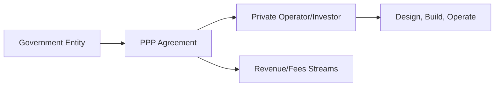

## Introduction

Public-Private Partnerships (PPPs) are like that joint family road trip you’ve been planning for ages: both parties have different resources, different goals, and different ways of doing things, yet they decide it’s worth teaming up for the journey. Unlike a typical road trip, however, PPPs deal with building, financing, and operating critical infrastructure like highways, energy grids, water treatment plants, and even airports or seaports. Concession agreements are often central to PPP structures, granting private operators the right to maintain, upgrade, and run these essential assets in exchange for some sort of fee or revenue-share arrangement.

In this section, we’ll explore the nature of PPPs, the challenges of setting them up, and the important performance metrics and risk-sharing methods that keep everyone aligned. Along the way, I’ll toss in anecdotes, pitfalls, best practices, and a few unexpected wrinkles (like political risk) that tend to pop up. Let’s dive in.

## Understanding Public-Private Partnerships

### Basic Concept and Rationale

At their core, PPPs are long-term alliances between government entities (the “public” side) and private sector investors (the “private” side). Governments often face budget constraints, while private investors seek stable, long-duration assets that can deliver reliable returns. By teaming up, governments can harness private capital and expertise, and private firms gain access to a potentially attractive revenue stream.

PPP agreements can take many forms—Build-Operate-Transfer (BOT), Build-Own-Operate-Transfer (BOOT), Design-Build-Finance-Operate (DBFO), among others. Regardless of the acronym, the fundamental objective is to ensure that the infrastructure project is funded, built, and maintained at appropriate standards through a balanced risk-and-reward framework.

### Concession Agreements: The Cornerstone of PPP

Concession agreements formalize the arrangement in which a government grants a private operator the license or right to operate an infrastructure asset for a stipulated time horizon (often 10–30 years, depending on the nature of the project). For instance, you might have heard of toll roads or managed lanes where a private entity collects and keeps toll revenues in exchange for maintaining the facility. The concession agreement sets forth:

• The scope of the project (e.g., length of highway, type of airport terminal).  
• Performance standards, including quality metrics and user experience.  
• The fee or tariff structure (e.g., toll rates, landing fees).  
• Maintenance obligations, such as frequency of repairs or required expansions.  
• Revenue-sharing or profit-sharing agreements (if applicable).

For investors, these contracts promise a predictable revenue stream if traffic or usage meets projections. For governments, the arrangement (hopefully) delivers improved infrastructure and service without blowing a hole in the public budget.

## Principal-Agent Issues

Any long-term contract is prone to agency conflicts—where the “principal” (the government) relies on the “agent” (the private party) to run the show. Here, the government wants top-notch service at a fair price, but the operator wants to maximize profit. Striking the right balance often relies on:

• Clearly Defined Performance Metrics: These can include metrics like wait times, downtime, maintenance frequency, or user satisfaction surveys.  
• Incentive Structures: Bonuses for exceeding certain performance thresholds or penalties for underperformance.  
• Transparent Reporting: Requiring the private operator to submit audited financials and operational data at regular intervals, akin to a real estate operator reporting occupancy rates.  
• Oversight Committees: Government watchdogs or independent bodies that keep tabs on day-to-day operations, ensuring compliance with safety, efficiency, and service standards.

In my experience, the most effective PPPs set expectations early. Think of it like writing a prenuptial agreement—if your partner shows up talking only about the “good times,” that’s a red flag.

## Risk-Sharing Mechanisms

### Minimum Revenue Guarantees

A common technique is to include provisions like Minimum Revenue Guarantees (MRGs). By guaranteeing a baseline level of cash flow, governments help make a project more attractive to private investors and their lenders. But be warned: if actual usage or toll revenues fall short of projections, the government compensates the operator up to the guaranteed threshold—potentially impacting public finances. On the other hand, if revenues exceed a cap, the government might share in the upside so taxpayers benefit, too.

### Performance-Based Payments

Alternatively, the government might pay the private operator a fixed fee tied to achieved performance metrics, such as road quality or water purity. This approach incentivizes the operator to keep the asset in top condition and can mitigate local pushback about user fees, since the government shoulders some or all of the billing.

### Construction and Operating Risk

Debt-laden PPP deals often shift construction risk to private sponsors, requiring them to cover cost overruns or schedule delays. Once the asset is operational, revenue risk can be shared through pre-agreed formulas or usage-based payments. The ultimate goal: align incentives so that each party is responsible for the aspects of the project they can directly influence.

## Political and Regulatory Climate

One cannot overstate the impact of political risk. A new administration may not support the same PPP project terms, or it might seek to renegotiate toll rates to satisfy populist demands. Changes in political leadership or public sentiment may lead to:

• Incomplete renewals or premature contract terminations.  
• Revision of permissible user fees, impacting the concession holder’s revenue stream.  
• Adjustments to environmental or labor regulations, raising operating costs.  

These uncertainties are often addressed via contractual safeguards, such as dispute resolution mechanisms (e.g., arbitration panels) and compensation clauses if the government unilaterally changes the project scope.

In extremely sensitive PPPs—like privatizing water supply—community backlash can be fierce if tariffs or usage fees rise sharply. Governments might freeze tariffs temporarily or subsidize a portion of the fee to calm public sentiment, but these moves can reduce the private operator’s expected return.

## Controversies and Public Pushback

Yes, controversies happen. Infrastructure is public by nature, and turning a public asset over to private hands can be perceived as “privatization.” Here are some typical flashpoints:

• Toll Rate Increases. Frequent or large hikes in user fees can anger local residents.  
• Service Quality Complaints. If the private operator skimps on maintenance to cut costs, the public sees a deterioration of service.  
• Transparency and Corruption. PPP negotiations can sometimes spawn allegations of favoritism or corruption if the awarding process isn’t transparent.  

To mitigate these risks, best practices involve early stakeholder engagement (town halls, public comment periods), robust contract oversight, and a well-regulated concession environment.

## Modeling Long-Term Cash Flows and Cost Structures

### Revenue Projections

Accuracy in forecasting revenues is pivotal. Typical approaches involve:

• Projected Volume × User Fee. For example, traffic volume on a toll road multiplied by expected toll rates, adjusting for elasticity of demand.  
• Indexed Fees. Concession fees might be indexed to inflation or other benchmarks (like a consumer price index or a specific construction cost index).  

### Maintenance and Overhaul Costs

Most PPPs include mandatory asset maintenance to ensure roads, runways, or pipelines don’t degenerate. Maintenance intervals—major repaving every seven years, for instance—must be factored into the project pro forma. Large-scale overhauls (like runway expansions or major system upgrades) can significantly dent cash flow if not carefully planned.

Often, a Life-Cycle Cost (LCC) approach is used, integrating capital expenditures, maintenance costs, and operating expenses across the project’s life. Investors and creditors scrutinize these assumptions because they can drastically alter the project’s net present value (NPV) if they turn out wrong.

Below is a simple formula for the Net Present Value (NPV) of a concession, using KaTeX:


\text{NPV} = \sum_{t=1}^{T} \frac{\left( \text{CF}_t \right)}{(1 + r)^t} - \text{Initial Investment}


Where:  
• \\( \text{CF}_t \\) = Net cash flow in period \\( t \\).  
• \\( r \\) = Discount rate (WACC or required rate of return).  
• \\( T \\) = Tenor of the concession in years.

### Revenue Escalators

Concession agreements frequently contain escalation clauses. Imagine a toll that starts at \$2.00 per vehicle and can increase annually by the lesser of (a) 2% or (b) the Consumer Price Index. That means the revenue side is partially protected against inflation but also subject to limitations if inflation surpasses a threshold. From a risk perspective, it’s beneficial to be partially shielded from inflation, but it also caps your upside.

## Diagram: Typical PPP Structure

Below is a simple depiction of the PPP framework in Mermaid:

• The government entity signs a PPP agreement with the private operator.  
• Under the contract, the private operator invests capital and provides construction/operation services.  
• In return, the operator receives a revenue stream from user fees, tolls, landing fees, or other concessions.  

## Best Practices, Common Pitfalls, and Strategies

• Conduct Thorough Due Diligence: From traffic or utilization studies to understanding local politics, comprehensive due diligence can make or break your projections.  
• Align Incentives: Clear performance metrics and risk-sharing provisions help preempt misunderstandings.  
• Use Transparent Procurement Processes: Minimizing corruption risk and ensuring a level playing field for all bidders fosters credibility.  
• Maintain Flexibility: The ability to adapt to technological changes or new regulations is essential, especially in longer concession periods, which can span decades.  
• Plan for Stress Scenarios: Build in buffers for worst-case usage or cost inflation. PPP structuring that includes coverage ratios or additional reserves can protect from shortfalls.

## Brief Personal Anecdote
I recall sitting in a local government meeting where officials debated awarding a PPP contract for a municipal water facility. For weeks, the public was concerned about potential water rate increases. The private consortium’s advantage was advanced filtration technology and improved service reliability. Ultimately, the city council insisted on a performance-based approach with a “rate corridor,” capping how much the operator could charge. The sweet spot was found through direct public engagement, and it was fascinating to see how a well-crafted PPP can address broad social concerns while still giving private investors a fair return.

## Exam Tips for CFA® Candidates

• Don’t get lost in acronyms when it comes to PPPs. You’ll want to know the difference between BOT, DBFO, and Concession Agreements but focus on the fundamental structure and risk allocation.  
• Pay special attention to how performance metrics and revenue-sharing schemes might appear in a scenario-based question, hinting at different ways to value the project.  
• For essay questions, be prepared to discuss the political and regulatory environment, as it can affect discount rates, contract enforceability, and risk premiums.  
• Remember the importance of including stakeholder perspectives—especially user fee acceptance and potential public backlash.

## Glossary

• **PPP (Public-Private Partnership):** A cooperative arrangement between public authorities and private investors, combining resources and expertise to finance, build, and operate an infrastructure asset.  
• **Concession Agreement:** A contract granting a private entity the right to operate an infrastructure asset for a specified duration, typically involving revenue-sharing or user-fee collection.  
• **Revenue-Sharing Mechanism:** A contractual provision dictating how revenue from user fees or other sources is split between government and the private sector.  
• **Performance Metrics:** Quantitative or qualitative indicators (e.g., service quality, system downtime) that measure operator effectiveness.  
• **Minimum Revenue Guarantee:** A safety net ensuring the private operator’s revenue does not fall below a certain level, with the public entity covering any shortfall.  
• **Political Risk:** The possibility that a change in government, policy, or public sentiment will materially affect the project’s viability or profitability.  
• **Maintenance Obligations:** Requirements established in the PPP contract that force the operator to keep the infrastructure in predefined operating conditions.  
• **User Fee/Toll:** A charge levied on the end-users (drivers, airline operators, shippers) to directly pay for the use of the infrastructure.

## References and Further Reading

• World Bank’s PPP Knowledge Lab:  
  https://pppknowledgelab.org/  
  A central repository of guidelines, case studies, and standardized documents for PPP projects.

• OECD Publications on PPP Best Practices:  
  Offers policy frameworks, recommendations, and lessons from member countries.

• European PPP Expertise Centre (EPEC):  
  Provides technical assistance and best-practice guidelines, focusing on European infrastructure projects but broadly relevant globally.

• CFA Institute. (Most recent edition). CFA Program Curriculum.  
  Essential reading for the Code of Ethics, Performance Standards, and application to real-world investment scenarios.

• Government Finance Officers Association (various papers on PPPs)  
  Resourceful for financial reporting and public budgeting aspects, focusing on transparency and best accounting practices.

--------------------------------------------------------------------------------

## PPP and Concession Agreements Knowledge Check



### Which of the following best describes a public-private partnership (PPP)?
- [ ] A short-term leasing arrangement between a government and a hedge fund.
- [ ] A licensing agreement for intellectual property between a government agency and a private firm.
- [x] A long-term collaborative deal between a government and private sector to finance, build, and operate infrastructure.
- [ ] A merger of government-owned and private corporations forming a joint stock company.

> **Explanation:** PPPs are specifically designed for infrastructure and essential public services, leveraging private resources and expertise under a long-term structure.

### A concession agreement in a PPP primarily grants the private operator:
- [x] The right to operate and maintain the infrastructure asset for a specified period.
- [ ] Full ownership rights over the infrastructure asset indefinitely.
- [ ] The authority to change local regulations pertaining to the asset.
- [ ] Unlimited profits without any contractual obligations.

> **Explanation:** A concession agreement gives the private party limited rights to operate and collect revenue for a set duration, subject to conditions outlined by the government.

### Which risk-sharing mechanism is often employed to protect private investors from lower-than-expected revenues?
- [ ] Performance-based penalty system.
- [ ] Built-in automatic toll discount rates.
- [ ] A guaranteed community rebate program.
- [x] Minimum Revenue Guarantee by the government.

> **Explanation:** A Minimum Revenue Guarantee protects the private operator if revenues fall below a contracted threshold.

### In PPPs, principal-agent problems typically arise because:
- [x] The private operator may prioritize profit over service quality, conflicting with public interests.
- [ ] The government always prioritizes short-term returns over long-term service.
- [ ] The private operator sets contradictory goals within its own management team.
- [ ] The government rarely enforces any infrastructure standards.

> **Explanation:** The government (“principal”) wishes to ensure quality and affordability, while the private operator (“agent”) seeks profits, creating a potential mismatch of interests.

### What is one common public criticism of PPP projects?
- [x] Increased user fees or tolls that may burden local residents.
- [ ] Greater employment opportunities for local communities.
- [x] Perception of privatizing essential public services at the expense of service accessibility.
- [ ] Lower service quality due to frequent government intervention.

> **Explanation:** PPPs can be controversial due to rate hikes and the notion of “privatizing” a public service. In some cases, service quality concerns also arise if not properly regulated.

### When modeling the long-term cash flows of a PPP infrastructure project, it is important to:
- [x] Include revenue escalation clauses and maintenance costs over the project’s lifespan.
- [ ] Assume all cost parameters remain static.
- [ ] Only factor in the initial capital expenditure.
- [ ] Eliminate contingency funds to simplify the model.

> **Explanation:** Accurate modeling considers all lifetime costs, including maintenance, as well as future revenue escalation that may depend on inflation or usage growth.

### Political risk in PPPs is best described as:
- [ ] The risk that an operator will not be able to manage day-to-day tasks.
- [ ] The risk of engineering failure in the asset’s design.
- [x] The risk that government leadership changes or new policies adversely affect contract terms or renewals.
- [ ] The risk that foreign currency exchange rates will fluctuate.

> **Explanation:** Political risk arises from shifts in political leadership or priorities that can alter or revoke existing contracts and conditions.

### A performance-based payment structure in a PPP means:
- [x] The government pays the private partner based on meeting service-level benchmarks.
- [ ] The government automatically reimburses all operating losses.
- [ ] The private partner pays the government for any revenue surplus.
- [ ] The project is fully funded only by user fees.

> **Explanation:** Performance-based payments tie compensation directly to metrics such as service quality, operational efficiency, and asset reliability.

### Which of the following is an example of a typical performance metric in a PPP contract?
- [x] Road surface quality and frequency of potholes.
- [ ] Currency fluctuations in cross-border payments.
- [ ] Federal tax rates for local municipalities.
- [ ] Share price of the private operator.

> **Explanation:** Performance metrics in PPPs revolve around service quality, safety, and maintenance of the infrastructure asset.

### True or False: Public consultation and community engagement are rarely important in PPPs, as these are purely financial arrangements.
- [x] False
- [ ] True

> **Explanation:** Community engagement is crucial to the success and acceptance of PPPs, as public pushback can derail or complicate projects.


