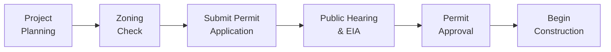

## Overview

Zoning, permitting, and government incentives might not initially sound like the most thrilling parts of real estate or infrastructure investing—trust me, even some seasoned professionals glaze over these regulatory requirements. However, skip the details on local zoning ordinances or building permits, and your project can get suspended more quickly than you can say “variance denied.” In this section, we’ll unravel the intricacies of zoning rules, permitting procedures, and the array of government incentives that can make—or break—your real estate investment strategy. Let’s face it: ignoring these rules is a surefire way to watch your grand infrastructure plan stall in the blueprint phase.

## Local Zoning Laws and Their Importance

Zoning is basically how local authorities organize and control land use. Think of it as the city’s blueprint for keeping industrial plants away from residential communities, ensuring farmland remains farmland (for as long as possible), and designating where high-rise developments can sprout up. Whenever real estate professionals say “highest and best use,” that’s partly a reflection of whether zoning laws permit a particular use on a site.

From a financial perspective, your property’s zoning classification can greatly impact its market value. I once saw a friend (an ambitious developer) acquire a property thinking he could build a mid-rise luxury condo in the heart of a suburban area. Turns out, the plot was strictly zoned for single-family residential use. Result: hefty legal fees, a scramble for rezoning applications, and months wasted. It taught me that the brightest architectural ideas can’t outshine a zoning restriction.

Common Zoning Elements:

• Use classification (residential, commercial, industrial, mixed-use).  
• Density (units per acre, floor area ratio).  
• Building height limits.  
• Coverage ratio (the portion of a lot covered by buildings).  
• Setback requirements (distance from property boundaries).  

Zoning can be further subdivided into subcategories—like R-1 for single-family homes or C-2 for neighborhood commercial—each with unique rules. Plus, local governments often tweak these codes, so staying updated is essential.

If you’re analyzing real estate for a portfolio, zoning compliance comes first. In a typical asset allocation context, real estate is often considered an illiquid asset; changes in zoning rules can affect potential exit value, so you’ll want to incorporate regulatory risk into both your valuation models and your risk scenario analyses.

## The Permitting Process: Essential Steps

After you confirm that your proposed development is permissible under zoning, you must secure the correct permits. These can range from building permits, demolition permits, grading permits, to specialized environmental or floodplain authorizations. Tailoring your approach to local procedures is crucial—some municipalities are a breeze, while others may feel like you’re navigating a labyrinth.

At a high level, the steps usually go something like this:



• Project Planning: Evaluate project feasibility and local zoning requirements.  
• Zoning Check: Confirm you meet land-use regulations before applying.  
• Submit Permit Application: Include detailed architectural drawings, engineering reports, and site plans.  
• Public Hearing & Environmental Impact Assessment: Provide stakeholders the opportunity to comment on the project’s effect on traffic, pollution, and local community welfare.  
• Final Approval: Once you address all concerns, you can secure your building permit (or other required permits).  
• Construction: Proceed with building activities under continuing inspection to confirm adherence to local codes.

### Environmental Impact Assessments

For larger or more contentious projects, an Environmental Impact Assessment (EIA) is required to check if the development harms local habitats, air/water quality, or historical sites. This can be tricky. Failing to conduct a proper EIA can delay infrastructure projects indefinitely, adding enormous costs. In many jurisdictions, if the EIA flags issues, you might need to revise project designs or offset damage by creating new green spaces, adopting improved pollution controls, or mitigating traffic levels.

## Incentive Zoning

Incentive zoning is a fantastic concept—especially if you’re looking to maximize a property’s potential while providing municipal benefits. Essentially, developers receive bonuses (like taller building heights or extra floor area) if they agree to add public amenities such as green spaces, affordable housing units, or cultural facilities. Here’s an example: a municipality might allow a developer to exceed the normal height limit by two extra floors if the ground floor includes a public plaza or childcare facility. From a capital allocation standpoint, these incentives can open doors to more profitable developments, but they often come with strings attached—mitigating community disruptions or providing tangible social benefits.

### Practical Example of Incentive Zoning

Let’s say a real estate sponsor is considering a mixed-use development in an area that caps building height at 10 stories. If the sponsor includes a public library branch or a certain percentage of units designated as affordable housing, they might be allowed 12 stories. The extra space yields more leasable square footage—and higher potential returns on investment—while the local community gains a beneficial amenity.

## Tax Abatements, Credits, and Grants

Tax abatements, credits, or grants can sweeten the deal for real estate developers. Municipalities often use them to spur investment in struggling areas or encourage specific types of projects. Common forms include:

• Property Tax Abatement: A temporary freeze or drastic reduction in property taxes for a set number of years.  
• Tax Credits: Reductions in tax liability—like credits for installing renewable energy systems or preserving historic buildings.  
• Grants: Direct financial support to offset certain costs (often tied to employing local labor, revitalizing buildings in distressed areas, etc.).

Consider an investment in a “blighted area” revitalization project. The promise of a significant property tax abatement could transform a borderline unprofitable venture into a worthwhile addition to an institutional portfolio. Be sure to run sensitivity analyses—both with and without the abatement—to see if the economics hold up. The last thing you’d want is to rely on an abatement that expires quickly or is politically unpopular.

## Special Economic Zones (SEZs)

Sometimes, governments attract investors by designating Special Economic Zones, offering more lenient tax policies, streamlined permitting, or even lower tariffs on imported construction materials. SEZs are common in emerging markets, but you can also find them in developed countries aiming to revitalize certain regions. For example, a port might be declared an SEZ to attract logistics, manufacturing, or shipping-related projects with duty-free import privileges and minimal bureaucratic oversight.

### Evaluating SEZ Opportunities

• Regulatory Environment: Are labor or environmental regulations eased? If so, does that create ethical or reputational risks?  
• Tax Incentives: Reduced corporate income tax, VAT exemptions, or export tax benefits can lower project costs.  
• Infrastructure: Many SEZs have upgraded roads, utilities, or broadband connectivity, which can enhance project feasibility.  

When analyzing SEZ investments for a diversified portfolio, consider the sustainability of these incentives. Governments change policies. So weigh whether the zone’s location and broader economic fundamentals (e.g., access to similar businesses, workforce quality) inherently support real estate success.

## Health, Safety, and Building Codes

Another big reason that real estate or infrastructure projects get delayed is failure to respect building codes and safety standards. Even if your project is perfectly zoned and has all the relevant permits, an unexpected round of inspections—or a newly enforced regulation—can blow your timeline (and budget) off course. That’s no joke, especially if you’re using a higher level of leverage or a short project timeline.

### Common Compliance Issues

• Fire Safety Systems: Commercial buildings typically need sprinklers, alarm systems, and fire exits that meet code.  
• Handicap Accessibility: Ensuring compliance with legislation like the Americans with Disabilities Act (ADA) in the United States (or comparable regulations in other countries).  
• Structural Integrity Checks: Engineering reviews that confirm load-bearing capacity, especially for older buildings slated for retrofit or repurposing.  
• Environmental & Worker Safety: On-site hazards, chemical handling, or waste disposal processes that must meet local standards.

Non-compliance can trigger stiff fines, forced building closures, or even lawsuits from injured parties. Smart developers initiate compliance strategies early and maintain open communication with local inspectors to keep surprises at a minimum.

## Changes in Zoning Regulations and Their Impact on Value

Zoning regulations aren’t static. Municipalities frequently revise them to align with community development plans. Sometimes, new rules open doors for more profitable developments—like allowing higher-density condos in previously low-density areas. Other times, they can curtail existing rights, rendering your dream expansion plan illegal overnight. Because real estate invests are typically held longer term, it’s wise to stay tuned into local political agendas and city council proposals. That can be your early warning system for changes that may affect your asset’s highest and best use.

### Coverage Ratio and Value

One big factor in property valuation is the coverage ratio: how much of the land you can cover with structures. A higher allowed coverage ratio typically means more usable area, which can lead to higher net operating income (NOI). You might see a formula like:


\text{Coverage Ratio} = \frac{\text{Building Footprint}}{\text{Lot Area}} \times 100\%


For a quick Python snippet:

```python
lot_area = 10000  # square feet
building_footprint = 3000  # square feet

coverage_ratio = (building_footprint / lot_area) * 100
print(f"Coverage Ratio: {coverage_ratio:.2f}%")
```

If a community revises zoning laws to allow a 50% coverage ratio, up from 30%, that’s a game-changer: you might develop a property with a significantly larger footprint, effectively increasing revenue potential. Conversely, a move in the opposite direction (tightening coverage) can slice future expansion plans, possibly impacting property appraisals.

## Case Study: Redeveloping a Blighted Mixed-Use Complex

Let’s illustrate the synergy between zoning, permitting, and incentives with a brief scenario. Suppose an investor identifies a down-at-the-heels waterfront district. The city wants to promote tourism and job creation, so they designate the area a Special Economic Zone. They also approve an incentive zoning policy that lets developers go a few stories taller in exchange for building a public promenade along the water’s edge.

The investor, after carefully analyzing the cost of constructing this promenade, sees that the additional leasable floor area from the height bonus adds significant value to the project—much more than the promenade costs. The city sweetens the deal with a 10-year property tax abatement. After thorough permitting (including environmental reviews for the riverfront) and compliance with safety codes, the investor completes a mixed-use development with retail, residential, and office spaces. Occupancy surges as local businesses relocate to the newly revitalized destination.

Takeaways:

• “Highest and best use” depends on local zoning—master that first.  
• Government incentives can substantially alter the ROI on a project.  
• Permits and compliance are not just academic checkboxes. They’re critical to keep a project on schedule and budget.  

## Exam Relevance and Best Practices

For CFA candidates, conceptualizing zoning, permitting, and government incentives helps you forecast real estate returns within your broader portfolio context. Whether you encounter real estate essay scenarios in the exam or item-set questions about property-related metrics, remember:

• Always incorporate regulatory risks into valuations (scenario-based or sensitivity analyses).  
• Factor in timelines for permitting and potential cost overruns.  
• Government incentives like tax abatements should be modeled with an awareness of expiration dates and political risks.  
• Changes in zoning can present upside potential or downside risk—stay vigilant.  

Best practices include reading municipal development plans, networking with zoning officials or consultants, and building robust models that can quickly adjust when incentives or zoning rules change. Monitoring local government meeting minutes might not be glamorous, but it can reveal important upcoming votes on zoning changes that could transform a property’s future.

## References for Further Reading

• Robert C. Ellickson, “Land Use Controls”: A thorough analysis of how zoning and other controls shape property rights.  
• American Planning Association (APA): https://www.planning.org/ for comprehensive resources on urban planning, zoning, and related research.  
• Local Government or Municipal Websites: These sites often publish zoning maps, permit application requirements, and details on incentives or special zones.

----------

## Test Your Knowledge: Zoning, Permitting, and Government Incentives



### Which of the following best describes the purpose of zoning in real estate?

- [ ] To provide a direct tax credit for real estate developers.
- [x] To regulate land-use patterns by designating allowable property uses and development intensity.
- [ ] To guarantee a universal financial incentive to all types of property owners.
- [ ] To immediately grant building permits without public hearings.

> **Explanation:** Zoning categorizes land by use (e.g., residential, commercial) and dictates intensity, building height, and density requirements.

### Regarding the permitting process, which step usually takes place first?

- [x] Verifying that the property’s proposed use complies with local zoning ordinances.
- [ ] Conducting final inspections for structural integrity.
- [ ] Applying for a demolition permit.
- [ ] Signing the construction contract with a general contractor.

> **Explanation:** You should always confirm that your proposed project conforms to local zoning requirements before submitting formal permit applications or hiring contractors.

### Incentive zoning typically allows a developer to exceed certain restrictions in exchange for which of the following?

- [ ] Commitment to purchase municipal bonds.
- [ ] 50 additional on-site parking spaces for employees.
- [ ] Payment of higher property taxes.
- [x] Providing public amenities such as green spaces or affordable housing.

> **Explanation:** Incentive zoning grants exceptions to zoning rules (e.g., height limits) if the developer incorporates community benefits like public plazas or subsidized units.

### How can tax abatements influence real estate development in blighted areas?

- [x] By temporarily reducing property taxes to encourage investment and revitalization.
- [ ] By permanently prohibiting rental rate increases to maintain affordability.
- [ ] By expediting permit approvals without an EIA.
- [ ] By mandating demolition of older buildings.

> **Explanation:** Tax abatements typically offer a temporary reduction or waiver of property tax obligations, making projects in distressed neighborhoods financially more attractive.

### Which of the following is a key characteristic of a Special Economic Zone (SEZ)?

- [x] SEZs generally offer favorable tax and regulatory conditions to attract businesses and developers.
- [ ] SEZs require a project developer to incorporate new cultural venues.
- [ ] SEZs entirely eliminate the need for building permits.
- [ ] SEZs are always restricted to agricultural development only.

> **Explanation:** Special Economic Zones often feature lax tax structures, streamlined permits, and incentives aimed at attracting investment.

### Which best describes an Environmental Impact Assessment (EIA)?

- [ ] A municipality’s method to ban high-rise developments in residential zones.
- [ ] A document authorizing the use of special tax credits.
- [ ] A purely financial audit of construction costs.
- [x] A study examining the potential environmental consequences of a proposed development.

> **Explanation:** EIAs review how a project might affect local ecosystems, pollution levels, or cultural/historical sites.

### If a mixed-use building violates local fire safety regulations, what is the likely outcome?

- [x] The developer may face fines, forced closures, or additional compliance costs.
- [ ] The local zoning board will automatically rezone the area to accommodate the violation.
- [ ] The developer will receive an automatic incentive for improving the system.
- [ ] The regional planning commission will waive all permits.

> **Explanation:** Violation of fire safety regulations can result in mandatory compliance measures, fines, or shutdowns until the building meets code.

### A coverage ratio of 60% means:

- [ ] 60% of the building is used for residential purposes.
- [x] 60% of the land area is covered by the building footprint.
- [ ] 60% of the value is tax-exempt under local abatement rules.
- [ ] 60% of the property must be allocated to public amenities.

> **Explanation:** Coverage ratio calculates the building’s footprint relative to the lot area.

### Which aspect of zoning might be most relevant for calculating a project’s highest and best use?

- [ ] Building material requirements for external façades.
- [x] Density limits that affect how many units or floors can be built.
- [ ] The age of the surrounding properties.
- [ ] The neighborhood’s median household income.

> **Explanation:** Density constraints directly influence how intensively you can use a parcel of land, often steering a project’s potential scale and revenue.

### True or False: Zoning regulations can sometimes be changed by local authorities, potentially altering a property’s value.

- [x] True
- [ ] False

> **Explanation:** Municipal councils often revise zoning rules, which can raise or limit development potential and have direct implications for property valuations.


