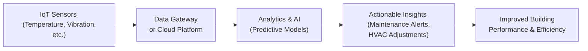

## Introduction
Technology has gradually, and sometimes surprisingly, become a major differentiator in the real estate industry. Not too long ago, property owners and managers relied heavily on manual processes for things like signing lease agreements, scheduling maintenance, or even collecting rent. And let’s be honest, some of those tasks were grueling to keep track of—especially across large portfolios. Today, real estate management is increasingly about integrating cutting-edge tools—often called “proptech”—to enhance operational efficiency, streamline processes, and deliver a better tenant experience.

In this article, we’ll explore the broad spectrum of technology adoption in real estate management, looking at every layer of innovation from Internet of Things (IoT) sensors that monitor building health to advanced analytics that predict market trends. We’ll also consider how managers are balancing forward-thinking tech with the industry’s timeless concerns, such as tenant privacy and data security. Throughout, our goal is to provide you with a comprehensive framework so you can see how these new approaches can fit into real estate portfolio strategies.

## The Rise of Proptech
Proptech (property technology) refers to an ecosystem of digital tools and platforms specifically geared toward the real estate sector. You might have heard of large listing portals that match buyers and sellers online—often the earliest wave of proptech. But the industry has since expanded to include solutions for property management, tenant communication, maintenance, transactions, and beyond.

Why is proptech becoming so popular now? One big reason is cost efficiency: automation cuts down on repetitive tasks, freeing time for strategic decisions. Another reason is data: real estate is loaded with potential data points (tenant behavior, energy usage, vacancy rates, etc.). Technology helps us make sense of that data, turning raw information into insightful analytics that can shape more profitable decisions.

## Leveraging IoT Sensors and Smart Building Systems
If you’ve ever walked into a sleek commercial office and wondered how the lighting, HVAC, and security seemed to operate in perfect sync, chances are an IoT-driven building system was running the show. Internet of Things sensors can be placed throughout a building to track temperature, humidity, foot traffic, or even machine performance.

• Energy Optimization: IoT sensors detect occupancy levels to ensure lighting and climate control only run when needed. This can slash utility bills significantly.  
• Predictive Maintenance: Data from HVAC systems or elevators can be analyzed to anticipate failure points, allowing managers to schedule maintenance before breakdowns occur.  

A personal anecdote: A friend of mine once managed an older property that had constant complaints about uneven heating—some floors were like a sauna, others felt like a freezer. After installing a network of IoT sensors paired with advanced thermostats, they reduced heating costs by almost 20% and improved tenant satisfaction. Not too shabby for a building that was over 40 years old!

Below is a simple illustration of how these connected elements interact:

## Software Platforms for Streamlined Property Management
In the modern real estate world, especially for managers handling large portfolios, specialized platforms and software can be absolute game-changers. Let’s face it, rummaging through spreadsheets to figure out occupancy rates or rent payments is no one’s idea of fun.

• Lease Management Systems: These tools centralize lease agreements, track upcoming renewals, and automate payment reminders.  
• Tenant Communication Tools: Today’s tenants expect prompt responses—some platforms integrate chatbots or text messaging for immediate resolution of common issues.  
• Maintenance & Workflow Solutions: Automated ticketing systems let tenants directly submit repair requests, which get assigned to contractors or staff, complete with a timeline for resolution.

### Example of Predictive Maintenance Scheduling
In some advanced platforms, building equipment usage is continuously monitored. Let’s say a property’s elevator system logs the number of daily trips and average load weight. Once usage crosses a certain threshold, the system will automatically notify management and schedule an inspection, ensuring breakdowns rarely happen at inconvenient times (like, you know, Monday morning when everyone’s rushing to work).

## Data Analytics and Artificial Intelligence
It’s one thing to collect data; it’s another to interpret and act on it effectively. This is where analytics and artificial intelligence come into play. AI-driven systems can parse vast amounts of tenant and market data, uncovering insights that humans might overlook.

• Market Forecasting: Predictive models can analyze local trends, development pipelines, and consumer behavior to suggest future market rents or potential cost inflation.  
• Rental Pricing Optimization: Sophisticated AI algorithms can consider seasonality, neighborhood demographics, even local events to dynamically set rental prices.  
• Budget Planning: By analyzing past expenditures and operational data, AI can forecast future capital expenditures and operating costs, reducing surprises and allowing for more precise budget allocation.

### A Quick Look at an ROI Formula
Managers often want a quick snapshot to gauge if their new AI-based system is worth it. A simplified formula for Return on Investment (ROI) can be expressed in KaTeX as follows:


\text{ROI} = \frac{\text{(Gains - Cost of Investment)}}{\text{Cost of Investment}}


If the gains from adopting an AI data analytics system (e.g., revenue lift from optimized rents or cost savings from better maintenance scheduling) minus the cost of implementation results in a positive ratio, then you’re on the right track.

## Cybersecurity: Protecting Data and Infrastructure
All these technological advancements, of course, come with one big caveat: data security. The more connected a building is—from Wi-Fi controlled thermostats to cloud-based leasing platforms—the more potential vulnerabilities exist.

• Data Encryption: Sensitive information, like tenant details or financial records, should be stored and transmitted with robust encryption standards.  
• Network Segmentation: Separating your building management network from public internet access or tenant Wi-Fi can contain threats more effectively.  
• Regular Audits and Penetration Testing: These are basically stress-tests to see if your systems can withstand cyberattacks.  

One cautionary tale: I recall hearing about a small real estate firm that was hacked through a building automation system that used a default password—yikes! The hackers quickly gained access to billing records for tenants, resulting in quite a reputational and legal nightmare.

## Advanced Building Management Systems (BMS)
A Building Management System (BMS) is an integrated platform that oversees multiple subsystems in a property. Honestly, it’s like having a “command center” for your building.

### Key Functions of a BMS
• HVAC Control: Automated management of heating, ventilation, and air conditioning.  
• Lighting & Access Control: Seamless control of lighting levels, entry passages, and sometimes even occupant safety protocols.  
• Security & Surveillance: Cameras, sensors, and alarm triggers that can be reviewed in real-time.  
• Resource Tracking: Water, electricity, and other utilities monitored around the clock.

These systems not only enhance occupant comfort but also reduce environmental impact by optimizing resource usage. Increased focus on sustainability means BMS solutions often tie directly into a property’s green certification efforts (LEED, BREEAM, etc.).

## Blockchain and Smart Contracts for Real Estate
Wait, blockchain? That’s right—some forward-looking real estate markets have begun experimenting with blockchain-based property registries. The idea is to securely record and transfer property ownership or lease rights with minimal paperwork. When you layer in a smart contract (a piece of self-executing code stored on a blockchain), certain real estate transactions can happen automatically once pre-agreed conditions are met.

• Digital Registries: Streamlined record-keeping, potentially reducing fraud or dispute over property titles.  
• Smart Contracts: Automate lease renewals, rent payments, or fund disbursements when conditions (like successful property inspections) are verified on-chain.

While these solutions are still emerging and might not be standard practice everywhere, they hint at tomorrow’s frictionless property transactions—no extended waiting for notaries or stapling countless documents. Just be sure to comply with any relevant local regulations and stick to the CFA Institute’s professional standards for transparency and disclosures in such innovative setups.

## Measuring Technology ROI: Cost Savings and Tenant Satisfaction
In real estate, technology investments aren’t just about being “cool.” They must demonstrate tangible returns. These returns typically appear in the form of:

• Operational Cost Savings: Reduced utility bills, lower maintenance overhead, smaller staffing requirements.  
• Revenue Uplift: Rental increases from more premium offerings, or higher occupancy due to enhanced tenant experiences.  
• Tenant Satisfaction: Measured through surveys or Net Promoter Scores (NPS). Tenants who enjoy the building’s features and responsive management are more likely to renew.

### Simple Numeric Example: Energy-Cost Benefit
Imagine you install an IoT-enabled HVAC system in a 100,000-square-foot office building at a cost of $200,000. Over one year, you reduce energy consumption by 15%, saving $50,000 and also boosting occupancy because tenants appreciate the improved climate control. This can be factored into your ROI calculation:


\text{ROI} = \frac{(\$50,000 ~\text{in annual energy savings} - \$0) + \text{Value of occupancy uplift}}{\$200,000}


If the new system helps you increase net rental income by another $10,000 due to higher occupancy or better tenant retention, it’s easy to see how technology payback can be achieved in just a few years.

## Best Practices and Common Pitfalls
Any new system—particularly one involving complex connectivity—comes with both opportunities and risks. Here are some tips:

• Align with Strategy: Make sure your technology investments fit your property or portfolio’s broader strategic objectives. Attempting an expensive system if your property is already nearing the end of its life cycle might not make sense.  
• Pilot Programs: Start small. Test new solutions in a single building before rolling them out portfolio-wide.  
• Keep Employees in the Loop: Maintenance staff and on-site managers need proper training to maximize the benefits of advanced tech.  
• Avoid Overreliance on Automation: Automated systems can fail or produce errors. Always have a manual override or backup plan.  
• Maintain Vendor Relationships: Ongoing updates and patches are critical to keep systems secure and current.

## Practical Insight: Integrating Real Estate Operations With Broader Portfolio Management
New technologies in real estate are not just about operational efficiencies at the asset level. They can significantly influence multi-asset portfolio decisions—a key concept tested in the CFA curriculum. For instance, more advanced data analytics might help identify underperforming properties that require targeted capital expenditures, or highlight market shifts that prompt rebalancing across geographies or property types.

Portfolio managers who can seamlessly merge real estate data with other asset classes (like equities, fixed income, or alternative investments) stand to develop more robust risk-return profiles. Real estate’s idiosyncratic risk can be better managed with that extra layer of real-time data, enabling a more holistic approach to risk management and asset allocation.

## Conclusion and Final Exam Tips
Technology adoption in real estate management is a dynamic field. As a future finance professional—or someone simply curious about emerging trends—you’ll want to keep tabs on these developments, especially as they become more embedded in everyday property operations. For the CFA exam (including Level III in portfolio management contexts), try to:

• Understand the Relationship: Show how technology enhancements can shift a property’s risk-return profile.  
• Consider Ethical Implications: Data privacy, transparency, and cybersecurity all relate to the CFA Institute Code of Ethics and Standards of Professional Conduct.  
• Practice Scenario Analysis: You could face item-set or essay questions about whether a given technology investment is justified, or how it affects the strategic allocation to real estate within a client’s overall portfolio.  
• Use Real-World Examples: The exam might reward candidates who demonstrate knowledge of how proptech platforms, IoT solutions, or blockchain-based registries affect real estate investment decisions.

Good luck—stay curious!

## Glossary of Key Terms
• Proptech (Property Technology): Technological solutions aimed at disrupting or improving the real estate industry.  
• IoT (Internet of Things): A network of internet-connected objects that can collect and exchange data.  
• Predictive Maintenance: The practice of using data analysis to predict when an asset needs maintenance—reducing unplanned downtime.  
• Building Management System (BMS): Automated systems controlling and monitoring building operations (e.g., lighting, HVAC).  
• Smart Contract: Self-executing agreements with terms written into lines of code—commonly on a blockchain.  
• Cybersecurity: Protective measures and technology used to safeguard systems and data from cyberattacks.  
• Digital Registry: An online record system for property rights, potentially reducing paperwork and improving transparency.  
• Occupant Comfort: Measures of tenants’ satisfaction with their indoor environment (temperature, airflow, lighting, etc.).

## References
- “The Impact of Emerging Technologies on the Real Estate Industry” by RICS (Royal Institution of Chartered Surveyors).  
- CBRE Proptech Research and Publications: https://www.cbre.com/  
- Real Estate Information Standards (REIS) for data governance in the property sector.

## Test Your Knowledge on Technology Adoption in Real Estate Management



### Which of the following best describes the primary benefit of using IoT sensors in buildings?

- [ ] They completely eliminate the need for human oversight.  
- [x] They gather real-time data that can lead to energy savings and predictive maintenance.  
- [ ] They replace property managers with AI robots.  
- [ ] They are solely useful for marketing campaigns.  

> **Explanation:** IoT sensors provide continuous real-time data on building operations and conditions, enabling data-driven decisions about energy usage, predictive maintenance, and overall property management efficiency.

### In a proptech context, which of the following tasks is most likely handled by a tenant communication platform?

- [ ] Calculating the capitalization rate.  
- [ ] Determining the ideal property location.  
- [x] Facilitating service requests and sending rent reminders to tenants.  
- [ ] Underwriting complex mortgage agreements.  

> **Explanation:** Tenant communication platforms streamline interactions by allowing tenants to submit maintenance requests, view rent statements, and receive important notifications in a centralized, digital way.

### A building management system (BMS) typically integrates all of the following subsystems EXCEPT:

- [ ] HVAC control.  
- [ ] Lighting and security systems.  
- [x] Lease underwriting policies.  
- [ ] Resource tracking (e.g., water and electricity).  

> **Explanation:** BMS usually focuses on operational controls such as heating, cooling, lighting, security, and resource usage. It doesn’t manage the underwriting or creation of leases.

### Which statement about blockchain-based property registries is most accurate?

- [ ] They are fully regulated in all countries worldwide.  
- [x] They can potentially automate and secure real estate ownership transfers.  
- [ ] They require no technical expertise to use.  
- [ ] They are only used for filing taxes.  

> **Explanation:** Blockchain-based property registries can potentially speed up and secure transactions by offering transparent, tamper-resistant records, but they are not universally regulated or ubiquitous yet.

### To comply with cybersecurity best practices in real estate management, firms should:

- [ ] Use default passwords for quick login.  
- [ ] Disable network firewalls for easy sharing.  
- [x] Conduct regular security audits and penetration testing.  
- [ ] Store data on openly accessible public networks.  

> **Explanation:** Regular audits and penetration testing are critical measures to stay ahead of evolving cyber threats, along with strong password policies and network segmentation.

### A key advantage of predictive maintenance using AI is:

- [x] Reducing equipment downtime by scheduling repairs in advance.  
- [ ] Making human maintenance engineers obsolete.  
- [ ] Increasing downtime through more frequent inspections.  
- [ ] Replacing the need for all physical inspections.  

> **Explanation:** Predictive maintenance uses historical data and real-time monitoring to anticipate failures, thereby minimizing downtime and preventing costly emergency repairs.

### Which of the following is a possible drawback of overreliance on automated building systems?

- [x] Systems may fail or produce errors, requiring manual intervention.  
- [ ] Property values will automatically rise indefinitely.  
- [ ] Tenants appreciate being monitored 24/7.  
- [ ] Budgets are always zero for building upkeep.  

> **Explanation:** Automated systems bring efficiency but can fail or generate false positives. Skilled human oversight remains essential.

### An example of a tangible KPI (Key Performance Indicator) for measuring technology’s ROI in real estate would be:

- [x] Decrease in annual energy expenditures by 10%.  
- [ ] The color of the building’s façade.  
- [ ] A manager’s preference for older technology.  
- [ ] The number of employees wearing uniforms.  

> **Explanation:** A percentage decrease in energy costs is a clear, quantifiable measure for assessing the financial impact of new building technologies.

### Which of the following best describes occupant comfort?

- [ ] Physical strength needed for climbing stairs.  
- [ ] Personal preference for bright neon lights.  
- [ ] Strict design guidelines outlined by city zoning.  
- [x] Tenants’ satisfaction with indoor environments like temperature, air quality, and lighting.  

> **Explanation:** Occupant comfort focuses on how the indoor environmental conditions—temperature, air circulation, lighting—contribute to overall well-being and productivity.

### True or False: A major application of AI in real estate is to predict future market trends and optimize rental pricing.

- [x] True  
- [ ] False  

> **Explanation:** AI can analyze extensive sets of historical and real-time marketplace data, helping investors and landlords forecast future scenarios and determine optimal rental or leasing prices.


